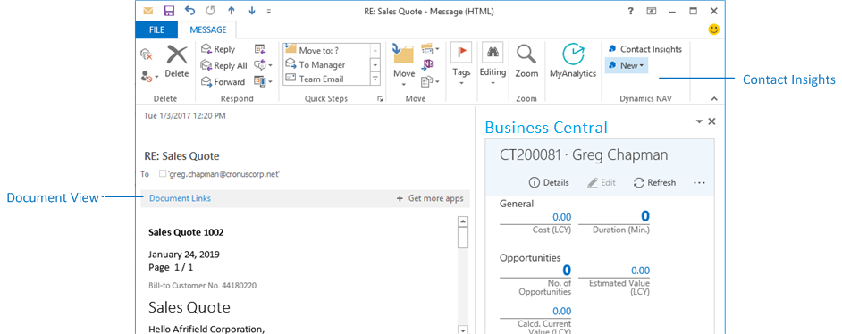

# Setting Up the Add-In for Outlook Integration with [!INCLUDE[prod_short](../developer/includes/prod_short.md)] On-Premises

If your organization uses Exchange Server or Exchange Online (alone or part of Microsoft 365), [!INCLUDE[prod_short](../developer/includes/prod_short.md)] includes integration with Outlook that enable users to complete [!INCLUDE[prod_short](../developer/includes/prod_short.md)] business tasks from their Outlook inbox.  

## Overview

[!INCLUDE[prod_short](../developer/includes/prod_short.md)] includes the following capabilities for Outlook:

- Contact Insights

    The add-in provides users with [!INCLUDE[prod_short](../developer/includes/prod_short.md)] customer or vendor information in Outlook emails and calendar appointments. It also enables users to create and send [!INCLUDE[prod_short](../developer/includes/prod_short.md)] business documents, such a sales quotes and invoices to a contact. To support these task, the add-in adds actions to the Outlook ribbon, in the **Business Central** group.  

- Create and view documents

    When a business document is sent as an email, the add-in provides a direct link from email to the actual business document in [!INCLUDE[prod_short](../developer/includes/prod_short.md)]. The add-in adds a **Document Links** action in the email header, which a user can select to display the document.  

<!--    -->

Setting up the add-in involves two procedures. First, you configure the [!INCLUDE[server](../developer/includes/server.md)] instance to work with the add-ins. Then, you deploy the add-ins from the [!INCLUDE[prod_short](../developer/includes/prod_short.md)] client to users' Outlook. Before you begin, make sure that the deployment environment meets the prerequisites.

## Prerequisites

1. [!INCLUDE[prod_short](../developer/includes/prod_short.md)] deployment prerequisites

    1. [!INCLUDE[webserver](../developer/includes/webserver.md)] installed and configured to use SSL (https).
    1. [Install Business Central using Setup](../deployment/install-using-setup.md)  
    1. [Configure SSL to Secure the Connection to Web Client](../deployment/configure-ssl-web-client-connection.md)
    1. NavUserPassword, Azure Access Control Service (ACS), or Azure Active Directory (Azure AD) authentication is used to authenticate users.  

        The [!INCLUDE[server](../developer/includes/server.md)] instance, clients, and users must be configured for NavUserPassword, Azure Access Control Service (ACS), or Azure Active Directory (Azure AD) authentication, as determined by the credential type configured for each component.  These credential types require the use of security certificates. For more information, see the following articles:

        - [Authentication and Credential Types](users-credential-types.md)  
        - [Using Certificates with Business Central](../deployment/implement-security-certificates-production-environment.md)
2. Exchange prerequisites

    If you are using Exchange Server, configure it to allow access to Exchange Web Services (EWS). For more information, see [Control access to EWS in Exchange](/exchange/client-developer/exchange-web-services/how-to-control-access-to-ews-in-exchange).  

3. Some browser versions, such as Google Chrome 80, include changes to how cookies are handled. To ensure that the Outlook add-in works with these browser versions, make sure that the [!INCLUDE [prod_short](../developer/includes/prod_short.md)] platform has been upgraded to a recommended update version as described in [Preparing Dynamics NAV or Dynamics 365 Business Central for Upcoming Changes to Browser Cookie Policy](../administration/prepare-for-cookie-samesite-policy.md).


## Configure the [!INCLUDE[server](../developer/includes/server.md)] instance to work with the Office Add-ins

You can use either the [!INCLUDE[admintool](../developer/includes/admintool.md)] or the **Set-NAVServerConfiguration** cmdlet in the [!INCLUDE[nav_shell](../developer/includes/nav_shell_md.md)].

1. In the [!INCLUDE[admintool](../developer/includes/admintool.md)], in the **Client Services** section, set the **Exchange Auth. Metadata Location** setting to the URL for the Exchange authentication metadata document of the authority that is allowed to sign the Exchange identity token.

    Alternatively, with the Set-NAVServerConfiguration cmdlet, set the ```ExchangeAuthenticationMetadataLocation``` key.

    This setting is used to confirm the identity of the signing authority when using Exchange authentication. In part, this includes the URL of the Exchange mail server. The field accepts a wild card URL. So for example, if the URL of the Exchange mail server is ```https://mail.cronus.com```, then you can set this to ```https://mail.cronus.com*```. The default value is ```https://outlook.office365.com/```.

2. Set the **Web Client Base URL** setting to the base URL of the [!INCLUDE[nav_web_md](../developer/includes/nav_web_md.md)].

 This is the root portion of all URLs that are used to access pages in the web client. This must have the format `https://[hostname:port]/[instance]`, such as such as `https://MyNavWebServer:443/BC130`.

 With the **Set-NAVServerConfiguration** cmdlet, set the ```PublicWebBaseUrl``` key.

## Deploy the Office Add-ins to Outlook accounts

The Outlook add-ins can be deployed by the users themselves to their own Outlook accounts. Or the Exchange administrator can deploy the add-ins to Outlook for all users in the organization or tenant.

### Individual user deployment

To deploy both the **Contact Insight** and **Document View** add-ins, users run the **Outlook for Business Central** assisted setup in their [!INCLUDE [prod_short](../developer/includes/prod_short.md)] and choose the **My Mailbox** option. Depending on the user authentication method used by [!INCLUDE[prod_short](../developer/includes/prod_short.md)], users will have to provide their email address and password:

- If [!INCLUDE[prod_short](../developer/includes/prod_short.md)] is configured for NavUserPassword or Access Control Service authentication, users must provide their Exchange email address and password.
- If [!INCLUDE[prod_short](../developer/includes/prod_short.md)] is configured for Azure AD authentication, users are not prompted for their email credentials because authentication against the Exchange or Exchange Online is done using an authentication token.

### Organization deployment as an Exchange administrator

With an Exchange Server or Exchange Online administrator account, you can deploy the add-ins for the entire organization. There are two ways to deploy the add-ins:

- Run the **Outlook for Business Central** assisted setup in [!INCLUDE [prod_short](../developer/includes/prod_short.md)] and choose the **My Organization** option. This method deploys both the Contact Insights and Document View add-ins.
- Use the **Office Add-ins Management** page. The **Office Add-ins Management** page lets deploy  the Contact Insights and Document View add-ins individually.

Both methods will lead you through the deployment. The information that you must provide depends on whether you are using Exchange Online (or Microsoft 365) or Exchange Server, and the user authentication method that is used by [!INCLUDE[prod_short](../developer/includes/prod_short.md)]:

- For Exchange Online or Microsoft 365

    If [!INCLUDE[prod_short](../developer/includes/prod_short.md)] is configured for NavUserPassword or Access Control Service authentication, you must provide an email address and password for an Exchange administrator account. If [!INCLUDE[prod_short](../developer/includes/prod_short.md)] is configured for Azure AD authentication, you are not prompted for these credentials because authentication against the Exchange or Exchange Online is done using an authentication token.

- For Exchange Server

  Exchange Web Services (EWS) and Autodiscover will try to find the local Exchange Server:

  - If EWS is not set up, you will receive an error message.
  - If Autodiscover cannot find the Exchange Server, you are prompted for an Exchange administrator email and password, and the local Exchange PowerShell endpoint. The Exchange PowerShell endpoint is a URI that has the format ```https://<ExchangeMailboxServer>/PowerShell```.  ```<ExchangeMailboxServer>``` is the fully qualified domain name of the Exchange Server, such as ```https://mail.cronus.com/PowerShell```.  

## See Also  

[Deploying Business Central](../deployment/deployment.md)  
[Using Business Central as your Business Inbox in Outlook](/dynamics365/business-central/admin-outlook?toc=/dynamics365/business-central/dev-itpro/toc.json)  
