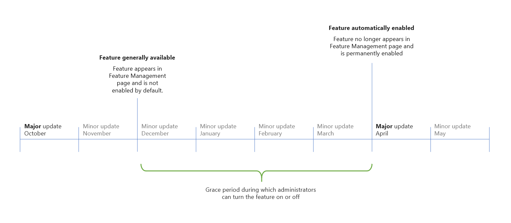

# Enabling Upcoming Features Ahead of Time

This document describes how administrators can turn on new features using the Feature Management page.

## About Feature Management

Some new features can be enabled ahead of time on sandbox and production environments. This capability allows you to benefit as early as possible from feature improvements and innovative new features. It gives you the time you need to test and prepare your organization for change.

When Microsoft releases features or feature design improvements as part of minor updates, some features aren't immediately enabled. Administrators can learn about these features and independently enable each feature from the **Feature Management** page. Once a feature is enabled, it becomes available for all users on that environment no matter how they access [!INCLUDE[prodshort](../includes/prodshort.md)].

These features are only optional for a while. The option period typically starts from the minor update in which they're made generally available. The period ends when the features become mandatory and are automatically enabled in a later major update. To see the approximate date and service update when each feature is expected to become mandatory, see the **Automatically enabled from** field in the **Feature Management** page. After this date, the feature will no longer appear in the Feature Management page and can no longer be turned off.

> [!IMPORTANT]
> The projected timeline for a feature is subject to change (see [Microsoft policy](https://go.microsoft.com/fwlink/p/?linkid=2007332)).

### Example timeline for an optional feature

> [!div class="mx-imgBorder"]
> 

Learn about [What's new and planned](https://aka.ms/dynamics365releaseplan).  
Learn about [new features available in the last minor update](https://aka.ms/bclastminorupdate).  

> [!TIP]
> To prepare for an upcoming feature, consider enabling the feature on a sandbox environment that has a copy of production data. Invite business users to test out the change using real-world tasks. Once you and your users are satisfied with the change, you can then enable it on production environments where they can immediately benefit from that feature.  

## How to enable an optional feature

1. Sign in to your environment and navigate to the **Feature Management** page, or use this link: [https://businesscentral.dynamics.com/?page=2610](https://businesscentral.dynamics.com/?page=2610).
2. If the page isn't editable, choose **Edit List** from the action menu.
3. For any row in the list, set the **Enabled for** field to *All users*.

As soon as you enable the feature, any user that signs in to that environment experiences the change. You won't necessarily experience the change yourself until you sign out and sign in again, or start a new session.

> [!TIP]
> You can try out the feature for yourself without enabling it for all users by choosing the **Try it out** link. This will open a new browser tab with the feature enabled for that session. Any new sessions in your browser will also have the feature temporarily turned on. To stop trying the feature, close your browser window or sign out.  

## Features that can't be turned off

Some features or feature improvements may permanently affect the state and capabilities of [!INCLUDE[prodshort](../includes/prodshort.md)] and can't be safely reverted. These irreversible features can't be turned off again after they've been enabled. Before you enable an irreversible feature on a production environment, we recommend that you first enable and evaluate it on a sandbox environment that has a copy of production data.

> [!NOTE]
> When you choose to enable an irreversible feature, a warning dialog that describes the consequences is displayed. Choose **Yes** to proceed with permanently enabling the feature on that environment.

## Features that update data
When enabled, some features change the user experience, which can be disruptive for users. Administrators can help avoid disturbing daily work by enabling features per company at their own pace, for example, after users have been trained in the new feature. If you have more than one company, you must enable the feature in each one.

> [!IMPORTANT]
> Features that update data cannot be turned off. Therefore, we recommend that you enable and test the feature's impact in a sandbox environment with a copy of your production data. For more information, see [Production and Sandbox Environments](/administration/environment-types.md).

When enabling features that update data, on the **Feature Management** page, use the **Feature Data Update** setup guide. The guide lets you review the data, and specify whether to run the update now, or schedule it to run as a background task later. For more information, see [Page Background Tasks](/developer/devenv-page-background-tasks.md). To start the setup guide, do on one of the following:

* Choosing **Schedule** under **Data Update**. 
* Choosing **All Users** in the **Enable for** column. 

When the update process is complete, the feature is enabled in the company in which you ran the update.

## FAQ about Feature Management

#### There are no features listed as optional. Did I do something wrong?

There may be periods where no optional features have been made available, which is perfectly normal. There will likely be few or no features listed in the **Feature Management** page immediately after a major update.

#### Will all new features eventually be listed on the Feature Management list?

No. We carefully select applicable features based on different criteria so that only a manageable subset of new features will appear in the list. Selected features are primarily those features that change the visuals or behaviors of the user interface and which require significant effort for business users to adjust to.

#### Are these features still under development or in beta/preview?

No. Features listed in the Feature Management page are considered ready and generally available. Most of these features are automatically enabled on newly provisioned environments for new customers to benefit from.

#### Does Microsoft provide support for optional features?

Yes. Features that are listed in the **Feature Management** page are considered ready. They follow the standard support lifecycle for the service update in which they're first made available.

#### Will Business Central notify me closer to the date when a feature becomes mandatory?

No. Users and administrators don't receive any in-app or email notifications about approaching dates for features becoming automatically enabled.  

#### Do these features show in the Microsoft 365 admin center Message center?

At this time, new [!INCLUDE[prodshort](../includes/prodshort.md)] features are not listed in Message center.  

#### How is feature management different to the Early Access program?

The Early Access program that is used by some Dynamics 365 apps makes a large set of new features available two months before a major update. It allows customers to enable those features in production. The most significant difference is that the Early Access program features are always two months before the major update.

#### How is feature management different to preview environments?

Preview environments are [!INCLUDE[prodshort](../includes/prodshort.md)] online sandbox environments that include all new platform and application features that will later be made available with the major update. The most significant difference is that a preview environment includes all new features bundled together. You don't have the opportunity to select which feature to enable and test. 

#### How is feature management different to Application Areas?

Application areas are a concept where developers specify differentiated user experiences in the business application. By using application areas, developers can show or hide individual controls on a page. Like feature management, application areas concept also puts administrators in control of selecting the preferred experience tier. One difference is that there's no time period during which application areas can be optionally enabled. Another difference is that they only apply to business application controls.  

#### Can resellers, ISVs, and developers contribute to the list of features?

No. At this time, feature management is only for features released by Microsoft.

#### Can I enable a feature for a single user?

No. Business Central doesn't provide the ability to enable a feature for a single user or group of users. Enabled features apply to all users of an environment.  

#### I don't see a link to try out an optional feature. Is something wrong?  

Some features don't provide a way to try out the feature for yourself and won't display a **Try it out** link. Before you enable these features, we recommend you first enable and test the features on a sandbox environment that has a copy of production data.

#### Are optional features also optional on new environments?

Yes. Most optional features are enabled by default on new environments for new customers to benefit from. Administrators can still turn any of these features off from the Feature Management page. Some features are irreversible and are not enabled by default.

#### Are optional features automatically enabled on sandbox environments?
When you create a new sandbox environment with a copy of production data, your choice of enabled features is also copied to the sandbox. When you create a fresh sandbox, each feature is enabled by default, unless a feature is irreversible. 

#### Is feature management applicable to on-premises deployments of Business Central?

Yes. You can turn optional features on or off in a similar way.

## See also

[New and planned features](https://aka.ms/Dynamics365ReleasePlan)  
[Administration of [!INCLUDE[prodshort](../includes/prodshort.md)] Online](tenant-administration.md)  
[Major updates of [!INCLUDE[prodshort](../includes/prodshort.md)] Online](update-rollout-timelime.md)  
