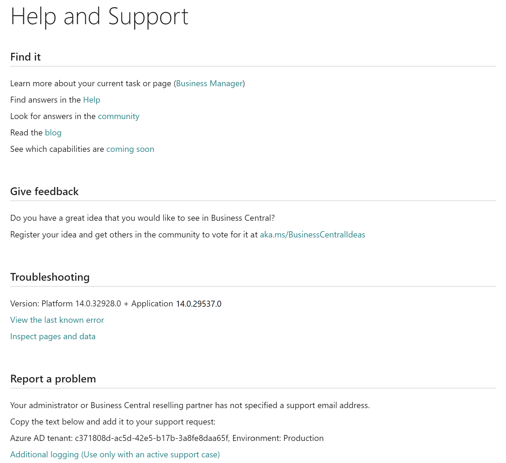

# Managing Technical Support

If users report that they are having a problem with [!INCLUDE [prod_short](../developer/includes/prod_short.md)], superusers and the internal administrator can often find a solution. The internal administrator can find technical information in the **Help and Support** page as described in the following sections, and they can then escalate relevant issues to the reselling partner.  

The reselling partner can log in to their customer's [!INCLUDE [prod_short](../developer/includes/prod_short.md)] as the delegated admin for troubleshooting, such as by creating a sandbox environment based on production data, and then troubleshooting in that environment.  

Both internal administrators and the reselling partner can use the [!INCLUDE [prodadmincenter](../developer/includes/prodadmincenter.md)] to manage environments and updates.  

## Internal administrators

As the internal administrator, you can work with users to identify solutions or workarounds, such as missing setup, missing permissions, and other issues in [!INCLUDE [prod_short](../developer/includes/prod_short.md)]. If users are not sure if their [!INCLUDE [prod_short](../developer/includes/prod_short.md)] is working as intended, they can check the [Help and Learn content](../user-assistance.md) for the intended behavior. For more technical problems, administrators can find technical information in the **Help and Support** page to help with this investigation. For more information, see the [Finding technical information](#finding-technical-information) section.  

Internal administrators can also [create sandbox environments](environment-types.md#sandbox-environments) for deeper troubleshooting, for example, before they decide to contact their partner for technical support. The partner must have specified their support contact details in the **Help and Support** page.  

## Delegated administrators

Each customer of [!INCLUDE [prod_short](../developer/includes/prod_short.md)] has a partner who assists with technical support when requested by the internal administrator. As the partner, you must have specified support contact details in the **Help and Support** page. For more information, see [Configuring the support experience](../technical-support.md#configuring-the-support-experience).  

> [!IMPORTANT]
> You must have set up users in your own tenant in Partner Center as either *Admin agent* or *Helpdesk agent*, and they must have *delegated administration* privileges in your customer's [!INCLUDE [prod_short](../developer/includes/prod_short.md)] to support the customer. For more information, see [Delegated Administrator Access to Business Central Online](delegated-admin.md).

The delegated administrator can access the customer's [!INCLUDE [prod_short](../developer/includes/prod_short.md)] for further troubleshooting, and they can use the [!INCLUDE [prodadmincenter](../developer/includes/prodadmincenter.md)] to [analyse telemetry](telemetry-overview.md), [create a sandbox environment](environment-types.md#sandbox-environments) for debugging, or an extra production environment for step-by-step reproduction, for example.  

If the partner cannot find a solution, they can request support from Microsoft. For more information, see the [Escalating support issues to Microsoft](#escalating-support-issues-to-microsoft) section.  

### Extend trials

Another task for a delegated admin is to help with extending trials. For more information, see [Extending trials](tenant-administration.md#extending-trials).  

### Cleaning up settings

If you end the relationship with a customer, you must remove certain settings while you still have access to that customer's [!INCLUDE [prodadmincenter](../developer/includes/prodadmincenter.md)]. These settings include the following:

- Support contact details

  For more information, see [To supply your support contact information in the administration center](../technical-support.md#to-supply-your-support-contact-information-in-the-administration-center).  

- Notification recipients

  For more information, see [Tenant Notifications](tenant-admin-center-notifications.md).  

- Application Insights key (if this was set up by the partner)

  For more information, see [Environment Telemetry in the [!INCLUDE[prodadmincenter](../developer/includes/prodadmincenter.md)]](tenant-admin-center-telemetry.md).  

## Finding technical information

For [!INCLUDE [prod_short](../developer/includes/prod_short.md)] online, administrators have access to a range of tools for troubleshooting. Depending on the type of problem, administrators
can troubleshoot in [!INCLUDE [prod_short](../developer/includes/prod_short.md)], or they can use the [!INCLUDE [prodadmincenter](../developer/includes/prodadmincenter.md)] to analyze telemetry, for example.

In this section, we provide an overview of the most useful tools for troubleshooting the problems that users are reporting. In many cases, administrators will want to create a sandbox environment based on the production environment where users are reporting problems. That way, the administrators can troubleshoot without disturbing normal work.  

- The Help and Support page  

    Each company in any [!INCLUDE [prod_short](../developer/includes/prod_short.md)] environment has a **Help and Support** page that can be accessed from the the question mark in the top right corner. Here you can access the latest error message, which, for example, is useful if your users complain of a confusing error message such as *Sorry, we just updated this page. Please close and reopen.*. For more information, see [The Help and Support page](#helpsupport) section.  
- Page inspection  

    [!INCLUDE [prod_short](../developer/includes/prod_short.md)] includes a page inspection feature that lets you get details about a page, providing insight into the page design, the different elements that comprise the page, and the source behind the data it displays. For more information, see [Inspecting and Troubleshooting Pages](../developer/devenv-inspecting-pages.md).  
- Environment telemetry in the [!INCLUDE [prodadmincenter](../developer/includes/prodadmincenter.md)]  

    In the [!INCLUDE [prodadmincenter](../developer/includes/prodadmincenter.md)], you can view telemetry of top-level AL events, and any errors resulting from calls through the telemetry stack. For more information, see [Environment telemetry](tenant-admin-center-telemetry.md).  
- Troubleshoot in a sandbox environment  

    In the [!INCLUDE [prodadmincenter](../developer/includes/prodadmincenter.md)], you can create sandbox environments for safe debugging and troubleshooting. For more information, see [Sandbox environments](environment-types.md#sandbox-environments).  
- Use the Event Recorder  

    Using the Event Recorder, you can record the events that are published and raised while performing the actions of your scenario. For more information, see [Discoverability of Events](../developer/devenv-events-discoverability.md).  
- Check the data in the database  

    You can view table objects in [!INCLUDE [prod_short](../developer/includes/prod_short.md)]. This lets you to see the data in all rows and columns of a specific table, including any columns that are added by table extensions. From the [!INCLUDE [prodadmincenter](../developer/includes/prodadmincenter.md)], you can also launch a list of all tables, sorted by storage size. For more information, see [Viewing Table Data](../developer/devenv-view-table-data.md).  
- Analyze long running operations in Application Insights  

    Set up Application Insights so that any SQL query that takes longer than 1000 milliseconds to execute will be sent to your Application Insights resource. For more information, see [Analyzing long running operations in Application Insights](telemetry-long-running-sql-query-trace.md).  
- Debug your app or pre-tenant extension  

    With Visual Studio Code and the AL Language extension you get an integrated debugger to help you inspect your code to verify that your application can run as expected. For more information, see [Debugging in AL](../developer/devenv-debugging.md).

### The **Help and Support** page in the [!INCLUDE [prod_short](../developer/includes/prod_short.md)] company

The **Help and Support** page is a powerful tool for administrators to find technical information about [!INCLUDE [prod_short](../developer/includes/prod_short.md)], both online and on-premises. The **Troubleshooting** section gives easy access to the [most recent error message](#last-known-error), and it has a link to [inspect pages](../developer/devenv-inspecting-pages.md) for further troubleshooting.  

> [!div class="mx-imgBorder"]
> 

Also in the **Help and Support** page, users can see support contact information, provided that this has been set up. For more information, see [To supply your support contact information in the administration center](../technical-support.md#to-supply-your-support-contact-information-in-the-administration-center). The **Help and Support** page also shows [which version](#version) of [!INCLUDE [prod_short](../developer/includes/prod_short.md)], the specific environment is on.  

For [!INCLUDE [prod_short](../developer/includes/prod_short.md)] online, a user can enable additional logging and then perform the operation that is causing problems. The additional telemetry is sent to Application Insights where you can do further troubleshooting, either as part of a support case, or before you submit a support request. In both scenarios, the additional details about the problematic operation will lead to a quicker resolution.  

For [!INCLUDE [prod_short](../developer/includes/prod_short.md)] online, internal and delegated administrators also have access to this information in the [!INCLUDE [prodadmincenter](../developer/includes/prodadmincenter.md)]. You can use the [!INCLUDE [prodadmincenter](../developer/includes/prodadmincenter.md)] to easily navigate to the different environments in a tenant, and you can create sandbox environments that can help troubleshoot any issues reported by users. For more information, see [The Business Central Administration Center](tenant-admin-center.md).  

#### Azure Active Directory tenant

When the internal administrator wants to contact the partner for support, then the **Help and Support** page encourages them to include information about their Azure Active Directory tenant ID in the email. This information is shown in the **Troubleshooting** section at the bottom of the **Help and Support** page.  

The delegated administrator can use that to identify the tenant in the Partner Center and in the [!INCLUDE [prodadmincenter](../developer/includes/prodadmincenter.md)] for troubleshooting.  

#### Version

You can use the information about which version the tenant is on to help you troubleshoot the issue that the customer has reported, for example. This information is also listed in the **Troubleshooting** section of the **Help and Support** page. For more information, see [Version numbers in Business Central](version-numbers.md).  

#### Last known error

The link behind the sentence *View the last known error* will find and show the most recent error message that was was generated by the application code. This includes errors from field validation, posting routines, and other code behind business functionality.  

The information that you can get from this link includes the following:

- Text

    This is the error message that the user sees, either in a dialog window or next to a user interface element that cannot render, for example.
- Code

    This is the code snippet that threw the error.
- Callstack

    This shows how the error was triggered.
- Object

    This shows information about the runtime objects.

The link cannot open errors that were generated by the platform. So if you suspect that the issue is caused by the platform, you can try to reproduce the error in a sandbox environment before you contact Microsoft for support. For more information, see [Create a sandbox environment](tenant-admin-center-environments.md#create-a-sandbox-environment).

> [!TIP]
> If your users complain of a confusing error message such as *Sorry, we just updated this page. Please close and reopen.*, then you can often find the underlying problem either in this last known error, or by analyzing telemetry in the [!INCLUDE [prodadmincenter](../developer/includes/prodadmincenter.md)]. For example, in the case of the *Sorry, we just updated this page. Please close and reopen.* message, the underlying problem is often that two users are trying to modify the same data. So if both users open the same sales order, and both change a field, then one of them will see the *Sorry, we just updated this page. Please close and reopen.* message, because [!INCLUDE [prod_short](../developer/includes/prod_short.md)] saves changes as soon as you move to the next field or close the page.

## Escalating support issues to Microsoft

Sometimes the tenant has run into a problem that the partner cannot resolve. In those cases, the delegated admin can use the Partner Center or the [!INCLUDE [prodadmincenter](../developer/includes/prodadmincenter.md)] to submit a support request to Microsoft.  

Both internal and delegated administrators can access [!INCLUDE [prodadmincenter](../developer/includes/prodadmincenter.md)], and then, in the **Support** menu, choose the **New Support Request** button. This logs you in to the Power Platform Admin Center. Here, you can launch the **New Support Request** guide that will help you identify potential solutions or workarounds based on how you fill in the various fields.  

In the Power Platform Admin Center, both internal and delegated administrators can explore different solutions based on the keywords that they specify.  

> [!NOTE]
> The internal administrator cannot contact Microsoft directly. If you are an internal admin and suspect that something is wrong with your [!INCLUDE [prod_short](../developer/includes/prod_short.md)], you must contact your partner for next steps.

### Submitting support requests on behalf of your customer

As the delegated administrator, if you are logged into the [!INCLUDE [prodadmincenter](../developer/includes/prodadmincenter.md)], you can use the **New Support Request** link in the **Support** menu to submit a support request on behalf of your customer.  

> [!TIP]
> Alternatively, you can use customer-specific URLs such as `https://admin.powerplatform.microsoft.com/account/login/[customer tenant ID]`.

#### To start the process of submitting a new support request from the [!INCLUDE[prodadmincenter](../developer/includes/prodadmincenter.md)]

1. On the **Environments** tab of the [!INCLUDE[prodadmincenter](../developer/includes/prodadmincenter.md)], choose the relevant environment to open the environment details.
2. In the **Support** menu, choose **New Support Request**.

    This opens a new browser tab so that you can submit the support request in the Power Platform Admin Center.

In the Power Platform Admin Center, you are automatically logged in with information about the customer tenant that you are working on behalf of. Create a new support request and fill in the fields as appropriate, but remember to use the **See solutions** button to find potential guidance or workarounds. Based on your search keywords, links to suggested documentation are shown on the **Solutions** tab.  

You can find most of the necessary information in the [!INCLUDE [prodadmincenter](../developer/includes/prodadmincenter.md)], including the tenant ID and the [!INCLUDE [prod_short](../developer/includes/prod_short.md)] version numbers. For more information, see [View solutions or enter a support request through the new support center](/power-platform/admin/get-help-support#view-solutions-or-enter-a-support-request-through-the-new-support-center) in the Power Platform administration content.  

> [!IMPORTANT]
> Your company must be registered as a partner in order to submit a support request to Microsoft, and you must have the ASfP (Advanced Support for Partners) support plan. The support person can be a member of the **Helpdesk agent** group in the customer's Azure AD tenant or a global administrator. For more information, see [Delegated Administrator Access to Business Central Online](delegated-admin.md). Your service account manager can get you more information about getting the ASfP, and, if you already have a support plan, they can get the contract information and access ID that you must specify when you submit a new support request on behalf of your customer.  

Microsoft Support will keep you updated on the status of your support request. You can also see the status in the Power Platform Admin Center. For more information, see [Power Platform Admin Center](/power-platform/admin/admin-documentation).  

#### To start the process of submitting a new support request from the Partner Center

You can also start the process from the Partner Center, where you can choose the customer you want to open a case on, and then follow the support request work flow. This will redirect the delegated administrator to the Power Platform admin center in the context of the customer's tenant.  

However, you might need information from the [!INCLUDE [prodadmincenter](../developer/includes/prodadmincenter.md)], which is why we recommend that route. For more information, see [Report problems on behalf of a customer](/partner-center/report-problems-on-behalf-of-a-customer) in the Partner Center content.

<!-- TODO: How to manage your customers' support issues -->

## Report customer outages

When a customer has a situation where no users can log in to [!INCLUDE [prod_short](../developer/includes/prod_short.md)], you must take immediate action. Outages are frustrating but rare, so make sure that you verify that the users are not unable to log in due to problems with their network connection, for example. For more information, see [How do I check my online service health?](/power-platform/admin/check-online-service-health) in the Power Platform administration content.  

Internal and delegated administrators can report this outage to Microsoft by using the **Report Production Outage** action for the relevant production environment in the [!INCLUDE [prodadmincenter](../developer/includes/prodadmincenter.md)]. This action creates a support ticket for Microsoft with all the information that is needed to begin steps to resolve the issue.  

> [!NOTE]
> This option is not available in sandbox environments.  

### To report an outage

1. On the **Environments** tab of the [!INCLUDE [prodadmincenter](../developer/includes/prodadmincenter.md)], choose the relevant environment to open the environment details.
2. In the action ribbon, choose **Support**, and then choose **Report Production Outage**.
3. In the **Report Production Outage** pane, choose the outage type:

    - Unable to log on (all users)
    - Cannot access API/Web Service

4. Enter your name, email address, and phone number. This information will be included in the support ticket.  
5. Choose **Next**.
6. In the next pane, provide details about the outage, including which browsers users have tried to log in with, any companies that you can log into, and errors and correlation IDs. This information will be included in the support ticket.  
7. Finally, add the date and time when the outage began. This information will also flow to the support ticket.  
8. Choose the consent checkbox, and then choose **Report**.

A support request ticket is then created, and you will see a dialog box with the ticket ID. You can then monitor progress in the **Reported Outages** section. From there, you can access the tickets in the Partner Center. For more information, see the [Microsoft Partner Center](/partner-center/) documentation.  

## See Also

[Inspecting and Troubleshooting Pages](../developer/devenv-inspecting-pages.md)  
[The Business Central Administration Center](tenant-admin-center.md)  
[Technical Support for Business Central](../technical-support.md)  
[Provide technical support (Microsoft Partner Center)](/partner-center/provide-technical-support)  
[Deployment Overview](../deployment/Deployment.md)  
[Administration as a partner](tenant-administration.md#administration-as-a-partner)  
[Administration of Business Central Online](tenant-administration.md)  
[Administration of Business Central On-Premises](Administration.md)  
