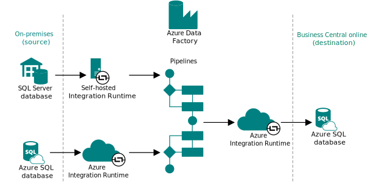

# Business Central on-premises to online migration: End-to-end overview

Migrating data from Business Central on-premises to online can seem like a complex process. This article provides an overview of how the migration works and the necessary tasks for completing the migration. By gaining an understanding of the data migration basics, you're able to plan and execute a smooth transition to the cloud.

## Understanding cloud migration

Data migration is the process of securely migrating data from an on-premises SQL Server instance (or Azure SQL) to [!INCLUDE[prod_short](../developer/includes/prod_short.md)] online. You manage cloud migration from [!INCLUDE [prod_short](../includes/prod_short.md)] online through a connection to the on-premises database and various components that establish a pipeline for replicating data. The on-premises solution remains the operative environment until you complete the cloud migration. <!--[!INCLUDE [bc-cloud-migrate-prod](../includes/bc-cloud-migrate-prod.md)]-->  

### Components involved

The following figure illustrates the main components involved in the data migration process.

<!-- -->

|Component|Description|
|-|-|
|On-premises database|This database is the on-premises SQL Server database or an Azure SQL Database that stores business data for the companies to migrate to the cloud. |
|Azure Data Factory|A key component of the data migration is [Azure Data Factory](/azure/data-factory/introduction). Azure Data Factory is a managed cloud service for migrating large amounts raw data across data sources and controlling data integration projects. Azure Data Factory migrates the data between on-premises and online directly. In other words, it doesn't look at any permissions within the applications you're transferring data between&mdash;only SQL permissions.|
|Pipelines|Pipelines are the main elements of Azure Data Factory. Pipelines are groupings of activities that copy, move, and transform data, and also orchestrate its flow.|
|Integration Runtime|The Integration Runtime component is the compute infrastructure of Azure Data Factory. There are two Integration Runtime instances in the end-to-end process. The first instance securely copies data from on-premises to the cloud, where the pipelines are created. If the on-premises database is an SQL Server database, you use a self-hosted integration runtime. This runtime is installed locally on the on-premises network and registered in Azure Data Factory. If the on-premises database is an Azure SQL Database, an Azure Integration Runtime is used. From the pipeline, the Azure Integration Runtime then moves the data to the online database for the environment. |
|Online database|This database in the Azure SQL Database of the Business Central environment that you're migrating data to.|

> [!NOTE]
> The process doesn't require a [!INCLUDE[server](../developer/includes/server.md)] instance&mdash;running or not. The integration runtime connects directly to the database and only makes calls to the Azure Data Factory.

<!-- A key component of the the data data migration is [Azure Data Factory](/azure/data-factory/introduction). Azure Data Factory is a managed cloud service that's built for migrating large amounts raw data for extract-transform-load (ETL), extract-load-transform (ELT), and data integration projects. Business Central uses Azure Data Factory to migrate the data between on-premises and online directly - meaning it doesn't look at any permissions within the applications you are transferring data between, only SQL permissions.-->

### What data is migrated and how

The cloud migration process transfers business data from one or more companies in the on-premises database to the online tenant database. The on-premises data comes from company-specific tables of the base application and tables that belong to customization extensions, whether they're from Microsoft or other publishers. However, it's important to note that certain requirements must be met when migrating data from extensions, meaning that not all data is necessarily transferred. For further clarification on what data is migrated, refer to [Determine what data to migrate](cloud-migration-plan-prepare.md#determine-what-data-to-migrate).

<!-- The data that's migrated is determined on two levels: company and extension.

- With companies, as part of the cloud migration setup, you specify the companies that you want to migrate data for. You can choose to migrate companies iteratively or all at once. <!--The cloud migration capabilities are optimized to migrate data in batches of up to 10 companies. However, a [!INCLUDE [prod_short](../includes/prod_short.md)] on-premises or [!INCLUDE [navnow_md](../developer/includes/navnow_md.md)] database often includes more companies. In some cases, the database contains several hundred companies.-->
<!-- With extensions, data is only migrated if the extension that contains the tables or table extensions is installed on the target online environment and its configured for data replication by the [ReplicateData](../developer/properties/devenv-replicatedata-property.md).-->

> [!NOTE]
> **What data isn't migrated?** During the data migration process, [!INCLUDE[prod_short](../developer/includes/prod_short.md)] doesn't migrate most system tables, users, and permissions. Additionally, record links aren't currently migrated because they're associated with a user ID, and users aren't migrated from the on-premises environment to the online tenant.

In general, data is migrated table by table. Depending on their size, tables might also be combined and migrated together for performance reasons. In either case, the success and failure of the migration is tracked for each table. For instance, tables fail to migrate if they can't be found, or if the schema doesn't match between the cloud and the on-premises tables. If a table fails to migrate, the error will be captured, and the migration moves on to the next table until completed.  

> [!NOTE]
> In [!INCLUDE[prod_short](../developer/includes/prod_short.md)] online, data is compressed using the SQL Server data compression feature. As a consequence, the data size in your on-premises database might not match the data size when migrated to the [!INCLUDE[prod_short](../developer/includes/prod_short.md)] service. For more information about estimating the compressed size of your data, go to [Estimating data size in your Business Central online tenant](./cloud-migration-estimate-compressed-data-size.md). 

Data migration can be run multiple times. The data migration time varies depending on factors such as the amount of data to migrate, your SQL Server configuration, and your connection speeds. The initial migration takes the longest amount of time to complete because all data is migrating. After the initial migration, only changes in data will be migrated, resulting in faster iterations. It's not necessary to run the migration process more than once. But if users are still using the on-premises system, you must run at least one more migration to ensure all data is moved to the cloud before transacting in [!INCLUDE [prod_short](../includes/prod_short.md)] online.

To learn more about data migration, go to [Data replication](migration-data-replication.md).
<!--
In such cases, here are our recommendations for how to manage the migration:

- Break the migration into batches.  
- If the companies include large data sets, break the migration into smaller batches.  

   For example, you're migrating 10 companies, but two companies include 50 GB each plus 30-GB shared data. In this example, we recommend that you migrate each of the large companies individually.
- Be mindful of any extensions that might complicate the migration as described in the [Migrate data from extensions](#migrate-data-from-extensions) section.  
- Check that the company names are valid. For more information, see [Company names](migration-troubleshooting.md#company-names) in the Troubleshooting article. 
- When moving many companies, use Cloud Migration APIs.

  For more information, go to [Cloud Migration API Overview](/dynamics365/business-central/dev-itpro/administration/cloudmigrationapi/cloud-migration-api-overview). Find samples in the [BC Tech GitHUb 
repo](https://github.com/microsoft/BCTech/tree/master/samples/CloudMigration/CloudMigrationAPIScript).  -->

<!--#### Data from extensions

It's highly recommended that you test the impact of any extension in a sandbox environment before you install the extensions in your [!INCLUDE[prod_short](../includes/prod_short.md)] production environment to help avoid any data failures or unintended consequences.  

> [!TIP]
> The migration from [!INCLUDE[prod_short](../includes/prod_short.md)] on-premises is in two separate steps, which gives you better options to test the migration in a sandbox environment before you migrate to the final production environment.

In order to support data migration, tables and table extensions must specify whether data from that table must be migrated or not. By default, the **ReplicateData** property is set to *Yes* so that, by default, any extension that is installed in the [!INCLUDE[prod_short](../includes/prod_short.md)] online environment will have all its tables migrated.  

In certain circumstances, you may not want to migrate all data. Here are a few examples:

- The extension is installed in the [!INCLUDE[prod_short](../includes/prod_short.md)] online environment but not in the [!INCLUDE [prod_short](../includes/prod_short.md)] on-premises solution

    In this case, [!INCLUDE[prod_short](../includes/prod_short.md)] will attempt to migrate the data but show a warning. Since the extension isn't installed on-premises, any table related to that extension table won't migrate, and warning notifications will appear in the cloud migration status page.

    If you own the extension, we recommend that you set the **ReplicateData** property to *No* on the extension tables. If you don't, and if you want data to migrate, install the extension in both [!INCLUDE[prod_short](../includes/prod_short.md)] online and your on-premises solution. If you don't want data to migrate, uninstall the extension from the [!INCLUDE[prod_short](../includes/prod_short.md)] online environment.  

- The extension references a base table

    This can cause your base table to appear empty when you view data in your [!INCLUDE[prod_short](../includes/prod_short.md)] online tenant. If that happens, uninstall the extension from your [!INCLUDE[prod_short](../includes/prod_short.md)] online tenant, and then run the cloud migration process again.

    Business Central will insert the default values and records into the table extensions automatically. If there any problems, you can use the **Repair Companion Table Records** action on the **Cloud Migration Management** page to insert the missing table extension records.

> [!TIP]
> Use the **Cloud Migration Management** page to verify that data migrated correctly. [!INCLUDE [bc-cloud-migrate-tableext](../includes/bc-cloud-migrate-tableext.md)]

For more information, see [FAQ about Migrating to Business Central Online from On-Premises Solutions](faq-migrate-data.md) and [Troubleshooting Cloud Migration](migration-troubleshooting.md).  

#### Data that isn't migrated

During the data migration process, [!INCLUDE[prod_short](../developer/includes/prod_short.md)] doesn't migrate most system tables, users, and permissions.  

> [!NOTE]
> Currently, record links are not migrated because the links are associated with a user ID, and we do not migrate users from the on-premises environment to the online tenant.

### Upgrading to a new version of [!INCLUDE [prod_short](../developer/includes/prod_short.md)]

If you upgrade to a new version of [!INCLUDE [prod_short](../developer/includes/prod_short.md)] on-premises, including a cumulative update, then you must update the extensions as well. Depending on your on-premises solution, your [!INCLUDE [prod_short](../developer/includes/prod_short.md)] online environment contains different extensions for the cloud migration. For more information, see [Business Central Cloud Migration Extensions](/dynamics365/business-central/ui-extensions-data-replication?toc=/dynamics365/business-central/dev-itpro/toc.json).  
-->
## Migration roadmap

This section outlines the phases you go through to migrate data from on-premises to online. This roadmap applies to full data migrations where you want to bring all your data and customizations to the cloud.

> [!TIP]
> If you're on Business Central version 14 and want a fresh start without migrating all data and customizations, consider the [Business Central 14 reimplementation tool](migrate-bc14-reimplementation.md). It migrates only essential business data directly to the cloud.

### Phase 1: Preparation

The preparation phase helps ensure the migration runs as fast and problem-free as possible. Preparation typically includes these tasks:

- **Plan**: Develop a migration plan that includes a detailed timeline, resource requirements, and migration approach. A well-crafted plan can help minimize downtime and prevent users from losing work. You should plan to run cloud migration between environment updates. To get started, go to [Plan and prepare](cloud-migration-plan-prepare.md).

- **Verify prerequisites**: Prepare your on-premises environment for migration, including ensuring that it meets the prerequisites for migration, such as upgrading to the required version of Business Central on-premises. To get started, go to [Prerequisites](cloud-migration-prerequisites.md).

- **Verify data quality**: Review your data to ensure that it's clean, accurate, and in the best possible state for migration. To get started, go to [Align SQL table definitions](migration-align-table-definitions.md) and [Clean data](migration-clean-data.md).

- **Optimize performance**: Follow practical steps to enhance the efficiency and reliability of the migration process while minimizing the risk of data loss or downtime. To get started, go to [Optimize cloud migration performance](migration-optimize-replication.md).

### Phase 2: Cloud migration setup

This phase doesn't migrate any data. It gets the environment ready for migration by establishing the connection and pipeline between the on-premises database and online tenant database. This phase starts when you run the **Set up Cloud Migration** assisted setup guide in [!INCLUDE [prod_short](../includes/prod_short.md)] online.

To get started, go to [Set up cloud migration](migration-setup-overview.md).

### Phase 3: Data replication

This phase migrates data from on-premises to online. It starts when you run the **Run data replication** assisted setup guide in [!INCLUDE [prod_short](../includes/prod_short.md)] online. At the end of the process, you have a copy of the on-premises data in the relevant [!INCLUDE [prod_short](../includes/prod_short.md)] online environment.

You can verify whether the migration went well, fix any problems, and rerun the replication multiple times. For example, you might run the assisted setup guide from a test company in a sandbox environment to identify problematic extensions. Once the data is replicated, you can use the troubleshooting tools in the [!INCLUDE [prodadmincenter](../developer/includes/prodadmincenter.md)].

To get started, go to [Replicate data](migration-data-replication.md).

### Phase 4: Data upgrade

After data replication is complete, the cloud migration might have the status *Upgrade Pending* on the **Cloud Migration Management** page. Data upgrade is typically required when migrating from a Business Central version that is earlier than the version used on the target online environment. During data upgrade, the platform-related data in the database is upgraded. This phase starts when you choose the **Run Data Upgrade Now** action on the **Cloud Migration Management** page.

To get started, go to [Upgrade data](migration-data-upgrade.md).

[!INCLUDE [cloud-migration-telemetry](../includes/bc-cloud-migrate-replicate-all-before-upgrade.md)]

### Phase 5: Completion

Completion involves setting up and optimizing your new Business Central online environment:

- **Optimize your environment**: Configure the system to meet your business needs, including setting up security, customizing forms and reports, and integrating with other systems.

- **Set up user access**: Grant access to your new Business Central online system for all relevant users, including creating user accounts, setting up permissions, and defining roles.

- **Reconnect integrations**: Re-establish connections to external services, APIs, Power Platform flows, and any third-party integrations that were running against the on-premises system. Test each integration end-to-end in the new environment.

- **Monitor and validate**: After go-live, monitor the environment closely for performance issues, data discrepancies, and user-reported problems. Review [!INCLUDE [prod_short](../includes/prod_short.md)] telemetry in Application Insights to track errors and usage patterns. Set up alerts for key performance indicators and resolve issues promptly during the stabilization period.

- **Go live**: Switch over to the new Business Central online system. This task involves decommissioning the on-premises deployment and ensuring that all users are using the new system.

To get started, go to [Complete cloud migration](migration-finish.md).

## Working with environments during cloud migration

You manage the cloud migration from [!INCLUDE [prod_short](../includes/prod_short.md)] online. But once you start the migration phase, the on-premises solution remains the operative environment until you complete the migration. [!INCLUDE [bc-cloud-migrate-prod](../includes/bc-cloud-migrate-prod.md)]  

Any existing data in [!INCLUDE[prod_short](../developer/includes/prod_short.md)] online is overwritten with data from your on-premises solution, or source, once the data replication is run.  

If you don't want data in [!INCLUDE[prod_short](../developer/includes/prod_short.md)] online to be overwritten, don't configure the connection. The only exception is when you migrate from [!INCLUDE [prod_short](../includes/prod_short.md)] on-premises current version because you can run the migration tool multiple times in that specific scenario.

With [!INCLUDE[prod_short](../developer/includes/prod_short.md)] on-premises, several stored procedures are added to the SQL Server instance that you define. These stored procedures are required to migrate data from your SQL Server database to the Azure SQL server associated with your [!INCLUDE[prod_short](../developer/includes/prod_short.md)] tenant.  

### Limited data entry during migration period

After you set up cloud migration, you can enter only data that isn't included in data migration from on-premises in the [!INCLUDE[prod_short](../developer/includes/prod_short.md)] online tenant. Otherwise, any data that was written to the tenant database would be continuously overwritten during the migration process.  

To make setting up this read-only tenant more efficient, we created the <!--*Intelligent Cloud* user group and the-->*Intelligent Cloud* permission set. Once the cloud migration environment is configured, existing users in the online tenant that don't have SUPER permissions are automatically assigned to the *Intelligent Cloud* <!--user group--> permission set. Only users with SUPER permissions can make modifications to the system at this point. If you add any online users later, make sure you assign them *Intelligent Cloud* permission set. They're not assigned automatically.

> [!NOTE]  
> Before you configure a connection from on-premises to [!INCLUDE [prod_short](../developer/includes/prod_short.md)] online, make sure that at least one user in each company is assigned SUPER permissions.  

Users that are reassigned to the *Intelligent Cloud* <!--user group--> permission set have access to read ALL data by default. If you need to further restrict what data a user should be able to read, the SUPER user can create new user groups and permissions sets and assign users accordingly. It's highly recommended to create any new permissions sets from a copy of the *Intelligent Cloud* permission set and then take away permissions you don't want users to have.  

> [!WARNING]
> Granting insert, modify, or delete permissions to any resource in the application set to read-only can negatively affect data in [!INCLUDE[prod_short](../developer/includes/prod_short.md)] online. If this condition occurs, you might have to clear all your data and rerun a full migration to correct it.

## Related information

[Migrate on-premises data to Business Central online introduction](migrate-data.md)  
[Business Central 14 reimplementation tool for cloud migration](migrate-bc14-reimplementation.md)  
[Intelligent insights with Business Central online](/dynamics365/business-central/about-intelligent-cloud)  
[Migrate legacy help to the [!INCLUDE[prod_long](../developer/includes/prod_long.md)] format](../upgrade/migrate-help.md)  
[Upgrading from Dynamics NAV to Business Central online](../upgrade/Upgrade-Considerations.md#online)
