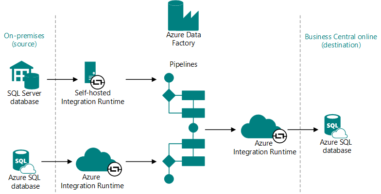

# Migrate On-Premises Data to Business Central Online

Organizations that run their workloads on-premises but are looking to move to the cloud can easily migrate to [!INCLUDE [prod_short](../developer/includes/prod_short.md)] online. By moving to the cloud, users get the benefits of cloud scenarios such as Machine Learning, Power BI, Power Automate, and others to drive suggested actions.  

If you're not already familiar with [!INCLUDE [prod_short](../includes/prod_short.md)] online, take a look [here](/dynamics365/business-central/across-preview?toc=/dynamics365/business-central/dev-itpro/toc.json).

## Supported migration paths

[!INCLUDE [bc-cloud-products](../includes/bc-cloud-products.md)]

> [!TIP]
> [!INCLUDE [bc-cloud-nav](../includes/bc-cloud-nav.md)]

If a customer is coming from another product, you can use configuration packages and templates to migrate their data to [!INCLUDE [prod_short](../includes/prod_short.md)] on-premises, and then use the cloud migration tool to switch to [!INCLUDE [prod_short](../includes/prod_short.md)] online. For more information, see [Set Up Company Configuration Packages](set-up-standard-company-configuration-packages.md).  

> [!TIP]
> Customers coming from QuickBooks can use apps from Microsoft to move to [!INCLUDE [prod_short](../includes/prod_short.md)] online. For more information, see [Changing from a QuickBooks App to Dynamics 365 Business Central](/dynamics365/business-central/across-quickbooks-to-business-edition).  
<!--
## Prerequisites

To run cloud migration, Business Central on-premises deployment and Business Central online environment must meet the following requirements.
* The customer must have a [!INCLUDE [prod_short](../includes/prod_short.md)] online tenant  
* The person who runs the migration must be signed in as an administrator of the Microsoft 365 tenant and [!INCLUDE [prod_short](../includes/prod_short.md)] online  
* The on-premises solution must be on the list of supported migration paths  

### Destination online environment

* Customer has a [!INCLUDE [prod_short](../includes/prod_short.md)] online tenant  

  * The on-premises solution must use SQL Server 2016 SP1 or later  
  * The database must have compatibility level 130 or higher  
  * Update statistics and reorganize indexes on all tables on the source database  
  
    This will ensure that the migration runs as fast as possible. For more information, see the documentation for [sp_updatestats (Transact-SQL)](/sql/relational-databases/system-stored-procedures/sp-updatestats-transact-sql) and [Resolve index fragmentation by reorganizing or rebuilding indexes](/sql/relational-databases/indexes/reorganize-and-rebuild-indexes).
* At least one user has *SUPER* permissions in the target company in [!INCLUDE [prod_short](../includes/prod_short.md)] online.  

  This is the only user who can make changes in [!INCLUDE[prod_short](../developer/includes/prod_short.md)] online. All users that do not have *SUPER* permissions will be automatically reassigned to the intelligent cloud user group. This will limit them to read-only access to data in [!INCLUDE[prod_short](../developer/includes/prod_short.md)] online. For more information, se the [Business Central permission sets](#business-central-permission-sets) section.  

* Plan the switch to use [!INCLUDE [prod_short](../includes/prod_short.md)] online for production carefully to not start until migration is complete  

  > [!IMPORTANT]
  > [!INCLUDE [bc-cloud-migrate-prod](../includes/bc-cloud-migrate-prod.md)]  

* Schedule the migration to not conflict with an update of [!INCLUDE [prod_short](../includes/prod_short.md)] online

  [!INCLUDE [bc-cloud-migrate-upgrade](../includes/bc-cloud-migrate-upgrade.md)]  
* Install the migration apps in [!INCLUDE [prod_short](../includes/prod_short.md)]  

  In the [!INCLUDE [prodadmincenter](../developer/includes/prodadmincenter.md)], open the environment that you intend to migrate your data to, and then choose the **Apps** action. Make sure that these apps have the latest updates installed:

  * Intelligent Cloud Base  
  * Business Central Intelligent Cloud  

  > [!IMPORTANT]
  > In [!INCLUDE [prod_short](../developer/includes/prod_short.md)] online, install, publish, or upgrade the **Intelligent Cloud Base** extension first, and then the product-specific extension or extensions.

  If you're migrating from an earlier supported version of [!INCLUDE [prod_short](../includes/prod_short.md)], you must also make sure that the following apps are updated:

  * Business Central Cloud Migration – Previous Release  
  * Business Central Cloud Migration – Previous Release [code for your country-specific version]  

  Also, at the end of the upgrade, you must make sure that the `applicationVersion` field in the `ndo$tenantdatabaseproperty` table is set to the right version. If the field is blank, or if it's set to an older version than the migration tool supports, the migration can't run. For more information, see [Post-upgrade tasks](../upgrade/upgrade-unmodified-application-v14-v17.md#post-upgrade-tasks).  

  If you're migrating from Dynamics GP, make sure that the following apps are installed and updated:

  * Dynamics GP Intelligent Cloud  
  * Dynamics GP History SmartLists  

  > [!IMPORTANT]
  > Migrating from Dynamics GP using the **Cloud Migration Setup** assisted setup guide is currently only supported for the following markets:  
  >
  > * United States
  > * Canada
  > * United Kingdom
  > * Australia

  If you want to migrate from another product, check the marketplace for an app to help.

* Install all customization extensions
  * Make sure all customization extensions have a permission set the gives access.

* Test extensions

  It is highly recommended that you test the impact of any extension in a sandbox environment before having it installed in your production environment in [!INCLUDE[prod_short](../includes/prod_short.md)] online to help avoid any data failures or untended consequences. 

### Source on-premises environment

* Business Central version is a supported migration path.

  If the solution is based on an older version of the on-premises product, upgrade to the latest supported version.

* SQL Server database:

  * Uses SQL Server 2016 or later 
  * Compatibility level set to 130 or higher
  * TCP/IP is enabled. Use SQL Configuration Management.
  * Configured for SQL Server authentication. For more information, go to [Configure SQL Server Authentication](configure-sql-server-authentication.md).
  * Update statistics and reorganize indexes on all tables on the source database  
  
    This will ensure that the migration runs as fast as possible. For more information, see the documentation for [sp_updatestats (Transact-SQL)](/sql/relational-databases/system-stored-procedures/sp-updatestats-transact-sql) and [Resolve index fragmentation by reorganizing or rebuilding indexes](/sql/relational-databases/indexes/reorganize-and-rebuild-indexes).

### Other

- The computer from which you'll run cloud migration has at least 6395 MB free disk space.

    This disk space is required for installing the Microsoft Integration Runtime (IntegrationRuntime_5.23.8324.1.msi). 

## Plan and prepare

* Plan the switch to use [!INCLUDE [prod_short](../includes/prod_short.md)] online for production very carefully to not start until migration is complete  

  [!INCLUDE [bc-cloud-migrate-prod](../includes/bc-cloud-migrate-prod.md)]  

* Schedule the migration to not conflict with an update of [!INCLUDE [prod_short](../includes/prod_short.md)] online

  [!INCLUDE [bc-cloud-migrate-upgrade](../includes/bc-cloud-migrate-upgrade.md)]

* Consider reducing the amount of data that you migrate.  

  [!INCLUDE [migrate-limits](../developer/includes/migrate-limits.md)]

  You can specify which companies to include in the migration in the assisted setup guide, and you can view the migration status of each company in the **Cloud Migration Management** page.  

  If you want to add more companies after the first selection of companies, you can add more companies in the **Cloud Migration Management** page in [!INCLUDE[prod_short](../developer/includes/prod_short.md)] online. For more information, see [Run the tool multiple times](#run-the-tool-multiple-times). But use the [Capacity](tenant-admin-center-capacity.md) section of the [!INCLUDE [prodadmincenter](../developer/includes/prodadmincenter.md)] to keep track of how much data you migrate.  

  > [!TIP]
  > On page 9035 **Data Administration**, you can find reports that are used to compress or cleanup the data. In earlier Business Central versions, the page may not be present. However, most reports can be found using **Search** .
  
  In certain cases, the customer wants to migrate large amounts of data. For large source databases, we recommend deploying the source database to an Azure SQL Database, and then setting up cloud migration from Azure SQL source instead of the on-premise SQL Server. This eliminates the need to install and maintain self-hosted integration runtime on-premise, and ensures much faster data replication.

  Deploying to Azure SQL can be an easy and quick process if done in SQL Server Management Studio connected to the on-premise database. Follow the **Deploy Database to Microsoft Azure SQL Database** wizard, which you find in the **Tasks** context menu on the database. When prompted to choose a service tier for the new Azure SQL database, remember that the lowest configurations may not be adequate for migrating large amounts of data. Consider the right balance between performance and price that would be preferable in your case. The database service tier can be tuned later in Azure Portal.

  We continually work on improving and optimizing the migration tool for larger database sizes. For example, customers can buy more environments, and they can buy extra storage. For more information, see [Managing Capacity](tenant-admin-center-capacity.md). If more assistance is required, contact support as described in [Escalating support issues to Microsoft](manage-technical-support.md#escalating-support-issues-to-microsoft).

  There are no firm limits on the size of the database, the number of daily transactions, or the number of users that can migrate from on-premises to [!INCLUDE [prod_short](../includes/prod_short.md)] online.

-->
<!--## End-to-end process

You manage cloud migration from [!INCLUDE [prod_short](../includes/prod_short.md)] online. But the on-premises solution remains the operative environment until you complete the migration. [!INCLUDE [bc-cloud-migrate-prod](../includes/bc-cloud-migrate-prod.md)]  

Any existing data in [!INCLUDE[prod_short](../developer/includes/prod_short.md)] online will be overwritten with data from your on-premises solution, or source, once the data migration process is run.  

If you don't want data in [!INCLUDE[prod_short](../developer/includes/prod_short.md)] online to be overwritten, don't configure the connection. The only exception is when you migrate from [!INCLUDE [prod_short](../includes/prod_short.md)] on-premises current version because you can run the migration tool multiple times in that specific scenario.

If your data source is [!INCLUDE[prod_short](../developer/includes/prod_short.md)] on-premises, several stored procedures will be added to the SQL Server instance that you define. These stored procedures are required to migrate data from your SQL Server database to the Azure SQL server associated with your [!INCLUDE[prod_short](../developer/includes/prod_short.md)] tenant.  

The main steps in a migration process are:

1. Have a target environment with a paid subscription  
2. Determine which data to migrate

    * For [!INCLUDE [prod_short](../includes/prod_short.md)] on-premises, determine which companies to migrate and the number of migration runs to use to migrate the required data
    * For Dynamics GP, you can use the migration process to move historical data to Azure Data Lake  
    * For Dynamics NAV, upgrade to [!INCLUDE [prod_short](../includes/prod_short.md)] on-premises first, and then migrate  

3. Migrate data, using the **Cloud Migration Setup** assisted setup guide in [!INCLUDE [prod_short](../includes/prod_short.md)] online  
4. Test the result of the migration  
5. Set up users, permissions, and other configurations in [!INCLUDE [prod_short](../includes/prod_short.md)] online  
6. Stop using the on-premises solution, switch off the migration, and tell users to start using [!INCLUDE [prod_short](../includes/prod_short.md)] online for daily business  

> [!TIP]
> Meanwhile, users can train themselves in how to work in [!INCLUDE [prod_short](../includes/prod_short.md)] using a sandbox environment and the [free training modules on Microsoft Learn](/learn/dynamics365/business-central?WT.mc_id=dyn365bc_landingpage-docs).-->

<!--
## Migrate data

Data migration is the process of securely migrating data from an on-premises SQL Server instance (or Azure SQL) to [!INCLUDE[prod_short](../developer/includes/prod_short.md)] online. The process uses the Azure Data Factory (ADF) to migrate the data between databases directly, meaning it doesn't look at any permissions within the applications you're transferring data between, only SQL permissions.  

 

Data is migrated table by table, and success and failures are tracked for each table. If a table fails to migrate, the error will be captured, and the migration moves on to the next table until completed. Tables will fail to migrate if they cannot be found, or if the schema does not match between the cloud and the on-premises tables.  

The initial data migration time can vary depending on factors such as the amount of data to migrate, your SQL Server configuration, and your connection speeds. The initial migration will take the longest amount of time to complete because all data is migrating. After the initial migration, only changes in data will be migrated, so each iteration runs more quickly. You don't need to run the migration process more than once if you don't want to. However, if you're running the migration while users are still using the on-premises system, you must run at least one more migration in order to ensure all data was moved to the cloud before you start transacting in [!INCLUDE [prod_short](../includes/prod_short.md)] online.  

> [!IMPORTANT]
> [!INCLUDE [bc-cloud-migrate-prod](../includes/bc-cloud-migrate-prod.md)]

-->
<!--
## Run the assisted setup guide

To migrate data, in the target company in [!INCLUDE[prod_short](../developer/includes/prod_short.md)] online, run the **Cloud Migration Setup** assisted setup guide.  

> [!IMPORTANT]
> You must be signed in as an administrator of the Microsoft 365 tenant as well as [!INCLUDE [prod_short](../includes/prod_short.md)] online.  

If the user running this flow is a delegated administrator, they must receive approval from a licensed user with either the *Essentials* or the *Premium* license and SUPER permissions in order to run the cloud migration. In this case, the **Data Migration Setup** guide will display an extra step, where the delegated administrator can copy the auto-generated approval link and send it to the licensed user for approval. Once the licensed user has approved the request, the delegated administrator can continue with the setup of the cloud migration and perform all other steps required to complete that process. The licensed user can always revoke the permission to run the migration by choosing the same approval link that was shared by the delegated administrator, or from the **Cloud Migration Approval** page.  

> [!TIP]
> We recommend that you start the migration by running the assisted setup from a company other than the company that you are migrating data to. For example, sign into the demonstration company, CRONUS, and start the process there. This way, you can make sure that all users are logged out of the original company and the target company. This is especially important when you migrate from [!INCLUDE [prod_short](../includes/prod_short.md)] on-premises current version because you can run the migration tool multiple times.

> [!IMPORTANT]
> [!INCLUDE [bc-cloud-migrate-prod](../includes/bc-cloud-migrate-prod.md)]

Once the setup guide is complete and data migration is activated, the initial data migration ready to be run from the **Cloud Migration Management** page whenever you want. Go to [Manage the Migration](#manage-the-migration).

> [!TIP]
> [!INCLUDE [migrate-limits](../developer/includes/migrate-limits.md)]

## Set up the cloud migration

The first thing to do is to set up cloud migration. This task doesn'r migrate any data - it just prepares your environment for running the doesn't run migration. For example, you'll specify the database connection string to your on-premises database, and install the Microsoft Runtime Integration.

1. [Sign in to the Microsoft 365 tenant](https://admin.microsoft.com) used by [!INCLUDE [prod_short](../includes/prod_short.md)] online.

   The person who runs the migration must be signed in as an administrator of the Microsoft 365 tenant as well as [!INCLUDE [prod_short](../includes/prod_short.md)] online .
2. [Sign in to Business Central online](https://businesscentral.dynamics.com) and open environment want to migrate the data to.
3. Search for and open the **Cloud Migration Setup** assisted setup.
4. Switch **I accept warning & privacy notice** on, then select **Next**.
5. Set **Product**  to the the product that you're migrating (BC version 21.1), then select **Next**.
6. On the **Define your SQL database connection** page, fill in th **SQL Connection String**. For example, Server=navdevvm-0604\bcdemo;Database="Demo Database BC (21-0)";User Id=bclogin;Password=3VeryStepUtread!2;, select Next
7. Do one of the following tasks:

   - If you already have a Microsoft integration runtime service instance, you can use the instance by entering its name in the **Integration Runtime Name** box. Then select **Next** and go to step 9. 
   - If you don't already have an integration runtime, leave **Integration Runtime Name** blank, slect **Next**, then go to the next step.

8. Select **Download the Self-hosted Integration Runtime**, the do these steps to install the integration runtime:
    1. On the Download Center page that opens, select **Download** > **IntegrationRuntime_<latestversion>.msi** > **Next**. The file is downloaded to your computer.
    2. Select **Open** file to start the installation. When completed, the **Register Integration Runtime (Self-Hosted)** page opens.
    3. Go back to the **Cloud Migration Setup** page copy the **Authentication key**.
    4. Go back to the **Register Integration Runtime (Self-Hosted)** page and paste the key value in box, then select **Finish**. 
    5. Go back to **Cloud Migration Setup** and select **Next**.
9. Under **Select companies to migrate** page, select one or more companies from the list or switch on **All Companies**, then select **Next** > **Finish**.
10. You've now finished the cloud migration setup. If would like to open **Cloud Migration Management**, where you can run the migration, select **Yes**.
-->

<!--
## Run the cloud migration

This task will run the cloud migration on your that you set up previously, moving data from your on-premises database to your online environment.

1. Search for and open the **Cloud Migration Management** page.
2. Select **Run Migration Now** > **Yes**. This step will try to start the cloud migration.
3. If successful, you'll get a message that the could migration was triggered. Select OK, then you can monitor the status on the **Cloud Migration Management** page.-->

<!--
## Specify the SQL connection

If the product you selected requires a SQL connection, this page will be presented. Other source applications may require different information to connect to them. This page will display the connection information based on the product that you specified in the previous page. This is defined from the installed extensions for the product you've selected. The following list provides more details about the fields in this part of the assisted setup guide.  

* **SQL Connection**

  Specify *SQL Server* for a locally installed SQL Server instance, or *Azure SQL*.
  
  > [!IMPORTANT]
  > Azure SQL Managed Instance is not supported.  

* **SQL Connection string**

  You must specify the connection string to your SQL Server, including the name of the server that SQL Server is running on, and the name of the instance, the database, and the relevant user account.  

  For example, `Server=MyServer\BCDEMO;Database=BC180;UID=MySQLAccount;PWD=MyPassWord;`, if you're migrating from [!INCLUDE [prod_short](../developer/includes/prod_short.md)] on-premises, version 18. For more information, see [the SQL Server blog](/archive/blogs/sqlforum/faq-how-do-i-find-the-correct-server-or-data-source-value-for-an-sql-server-instance-in-a-connection-string).  

  The following snippets illustrate a couple of connection strings with different formats:  

    `Server={Server Name\Instance Name};Initial Catalog={Database Name};UserID={SQL Authenticated UserName};Password={SQL Authenticated Password};`  

    `Server={Server Name\Instance Name};Database={Database Name};User Id={SQL Server Authenticated UserName};Password={SQL Server Authenticated Password};`  

  > [!IMPORTANT]
  > In the second connection string format, don't forget to add the **space** in *User Id* parameter as it's mandatory and can throw an error if it's missing.

  The SQL connection string is passed to Azure Data Factory (ADF), where it's encrypted and delivered to your Self-Hosted Integration Runtime and used to communicate with your SQL Server instance during the data migration process.  

* **Integration runtime name**

  If your SQL connection is *SQL Server*, you must specify the runtime service that will be used to replicate the data from the defined source to [!INCLUDE [prod_short](../includes/prod_short.md)] online. The integration runtime must be running on the machine that holds the SQL Server database. If you don't already have a runtime service, leave the field empty, and then choose the **Next** button.  

  If you leave the **Integration runtime name** field empty, a new page appears from where you can download the self-hosted integration runtime that you must install. Follow the instructions on the page.  [!INCLUDE [tooltip-inline-tip_md](../includes/tooltip-inline-tip_md.md)]

Once you choose **Next**, a new pipeline will be created in the Azure service. This takes less than a minute to complete, in most cases. If you want to test your SQL string, open the **Microsoft Integration Runtime Configuration Manager**, and then choose the **Diagnostics** menu option. From there, you can test to see if the connection is good.  -->

<!--
## Manage the migration

Once you have set up this configuration, you can manage your cloud environment and data migration from the **Cloud Migration Management** page in [!INCLUDE[prod_short](../developer/includes/prod_short.md)] online.  

The **Cloud Migration Management** page provides information about your data migration runs and the ability to manage your migration services, for example.  

The page provides a view of the status of all migration runs. You can view the time the migration ran and the status of each migration. The **Migration Information** tiles show the number of migrated tables and the number of tables that didn't migrate due to warnings or errors. Choose a tile to drill into more details and guidance to correct any errors.  

There's also a tile that shows tables that aren't migrated due to problems with the data. For example, tables with permissions aren't migrated from on-premises solutions because permissions work differently between online and on-premises.

The following table describes the actions that you can run from the page:  

|Action   |Description|
|---------|---------|
|Manage Schedule   not seen  |Opens a page where you can set the migration schedule without having to run the assisted setup guide again.|
|Run Migration Now    |Choose this action to start the data migration manually. A manual run can be helpful if you received errors in the scheduled data migration, you corrected the errors, and you now want to push updated data to the cloud outside of a normally scheduled run. The migration can also be used for subsequent runs after the initial migration. On subsequent runs, the migration tool will only migrate changes that have happened since the previous migration was run. Change tracking is used to identify what data should be moved in those subsequent runs. However, the migration tool cannot run if the target environment is being upgraded. In that case, you must disable cloud migration, upgrade, and then set up cloud migration again.|
|Run Data Upgrade Now|Choose this action to upgrade data, such as if you're migrating data from an earlier version to the latest version of [!INCLUDE [prod_short](../includes/prod_short.md)].|
|Refresh Status      |If a migration run is in progress, you can choose to refresh status to update the page. If the run is complete, the status will update using the refresh status action without having to close the window and reopen it.|
|Reset Cloud Data   |You may run into instances where you need to reset your cloud data. This option will clear all data in your cloud tenant and enable you to start over with data migration. Only run this process if you want to start the migration process all over from the beginning. If you need to clear data in your cloud tenant, and you have connectivity issues that persist for more than 7 days, you must contact customer support. They'll create a ticket to have your tenant data cleared. *Only* run this process if you want to start the data migration all over and bring all data from on-premises to your cloud tenant.|
|Get Runtime Service Key    |Returns the existing runtime key.|
|Reset Runtime Service Key    |If at any time you suspect that your Self-Hosted Integration Runtime key is no longer secure, you can choose this option to regenerate a new key. A new key will be generated for you and automatically be updated in the Self-Host Integration Runtime service.|
|Disable Cloud Migration    |Opens a guide that helps you through a checklist of instructions to disable the cloud migration configuration. Use the guide when you've migrated the data that you want to migrate, or when you want to upgrade the target environment. Once the steps in this process are complete, you can use your [!INCLUDE[prod_short](../developer/includes/prod_short.md)] online tenant as your primary solution, or you can upgrade the environment.|
|Check for Update           |If there have been changes to the migration service, we'll publish the new service. This action will check to see if a new service has been published. The check will display the version of the service you're currently running and then also display the latest service published. Then, you can choose to update your solution. We recommend that you update the solution if a newer version has been published.|
|Select Companies to Migrate|If your database contains more than one company, use this action to specify which company or companies to run a migration for. For example, you're migrating a large database with multiple companies, so you break down the migration in several runs by including one or a few companies in each migration run. You can see the estimated size of each company|
|Define User Mappings       |This option is available when you sign in to a particular company that has been migrated. This action  should be done in one of the companies you've migrated. This action gives you a list of the users that were in your on-premises environment, and then gives you a list of your Microsoft 365 users, so that you can map the two together. This process renames the **Name** field on the **User Card** to match the user name in your on-premises solution. It isn't a required step, but if you use some of the processes in [!INCLUDE[prod_short](../developer/includes/prod_short.md)] that work with the user name, such as time sheets, you may want to map users. Time sheets are visible based on the user name you're logged in as in [!INCLUDE[prod_short](../developer/includes/prod_short.md)]. Map users only once for each migration. If you run the mapping twice or more, you might run into conflicts. |
|Setup Checklist      |When you're ready to use your [!INCLUDE[prod_short](../developer/includes/prod_short.md)] online tenant as your main system, the tables that weren't migrated must be set up or defined as needed. The checklist page shows recommended steps to complete your migration to the cloud.|
|Azure Data Lake|This option is available if the [!INCLUDE [prod_short](../developer/includes/prod_short.md)] online tenant is connected to Dynamics GP. For more information, see [Migrate Dynamics GP to Azure Data Lake](migrate-dynamics-gp.md#lake).|

<!-- Manage Custom tables and Create Diagnostic Run, Repair Companion Table Records-->
<!-- |Manage Schedule     |Opens a page where you can set the migration schedule without having to run the assisted setup guide again.|-->
<!--
## Run the tool multiple times

There are some scenarios where it will be necessary for you to run the cloud migration setup guide more than once.  

> [!TIP]
> We recommend that you take a backup of the target environment so that you can easily restore the environment to a specific state and time, should you want to.

The  following list highlights a few examples:

* Multiple companies in [!INCLUDE [prod_short](../includes/prod_short.md)] on-premises

  One example is if you want to add more companies to the migration, or if you want to change the companies to migrate, run the assisted setup guide again. A more efficient option, though, is to use the **Select Companies to Migrate** action from the **Cloud Migration Management** page.  

* Add tenants to an existing runtime service  

  If you're a hosting partner, you may have multiple tenants running on the same integration runtime service. Each tenant will be isolated in their own data pipeline. To add tenants to an existing integration runtime service, enter the name of the existing integration runtime service into this field. The integration runtime name can be found in the Microsoft Integration Runtime Manager. For more information, see [Create and configure a self-hosted integration runtime](/azure/data-factory/create-self-hosted-integration-runtime) in the Azure docs.

In both examples, you'll be making updates to an existing runtime service. When you get to the point of the wizard where you can specify an existing runtime services name, open the Microsoft Integration Runtime Service Manager and enter the runtime name in the field in the wizard; you won't be allowed to copy/paste. The runtime service will identify that you're making updates to an existing service and won't create a new one.  

Complete the steps in the wizard to update the runtime service. If the change was related to adding tenants to an existing service, a new data pipeline will be created for that tenant. Regenerating an Azure Data Factory (ADF) key may be done using the **Cloud Migration Management** page in your [!INCLUDE[prod_short](../developer/includes/prod_short.md)] online. For more information, see the [Run the assisted setup guide](#run-the-assisted-setup-guide) section.  

> [!TIP]
> If you are using [!INCLUDE[prod_short](../developer/includes/prod_short.md)] on-premises, the same setup guide is also available in your on-premises solution. You will automatically be redirected to your [!INCLUDE[prod_short](../developer/includes/prod_short.md)] online to continue the configuration process.

> [!CAUTION]
> If you have mapped users in the first run of the cloud migration setup guide, then do not choose the **Define User Mappings** action again in subsequent runs.-->

<!--
## Business Central permission sets

Specifically for migration from [!INCLUDE [prod_short](../includes/prod_short.md)] on-premises, we limit the amount of data that you can enter in [!INCLUDE[prod_short](../developer/includes/prod_short.md)] online to data that isn't migrated. Otherwise any data that was written to the tenant database would be continuously overwritten during the migration process.  

To make setting up this read-only tenant more efficient, we created the *Intelligent Cloud* user group and the *Intelligent Cloud* permission set. Once the cloud migration environment is configured, all users without SUPER permissions will be automatically assigned to the *Intelligent Cloud* user group. Only users with SUPER permissions will be allowed to make modifications to the system at this point.  

> [!NOTE]  
> Before you configure a connection from on-premises to [!INCLUDE [prod_short](../developer/includes/prod_short.md)] online, make sure that at least one user in each company is assigned SUPER permissions.  

Users that are reassigned to the *Intelligent Cloud* user group will have access to read ALL data by default. If you need to further restrict what data a user should be able to read, the SUPER user may create new user groups and permissions sets and assign users accordingly. It's highly recommended to create any new permissions sets from a copy of the *Intelligent Cloud* permission set and then take away permissions you don't want users to have.  

> [!WARNING]
> If you grant insert, modify or delete permissions to any resource in the application that was set to read-only, it could have a negative impact on the data in [!INCLUDE[prod_short](../developer/includes/prod_short.md)] online. If this occurs, you may have to clear all your data and rerun a full migration to correct this.  
-->

<!--
## Company initialization

When a company is created in [!INCLUDE [prod_short](../developer/includes/prod_short.md)], it must be initialized to ensure it's accessible and functional for everyone who needs to use it. If you're familiar with [!INCLUDE [navnow_md](../developer/includes/navnow_md.md)], then you're used to this step happening automatically during the upgrade process, for example. But it's not quite the same with [!INCLUDE [prod_short](../developer/includes/prod_short.md)] online. When a migration run completes, you're prompted to view a list of non-initialized companies so that you can start the initialization. You can choose to mark a company as already initialized, such as if it was initialized in an earlier migration run. Technically, the initialization runs as a scheduled task in the job queue, and the status is automatically updated in the list of companies when a task completes.  

> [!NOTE]
> When you schedule an initialization in the **Hybrid Companies** list, we recommend not using the company until its initialized. The setup data could be missing, which might cause problems. <!--then you cannot make any modifications to the company until the initialization task completes.-->

<!--
## End the migration

Once you've migrated the data that you want to migrate to [!INCLUDE [prod_short](../includes/prod_short.md)] online, you end the migration by disabling cloud migration in the **Cloud Migration Setup** page. This is an important step, because each time someone runs the migration, outstanding documents for vendors and customers, general ledger account numbers, inventory items, and any other changes made in the target company in [!INCLUDE [prod_short](../includes/prod_short.md)] online are overwritten.  

> [!NOTE]  
> The amount of time the migration will take to complete depends on the amount of data, your SQL configuration, and your connection speed. Subsequent migrations will complete more quickly because only changed data is migrating.  

> [!IMPORTANT]
> [!INCLUDE [bc-cloud-migrate-upgrade](../includes/bc-cloud-migrate-upgrade.md)]-->

## Next steps

The migration process, including the data flow and tasks that must be done to prepare and run the cloud migration, is similar for Business Central and Dynamics GP. But there are some differences. To continue, select the link that matches your on-premises product:

- [Business Central on-premise to online migration](migrate-business-central-on-premises.md)
- [Dynamics GP on-premise to online migration](migrate-gp-overview.md)

## See also

[FAQ about Migrating to the Cloud from On-Premises Solutions](faq-migrate-data.md)  
[Migrate to Business Central Online from Business Central On-premises](migrate-business-central-on-premises.md)  
[Migrate Dynamics GP Data to the Cloud](migrate-dynamics-gp.md)  
[Upgrading from Dynamics NAV to Business Central Online](../upgrade/Upgrade-Considerations.md#online)  
[Managing Capacity](tenant-admin-center-capacity.md)  
