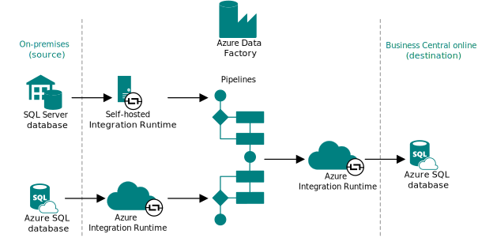

# Dynamics GP on-premises to online migration: End-to-end overview

This article provides an overview of how the migration works and the necessary tasks for completing the migration from Dynamics GP on-premises. By gaining an understanding of the data migration basics, you're able to plan and execute a smooth transition to the cloud. 

## Understanding cloud migration

Data migration is the process of securely migrating data from an on-premises SQL Server instance (or Azure SQL) to [!INCLUDE[prod_short](../developer/includes/prod_short.md)] online.  You manage cloud migration from [!INCLUDE [prod_short](../includes/prod_short.md)] online through a connection to the on-premises database and various components that establish a pipeline for replicating data. The on-premises solution remains the operative environment until you complete the cloud migration. <!--[!INCLUDE [bc-cloud-migrate-prod](../includes/bc-cloud-migrate-prod.md)]-->  

### Components involved

The following figure illustrates the main components involved in the data migration process.

|Component|Description|
|-|-|
|On-premises database|This database is the on-premises SQL Server database or an Azure SQL Database that stores business data for the companies to migrate to the cloud. |
|Azure Data Factory|A key component of the data migration is [Azure Data Factory](/azure/data-factory/introduction). Azure Data Factory is a managed cloud service that's built for migrating large amounts raw data across data sources and controlling data integration projects. Azure Data Factory migrates the data between on-premises and online directly. In other words, it doesn't look at any permissions within the applications you're transferring data between&mdash;only SQL permissions.|
|Pipelines|Pipelines are the main elements of Azure Data Factory. Pipelines are groupings of activities that copy, move, and transform data, and also orchestrate its flow.|
|Integration Runtime|The Integration Runtime component is the compute infrastructure of Azure Data Factory. There are two Integration Runtime instances in the end-to-end process. The first instance securely copies data from on-premises to the cloud, where the pipelines are created. If the on-premises database is an SQL Server database, you use a self-hosted integration runtime. This runtime is installed locally on the on-premises network and registered in Azure Data Factory. If the on-premises database is an Azure SQL Database, an Azure Integration Runtime is used. From the pipeline, the Azure Integration Runtime then moves the data to the online database for the environment. |
|Online database|This database in the Azure SQL Database of the Business Central environment that you're migrating data to.|

## Migrated data

Data migration is the process of securely migrating data from an on-premises SQL Server instance (or Azure SQL) to [!INCLUDE[prod_short](../developer/includes/prod_short.md)] online. The process uses the Azure Data Factory (ADF) to migrate the data between databases directly, meaning it doesn't look at any permissions within the applications you're transferring data between, only SQL permissions.  

Data is migrated table by table, and success and failures are tracked for each table. If a table fails to migrate, the error will be captured, and the migration moves on to the next table until completed. Tables will fail to migrate if they can't be found, or if the schema doesn't match between the cloud and the on-premises tables.  

The initial data migration time can vary depending on factors such as the amount of data to migrate, your SQL Server configuration, and your connection speeds. The initial migration will take the longest amount of time to complete because all data is migrating. After the initial migration, only changes in data will be migrated, so each iteration runs more quickly. You don't need to run the migration process more than once if you don't want to. However, if you're running the migration while users are still using the on-premises system, you must run at least one more migration in order to ensure all data was moved to the cloud before you start transacting in [!INCLUDE [prod_short](../includes/prod_short.md)] online.  

> [!IMPORTANT]
> [!INCLUDE [bc-cloud-migrate-prod](../includes/bc-cloud-migrate-prod.md)]

## End-to-end process

You manage cloud migration from [!INCLUDE [prod_short](../includes/prod_short.md)] online. But the on-premises solution remains the operative environment until you complete the migration. [!INCLUDE [bc-cloud-migrate-prod](../includes/bc-cloud-migrate-prod.md)]  

Any existing data in [!INCLUDE[prod_short](../developer/includes/prod_short.md)] online will be overwritten with data from your on-premises solution, or source, once the data migration process is run.  

If you don't want data in [!INCLUDE[prod_short](../developer/includes/prod_short.md)] online to be overwritten, don't configure the connection. <!--The only exception is when you migrate from [!INCLUDE [prod_short](../includes/prod_short.md)] on-premises current version because you can run the migration tool multiple times in that specific scenario.-->

<!--If your data source is [!INCLUDE[prod_short](../developer/includes/prod_short.md)] on-premises, several stored procedures will be added to the SQL Server instance that you define. These stored procedures are required to migrate data from your SQL Server database to the Azure SQL server associated with your [!INCLUDE[prod_short](../developer/includes/prod_short.md)] tenant.  -->

The main steps in a migration process are:

1. Have a target environment with a paid subscription  
2. Determine which data to migrate.

    You can use the migration process to move historical data to Azure Data Lake.

3. Migrate data, using the **Cloud Migration Setup** assisted setup guide in [!INCLUDE [prod_short](../includes/prod_short.md)] online  
4. Test the result of the migration  
5. Set up users, permissions, and other configurations in [!INCLUDE [prod_short](../includes/prod_short.md)] online  
6. Stop using the on-premises solution, switch off the migration, and tell users to start using [!INCLUDE [prod_short](../includes/prod_short.md)] online for daily business  

> [!TIP]
> Meanwhile, users can train themselves in how to work in [!INCLUDE [prod_short](../includes/prod_short.md)] using a sandbox environment and the [free training modules on Microsoft Learn](/learn/dynamics365/business-central?WT.mc_id=dyn365bc_landingpage-docs).

## Run the assisted setup guide

To migrate data, in the target company in [!INCLUDE[prod_short](../developer/includes/prod_short.md)] online, run the **Cloud Migration Setup** assisted setup guide.  

> [!IMPORTANT]
> You must be signed in as an administrator of the Microsoft 365 tenant as well as [!INCLUDE [prod_short](../includes/prod_short.md)] online.  

If the user running this flow is a delegated administrator, they must receive approval from a licensed user with either the *Essentials* or the *Premium* license and SUPER permissions in order to run the cloud migration. In this case, the **Data Migration Setup** guide will display an extra step, where the delegated administrator can copy the auto-generated approval link and send it to the licensed user for approval. Once the licensed user has approved the request, the delegated administrator can continue with the setup of the cloud migration and perform all other steps required to complete that process. The licensed user can always revoke the permission to run the migration by choosing the same approval link that was shared by the delegated administrator, or from the **Cloud Migration Approval** page.  

> [!TIP]
> We recommend that you start the migration by running the assisted setup from a company other than the company that you are migrating data to. This way, you can make sure that all users are logged out of the original company and the target company.

> [!IMPORTANT]
> [!INCLUDE [bc-cloud-migrate-prod](../includes/bc-cloud-migrate-prod.md)]

Once the setup guide is complete and data migration is activated, the initial data migration ready to be run from the **Cloud Migration Management** page whenever you want. Go to [Manage the Migration](migration-manage.md).

> [!TIP]
> [!INCLUDE [migrate-limits](../developer/includes/migrate-limits.md)]

[!INCLUDE[cloud-migration-sql-connection-ir](../developer/includes/cloud-migration-sql-connection-ir.md)]

## Run the tool multiple times

There are some scenarios where it will be necessary for you to run the cloud migration setup guide more than once.  

> [!TIP]
> We recommend that you take a backup of the target environment so that you can easily restore the environment to a specific state and time, should you want to.

The following list highlights a few examples:

* Multiple companies in on-premises

  One example is if you want to add more companies to the migration, or if you want to change the companies to migrate, run the assisted setup guide again. A more efficient option, though, is to use the **Select Companies to Migrate** action from the **Cloud Migration Management** page.  

* Add tenants to an existing runtime service  

  If you're a hosting partner, you may have multiple tenants running on the same integration runtime service. Each tenant will be isolated in their own data pipeline. To add tenants to an existing integration runtime service, enter the name of the existing integration runtime service into this field. The integration runtime name can be found in the Microsoft Integration Runtime Manager. For more information, see [Create and configure a self-hosted integration runtime](/azure/data-factory/create-self-hosted-integration-runtime) in the Azure docs.

In both examples, you'll be making updates to an existing runtime service. When you get to the point of the wizard where you can specify an existing runtime services name, open the Microsoft Integration Runtime Service Manager and enter the runtime name in the field in the wizard; you won't be allowed to copy/paste. The runtime service will identify that you're making updates to an existing service and won't create a new one.  

Complete the steps in the wizard to update the runtime service. If the change was related to adding tenants to an existing service, a new data pipeline will be created for that tenant. Regenerating an Azure Data Factory (ADF) key may be done using the **Cloud Migration Management** page in your [!INCLUDE[prod_short](../developer/includes/prod_short.md)] online. For more information, see the [Run the assisted setup guide](#run-the-assisted-setup-guide) section.  

> [!TIP]
> If you are using [!INCLUDE[prod_short](../developer/includes/prod_short.md)] on-premises, the same setup guide is also available in your on-premises solution. You will automatically be redirected to your [!INCLUDE[prod_short](../developer/includes/prod_short.md)] online to continue the configuration process.

> [!CAUTION]
> If you have mapped users in the first run of the cloud migration setup guide, then do not choose the **Define User Mappings** action again in subsequent runs.

## Business Central permission sets

Specifically for migration from [!INCLUDE [prod_short](../includes/prod_short.md)] on-premises, we limit the amount of data that you can enter in [!INCLUDE[prod_short](../developer/includes/prod_short.md)] online to data that isn't migrated. Otherwise any data that was written to the tenant database would be continuously overwritten during the migration process.  

To make setting up this read-only tenant more efficient, we created the *Intelligent Cloud* user group and the *Intelligent Cloud* permission set. Once the cloud migration environment is configured, all users without SUPER permissions will be automatically assigned to the *Intelligent Cloud* user group. Only users with SUPER permissions will be allowed to make modifications to the system at this point.  

> [!NOTE]  
> Before you configure a connection from on-premises to [!INCLUDE [prod_short](../developer/includes/prod_short.md)] online, make sure that at least one user in each company is assigned SUPER permissions.  

Users that are reassigned to the *Intelligent Cloud* user group will have access to read ALL data by default. If you need to further restrict what data a user should be able to read, the SUPER user may create new user groups and permissions sets and assign users accordingly. It's highly recommended to create any new permissions sets from a copy of the *Intelligent Cloud* permission set and then take away permissions you don't want users to have.  

> [!WARNING]
> If you grant insert, modify or delete permissions to any resource in the application that was set to read-only, it could have a negative impact on the data in [!INCLUDE[prod_short](../developer/includes/prod_short.md)] online. If this occurs, you may have to clear all your data and rerun a full migration to correct this.  

## Company initialization

When a company is created in [!INCLUDE [prod_short](../developer/includes/prod_short.md)], it must be initialized to ensure it's accessible and functional for everyone who needs to use it. <!--If you're familiar with [!INCLUDE [navnow_md](../developer/includes/navnow_md.md)], then you're used to this step happening automatically during the upgrade process, for example. But it's not quite the same with [!INCLUDE [prod_short](../developer/includes/prod_short.md)] online.--> When a migration run completes, you're prompted to view a list of non-initialized companies so that you can start the initialization. You can choose to mark a company as already initialized, such as if it was initialized in an earlier migration run. Technically, the initialization runs as a scheduled task in the job queue, and the status is automatically updated in the list of companies when a task completes.  

> [!NOTE]
> When you schedule an initialization in the **Hybrid Companies** list, we recommend not using the company until its initialized. The setup data could be missing, which might cause problems. <!--then you cannot make any modifications to the company until the initialization task completes.-->

## End the migration

Once you've migrated the data that you want to migrate to [!INCLUDE [prod_short](../includes/prod_short.md)] online, you end the migration by disabling cloud migration in the **Cloud Migration Setup** page. This is an important step, because each time someone runs the migration, outstanding documents for vendors and customers, general ledger account numbers, inventory items, and any other changes made in the target company in [!INCLUDE [prod_short](../includes/prod_short.md)] online are overwritten.  

> [!NOTE]  
> The amount of time the migration will take to complete depends on the amount of data, your SQL configuration, and your connection speed. Subsequent migrations will complete more quickly because only changed data is migrating.  

> [!IMPORTANT]
> [!INCLUDE [bc-cloud-migrate-upgrade](../includes/bc-cloud-migrate-upgrade.md)]

## See also

[FAQ about Migrating to the Cloud from On-Premises Solutions](faq-migrate-data.md)  
[Migrate to Business Central Online from Business Central On-premises](migrate-business-central-on-premises.md)  
[Migrate Dynamics GP Data to the Cloud](migrate-dynamics-gp.md)  
[Upgrading from Dynamics NAV to Business Central Online](../upgrade/Upgrade-Considerations.md#online)  
[Managing Capacity](tenant-admin-center-capacity.md)  
