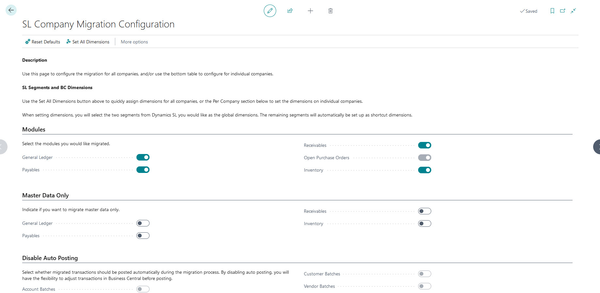

# Configure Dynamics SL company migration

The Business Central cloud migration tools for Dynamics SL include the **SL Company Migration Configuration** page. This page lets you set global settings for all companies selected to migrate, with the option to update at a company level if necessary. Learn more about the data that can be migrated in [Dynamics SL data migrated to Business Central online](migrate-dynamics-SL.md).

Complete this task after you set up cloud migration and before you replicate data.

[!INCLUDE [migrate-e2e-process](../developer/includes/migrate-e2e-process-SL.md)]

## Prerequisites

[Run cloud migration setup](migration-setup-SL.md).

## Get started

The **SL Company Migration Configuration** page opens automatically when you complete the **Cloud Migration Setup** assisted setup. You can also open the page by searching for and opening the **Cloud Migration Management** page and then selecting the **SL Company Migration Configuration** action.

Once the **SL Company Migration Configuration** page is open, start configuring the data to migrate using the different sections of the page.

The page allows you to configure the migration globally for all selected companies (using the upper sections of the page) or indivdually for each company using the **Per Company** section.

You don't have to make changes on this page unless there's more than one subaccount segment in Dynamics SL. In that case, you must indicate which subaccount segment to use for the global dimensions.

As a best practice, specify how many years back to migrate data. Otherwise, the tool migrates all years. Regardless of whether you make changes, review the default settings before closing the page and continuing the migration process.

## Configure migration globally

The steps in this section configure the data migration globally for all companies that you chose to migrate using the **Cloud Migration Setup**. If you're migrating more than one company, you can specify the [configuration on a per company basis](#configure-migration-per-company).

1. **Set the dimensions**.

   To assign default dimensions for the companies you're migrating, select the **Dimension 1** and **Dimension 2** values in the **Per Company** section for each company. Set the dimensions manually for these companies. **Dimension 1** and **Dimension 2** are selected from the Dynamics SL subaccount segments you want to use as the global dimensions in Business Central. The remaining segments are automatically set up as shortcut dimensions.  [Learn more about Dimensions](/dynamics365/business-central/finance-dimensions).

1. **Modules**: Choose the modules to migrate.

   Use the **Modules** section to choose the specific modules to migrate data from to Business Central. By default, all modules are selected for migration. To exclude a module, turn off its switch. For example, to exclude payables, turn off the **Payables** switch.

   If you're migrating the General Ledger module, be sure to go to the **Per Company** section and specify the **Oldest GL Year** field. The year and all future years are migrated to Business Central. If you don't set the **Oldest GL Year** field, all years are migrated.

1. **Master Data Only**: Choose whether to migrate master data only for modules.

   Use the **Master data only** section to specify those modules for which you only want to migrate master data. For example, if you only want to migrate Vendors, turn on the **Payables**. Transactions aren't migrated in this case.

   By default, both master data and transactional data for the selected modules are migrated. Master data represents the core information about entities that change infrequently, for example, information about a vendor. Transactional data captures specific activities or events for an entity, like open vendor documents.

1. **Disable Auto Posting**: Choose whether to disable auto posting for migrated transactions for the modules listed.

   By default, the migration process automatically posts migrated transactions in batches based on the type. In the **Disable Auto Posting** section, specify transactions that you don't want to be posted automatically. To disable auto posting, turn off the switch.

   Disabling auto posting is useful if you wanted to modify transactions before they're posted. For example, if you wanted to adjust some **General Ledger** accounts before they're posted, turn off the **Account batches** switch.

1. **Inactive Records**: Choose the inactive record or discontinued items that you want to migrate.

   In the **Inactive records** section, specify the inactive records or discontinued items that you want to migrate. By default, no inactive records or discontinued items are migrated. For example, to migrate inactive customers, turn on the **Inactive Customers** switch.

1. **Classes**: Choose the classes that you want to migrate as posting groups.

   This feature is currently not available in the Dynamics SL Migration Tool.

1. **Historical Snapshots**: Choose the historical transactions that you want to migrate.

   In the **Historical Snapshots** section, specify historical transactions to migrate to Business Central. The selected transactions are migrated to extension tables in Business Central. Users in the Business Central client can then view the data from specific Dynamics SL list pages.

   To migrate historical transactions, use the following steps.
   1. Turn on the **Enable/Disable All Transactions** switch.
   1. Turn on the switch for each transaction type you want to migrate, like **GL Transactions** and **AR Transactions**.
   1. Go to the **Per Company** section and set **Oldest Snapshot Year** field the earliest year in Dynamics SL that you want to be migrated.

## Configure migration per company

In the **Per Company** section, set the data migration settings separately for each company when migrating more than one company. You can specify the same settings as globally, plus a couple more. By default, each company uses the global settings.

Specify how far back in time to migrate general ledger (GL) account summary data and historical snapshots using the following fields:

- **Oldest GL Year**: Select the year from which you want to migrate GL account summary transactions. If the **Oldest GL Year** field is empty, all years are migrated. Account summary transactions are generated and posted for open and history years set up in Dynamics SL. The summary amounts are created based on the fiscal periods set up in Dynamics SL. For example, if 2019, 2020, 2021, and 2022 are historical years in Dynamics SL, but you only want to migrate data from 2021 and later, set the **Oldest GL Year** to 2021. As a result, summary transactions for 2019 and 2020 aren't migrated to Business Central.
- **Oldest Snapshot Year**: Select the year from which you want to migrate history snapshots. If the **Oldest GL Year** field is empty, history snapshots from all years are migrated.

## Next steps

[Run data replication](migrate-data-replication-run-sl.md)
