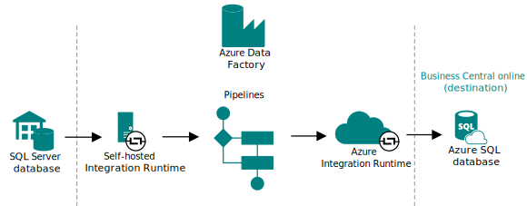

# Dynamics SL migration to Business Central online: End-to-end overview

This article gives an overview of how to migrate from Dynamics SL on-premises to Business Central online. Understanding the data migration basics helps you plan and execute a smooth transition to the cloud.

## Understanding cloud migration

Data migration securely moves data from an on-premises SQL Server instance to [!INCLUDE[prod_short](../developer/includes/prod_short.md)] online. You manage cloud migration from [!INCLUDE [prod_short](../includes/prod_short.md)] online through a connection to the on-premises database and various components that establish a pipeline for replicating data. The on-premises solution remains the operative environment until you complete the cloud migration.

### Components involved

The following figure shows the main components involved in the data migration process.

<!-- no sl version-->

|Component|Description|
|-|-|
|**On-premises database**|This database is the on-premises SQL Server database that stores business data for the companies to migrate to the cloud. |
|**Azure Data Factory**|A key component of the data migration is [Azure Data Factory](/azure/data-factory/introduction). Azure Data Factory is a managed cloud service that's built for migrating large amounts of raw data across data sources and controlling data integration projects. Azure Data Factory migrates the data between on-premises and online directly. In other words, it doesn't look at any permissions within the applications you're transferring data between&mdash;only SQL permissions.|
|**Pipelines**|Pipelines are the main elements of Azure Data Factory. Pipelines are groupings of activities that copy, move, and transform data, and also orchestrate its flow.|
|**Integration Runtime**|The Integration Runtime component is the compute infrastructure of Azure Data Factory. There are two Integration Runtime instances in the end-to-end process. The first instance securely copies data from on-premises to the cloud, where the pipelines are created. If the on-premises database is an SQL Server database, you use a self-hosted integration runtime. This runtime is installed locally on the on-premises network and registered in Azure Data Factory.|
|**Online database**|This database is the Azure SQL Database of the Business Central environment to which you're migrating data.|

### What data is migrated

In general, the cloud migration tool migrates the following data:

- System and company setup, accounting periods (Dynamics SL Fiscal periods), tax areas (Dynamics SL Tax Groups), and locations (Dynamics SL Inventory Sites)
- Master data for accounts, customers, vendors, and items
- Open Document amounts for customers and vendors
- Account balances by period
- Historical data

The company data that is migrated is configurable as part of the cloud migration setup. Learn more in [Configure Dynamics SL company migration](migrate-dynamics-SL.md).

### How data is migrated

Data is migrated table by table, and success and failures are tracked for each table. If a table fails to migrate, the error will be captured, and the migration moves on to the next table until completed. Tables fail to migrate if they can't be found, or if the schema doesn't match between the cloud and the on-premises tables.  

Typically, you first run the migration as a test on a sandbox environment. Then, when you're ready to go live, you run the migration on the production environment. The data migration time can vary depending on factors such as the amount of data to migrate, your SQL Server configuration, and your connection speeds.

> [!IMPORTANT]
> [!INCLUDE [bc-cloud-migrate-prod](../includes/bc-cloud-migrate-prod.md)]

## End-to-end process

This section outlines the general process or phases you go through to migrate data from on-premises to online.

1. **Migration Assessment**

   Before migrating your on-premises deployment to the cloud, evaluate its readiness using the Dynamics SL Analysis and Dynamics SL Repair tools. These tools provide migration options based on your needs and detect potential migration issues based on your Dynamics SL system structure. Download the tools from GitHub at [BCTech/Samples/DynamicsSLMigrationTools/Analysis and Repair Tool at master · microsoft/BC Tech](https://github.com/microsoft/BCTech/tree/master/samples/DynamicsSLMigrationTools/Analysis%20and%20Repair%20Tool).

   - The **Analysis Tool** connects to a Microsoft Dynamics SL database and generates an analysis report text file.
   - The report outlines and provides an overview of the modules in use and examines the data that can be migrated to Business Central.
   - Analysis Report information example:
     - Microsoft Dynamics SL version
     - Microsoft SQL version
     - Overview of Microsoft Dynamics SL modules being used
     - Module details including the number of:
       - Records in master tables
       - Records in transaction tables

   - The **Repair Tool** connects to a Microsoft Dynamics SL database.
     - The Repair tool is used to validate Microsoft Dynamics SL data to identify any issues that require repair before using the online Business Central tool to migrate Microsoft Dynamics SL data to Microsoft Dynamics Business Central.
     - Repair Tool:
       - Includes automated fixes to the Microsoft Dynamics SL data.
       - Includes repair items that need to be addressed.

1. **Preparation**

   The preparation phase ensures a fast and problem-free migration. It typically includes these tasks:

   1. **Plan**

      Create a migration plan with a detailed timeline, resource requirements, and approach. A well-crafted plan minimizes downtime and prevents users from losing work. Plan to run cloud migration between environment updates.

      Learn more in [Prepare and plan for cloud migration from Dynamics SL](cloud-migration-plan-prepare-SL.md).
  
   1. **Verify prerequisites**

      Prepare your on-premises environment for migration, which includes ensuring that it meets the prerequisites for migration, such as using SL 2015 or later. This step is crucial in ensuring that your environment is ready for the migration process.

      Learn more in [Cloud migration prerequisites for Dynamics SL](cloud-migration-prerequisites-SL.md).
   1. Verify that data is in the best state possible to complete the migration:

      This step involves reviewing your data to ensure that it's clean, accurate, and in the best possible state for migration.

1. **Cloud migration setup**

   The phase doesn't migrate any data, but it gets the environment ready for migration by establishing the connection and pipeline between the on-premises database and the online tenant database. You also specify which companies to migrate. This phase starts when you run the **Set up Cloud Migration** assisted setup guide in [!INCLUDE [prod_short](../includes/prod_short.md)] online.

   Learn more in [Set up cloud migration](migration-setup-overview.md).

1. **Configure Dynamics SL company migration**

   The step is part of the setup phase in which you select the companies and data that you want to migrate.

   Learn more in [Configure Dynamics SL company migration](migrate-SL-configure-companies.md).

1. **Data replication**

   This step migrates data from on-premises to online. It starts when you run the **Run data replication** assisted setup guide in [!INCLUDE [prod_short](../includes/prod_short.md)] online. At the end of the process, you have a copy of the on-premises data in the relevant [!INCLUDE [prod_short](../includes/prod_short.md)] online environment.

   At this point in the process, you can verify whether the migration went well or not, fix any problems, and rerun the replication multiple times if you want to. Once the data replicates to the sandbox environment, you can use the troubleshooting tools in the [!INCLUDE [prodadmincenter](../developer/includes/prodadmincenter.md)].

   Learn more in [Replicate data](migration-data-replication.md). <!--broken migration-data-replication-SL.md-->

1. **Data upgrade**

   After data replication is complete, the cloud migration might have the status *Upgrade Pending* on the **Cloud Migration Management** page. This step starts when you choose the **Run Data Upgrade Now** action in the **Cloud Migration Management** page in [!INCLUDE [prod_short](../includes/prod_short.md)] online for the specific environment.

   Learn more in [Upgrade data for Dynamics SL cloud migration](migration-data-upgrade-SL.md).

   [!INCLUDE [cloud-migration-telemetry](../includes/bc-cloud-migrate-replicate-all-before-upgrade.md)]

1. **Completion and follow-up**

   Completion and follow-up are crucial steps in the cloud migration process. They involve setting up and optimizing your new Business Central online environment. Consider these essential tasks:

   1. **Optimize your Business Central online environment**

      Configure the system to meet your business needs. This task might include setting up security, customizing forms and reports, and integrating with other systems. By taking the time to optimize your new environment, you can ensure that it meets your specific requirements and works seamlessly with your existing systems.
   1. **Set up user access**

      Grant access to your new Business Central online system for all relevant users. This task includes creating new user accounts, setting up permissions, and defining roles and responsibilities.

1. **Go live**

   Once you're satisfied with the new environment setup, switch to the new Business Central online system. This task involves decommissioning the on-premises deployment and ensuring all users use the new system.

   Learn more in [Complete Dynamics SL cloud migration](migration-finish-SL.md).

By completing these tasks, you can ensure a successful migration to the cloud-based Business Central solution.

## Working with environments during cloud migration

You manage the cloud migration from [!INCLUDE [prod_short](../includes/prod_short.md)] online. But once you start the migration phase, the on-premises solution remains the operative environment until you complete the migration. [!INCLUDE [bc-cloud-migrate-prod](../includes/bc-cloud-migrate-prod.md)]  

Any existing data in [!INCLUDE[prod_short](../developer/includes/prod_short.md)] online is overwritten with data from your on-premises solution, or source, once the data replication is run.  

If you don't want data in [!INCLUDE[prod_short](../developer/includes/prod_short.md)] online to be overwritten, don't configure the connection.

### Limited data entry during the migration period

Once the cloud migration is set up and underway, the data that you can enter in the [!INCLUDE[prod_short](../developer/includes/prod_short.md)] online tenant is limited to data that isn't included in data migration from on-premises. Otherwise, any data that was written to the tenant database would be continuously overwritten during the migration process.  

To make setting up this read-only tenant more efficient, we created the *Intelligent Cloud* permission set. Once the cloud migration environment is configured, existing users in the online tenant without SUPER permissions are automatically assigned to the *Intelligent Cloud* Permission Set. Only users with SUPER permissions can make modifications to the system at this point. If you add any online users later, assign them the *Intelligent Cloud* permission set. They're not assigned automatically.

> [!NOTE]  
> Before you configure a connection from on-premises to [!INCLUDE [prod_short](../developer/includes/prod_short.md)] online, make sure that at least one user in each company is assigned SUPER permissions.  

Users that are reassigned to the *Intelligent Cloud* <!--user group--> Permission Set have access to read ALL data by default. If you need to further restrict what data a user can read, the SUPER user can create new user groups and permission sets and assign users accordingly. It's highly recommended to create any new Permission Sets from a copy of the *Intelligent Cloud* Permission Set and then take away permissions you don't want users to have.  

> [!WARNING]
> If you grant insert, modify, or delete permissions to any resource set to read-only, it could negatively impact the data in [!INCLUDE[prod_short](../developer/includes/prod_short.md)] online. If this occurs, you may need to clear all your data and rerun a full migration to correct it.

## Related information

[Migrate Dynamics SL Data to the Cloud](migrate-dynamics-SL.md)  
[FAQ about Migrating to the Cloud from on-premises Solutions](faq-migrate-data.md)  
[Managing Capacity](tenant-admin-center-capacity.md)  
