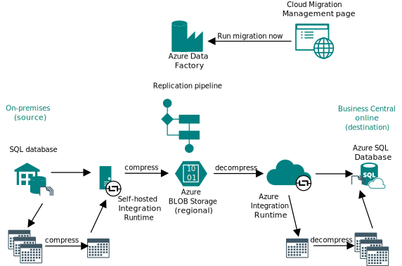
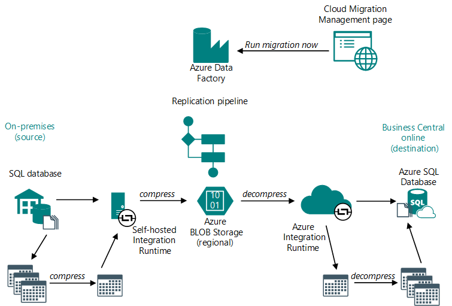

# Data replication overview

After setting up the cloud migration, the next phase of data migration process is replicating the on-premises data to online, also known as data migration. Like cloud migration setup, data replication is done from the destination Business Central online environment, except from the **Cloud Migration Management** page.

## Detailed flow

The following diagram illustrates what happens during the data replication:

<!---->

The following steps provide more details of the different phases in the process:

1. On the **Cloud Migration Management** page, you select the **Run data migration** action to start data replication run.
2. Business Central online calls the Azure Data Factory and the replication pipeline that was installed during the cloud migration setup.
3. The replication pipeline starts and provides instructions to the self-hosted integration runtime for copying data from the on-premises tenant to the online tenant.
4. The data copy process starts. In general, data is copied on a per-table basis. But for performance reasons, there are two flows - one for large tables and one for smaller tables.

   ### [Large table flow](#tab/largetable)

   1. Self-hosted integration runtime gets the table data from the on-premises database.
   2. Self-hosted integration runtime compresses the data and copies it an Azure BLOB storage.

      The Azure BLOB storage acts as a temporary store for the data. The store is regional, so your data isn't moved outside of your region.
   3. Azure integration runtime gets the data from the Azure BLOB storage and decompresses the data.
   4. Azure integration runtime copies data to a table in the online tenant database.
  
   On the **Cloud Migration Management** page, you can monitor the status of each table that's being migrated.

   ### [Smaller table flow](#tab/smalltable)

   The process is similar to the process for larger tables, but the flow has been optimized to limit the number of times data must be transferred from on-premises to online:

   1. On the on-premises side, data from the several smaller tables is collected and serialized into a json file. The json file is compressed and records are merged into single table, which is then stored in Azure BLOB storage.
   2. On the online side, after Azure BLOB storage, the table data is deserialized into a json file. The json file is decompressed and records merged into specific tables in the tenant database.

   On the **Cloud Migration Management** page, you don't see a status until the all data has been merged into the tenant database tables.

   ---

5. When data replication completes, the **Migration log** displays the results.

## Company initialization

When a company is created in [!INCLUDE [prod_short](../developer/includes/prod_short.md)], it must be initialized to ensure it's accessible and functional for everyone who needs to use it. If you're familiar with [!INCLUDE [navnow_md](../developer/includes/navnow_md.md)], then you're used to this step happening automatically during the upgrade process, for example. But it's not quite the same with [!INCLUDE [prod_short](../developer/includes/prod_short.md)] online. When a data replication completes, you're prompted to view a list of noninitialized companies so that you can start the initialization. You can choose to mark a company as already initialized, such as if it was initialized in an earlier migration run. Technically, the initialization runs as a scheduled task in the job queue, and the status is automatically updated in the list of companies when a task completes.  

<!-- got a Setup company page -->

> [!NOTE]
> When you schedule an initialization in the **Hybrid Companies** list, we recommend not using the company until its initialized. The setup data could be missing, which might cause problems. <!--then you cannot make any modifications to the company until the initialization task completes.-->

## Rerunning data replication

The first time you run the data replication, all on-premises tables are replicated to the online tenant database. This run is referred to as a full replication. On subsequent runs, the process uses SQL change tracking versions to replicate only data that has changed since the last replication, making the process faster.

The replication process on the next run will either copy only the changes made since the previous run or replicate the entire table, depending on the retention period set for change tracking in your on-premise database. For faster replications, it's recommended to trigger migration runs at least once within the retention period. If an on-premises table has changed since the previous replication run, but the change tracking retention period expired, the table is fully replicated again.

## Data replication telemetry

[!INCLUDE [cloud-migration-telemetry](../developer/includes/cloud-migration-telemetry.md)]

## Next steps

[Run data replication](migrate-data-replication-run.md)

  <!--add your content here-->

<!--Remove all the comments in this template before you sign-off or merge to the main branch.-->
