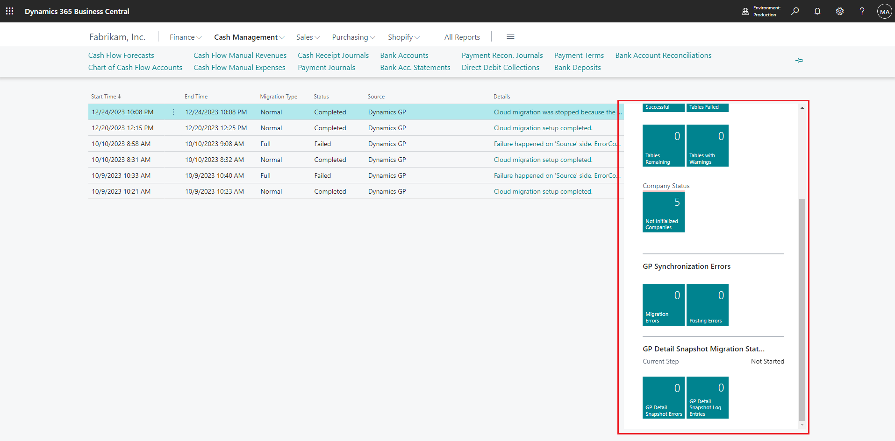

# Managing Dynamics GP cloud migration

Business Central offers two ways to manage cloud migration: the Business Central web client in the online environment or the cloud migration API. The web client provides a user-friendly interface for managing migration runs and services through the **Cloud Migration Management** page, while the API offers more advanced and automated capabilities. Both options allow users to set up, move data, track progress, and manage migration services.

The following section provides an overview of the **Cloud Migration Management** page. For more information about the cloud management API, see [Cloud Migration APIs Overview](cloudmigrationapi/cloud-migration-api-overview.md).

## Cloud Migration Management page

The **Cloud Migration Management** page in the web client is a central hub for managing cloud data migration. This page provides you with the necessary actions and information to manage your migration services and keep track of data migration runs.

- The **Migration Log** gives you the status of all migration runs, including the time they ran and their current progress. 
- Above the **Migration Log**, fields provide details the number of successfully migrated tables. By selecting a field, you can drill down to view more details and guidance on how to correct any errors.
- The **Migration Information** tiles, as illustrated in the following figure, show the number of migrated tables and the number of tables that didn't migrate due to warnings or errors. Select a tile to drill into more details and guidance to correct any errors. There's also a tile that shows tables that aren't migrated due to problems with the data. For example, tables with permissions aren't migrated from on-premises solutions because permissions work differently between online and on-premises.

   
## Available actions

> [!NOTE]
> Some actions aren't available until after you've set up cloud migration, and others aren't active for Dynamics GP migration. 

|Action   |Description|
|---------|---------|
|GP Company Migration Configuration|Configure migration settings for migrating company data in Dynamics GP. [Learn more](migrate-gp-configure-companies.md)|
|Rerun GP Detail Snapshot|Rerun the migration of GP historical transactions based on your company settings.|
|Run Migration Now    |Choose this action to start the data migration manually. The migration can also be used for subsequent runs after the initial migration. On subsequent runs, the migration tool only migrates changes that happened since the previous migration was run. Change tracking is used to identify what data should be moved in those subsequent runs. However, the migration tool can't run if the target environment is being upgraded. In that case, you must disable cloud migration, upgrade, and then set up cloud migration again. [Learn more](migrate-data-replication-run.md)|
|Run Data Upgrade Now|Choose this action to upgrade data. [Learn more](migration-data-upgrade.md)|
|Refresh Status      |If a migration run is in progress, you can choose to refresh status to update the page. If the run is complete, the status updates using the refresh status action without having to close the window and reopen it.|
|Reset Cloud Data   |You might run into instances where you need to reset your cloud data. This option clears all data in your cloud tenant and enables you to start over with data migration. Only run this process if you want to start the migration process all over from the beginning. If you need to clear data in your cloud tenant, and you have connectivity issues that persist for more than seven days, you must contact customer support. They then create a ticket to have your tenant data cleared. *Only* run this process if you want to start the data migration all over and bring all data from on-premises to your cloud tenant.|
|Get Runtime Service Key |Returns the existing runtime key.|
|Reset Runtime Service Key |If at any time you suspect that your Self-Hosted Integration Runtime key is no longer secure, you can choose this option to regenerate a new key. A new key is generated for you and automatically updated in the Self-Host Integration Runtime service.| 
|Disable Cloud Migration    |Opens a guide that helps you through a checklist of instructions to disable the cloud migration configuration. Use the guide after you migrate the data that you want to migrate, or when you want to upgrade the target environment. Once the steps in this process are complete, you can use your [!INCLUDE[prod_short](../developer/includes/prod_short.md)] online tenant as your primary solution, or you can upgrade the environment. [Learn more](migration-finish.md)|
|Check for Update           |If the migration service changed, we publish the new service. This action checks to see whether a new service is available. The check displays the version of the service you're currently running and then also display the latest service published. Then, you can choose to update your solution. We recommend that you update the solution if a newer version is available.|
|Setup Checklist      |When you're ready to use your [!INCLUDE[prod_short](../developer/includes/prod_short.md)] online tenant as your main system, the tables that weren't migrated must be set up or defined as needed. The checklist page shows recommended steps to complete your migration to the cloud.|
|Azure Data Lake|This option is available if the [!INCLUDE [prod_short](../developer/includes/prod_short.md)] online tenant is connected to Dynamics GP. For more information, see [Migrate Dynamics GP to Azure Data Lake](migrate-dynamics-gp.md#lake).|

## Next steps

- [Prepare and plan for cloud migration](cloud-migration-plan-prepare.md)
- [Run cloud migration setup](migration-setup-gp.md)
- [Run data migration](migration-data-replication.md)
- [Run data upgrade](migration-data-upgrade-gp.md)
- [Complete cloud migration](migration-finish-gp.md)  

## See also

[Dynamics GP migration to Business Central online: End-to-end overview](migrate-gp-overview.md)  
[FAQ about migrating to Business Central online from on-premises solutions](faq-migrate-data.md)  
