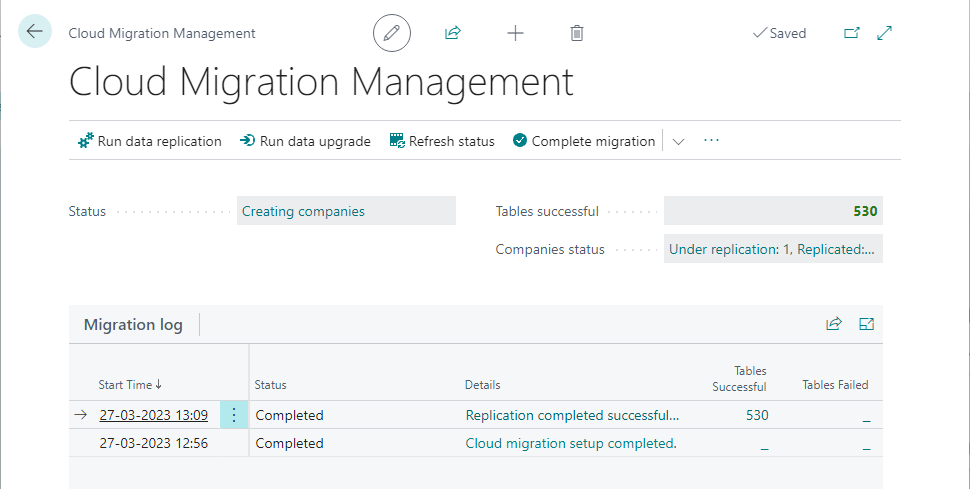

# Managing cloud migration

Business Central offers two ways to manage cloud migration: the Business Central web client in the online environment or the cloud migration API. The web client provides a user-friendly interface for managing migration runs and services through the **Cloud Migration Management** page, while the API offers more advanced and automated capabilities. Both options allow users to set up, move data, track progress, and manage migration services.

The following section provides an overview of the **Cloud Migration Management** page. For more information about the cloud management API, refer to [Cloud Migration APIs Overview](cloudmigrationapi/cloud-migration-api-overview.md).

<!--Cloud migration API provides capability for automating the cloud migration process end-to-end by using APIs. You will be able to complete the setup, move the data, and track the progress, trigger upgrade if needed and switch off the cloud migration.-->

## Cloud Migration Management page

<!--The **Cloud Migration Management** page provides information about your data migration runs and the ability to manage your migration services, for example.  

The page provides a view of the status of all migration runs. You can view the time the migration ran and the status of each migration. The **Migration Information** tiles show the number of migrated tables and the number of tables that didn't migrate due to warnings or errors. Choose a tile to drill into more details and guidance to correct any errors.  

There's also a tile that shows tables that aren't migrated due to problems with the data. For example, tables with permissions aren't migrated from on-premises solutions because permissions work differently between online and on-premises.

The following table gives a brief description of the actions that you can run from the page. More details about how and when to use these actions are provided in other articles of the help.   

> [!NOTE]
> Many actions aren't available until after you've set up cloud migration.-->

The **Cloud Migration Management** page in the web client is a central hub for managing cloud data migration. This page provides you with the necessary actions and information to manage your migration services and keep track of data migration runs.

On the page, the **Migration Log** gives you the status of all migration runs, including the time they ran and their current progress. Above the **Migration Log**, fields provide details about the companies including the number of migrated tables and those tables that didn't migrate due to warnings or errors. By selecting a field, you can drill down to view more details and guidance on how to correct any errors.

<!--Furthermore, there's a tile that highlights tables that weren't migrated due to data-related issues. For example, tables with permissions aren't migrated from on-premises solutions because permissions work differently between online and on-premises.-->

The following table provides a brief description of the actions you can take and when to use them. More detailed information on how to use these actions is available in other articles in the help section.

|Action   |Description|
|---------|---------|
|Run data replication|Select this action to start the data migration right away. This action can also be used for subsequent runs after the initial migration. On subsequent runs, the migration tool only migrates changes that have happened since the previous migration was run. Change tracking is used to identify what data should be moved in those subsequent runs. However, the migration tool can't run if the target environment is being upgraded. In that case, you must disable cloud migration, upgrade, and then set up cloud migration again.|
|Run data upgrade|Select this action to upgrade data, such as if you're migrating data from an earlier version to the latest version of [!INCLUDE [prod_short](../includes/prod_short.md)].|
|Refresh status |If a migration run is in progress, you can choose to refresh status to update the page. If the run is complete, the status updates using the refresh status action without having to close the window and reopen it.|
|Complete migration|Opens a guide that helps you through a checklist of instructions to disable the cloud migration configuration. Use the guide when you've migrated the data that you want to migrate, or when you want to upgrade the target environment. Once the steps in this process are complete, you can use your [!INCLUDE[prod_short](../developer/includes/prod_short.md)] online tenant as your primary solution, or you can upgrade the environment.|
|Pause migration|Stops the cloud migration process. Use this action if you only want plan to run the cloud migration on the environment in the future. |
|Abandon migration|Stops the cloud migration process. Use this action if you don't intent to run the cloud migration again on the environment. This action disables the cloud migration for your environment and data migration from your on-premises solution. You can set up the migration again on the same or different environment.|
|Manage custom tables|Define migration table mappings for renaming tables or moving a subset of fields to a different table or table extension during the cloud migration. For more information, go to [Define migration table mappings](migration-table-mapping.md). For more information, go to [Complete cloud migration](migration-finish.md).|
|Define user mappings |This option is available when you sign in to a particular company that has been migrated. This action should be done in one of the companies you've migrated. This action gives you a list of the users that were in your on-premises environment. Then, it gives you a list of your Microsoft 365 users, so that you can map the two together. This process renames the **Name** field on the **User Card** to match the user name in your on-premises solution. It isn't a required step, but if you use some of the processes in [!INCLUDE[prod_short](../developer/includes/prod_short.md)] that work with the user name, such as time sheets, you may want to map users. Time sheets are visible based on the user name you're logged in as in [!INCLUDE[prod_short](../developer/includes/prod_short.md)]. Map users only once for each migration. If you run the mapping twice or more, you might run into conflicts. |
|Create diagnostic run|Does a test run of the data replication. No data from the on-premises database is migrated to the online tenant, but it allows you to identify issues and fix them before you run the actual replication.|
|Reset cloud data|You may run into instances where you need to reset your cloud data. This option clears all data in your cloud tenant and enables you to start over with data migration. Only run this process if you want to start the migration process all over from the beginning. If you need to clear data in your cloud tenant, and you have connectivity issues that persist for more than seven days, you must contact customer support. They'll create a ticket to have your tenant data cleared. *Only* run this process if you want to start the data migration all over and bring all data from on-premises to your cloud tenant.|
|Get runtime service key|Returns the existing authentication key used by the integration runtime service. |
|Reset runtime service key|If at any time you suspect that your self-hosted integration runtime key is no longer secure, you can select this option to regenerate a new key. A new key is generated for you and automatically updated in the self-hosted integration runtime service.|
|Check for update |If there have been changes to the migration service, we publish the new service. This action checks to see if a new service has been published. The check displays the version of the service you're currently running and then also display the latest service published. Then, you can choose to update your solution. We recommend that you update the solution if a newer version has been published.|
|Select companies to replicate|If your database contains more than one company, use this action to specify which company or companies to run a migration for. For example, you're migrating a large database with multiple companies, so you break down the migration in several runs by including one or a few companies in each migration run. You can see the estimated size of each company|
|Setup checklist|When you're ready to use your [!INCLUDE[prod_short](../developer/includes/prod_short.md)] online tenant as your main system, the tables that weren't migrated must be set up or defined as needed. The checklist page shows recommended steps to complete your migration to the cloud.|
|Repair companion tables|Inserts missing records in table extensions. Use this action if records were copied under replication, but they're not showing up the client UI.|
|Set up cloud migration|Opens the **Cloud Migration Setup** assisted setup guide to configure the cloud migration. Setting up cloud migration is a necessary step before you can replicate data. For more information, go to [Set up cloud migration](migration-setup-overview.md).|
|Sanitize tables|Deletes invalid characters in fields of tables of the on-premises database. Invalid characters include lowercase characters and white space characters. Sanitizing data is recommended before you replicate data. For more information, go to [Clean data](migration-clean-data.md). |
|Enable/disable new UI|Toggles between the legacy and the new user-interface of the **Cloud Migration Management** page. |
|Azure Data Lake|This option is available if the [!INCLUDE [prod_short](../developer/includes/prod_short.md)] online tenant is connected to Dynamics GP. For more information, see [Migrate Dynamics GP to Azure Data Lake](migrate-dynamics-gp.md#lake).|

<!--
|Disable cloud migration|Opens a guide that helps you through a checklist of instructions to disable the cloud migration configuration. Use the guide when you've migrated the data that you want to migrate, or when you want to upgrade the target environment. Once the steps in this process are complete, you can use your [!INCLUDE[prod_short](../developer/includes/prod_short.md)] online tenant as your primary solution, or you can upgrade the environment.|-->
