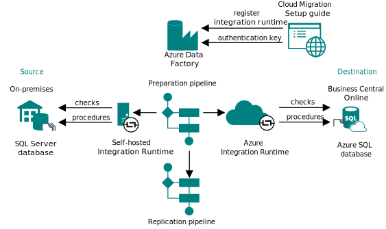
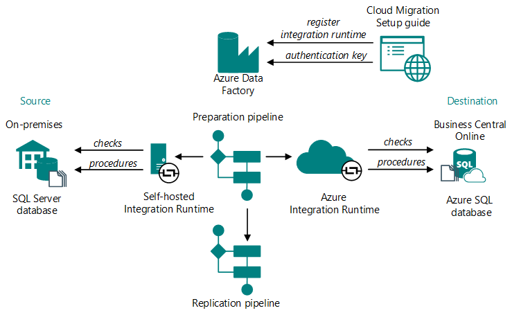

# Cloud migration setup overview

The first phase of cloud migration of on-premises data is the setup, which is done by running the **Cloud Migration Setup** assisted setup from the destination Business Central online environment. This task doesn't migrate any data, but it establishes the connection and pipeline between the on-premises database and online tenant database used for migrating the data. <!--the **Cloud Migration Setup** you'll specify the database connection string to your on-premises database and install the Microsoft Runtime Integration for . The following diagram illustrates what happens during the setup.-->

## Detailed flow

The following figure illustrates the flow of the cloud migration setup:

<!---->

The following steps provide more details of the different phases in the process:

1. Run the **Cloud Migration Setup** assisted setup guide and specify the following information:
   - SQL database connection, like SQL Server or Azure SQL Database and the SQL connection string
   - The integration runtime to use. You can either use an existing instance or install a new one, where you assign it an autogenerated authentication key.

2. The integration runtime is registered with an Azure Data Factory and authentication key exchanged to establish the connection.

   There are several Azure Data Factories available. Load balancing is used to automatically select the factory.
3. Preparation pipeline is created:

   1. Checks the compatibility between the source and destination databases, for example do the compatibility levels and versions match.
   2. If checks succeed, stored procedures are created on the source and destination side.
   3. Gets a list of companies from the source database and a list of extensions installed on the destination.
   4. Creates a list of tables to be migrated to the destination and how they should be copied.
4. Replication pipeline is created based on information in the previous step.

   The replication pipeline is used for copying the data. This pipeline remains idle until you initiate the data replication.
5. Environment is marked as ready for migration and the preparation pipeline is deleted.

After completing 1 or more replication runs, you run data upgrade, then complete the migration.

## Cloud migration setup telemetry

[!INCLUDE [cloud-migration-telemetry](../developer/includes/cloud-migration-telemetry.md)]

## Next steps

1. [Define migration table mappings](migration-table-mapping.md)  
2. [Run data migration setup](migration-setup.md)
