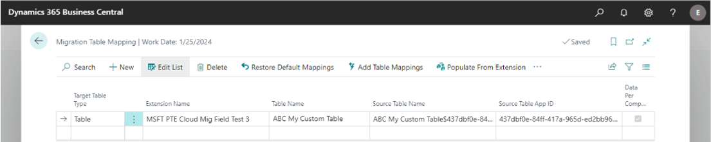
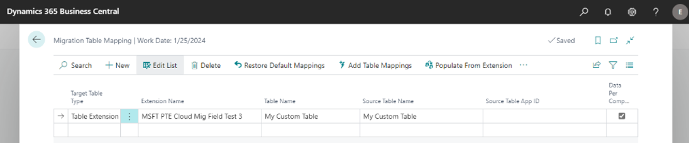
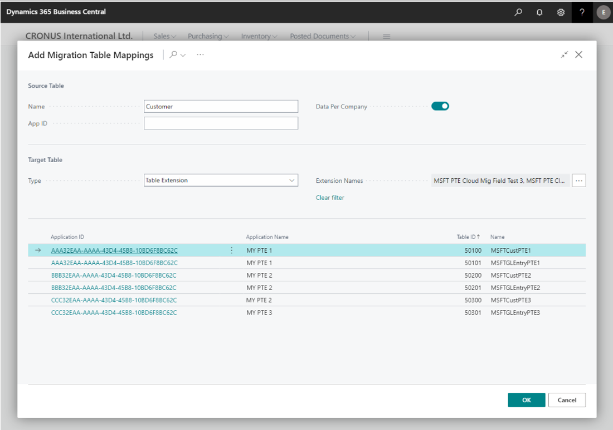

# Migration Table Mapping

Migration table mapping can be used to rename the table during the cloud migration or to move a subset of fields to a different table or table extension.

> [!TIP]
> You can use the **Import** and **Export** actions to import or export the definition done in the UI.

## Rename the table during the cloud migration

This scenario supports adding the prefix or changing the table name during cloud migration.

For example, suppose the Business Central on-premises table is named **My Custom Table**. But in Business Central online, the name needs to be prefixed (or suffixed) with 3 letters, so the table name is **ABC My Custom Table**.

### Prerequisites

- The keys in on-premises table and online table must match.
- The online target table must have the [ReplicateData property](../developer/properties/devenv-replicatedata-property.md) set to `true`.

### Create the table mapping for renaming

1. Sign in to [Business Cental online](https://businesscentral.dynamics.com).
2. Search for and open the **Cloud Migration Management** page.
3. Select **Manage Custom Tables** to open the **Migration Table Mapping** page.
4. Set the following columns:

   |Fields|Value|
   |-|-|
   |Target Type| **Table**|
   |Extension Names|Set to the name of the extension that contains the table |
   |Table Name|Set to the table in the extension. Setting these three fields specifies the target table.|
   |Source Table Name|Enter the full name as it appears in SQL. The system will parse the values.   C/AL table example: `[CRONUS COMPANY$ABC My Custom Table]`   AL table example: `[CRONUS COMPANY$ABC My Custom Table$437dbf0e-84ff-417a-965d-ed2bb9650972]`. The GUID `437dbf0e-84ff-417a-965d-ed2bb9650972` is the extension ID, which in this case is for base app. |

The following figure illustrates an example of the **Migrate Table Mappings** page for an AL table:

## Move a set of fields out of the main table to another table or table extension

> [!NOTE]
> This type of table mapping is only supported for cloud migrations from Business Central. Dynamics GP and SL don't support table extensions.

For example, suppose that you've added two custom fields to the **Customer** table in Business Central on-premises. You want to move these two custom fields to a table extension in Business Central online. If you define a table extension mapping, then the engine will move a subset of fields to the table extension.

### Prerequisite

Fields to be moved to a table extension must have the same name and type as in the source table in the Business Central. If the name is different, the fields will be ignored by the engine, and won't be moved to Business Central online.

### Create the table mapping for moving fields

1. To create the table mapping, follow the same steps as in Scenario 1, except set the **Target Table Type** to **Table Extension**. 

2. If you're moving a table that is per-database table, clear the **Data Per Company** check box.

The following figure illustrates an example of the **Migrate Table Mappings** page for a C/AL table:

 

## Add multiple table mappings

Follow these steps if you need multiple table mappings.

1. On the **Migration Table Mapping** page, select **Add Table Mappings**.  
2. On the **Add Migrate Table Mappings** page, in the **Source Table** section, enter the table name in the **Name** field.

   It's best to enter the full name as it appears in SQL Management Studio.

   |C/AL table |AL table example|
   |-|-|
   |`[CRONUS COMPANY$ABC My Custom Table]`|[CRONUS COMPANY$ABC My Custom Table$437dbf0e-84ff-417a-965d-ed2bb9650972]  The GUID `437dbf0e-84ff-417a-965d-ed2bb9650972` is the extension ID, which in this case is for base app.|

3. To set the target table, go to the **Target Table** section and set the **Type** to **Table** or **Extension**.

    The list shows all the tables that are available for mapping to the target table. You can filter the list by setting an extension in the **Extension Name** field.
4. Select all rows that you want to map to the target table.

   The following figure illustrates an example of the **Add Migrate Table Mappings** page:

    

5. Close the page.

   After closing the page, the multiple table mappings will be inserted. This step is useful when you want to split a single source table into multiple table extensions.

## Provide table mappings programmatically

We recommend that you provide the table mappings programmatically. To do table mappings programmatically, subscribe to `OnInsertDefaultTableMappings` event from codeunit 4001 "Hybrid Cloud Management".

Table mappings will be inserted after the setup wizard is completed or if you run the **Restore Default Mappings** from **Migration Table Mapping** page.
