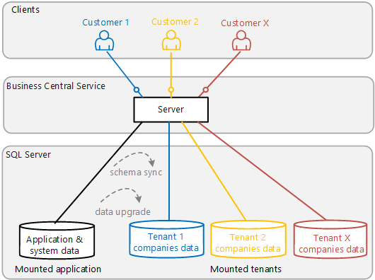

# Multitenant Deployment Setup Guide

This article provides an introduction to the most common tasks you'll do to set up and maintain a [!INCLUDE[server](../developer/includes/server.md)] multitenant deployment.

<!--
The tasks in the table are listed in the order you'd do them if you started from scratch. But most can be done at any time.

|Task|Description|Learn how...|
|----|-----------|------|
|Create the application database|The application database includes tables that store information about the application and system, required by all tenants.|[Creating Application and Tenant Databases](../deployment/devenv-create-databases.md#application)|
|Mount the application database on [!INCLUDE[server](../developer/includes/server.md)]|Also known as just *mounting the application*, this operation configures the [!INCLUDE[server](../developer/includes/server.md)] instance to connect to the application database.|[Mount-NAVApplication cmdlet](/powershell/module/microsoft.dynamics.nav.management/mount-navapplication)|
|Publish symbols and extensions|Extensions include the code for the application. |[Publishing and Installing an Extension](../developer/devenv-how-publish-and-install-an-extension-v2.md)
|Create a tenant database|The tenant database includes tables for storing customer data that's accessible from the application. The tenant database is often referred to as just the *tenant*. The advantage of a multitenant deployment being to having several tenants using the same server and application.|[Creating Application and Tenant Databases](../deployment/devenv-create-databases.md)|
|Mount a tenant database|Mounting a tenant database, which is also referred to as *mounting a tenant*, configures [!INCLUDE[server](../developer/includes/server.md)] so that it can process requests for data it. Mounting a tenant database makes it accessible through the mounted application. |[Mount or Dismount a Tenant](mount-dismount-tenant.md)|
|Synchronize the tenant database|The application database stores the application definition, which defines the required structure or schema of tenant databases. So any changes made to the application that affect the schema will have to be updated or *synchronized* in the tenant database. |[Synchronizing the Tenant](synchronize-tenant-database-and-application-database.md)|
-->

<!--|Create an application or tenant databases|The application database includes tables that store information about the application and system, required by all tenants. The tenant database includes tables for storing customer data that's accessible from the application. The tenant database is often referred to as just the *tenant*. The advantage of a multitenant deployment being to having several tenants using the same server and application.|[Creating Application and Tenant Databases](../deployment/devenv-create-databases.md)|-->

## Create an application database

The application database includes tables that store information about the application and system, required by all tenants. There are two ways to create an application database:

- Start from scratch and use the [New-NAVApplicationDatabase cmdlet](/powershell/module/microsoft.dynamics.nav.management/new-navapplicationdatabase).

    This cmdlet is available in the [!INCLUDE[adminshell](../developer/includes/adminshell.md)]. It creates a database in SQL Server that's initialized with the required tables and data. For more information, see [Create an Application Database](../deployment/devenv-create-databases.md#application).

- Export the application objects from an existing database to a new database.

    If you already have a database that includes the application, you can use the [Export-NAVApplication cmdlet](/powershell/module/microsoft.dynamics.nav.management/Export-NAVApplication) to export only the application objects to a new database.  For more information, see [Exporting the Application Tables to a Dedicated Application Database](../deployment/separating-application-data-from-business-data.md#exportapplication).

## Configure the [!INCLUDE[server](../developer/includes/server.md)] for multitenancy

To set up the [!INCLUDE[server](../developer/includes/server.md)] instance for multitenancy, make the following changes to the server instance configuration:

1. Enable the **Multitenant** setting.
2. Set the server instance to connect to the application database by changing these settings: **DatabaseServer**, **DatabaseServer**, and **DatabaseServer**.

For more information, see [Configuring Business Central Server](../administration/configure-server-instance.md#multitenant) and [Connecting a Business Central Server Instance to a Database](../administration/connect-server-to-database.md).  

> [!TIP]
> Instead of doing the two previous steps, you could use the [Mount-NAVApplication cmdlet](/powershell/module/microsoft.dynamics.nav.management/Mount-NAVApplication). Running this cmdlet will enable the **Multitenant** and set up the data base connection.

## Publish the symbols and extensions

Before mounting tenants, publish the system symbols and extensions that make up your application. Publish the system application and base application extensions as a minimum. Then, as needed, publish any Microsoft and third-party extensions tenants may use.

For more information, see [Publishing and Installing an Extension](../developer/devenv-how-publish-and-install-an-extension-v2.md).

## Create, mount, and synchronize tenants

The tenant database includes tables for storing customer data that's accessible from the application. The tenant database is often referred to as just the *tenant*. The basics tasks for getting a new tenant up and running, and keeping it up to date, are as follows:

1. Create an empty database with the wanted collation in SQL Server.
2. Mount the database as a tenant of the [!INCLUDE[server](../developer/includes/server.md)] instance.

    This operation connects the tenant database to the [!INCLUDE[server](../developer/includes/server.md)] so it can process data requests from the application. See [Mount or Dismount a Tenant](mount-dismount-tenant.md).

3. Synchronize the tenant database with the application.

    The application database stores information that defines the basic structure or schema required for all tenant databases. This operation updates the tenant database schema with the definitions in application database. See [Synchronizing the Tenant](synchronize-tenant-database-and-application-database.md).

4. Synchronize and install extensions.

    The last step is to install all the extensions that you want to use on the tenant. Many extensions define table objects and table extension objects for storing data. So, before you can install an extension, you have to synchronize it with the tenant to update the tenant database's schema. See [Publishing and Installing an Extension](../developer/devenv-how-publish-and-install-an-extension-v2.md).

> [!TIP]
> For more detailed steps, see [Create a Tenant Database](../deployment/devenv-create-databases.md).

## See Also  
[Multitenant Deployment Overview Architecture](../deployment/Multitenant-Deployment-Architecture.md)  
[Multitenant Deployment Architecture](../deployment/Multitenant-Deployment-Architecture.md)  
