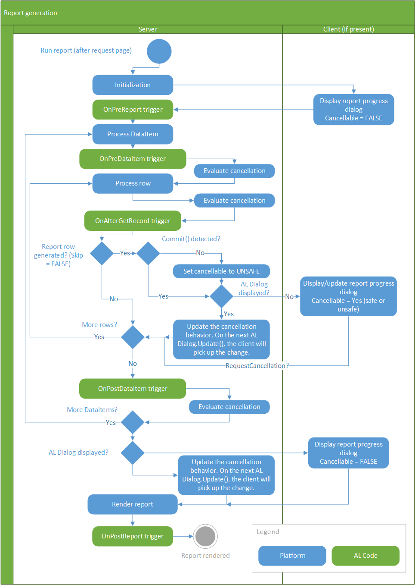
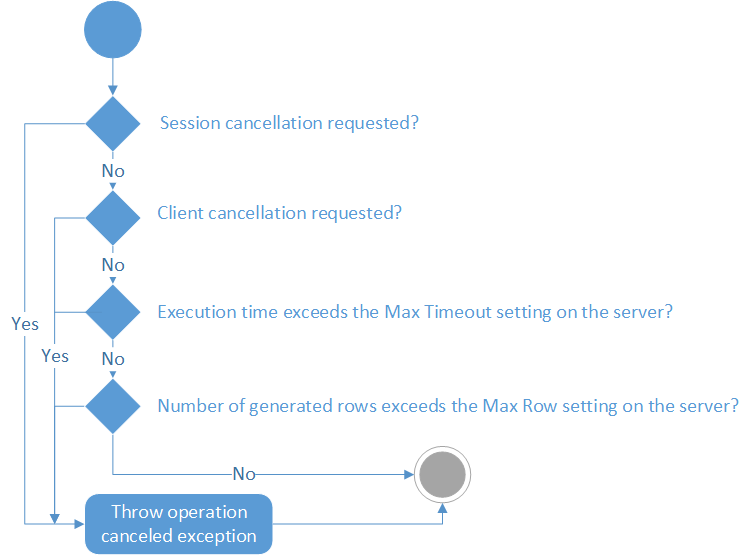

# Report Generation and Cancellation Flow

This following figure illustrates the process that occurs when a report is generated.

  

## Evaluate Cancellation

There are several operations and events that can initiate a request on the server to cancel a report. Some of these operations and events are invoked by the user, while others by the server itself. The server doesn't cancel a report immediately. Instead, every five seconds it evaluates the status of cancellation requests. The following diagram illustrates the flow for this subprocess:

  

This flow means a report isn't necessarily canceled when a limit is exceeded. For example, if the maximum number of rows is exceeded, the report won't be canceled as long as it completes within the five-second interval.

> [!NOTE]
> The report rendering is not included in the evaluate cancellation process and can't be canceled.

## See Also

[Configuring Business Central Server](configure-server-instance.md)  
[Analyzing Report Telemetry](telemetry-reports-trace.md)  