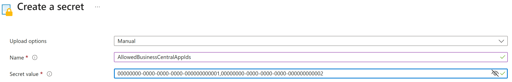

# Set up app key vaults for Business Central online

[!INCLUDE[2020_releasewave2](../includes/2020_releasewave2.md)]

[!INCLUDE[azure-ad-to-microsoft-entra-id](~/../shared-content/shared/azure-ad-to-microsoft-entra-id.md)]

AppSource apps for [!INCLUDE[prod_short](../developer/includes/prod_short.md)] can be developed to get secrets from Azure keys vaults. The app key vault feature is readily available for use on the service by all AppSource apps. However, there are some onboarding tasks required.

> [!IMPORTANT]
> With [!INCLUDE [prod_short](../developer/includes/prod_short.md)] online, App key vaults can only be used with AppSource apps. They're not supported with per-tenant extensions.

> [!TIP]
> You must also specify secrets in a key vault if you deploy [!INCLUDE [prod_short](../developer/includes/prod_short.md)] as part of the Embed App program. Especially if you must support the Outlook add-in, in which case you must specify secrets for TEMPORARYDOCUMENTSTORAGEACCOUNT and TEMPORARYDOCUMENTSTORAGEKEY. <!--For more information, see [Setting Up the Office Add-Ins for Outlook Integration with [!INCLUDE[prod_short](../developer/includes/prod_short.md)]](Setting-up-Office-Add-Ins-Outlook-Inbox.md).-->

Learn more about developing extensions with key vaults in [Using key vault secrets in [!INCLUDE[prod_short](../developer/includes/prod_short.md)] extensions](../developer/devenv-app-key-vault.md).

## Create the Azure key vault with secrets

In this task, you create a key vault in Azure, and add the secrets that you want to make available to your extensions. An extension can use up to two key vaults, so you can create more than one.

There are different ways to create an Azure key vault. For example, you can use the Azure portal, Azure CLI, and more.

The easiest way is to use the Azure portal. Learn more in [Quickstart: Set and retrieve a secret from Azure key vault using the Azure portal](/azure/key-vault/secrets/quick-create-portal). 

For using other methods, learn more in [Azure key vault Developer's Guide](/azure/key-vault/general/developers-guide#creating-and-managing-key-vaults).

## Provision the key reader application in your Microsoft Entra tenant

Your [!INCLUDE [prod_short](../developer/includes/prod_short.md)] online solution is configured to use a Microsoft Entra application for reading key vault secrets. The application is called **Dynamics 365 Business Central ISV key vault Reader**. Microsoft manages the key vault reader application, however, there are a couple tasks that you have to do to enable it. First, the application must be provisioned on your Microsoft Entra tenant, as described here.

To provision the key vault reader application, use the [Microsoft Entra ID PowerShell module](/powershell/module/azuread).

1. Open Windows PowerShell as an administrator.
1. Install the Microsoft Entra ID PowerShell module.

    ```powershell
    Install-Module AzureAD 
    ```

1. Import the Microsoft Entra ID module.

    ```powershell
    Import-Module AzureAD 
    ```

1. Connect to your [!INCLUDE[prod_short](../developer/includes/prod_short.md)] Microsoft Entra tenant.

    1. Run the following command:

       ```powershell
       Connect-AzureAD 
       ```

    1. Provide your sign-in name and password when prompted.

1. Create a Microsoft Entra service principal using the following command:

    ```powershell
    New-AzureADServicePrincipal -AppId 7e97dcfb-bcdd-426e-8f0a-96439602627a
    ```

    `7e97dcfb-bcdd-426e-8f0a-96439602627a` is the Application (client) ID of Microsoft's centralized Microsoft Entra application.

    This step provisions the application in your Microsoft Entra tenant, where it now "lives" together with your key vaults.

## Grant the key vault reader application permission to your key vaults

The next task is to grant the key vault reader application permission to read secrets from your key vaults. The steps in this task are done from the [Azure portal](https://portal.azure.com).

1. Open the key vault in the portal.
2. Select **Access policies**, then **Add Access Policy**.
3. Set **Secret Permissions** to **Get**.
4. Choose **Select principal**, and then in the pane on the right, search for either the application (client) ID **7e97dcfb-bcdd-426e-8f0a-96439602627a** or the display name **Dynamics 365 Business Central ISV key vault Reader**. 
5. Select **Add**, then **Save**.

## Introduce the special Azure key vault secret

Once your key vault is created, there are few steps that you should perform. Feel free to skip the first couple of them if you're just linking new App to an existing Azure key vault.

1. Create **AllowedBusinessCentralAppIds** secret in your key vault. You can learn how to create a secret following this [guide](/azure/key-vault/secrets/quick-create-portal).
2. Add your AppId or AppIds as content of the secret. If you're adding multiple appIds separate them by comma or semicolumn.
Your secret creation screen should look similar to this:
   
3. If you're linking a new app to the existing Azure key vault, you have to create a new version of the **AllowedBusinessCentralAppIds** secret. When creating the new version make sure to correctly append the new appId. In order to do so you have to get the value of the secret from the existing version by clicking on the secret name then on **Current version** and then on **Show secret value**, copy this value and upon creating the new verion modify the secret value to be the existing value + ", [new appId]".

## Extra information

1. The key vault URLs added to your `app.json` file should belong to the same Microsoft Entra Tenant.
2. Microsoft registers the link between your AppSource app and Azure key vault upon submission of a new AppSource app version. Once this link is established, it can't be removed as this is considered breaking changes, and it might break existing installations of your AppSource app.
3. Even if the value of the **AllowedBusinessCentralAppIds** is deleted or some of the appIds are removed from the secret, this won't "deregister" the access to the key vault from this specific AppSource app. Once the registration is done, it's irreversible.
4. If you're facing issues that are generic and don't give you actionable error messages, contact the AppSource Marketplace support.

## Related information  

[Security considerations with app key vaults](../developer/devenv-app-key-vault.md#security)  
[Monitoring and troubleshooting app key vaults](../developer/devenv-app-key-vault.md#troubleshooting)  
[Configuring Business Central Server](configure-server-instance.md)  
