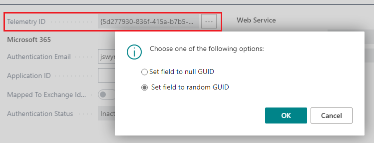

# Enable Environment Telemetry in Application Insights

[!INCLUDE[2019_releasewave2.md](../includes/2019_releasewave2.md)]

This article describes how to set up sending telemetry data to Azure Application Insights for [!INCLUDE [prod_short](../includes/prod_short.md)] online and on-premises environments.

> [!NOTE]
> For extension telemetry, see [Sending Extension Telemetry to Azure Application Insights](../developer/devenv-application-insights-for-extensions.md).

## <a name="appinsights"></a>Get started (set up Azure Application Insights)

1. If you don't already have one, get a subscription to [Microsoft Azure](https://azure.microsoft.com).
2. Sign in to the [Azure portal](https://portal.azure.com).
3. Create an Azure Application Insights resource by following the guidelines at [Workspace-based Application Insights resources](/azure/azure-monitor/app/create-workspace-resource).

    [!INCLUDE [admin-appinsights-germany](../includes/admin-appinsights-germany.md)]

    The Application Insights resource can be in any Azure tenant that is accessible to your organization. For example, a delegated administrator from the reselling partner is the person analyzing the telemetry. But this person might not have access rights the customer's Azure instance. This scenario enables the partner to send the telemetry to their own Application Insights instance.

    > [!TIP]
    > You can use the same Application Insights resource for multiple tenants and their different environments.

    For more information, see [Create an Application Insights resource](/azure/azure-monitor/app/create-new-resource).  

4. Depending on your [!INCLUDE[prod_short](../includes/prod_short.md)] version, get the **Connection String** or **Instrumentation Key** of the Application Insights resource.

    You can copy this information from the **Overview** page for resource in the Azure portal.

    - For [!INCLUDE[prod_short](../includes/prod_short.md)] 2020 release wave 2 (v17) or earlier, copy the **Instrumentation Key**.

    - For later versions, copy the **Connection String**.

        > [!NOTE]
        > For these versions, you can use either the instrumentation key or the connection string. However, for reliability, we recommend that you use the connection string. 

        > [!NOTE]
        > Transition to using connection strings for data ingestion in Application Insights by **31 March 2025**. On 31 March 2025, technical support for instrumentation key–based global ingestion in the Application Insights feature of Azure Monitor will end. After that date, your Applications Insights resources will continue to receive data, but Microsoft no longer provide updates or customer support for instrumentation key–based global ingestion. 

## Enable telemetry on tenants

Once you have the resource and its connection string or instrumentation key, you can enable your tenants to send telemetry to your Application Insights resource.

The way you enable Application Insights depends on whether you want to connect to a [!INCLUDE [prod_short](../includes/prod_short.md)] online or [!INCLUDE [prod_short](../includes/prod_short.md)] on-premises. For on-premises, if also depends on whether the [!INCLUDE[server](../developer/includes/server.md)] instance is configured as a single-tenant or multitenant instance.

### For online environments

For [!INCLUDE [prod_short](../includes/prod_short.md)] online:

1. In the [!INCLUDE[prodadmincenter](../developer/includes/prodadmincenter.md)], select **Environments**, and then select the environment that you want to change.

    > [!IMPORTANT]  
    > The next steps require a restart to the environment, which is triggered automatically at the end of this procedure. Plan to do this during non-working hours to avoid disruptions.
2. On the **Environment** page, the **Application Insights Key** field shows if the environment already uses application insights.

    To enable application insights, choose the **Define** caption, and then, in the **Set Application Insights Key** pane, choose the **Enable application insights** field and enter the instrumentation key in the **Instrumentation Key** field.  

    > [!NOTE]
    > In version 15 and 16, to enable application insights, choose the **Application Insights Key** action, and then specify the instrumentation key.
3. Choose the **Save** button.

### For on-premises environments (single-tenant mode)

For a single-tenant server instance of [!INCLUDE [prod_short](../includes/prod_short.md)] on-premises, set the **Application Insights Connection String** or **Application Insights Instrumentation Key** setting of the server instance.

```powershell
Set-NAVServerConfiguration -ServerInstance BC200 -Keyname ApplicationInsightsConnectionString -Keyvalue 'InstrumentationKey=11111111-2222-3333-4444-555555555555;IngestionEndpoint=https://westeurope-1.in.applicationinsights.azure.com/'
```
For more information, see [Configuring Business Central Server](configure-server-instance.md#General).

### For on-premises environments (multi-tenant mode)
For a multitenant server instance of [!INCLUDE [prod_short](../includes/prod_short.md)] on-premises, enable telemetry on a per-tenant basis when you mount tenants on the [!INCLUDE[server](../developer/includes/server.md)] instance.

The [Mount-NAVTenant cmdlet](/powershell/module/microsoft.dynamics.nav.management/mount-navtenant?view=businesscentral-ps&preserve-view=true) includes the `-ApplicationInsightsConnectionString` and `-ApplicationInsightsKey` parameters. For example:

```powershell
Mount-NAVTenant -ServerInstance BC200 -Tenant tenant1 -DatabaseName "Demo Database BC (20-0)" -DatabaseServer localhost -DatabaseInstance BCDEMO -ApplicationInsightsConnectionString 'InstrumentationKey=11111111-2222-3333-4444-555555555555;IngestionEndpoint=https://westeurope-1.in.applicationinsights.azure.com/'
```

or

```powershell
Mount-NAVTenant -ServerInstance BC200 -Tenant tenant1 -DatabaseName "Demo Database BC (20-0)" -DatabaseServer localhost -DatabaseInstance BCDEMO -ApplicationInsightsKey 11111111-2222-3333-4444-555555555555
```

If you use the same Azure Application Insights resource for multiple environments, consider also using the AadTenantId parameter to distinguish tenants in telemetry.

### For on-premises Docker sandbox environments

If you're using the BcContainerHelper module, specify the Application Insights instrumentation key when you create the container. The key is used on the server instance for a single-tenant container. For a multi-tenant container, it's used on the default tenant.

```powershell
New-BcContainer `
    -accept_eula `
    -updateHosts `
    -artifactUrl (Get-BCArtifactUrl -country us) `
    -applicationInsightsKey "11111111-2222-3333-4444-555555555555" 
```

You can specify the same or another key when creating more tenants:

```powershell
New-BcContainerTenant -tenantId "additional" -applicationInsightsKey "11111111-2222-3333-4444-555555555555" 
```

## Assign a telemetry ID to users

To help troubleshooting problems experienced by a given Business Central user, you can assign the user a random ID that will be included in traces logged in Application Insights. This ID is a special GUID that's only used for telemetry. It will appear in the `user_Id` column in certain traces, but not all. Specifically, it's used only in telemetry that the Business Central service/server emits in the context of a user session. So, for example, telemetry that the Business Central Web server emits won't include this ID.

To assign, change, or clear the telemetry ID on a user, set the **Telemetry ID** field on the **User Card** for the user in Business Central:

1. Sign in to Business Central using an administrator account.
2. Choose the  icon, enter **Users**, and then choose the related link.
3. Choose the user name to open the **User Card** page.
4. Select the **Telemetry ID** field .

   .

   - To assign or change the telemetry ID, choose **Set field to random GUID** > **OK**.
   - To clear the telemetry ID, choose **Set field to null GUID** > **OK**.

> [!NOTE]
> We recommend that a telemetry ID is assigned to all users to make it possible to troubleshoot situations that happened in the past using telemetry.

## Cleaning up settings

If the Application Insights resource is tied to your partner account, and you end the relationship with a customer where you have set up telemetry based on your account's instrumentation key, you must remove the instrumentation key while you still have access to that customer's [!INCLUDE [prodadmincenter](../developer/includes/prodadmincenter.md)].

It is also considered good practice to change all user telemetry IDs at the end of the relationship with the customer. This will remove traceability to users for all data in the Application Insights resource.

## See Also

[Sending Extension Telemetry to Azure Application Insights](../developer/devenv-application-insights-for-extensions.md)  
[Monitoring Long Running SQL Queries](monitor-long-running-sql-queries-event-log.md)  
[Environment Telemetry](tenant-admin-center-telemetry.md)  
[Monitoring and Analyzing With Telemetry](telemetry-overview.md)  
