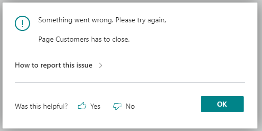

# Analyzing Error Message Quality Telemetry

**APPLIES TO:** [!INCLUDE[2022_releasewave1.md](../includes/2022_releasewave1.md)]

When a user gets an error message while working in the application, the message includes a yes or no question as to whether the message was helpful, similar to the following illustration:

If a user selects either **Yes** or **No**, a signal is emitted and recorded in Application Insights. This information can help partners and developers get insight into error messages that users find hard to understand. They can then follow up with the customer to help out.

This voting feature appears on all error messages that are thrown by calls to the [Error(String)](../developer/methods-auto/dialog/dialog-error-string-joker-method.md) and [Error(ErrorInfo)](https://docs.microsoft.com/en-us/dynamics365/business-central/dev-itpro/developer/methods-auto/dialog/dialog-error-errorinfo-method) methods.

## User gave feedback on error message

Occurs when a use selects either **Yes** or **No** to the question on the error dialog as to whether the message was helpful.

### General dimensions

The following table explains the general dimensions included in the trace. The table lists the dimensions that are specific to Business Central.

|Dimension|Description or value|
|---------|-----|-----------|
|message|**User gave feedback on error message: [OK|Not OK]**|

<!-- removed by request |severityLevel|**3**| -->

### Custom dimensions

The following table explains the custom dimensions included in the trace.

|Dimension|Description or value|
|---------|-----|
|eventId|**CL0002**|
|aadTenantId|Specifies that Azure Active Directory (Azure AD) tenant ID used for Azure AD authentication. For on-premises, if you aren't using Azure AD authentication, this value is **common**. |
|alObjectId|Specifies the ID of the AL object that threw the error.|
|alObjectName|Specifies the ID of the AL object that threw the error.|
|alObjectType|Specifies the ID of the AL object that threw the error.|
|alStackTrace|Specifies the stack trace in AL code for the error.|
|appId|Specifies the ID of the extension that threw the error.|
|appName|Specifies the name of the extension that threw the error.|
|appVersion|Specifies the version of the extension that threw the error.|
|component|**Dynamics 365 Business Central Server**|
|componentVersion|Specifies the version number of the component that emits telemetry (see the component dimension.)|
|environmentName|Specifies the name of the tenant environment. This dimension isn't included with Business Central on-premises. See [Managing Environments](tenant-admin-center-environments.md).|
|environmentType|Specifies the environment type for the tenant, such as **Production**, **Sandbox**, **Trial**. See [Environment Types](tenant-admin-center-environments.md#types-of-environments)|
|errorMessage|Specifies the error shown to the user.|
|exceptionId|Specifies the GUID assigned to the error.|
|userFeedback|Specifies what the user voted, which can be either **Yes** or **No**.|
|userLocale|Specifies the regional language version of the message. The value is a language culture name, like **en-US** for English US and **da-DK** for Danish.|
|telemetrySchemaVersion|Specifies the version of the [!INCLUDE[prod_short](../developer/includes/prod_short.md)] telemetry schema.|

<!--
|clientType|Specifies the type of client that executed the message, such as **Background** or **Web**. For a list of the client types, see [ClientType Option Type](../developer/methods-auto/clienttype/clienttype-option.md).|
|hostType|Specifies [tbd]|-->

<!--
{"telemetrySchemaVersion":"1.2","componentVersion":"20.0.36722.0","aadTenantId":"d88985a1-c863-442c-bb5f-dc622e480a8d","companyName":"CRONUS International Ltd.","component":"Dynamics 365 Business Central Client","eventId":"CL0002","clientType":"Desktop","alObjectType":"Page","alObjectName":"Dialog","alObjectId":"-1","alStackTrace":"undefined","hostType":"Browser","userLocale":"en-US","exceptionId":"undefined","errorMessage":"undefined","userFeedback":"No","appId":"null","appName":"null","appPublisher":"null","appVersion":"null","environmentName":"null"}

{"telemetrySchemaVersion":"1.2","componentVersion":"20.0.36722.0","environmentType":"undefined","companyName":"CRONUS International Ltd.","aadTenantId":"d88985a1-c863-442c-bb5f-dc622e480a8d","clientType":"Desktop","component":"Dynamics 365 Business Central Client","eventId":"CL0002","userFeedback":"No","userLocale":"en-US","appVersion":"1.0.0.0","appPublisher":"Default publisher","environmentName":"null","exceptionId":"4c70c77a-147e-4fc1-af16-96cf7c008fa6","alStackTrace":"CustomerListExt(PageExtension 50110).OnOpenPage(Trigger) line 8 - ALlogmessage by Default publisher","hostType":"Browser","errorMessage":"Use ERROR with a text constant to improve telemetry details","appId":"f2ae006d-deef-4990-828e-4c76906e7171","appName":"ALlogmessage","alObjectType":"Page","alObjectName":"Dialog","alObjectId":"-1"}

{"telemetrySchemaVersion":"1.2","componentVersion":"20.0.36722.0","companyName":"CRONUS International Ltd.","aadTenantId":"d88985a1-c863-442c-bb5f-dc622e480a8d","component":"Dynamics 365 Business Central Client","eventId":"CL0002","clientType":"Desktop","alObjectName":"Dialog","alObjectType":"Page","alObjectId":"-1","alStackTrace":"CustomerListExt(PageExtension 50110).OnOpenPage(Trigger) line 9 - ALlogmessage by Default publisher","appPublisher":"Default publisher","appName":"ALlogmessage","hostType":"Browser","environmentName":"null","appId":"f2ae006d-deef-4990-828e-4c76906e7171","userFeedback":"Yes","appVersion":"1.0.0.0","userLocale":"en-US","errorMessage":"Something went wrong again","exceptionId":"ddc77782-caa0-44a9-8fae-9329375613e2"}

-->
 
## See also

[Monitoring and Analyzing Telemetry](telemetry-overview.md)  
[Enable Sending Telemetry to Application Insights](telemetry-enable-application-insights.md)  
