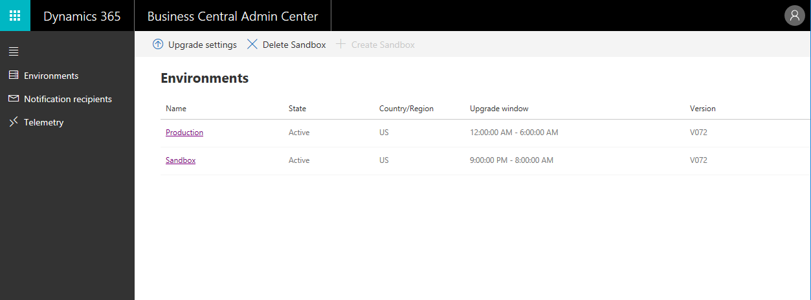
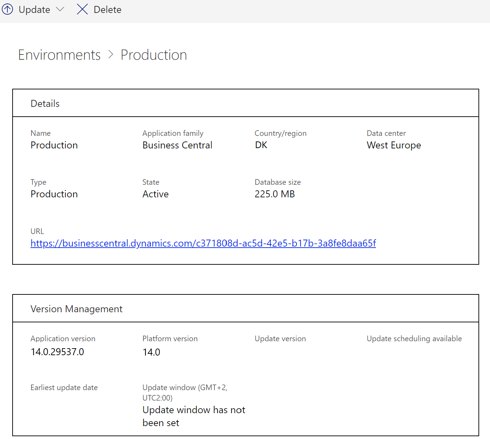

# Managing Environments

The **Environments** tab of the [!INCLUDE[prodadmincenter](../developer/includes/prodadmincenter.md)] provides you with an overview of the [!INCLUDE[prod_short](../developer/includes/prod_short.md)] production and sandbox environments for the tenant, and you can manage updates for each environment.

> [!div class="mx-imgBorder"]
> 

## Viewing details for an environment

In the environments list, you can view more details by choosing the link in the **Name** column.

> [!div class="mx-imgBorder"]
> 

## Types of environments

You can create environments of different types. Which type of environment to choose depends on what you need it for. For more information, see [Production and Sandbox Environments](environment-types.md).  

### Production environments

[!INCLUDE [admin-env-prod](../developer/includes/admin-env-prod.md)]

[!INCLUDE [admin-env-quota](../developer/includes/admin-env-quota.md)]

### Sandbox environments

[!INCLUDE [admin-env-sandbox](../developer/includes/admin-env-sandbox.md)]

[!INCLUDE [admin-env-quota](../developer/includes/admin-env-quota.md)]

### Pre-sales performance evaluation

[!INCLUDE [perf-demo](../developer/includes/perf-demo.md)]

## Create a new production environment

The [!INCLUDE[prodadmincenter](../developer/includes/prodadmincenter.md)] provides an easy method for creating environments for the tenant. For example, if you have been using a production environment for training purposes, and you've decided to start using [!INCLUDE [prod_short](../developer/includes/prod_short.md)] to run the business, you can delete the original production environment and then create a new production environment.  

[!INCLUDE [admin-env-quota](../developer/includes/admin-env-quota.md)]

To create a production environment:

1. On the **Environments** tab of the [!INCLUDE[prodadmincenter](../developer/includes/prodadmincenter.md)], choose the **New** action on the action ribbon.
2. In the **Create Environment** pane, in the **Environment Type** list, choose **Production**.
3. In the **Country** list, select the country for the environment. The specified country determines the localization for the environment and the Azure region in which the environment is created and stored.
4. Select **Create**.

When the new production environment is created, it will be based on the latest production version of [!INCLUDE[prod_short](../developer/includes/prod_short.md)].

## Create a new sandbox environment

A sandbox environment is a non-production instance of [!INCLUDE[prod_short](../developer/includes/prod_short.md)]. Isolated from production, a sandbox environment is the place to safely explore, learn, demo, develop, and test the service without the risk of affecting the data and settings of your production environment.

> [!IMPORTANT]
> Make sure that you understand the limitations of a sandbox before you create a new sandbox environment. For more information, see [Sandbox environments](environment-types.md#sandbox-environments) section.

To create a sandbox environment:

1. On the **Environments** tab of the [!INCLUDE[prodadmincenter](../developer/includes/prodadmincenter.md)], choose the **New** action on the action ribbon.
2. In the **Create Environment** pane, specify a name for the new environment.
3. In the **Create Environment** pane, in the **Environment Type** list, choose **Sandbox**.
4. Specify if you want the sandbox environment to contain a copy of another environment. If you choose this option, you must specify which environment to copy.
    
    When you create a sandbox environment as a copy of another environment, the new environment is created on the same application version as the environment that you are copying. The new environment will contain all per-tenant extensions and AppSource extensions that are installed and published in the original environment that is being copied.

   [!INCLUDE [admin-env-sandbox-precautions](../developer/includes/admin-env-sandbox-precautions.md)]
5. In the **Country** list, select the country for the environment. The specified country determines the localization for the environment and the Azure region in which the environment is created and stored.
6. Choose the relevant application version for the new sandbox environment from the **Version** list if more than one version is available.
7. Select **Create**.
    > [!NOTE]
    > The sandbox environment won't be accessible until the **State** shows *Active*.

To delete a sandbox environment, choose the environment on the **Environments** tab of the [!INCLUDE[prodadmincenter](../developer/includes/prodadmincenter.md)], and then choose **Delete** on the action ribbon.

### Selecting a version for a new sandbox environment

If you create a sandbox that isn't a copy of an existing environment, you must specify an application version for the new environment. The version list will show the latest *production* version, which is the version used for new production environments.

The version list may also have one or more *preview* versions. Preview versions are early release candidates of upcoming releases of [!INCLUDE[prod_short](../developer/includes/prod_short.md)] that are made available specifically for sandbox environments. This list gives you access to review new functionality, validate extension compatibility, and other general testing of the upcoming release.

When you create a sandbox environment on a preview version, the environment will automatically be updated to new preview versions when they become available. However, the environment won't be updated to the production version. Once a sandbox environment is on a preview version, it must stay on a preview version until it's deleted. The environment can also be deleted if an update between preview versions fails. We recommend that preview versions are used only for temporary testing of an upcoming release.

<!--
## Renaming environments

You can rename environments in the [!INCLUDE [prodadmincenter](../developer/includes/prodadmincenter.md)], such as if the customer is dissatisfied with the default name that was assigned to their environment during setup, or when an administrator wants to restore an environment and, accordingly, must rename the original environment to prevent it from being used. The new name will be applied to the environment immediately, so make sure that you plan all the necessary communications about the new name well in advance.  

The renaming of an environment is logged and shown in the [operations log](#opslog). 
-->
## Managing Sessions

The **Manage Sessions** page displays information about active sessions on an environment and lets you cancel selected sessions.

To open the page, select **Manage Sessions**. Use the **Show session details** check box to show more or fewer details.

### Cancel sessions

Canceling a session is sometimes the only way to unblock a customer. For example, a long-running report is locking data in a table, preventing warehouse employees from working.

To cancel a session, select it from the list and then select **Cancel selected sessions**.

## Restoring an environment

> [!NOTE]
> This feature is in preview. It might change or be removed in the future updates.

Database backups are an essential part of any business continuity and disaster recovery strategy, because they protect your data from corruption or deletion. [!INCLUDE[prod_short](../developer/includes/prod_short.md)] online service uses Azure SQL Database as the underlying database backup technology for its environments. All databases are protected by automated backups that are continuously created and maintained by the Azure SQL service. The backup retention period for Business Central databases is set to 30 days for both production and sandbox environments. For more information about this backup process, see [Automated backups - Azure SQL Database & SQL Managed Instance](/azure/azure-sql/database/automated-backups-overview).  

As an administrator, you can restore an existing environment from a time in the past, within the 30-day retention period. An environment can only be restored within the same [!INCLUDE[prod_short](../developer/includes/prod_short.md)] version (minor and major).

### Users who can restore environments

Permission to restore environments is limited to specific types of users: internal and delegated administrators. The following users are allowed to restore environments.

- Delegated administrators from reselling partners
- Administrators from the organization that subscribes to [!INCLUDE [prod_short](../developer/includes/prod_short.md)] online

Also, these users must have the **D365 BACKUP/RESTORE** permission set assigned to their user account in the environment they're trying to export.

For more information about permissions sets and user groups, see [Assign Permissions to Users and Groups](/dynamics365/business-central/ui-define-granular-permissions).

### Considerations and limitations

- Environments can only be restored if the customer has a paid [!INCLUDE[prod_short](../developer/includes/prod_short.md)] subscription.
- Each environment can be restored up to 10 times in a calendar month.
- It's not possible to use the [!INCLUDE[prod_short](../developer/includes/prod_short.md)] administration center to restore an environment that was previously deleted.

    If you end up in the situation where you need to restore a deleted environment, contact Microsoft Support for help. In such cases, Microsoft doesn't guarantee a restore operation will succeed or all data and extensions will be available in the restored database. So before you decide to delete an environment, it's important to ensure that the environment is no longer needed.
- An environment can only be restored within the same Azure region and country ([!INCLUDE[prod_short](../developer/includes/prod_short.md)] localization) as the original environment.
- A production environment can be restored to either a **Production** or **Sandbox** type environment. A sandbox environment can only be restored a **Sandbox** type environment.
- When restoring a sandbox environment, all development extensions (that is, extensions published directly from Visual Studio Code) won't be available in the restored environment&mdash;even if they were present at the point-in-time you're restoring to). Additionally, any per-tenant extensions that depend on such development extensions will also not be available.
- Per-tenant extensions you may have uploaded that target the **next** version of the [!INCLUDE[prod_short](../developer/includes/prod_short.md)] won't be available in the restored environment&mdash;even if they were uploaded at the point-in-time you're restoring to. Per-tenant extensions that were already installed will be available in the restored environment.
- Every AppSource and [!INCLUDE[prod_short](../developer/includes/prod_short.md)] app in the restored environment will have the latest available hotfix installed automatically&mdash;even if the hotfix was introduced after the point-in-time you're restoring to.

### Before you restore an environment

Here are a few important things to do when you're planning to restore an environment:

- Make sure you communicate the plan to restore an environment within your organization upfront, in good time.

- Typically, you want to stop users and external integrations from using the environment during restoration. Consider doing the following actions in the environment you're planning to restore:

  - Remove access to the environment for non-essential users, but make sure required users, like administrators, keep access. For more information, see [Remove a user's access to the system](/dynamics365/business-central/ui-how-users-permissions#to-remove-a-users-access-to-the-system).

  - Put all job queues to on hold. For more information, see [Use Job Queues to Schedule Task](/dynamics365/business-central/admin-job-queues-schedule-tasks).

- Consider renaming the environment. The users and external integrations won't be able to access it by its old name. 

  When restoring an environment, you'll create a new environment that the database backup will be restored to. You can't use the same name for two environments of the same customer. So if you want the restored environment to have the same name as the original environment, rename the original environment before you run the restore operation. For example, you could change the name to include **DONOTUSE**.

  For more information, see [Renaming an environment](#rename).

### Restore an environment

To restore an environment, you'll have to provide a name for the environment and a date/time from which to restore the database.

1. Select **Environments** and then open the environment you want to restore.
2. Select **Restore**.
3. In the **Restore Environment** pane, specify the date and time in the past to which you want to restore the environment.  
4. Select the type to be used for the restored environment.
5. Specify a name for the restored environment.
6. Select **Restore**.

    If there's no backup available for date and time you chose, select the available nearest backup, when prompted. This situation can occur, for example, if the environment was being updated to a new minor or major version during the specified time.  

    > [!NOTE]
    > For newly created environments it may take up to 30 min for the backups to be initialized, so you may not be able to restore an environment if you have just created it. 

7. When the process starts, you can go to the list of your environments and see the status of the restored environment. At first, you'll see the new environment with state **Preparing**. The original environment state remains as **Active**. 

    The restore operation duration is affected by several factors. For large or highly active databases, the restore might take several hours. You can find more details about the factors that affect the recovery time at [Recovery time](/azure/azure-sql/database/recovery-using-backups#recovery-time).  

    Once the restore is completed, the environment state will change to **Active**.  If the restore operation fails, you can find the failure details on the **Operations** page. In this case, delete the failed environment, and then try to restore again. Contact Microsoft Support if the issue persists.

### After you restore an environment

After restoring an environment, you should inspect and adjust data to prepare it for users. Consider enforcing these steps during this period:

- Remove access to the environment for non-essential users, but make sure required users, like administrators, keep access.
- Put all job queues in the restored environment to on hold immediately after restore.
- If needed, you can upload the per-tenant extensions targeting the next version of [!INCLUDE[prod_short](../developer/includes/prod_short.md)] again.

The original environment will remain available and isn't affected by the restore operation. You can then get back to the original environment if you need to look up data. Or maybe you'll have to migrate some data to the restored environment. You can, for example, migrate data by using [!INCLUDE[prod_short](../developer/includes/prod_short.md)] RapidStart services. For more information, see [Migrate Customer Data](https://docs.microsoft.com/dynamics365/business-central/admin-migrate-customer-data).

> [!IMPORTANT]
> You can restore your production environment into a new production environment even if doing so results in exceeding your number of environments or database capacity quotas. You can however only exceed this quota by one extra production environment, regardless of how many production environments you have available for your subscription. This capability is provided as an exception, to ensure that you can always restore your production environment in critical situations. You must return within your quota within 30 days following the restore by either removing the original production environment or by purchasing an additional production environment. Before removing the environment, we recommend you [export the environment to an Azure storage container](tenant-admin-center-database-export.md) in case you need to access some data at a later point. This exception isn't available for restoring from and to sandbox environments.

When you're satisfied with the data in the restored database, enable the users, start the job queues, and let your organization know that the restore process is now completed and they can again use the environment.

## Renaming an environment

> [!NOTE]
> This feature is in preview. It might change or be removed in the future updates.

You can change the name of any environment. The name uniquely identifies the environment from your other environments. Before you change a name, you must consider that the name also is part of the environment's URL. The URL is used in links to the environment in various ways. So changing the name can have significant impact.

The renaming of an environment is logged and shown in the [operations log](#opslog).

### Before you rename an environment

- Read the [Environment rename considerations](#consider) section to understand the consequences of renaming an environment.
- Make sure you notify all your users, including any external service integrations you may have, about the upcoming URL change. It will let them prepare to update their references. 
- Determine the best time to do the renaming. Renaming an environment requires a restart to the environment. We recommend doing this operation when no users are active in Business Central.  

### Rename an environment

1. Select **Environments**, then select the environment you want to rename.
2. On the **Environment Details** page, select **Rename**.
3. On **Rename environment** page, read the information.
4. Enter the new name, and then select **Rename**.
5. Confirm your intent to rename the environment.

At this point, the environment state will first change to **Preparing | Rename Scheduled**, then to **Active** again when the rename has been completed. The new name will be available immediately. The environment will no longer be accessible using the old environment name.  

You can also review the log for the Rename operation on the **Operations** page afterwards.

### Environment rename considerations

Changing the environment name can affect many scenarios and integrations. In the early stages of a customer implementation, it may be a low risk operation. But renaming an environment that's been used by customers for a while or integrated with many external services and components is risky. So carefully plan for it.

Here are some areas where the environment name is used, which will be affected when you change the environment name. Consider these areas and plan your communication before attempting to rename an environment:  

- Web client URL, including links to web client bookmarked by users
- Deep links to specific pages within [!INCLUDE[prod_short](../developer/includes/prod_short.md)] created by users or shared by them via e-mails, internal documentation or training  portals, Teams channels, Word, and Excel documents. They're often exchanged among users in the same company, across companies, across environments, across tenants. Links created by users as desktop shortcuts. Links sent or created before the name change will no longer work after the name change.
- Integrations that embed the web client, for example, SharePoint apps composed of Business Central pages
- Integrations that launch the web client  
- Partner-developed mobile apps, web applications, and so on. These apps likely originate from partners outside the customer's organization where the admin can't update URLS. 
- Mobile apps, including Windows 10 store app for desktop/tablet. Affects only users who have modified the protocol handler to force the app to connect to environment with name other than "production". If the user keeps working with "production" on the mobile app (which is default now), and the admin renames the environment from "prod2" to "myprod", the mobile user isn't affected. Otherwise, the app would throw an error, and the user would have to exit using a newly created protocol handler link.
- Browser cache. [!INCLUDE[prod_short](../developer/includes/prod_short.md)] stores the URL, including environment name, in some of its cached data. This data is cached browser-side, that is, in the user's browser and across devices. Admins typically don't have access or control this data cache. When users lose their cache, they lose the link modifications to all their pages and preferences. 
- Web services URL, potentially affecting external integrations that use OData or SOAP

- [!INCLUDE[prod_short](../developer/includes/prod_short.md)] add-ins and integrations with other Microsoft services
  - Outlook Add-in. The Add-In manifest that is saved to Exchange Server, either per-organization or per-user, includes the environment name.
  - Excel Add-in. Each user's Excel worksheet stores the environment name. 
  - Power BI. All reports, including the default reports deployed from the Role Center, built before the rename will be affected. Also, Power BI apps installed before the rename would be affected. There's no automatic way to repair these items. The partner or user would have to manually update the connections.
  - Power Apps/Automate. All apps and flows built before rename would be affected with no automatic way to repair. The partner or user would have to manually update the connections. 
  - CDS. CDS Virtual Entity setup stores environment name.
- Development scenarios  
  - Publish to sandbox environment from Visual Studio Code. The launch.json file of extensions might contain the sandbox name, if different from "default". The files require source code updates.
  - CI/CD pipelines for test and deployment could be impacted by environment renames.
- Azure Application Insights logs and metrics

## Move an environment from one Azure Active Directory organization to another through Microsoft Support

In some cases, the Azure AD organization (also known as the Azure AD tenant) of a [!INCLUDE[prod_short](../developer/includes/prod_short.md)] customer changes after they acquire a [!INCLUDE[prod_short](../developer/includes/prod_short.md)] environment. This situation can occur for various reasons, for example:

- Business entities merge
- An acquisition takes place
- The customer decides to use one Azure AD organization in a specific region and stop using Azure AD organizations they created in other regions.
- The environment was mistakenly created by the reselling partner for the wrong Azure AD organization.  

In almost all such cases, the customers want to preserve the [!INCLUDE[prod_short](../developer/includes/prod_short.md)] environments they created for the original Azure AD organizations, and link them to the new ones instead.

Microsoft Support can move an environment from one Azure AD organization to another, based on the partner's support request. As a partner, you can submit a support request by following the guidance at [Escalating support issues to Microsoft](manage-technical-support#escalating-support-issues-to-microsoft). When submitting these support requests, you must provide the following information:

- Proof of your delegated admin rights in both Azure AD tenants
- Confirmation from the customer that the environment move is authorized by them.

You can request moving one or more environments. For Microsoft to do the move, you'll need to provide some information about the source and destination Azure AD tenants, such as:

- Source tenant ID, domain, and country 
- Destination tenant ID, domain, and country
- Does the destination tenant have a valid [!INCLUDE[prod_short](../developer/includes/prod_short.md)] subscription?
- Does the destination tenant have enough available user licenses?
- Does the destination tenant have enough environment licenses?
- Does the destination tenant have enough storage available for the environments being migrated?

Once the move is completed, your environments will appear in your new tenant.

### Considerations

- Environment data will remain unchanged during this procedure, the exact same environment will be linked to a specified Azure AD tenant.  
- The country and Azure region of the environment will remain the same, and cannot be changed during this procedure.
- The operation will involve a brief downtime period for the environment being reassigned (typically not exceeding 1 hour), so it needs to be coordinated with the customer and Microsoft Support. 
- [!INCLUDE[prod_short](../developer/includes/prod_short.md)] Support does not provide help with moving the [!INCLUDE[prod_short](../developer/includes/prod_short.md)] subscriptions between the Azure AD tenants. 

## Log of administrative operations

The **Operations** section of [!INCLUDE [prodadmincenter](../developer/includes/prodadmincenter.md)] provides a log of operations that internal administrators and delegated administrators from the partner have made in the [!INCLUDE [prodadmincenter](../developer/includes/prodadmincenter.md)] or through the admin center API. Currently, the log includes the following operations: renaming environments restoring environments.

Use this log to see which operations were created and when. You can also access detailed error messages in this log, should any operation fail.  

## See also

[Working with Administration Tools](administration.md)  
[The Business Central Administration Center](tenant-admin-center.md)  
[Managing Environments](tenant-admin-center-environments.md)  
[Managing Apps](tenant-admin-center-manage-apps.md)  
[Updating Environments](tenant-admin-center-update-management.md)  
[Managing Tenant Notifications](tenant-admin-center-notifications.md)  
[Introduction to automation APIs](itpro-introduction-to-automation-apis.md)  
