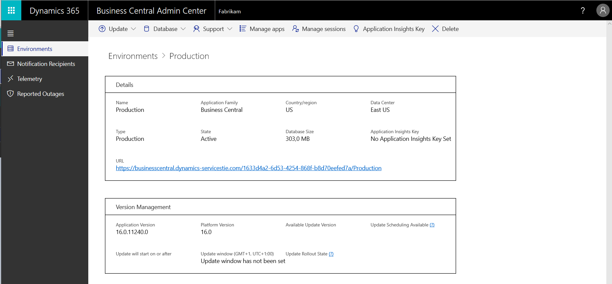

# Managing Environments

The **Environments** tab of the [!INCLUDE[prodadmincenter](../developer/includes/prodadmincenter.md)] provides you with an overview of the [!INCLUDE[prodshort](../developer/includes/prodshort.md)] production and sandbox environments for the tenant, and you can manage updates for each environment.

> [!div class="mx-imgBorder"]
> 

## Viewing details for an environment

In the environments list, you can view more details by choosing the link in the **Name** column.

> [!div class="mx-imgBorder"]
> 

## Types of environments

You can create environments of different types. Which type of environment to choose depends on what you need it for. For more information, see [Production and Sandbox Environments](environment-types.md).  

### Production environments

[!INCLUDE [admin-env-prod](../developer/includes/admin-env-prod.md)]

### Sandbox environments

[!INCLUDE [admin-env-sandbox](../developer/includes/admin-env-sandbox.md)]

[!INCLUDE [perf-demo](../developer/includes/perf-demo.md)]

## Create a new production environment

The [!INCLUDE[prodadmincenter](../developer/includes/prodadmincenter.md)] provides an easy method for creating environments for the tenant. For example, if you have been using a production environment for training purposes, and you've decided to start using [!INCLUDE [prodshort](../developer/includes/prodshort.md)] to run the business, you can delete the original production environment and then create a new production environment.  

> [!NOTE]
> Each [!INCLUDE[prodshort](../developer/includes/prodshort.md)] tenant is limited to three production environments.

To create a production environment:

1. On the **Environments** tab of the [!INCLUDE[prodadmincenter](../developer/includes/prodadmincenter.md)], choose the **New** action on the action ribbon.
2. In the **Create Environment** pane, in the **Environment Type** list, choose **Production**.
3. In the **Country** list, select the country for the environment. The specified country determines the localization for the environment and the Azure region in which the environment is created and stored.
4. Select **Create**.

When the new production environment is created, it will be based on the latest production version of [!INCLUDE[prodshort](../developer/includes/prodshort.md)].

## Create a new sandbox environment

A sandbox environment is a non-production instance of [!INCLUDE[prodshort](../developer/includes/prodshort.md)]. Isolated from production, a sandbox environment is the place to safely explore, learn, demo, develop, and test the service without the risk of affecting the data and settings of your production environment.

> [!IMPORTANT]
> Make sure that you understand the limitations of a sandbox before you create a new sandbox environment. For more information, see [Sandbox environments](environment-types.md#sandbox-environments) section.

> [!NOTE]
> Each [!INCLUDE[prodshort](../developer/includes/prodshort.md)] tenant is limited to three sandbox environments.

To create a sandbox environment:

1. On the **Environments** tab of the [!INCLUDE[prodadmincenter](../developer/includes/prodadmincenter.md)], choose the **New** action on the action ribbon.
2. In the **Create Environment** pane, specify a name for the new environment.
3. In the **Create Environment** pane, in the **Environment Type** list, choose **Sandbox**.
4. Specify if you want the sandbox environment to contain a copy of another environment. If you choose this option, you must specify which environment to copy.
    > [!NOTE]
    > When you create a sandbox environment as a copy of another environment, the new environment is created on the same application version as the environment that you are copying. The new environment will also contain all per-tenant extensions and AppSource extensions that are installed and published in the original environment that is being copied.
5. In the **Country** list, select the country for the environment. The specified country determines the localization for the environment and the Azure region in which the environment is created and stored.
6. Choose the relevant application version for the new sandbox environment from the **Version** list if more than one version is available.
7. Select **Create**.
    > [!NOTE]
    > The sandbox environment won't be accessible until the **State** shows *Active*.

To delete a sandbox environment, choose the environment on the **Environments** tab of the [!INCLUDE[prodadmincenter](../developer/includes/prodadmincenter.md)], and then choose **Delete** on the action ribbon.

### Selecting a version for a new sandbox environment

If you create a sandbox that isn't a copy of an existing environment, you must specify an application version for the new environment. The version list will show the latest *production* version, which is the version used for new production environments.

The version list may also have one or more *preview* versions. Preview versions are early release candidates of upcoming releases of [!INCLUDE[prodshort](../developer/includes/prodshort.md)] that are made available specifically for sandbox environments. This list gives you access to review new functionality, validate extension compatibility, and other general testing of the upcoming release.

When you create a sandbox environment on a preview version, the environment will automatically be updated to new preview versions when they become available. However, the environment won't be updated to the production version. Once a sandbox environment is on a preview version, it must stay on a preview version until it's deleted. The environment can also be deleted if an update between preview versions fails. We recommend that preview versions are used only for temporary testing of an upcoming release.

## Managing Sessions

The **Manage Sessions** page displays information about active sessions on an environment and lets you cancel selected sessions.

To open the page, select **Manage Sessions**. Use the **Show session details** check box to show more or fewer details.

### Cancel sessions

Canceling a session is sometimes the only way to unblock a customer. For example, a long-running report is locking data in a table, preventing warehouse employees from working.

To cancel a session, select it from the list and then select **Cancel selected sessions**.

## Renaming an environment

> [!NOTE]
> This feature is in preview. It might change or be removed in the future updates.

You can change the name of any environment. The name uniquely identifies the environment from your other environments. Before you change a name, you must consider that the name also is part of the environment's URL. The URL is used in links to the environment in various ways. So changing the name can have significant impact.

### Before you rename an environment

- Read the [Environment rename considerations](#consider) section to understand the consequences of renaming an environment.
- Make sure you notify all your users, including any external service integrations you may have, about the upcoming URL change. It will let them prepare to update their references. 
- Determine the best time to do the renaming. Renaming an environment requires a restart to the environment. We recommend doing this operation when no users are active in Business Central.  

### Rename an environment

1. Select **Environments**, then select the environment you want to rename.
2. On the **Environment Details** page, select **Rename**.
3. On **Rename environment** page, read the information.
4. Enter the new name, and then select **Rename**.
5. Confirm your intent to rename the environment.

At this point, the environment state will first change to **Preparing | Rename Scheduled**, then to **Active** again when the rename has been completed. The new name will be available immediately. The environment will no longer be accessible using the old environment name.  

You can also review the log for the Rename operation on the **Operations** page afterwards.

### Environment rename considerations

Changing the environment name can affect many scenarios and integrations. In the early stages of a customer implementation, it may be a low risk operation. But renaming an environment that's been used by customers for a while or integrated with many external services and components is risky. So carefully plan for it.

Here are some areas where the environment name is used, which will be affected when you change the environment name, therefore you need to consider these areas and plan your communication before attempting to rename an environment:  

- Web client URL, including links to web client bookmarked by users 
- Deep links to specific pages within [!INCLUDE[prodshort](../developer/includes/prodshort.md)] created by users or shared by them via e-mails, internal documentation or training  portals, Teams channels, Word, and Excel documents. They're often exchanged among users in the same company, across companies, across environments, across tenants. Links created by users as desktop shortcuts. Links sent or created before the name change will no longer work after the name change.
- Integrations that embed the web client, for example, SharePoint apps composed of Business Central pages
- Integrations that launch the web client  
- Partner-developed mobile apps, web applications, and so on. These apps likely originate from partners outside the customer's organization where the admin can't update URLS. 
- Mobile apps, including Windows 10 store app for desktop/tablet. Affected only users who have modified the protocol handler to force the app to connect to environment with name other than "production". If the user keeps working with "production" on the mobile app (which is default now), and the admin renames the environment from "prod2" to "myprod", the mobile user isn't affected. Otherwise, the app would throw an error, and the user would have to exit using a newly created protocol handler link.
- Browser cache. [!INCLUDE[prodshort](../developer/includes/prodshort.md)] stores the URL, including environment name, in some of its cached data. This data is cached browser-side, that is, in the user's browser and across devices. Admins typically don't have access or control this data cache. When users lose their cache, they lose the link modifications to all their pages and preferences. 
- Web services URL, potentially affecting external integrations that use OData or SOAP

- [!INCLUDE[prodshort](../developer/includes/prodshort.md)] add-ins and integrations with other Microsoft services
    - Outlook Add-in. The Add-In manifest that is saved to Exchange Server, either per-organization or per-user, includes the environment name.
    - Excel Add-in. Each user's Excel worksheet stores the environment name. 
    - Power BI. All reports, including the default reports deployed from the Role Center, built before the rename will be affected. Also, Power BI apps installed before the rename would be affected. There's no automatic way to repair these items. The partner or user would have to manually update the connections.
    - Power Apps/Automate. All apps and flows built before rename would be affected with no automatic way to repair. The partner or user would have to manually update the connections. 
    - CDS. CDS Virtual Entity setup stores environment name.
- Development scenarios  
    - Publish to sandbox environment from Visual Studio Code. The launch.json file of extensions might contain the sandbox name, if different from "default". The files require source code updates,
    - CI/CD pipelines for test and deployment could be impacted by environment renames.
- Azure Application Insights logs and metrics

## See also

[Working with Administration Tools](administration.md)  
[The Business Central Administration Center](tenant-admin-center.md)  
[Managing Environments](tenant-admin-center-environments.md)  
[Managing Apps](tenant-admin-center-manage-apps.md)  
[Updating Environments](tenant-admin-center-update-management.md)  
[Managing Tenant Notifications](tenant-admin-center-notifications.md)  
[Introduction to automation APIs](itpro-introduction-to-automation-apis.md)  
