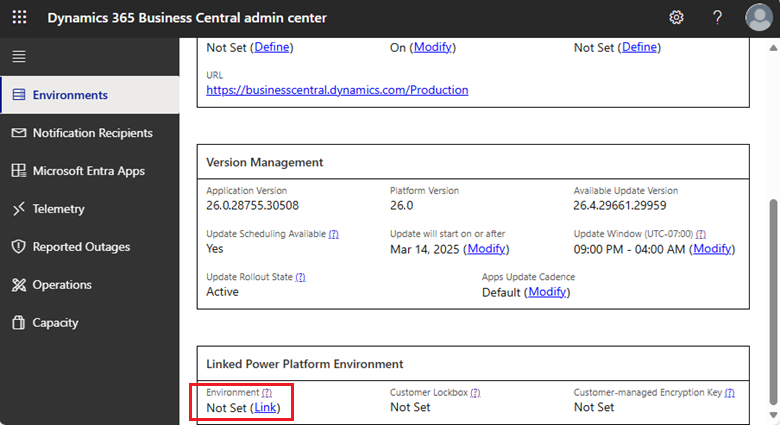

# Managing production and sandbox environments in the admin center

 

The **Environments** tab of the [!INCLUDE[prodadmincenter](../developer/includes/prodadmincenter.md)] provides you with an overview of the [!INCLUDE[prod_short](../developer/includes/prod_short.md)] production and sandbox environments for the tenant, and allows you to manage updates for each environment.

> [!div class="mx-imgBorder"]
> 

## Viewing details for an environment

In the environments list, you can view more details by choosing the link in the **Name** column.

> [!div class="mx-imgBorder"]
> 

## Linked Power Platform environment

A [!INCLUDE[prod_short](../developer/includes/prod_short.md)] environment can link to a Power Platform environment of the same type (production or sandbox) in the same Azure Geo. Linking to a Power Platform environment lets the [!INCLUDE[prod_short](../developer/includes/prod_short.md)] environment inherit selected settings from the Power Platform environment, with the status visible in the [!INCLUDE[prod_short](../developer/includes/prod_short.md)] admin center. It also provides a default target environment when setting up features that integrate [!INCLUDE[prod_short](../developer/includes/prod_short.md)] with Power Platform and other Dynamics 365 products. Links between [!INCLUDE[prod_short](../developer/includes/prod_short.md)] environments and Power Platform environments are exclusive; it isn't possible to simultaneously link multiple [!INCLUDE[prod_short](../developer/includes/prod_short.md)] environments to a single Power Platform environment or vice versa.

When a link exists between a [!INCLUDE[prod_short](../developer/includes/prod_short.md)] environment and a Power Platform environment, several environment lifecycle operations are blocked on the Power Platform environment. The [!INCLUDE[prod_short](../developer/includes/prod_short.md)] environment can't be deleted if it's linked to a Power Platform environment. For environment lifecycle operations on the [!INCLUDE[prod_short](../developer/includes/prod_short.md)] environment that create a new environment, such as [Copy](tenant-admin-center-environments-copy.md) and [Restore](tenant-admin-center-backup-restore.md), the target environment isn't linked to a Power Platform environment as part of the operation. The target environment can be linked to a different Power Platform environment after the operation that creates the environment completes.

### Link Business Central environment to Power Platform environment

To complete this task, you need to be an internal admin with a role that grants access to the [!INCLUDE[prodadmincenter](../developer/includes/prodadmincenter.md)] and permissions to update the properties of the targeted Power Platform environment, such as environment administrator.

> [!IMPORTANT]
> Users with an admin Entra role assigned may not automatically gain the environment administrator role on the Power Platform environment. If the Power Platform environment does not show up as available to link the [!INCLUDE[prod_short](../developer/includes/prod_short.md)] environment to, verify that you are an Environment Admin for the Power Platform environment. For more information, go to [Role-based security roles](/power-platform/admin/database-security).

1. Sign in to the Business Central admin center and open the environment.
1. In the **Linked Power Platform Environment** section on the environment page, select **Link** under **Environment** or **Modify** to change to another Power Platform environment.

   

   > [!NOTE]
   > Only Power Platforms meeting the following conditions are available to link:
   >
   > - In the same Azure Geo.
   > - Same type of environment (Production or Sandbox).
   > - Not linked to another environment already.

1. In the **Link** pane, select the Power Platform environment, and then select **Link**.

### Unlink environments

You can unlink the [!INCLUDE[prod_short](../developer/includes/prod_short.md)] environment from the Power Platform environment. Unlinking an environment disables any settings the [!INCLUDE[prod_short](../developer/includes/prod_short.md)] environment inherits from the Power Platform environment but doesn't disable any integrations set up between the two environments. Examples include Power Automate flows created from the [!INCLUDE[prod_short](../developer/includes/prod_short.md)] environment or data integration with Dynamics 365 Sales or Dynamics 365 Field Service.

Unlinked environments can be [relinked to the same or different environments](#link-business-central-environment-to-power-platform-environment).

## Types of environments

You can create different types of environments. Choose the type of environment based on what you need it for. Learn more in [Production and Sandbox Environments](environment-types.md).  

### Production environments

[!INCLUDE [admin-env-prod](../developer/includes/admin-env-prod.md)]

[!INCLUDE [admin-suspended](../includes/admin-suspended.md)]

[!INCLUDE [admin-env-quota](../developer/includes/admin-env-quota.md)]

### Sandbox environments

[!INCLUDE [admin-env-sandbox](../developer/includes/admin-env-sandbox.md)]

[!INCLUDE [admin-env-quota](../developer/includes/admin-env-quota.md)]

### Pre-sales performance evaluation

[!INCLUDE [perf-demo](../developer/includes/perf-demo.md)]

## Create a new environment

The [!INCLUDE[prodadmincenter](../developer/includes/prodadmincenter.md)] provides an easy method for creating environments for the tenant. For example, you've been using a production environment for training purposes, and you decide to start using [!INCLUDE [prod_short](../developer/includes/prod_short.md)] to run the business. You can, in this case, delete the original production environment and then create a new production environment.  

[!INCLUDE [admin-env-quota](../developer/includes/admin-env-quota.md)]

You can create new environments that are either production environments or sandboxes. You can also copy an existing environment. Learn more in [Copy a Production or Sandbox Environment](tenant-admin-center-environments-copy.md).  

> [!IMPORTANT]
> Make sure that you understand the limitations of a sandbox before you create a new sandbox environment. Learn more in the [Sandbox environments](#sandbox-environments) section.

### Create a new environment that isn't a copy of an existing environment

1. In the navigation pane on the left side of the [!INCLUDE[prodadmincenter](../developer/includes/prodadmincenter.md)], select **Environments**, then select the **New** action on the action ribbon.
1. In the **Create Environment** pane, specify a name for the new environment.
1. In the **Environment Type** list, select **Production** or **Sandbox**.
1. In the **Application family** field, specify the type of solution that this environment is based on if it isn't [!INCLUDE [prod_short](../includes/prod_short.md)].  
1. In the **Country** list, select the country for the environment. The specified country determines the localization for the environment and the Azure region in which the environment is created and stored.

   > [!TIP]
   > To create a sandbox environment that's based on the Business Central W1 (non-localized) version, choose a country that uses the W1 BaseApp, as indicated in the [Country/regional availability and supported languages](../compliance/apptest-countries-and-translations.md) article.

1. In the **Version** list, specify the relevant application version for the new environment.

   For sandbox environments, [preview versions](preview-environments.md) might be available. Preview versions provide early access to new functionality, but environments on these versions aren't updated once the version becomes available and are deleted automatically when the preview ends.  

   > [!IMPORTANT]
   > You can create environments on any available version. For major version 25.x, not all minor versions are available for every country during the entire 25.x [update period](update-rollout-timeline.md#update-period). At least one minor version of 25.x is available during this period.  

1. Select **Create**.  

   The new environment isn't accessible until the **State** becomes **Active**.

> [!NOTE]
> The new environment has a default update window that guarantees future updates don't run between 8:00 PM and 6:00 AM local time for the environment country. This update window can be changed after the environment is created. Learn more in [Managing Updates in the Business Central Admin Center](tenant-admin-center-update-management.md#set-the-update-window-for-each-environment).

To delete an environment, choose the environment on the **Environments** tab of the [!INCLUDE[prodadmincenter](../developer/includes/prodadmincenter.md)], and then select **Delete** on the action ribbon.

## Log of administrative operations

The **Operations** section of [!INCLUDE [prodadmincenter](../developer/includes/prodadmincenter.md)] provides a log of operations that internal administrators and delegated administrators from the partner have made in the [!INCLUDE [prodadmincenter](../developer/includes/prodadmincenter.md)] or through the admin center API. Use this log to view which operations were created and when. You can also access detailed error messages in this log, should any operation fail.

### Operations

Currently, the log includes the following operations:

|Type|Description|Admin center|API|Extension Management Page|
|----|-----------|------------|---|-------------------------|
|Copy environment|An environment was created from a copy of another environment.|[Copy an environment](tenant-admin-center-environments-copy.md)|[Copy environment](administration-center-api_environments.md#copy-environment)||
|Create environment |A new environment was created|[Create a new environment](#create-a-new-environment)|[Create a new environment](administration-center-api_environments.md#create-new-environment)||
|Soft delete environment|An environment was soft deleted.|[Delete an environment](tenant-admin-center-environments-delete.md#delete-an-environment)|[Delete environment](administration-center-api_environments.md#delete-environment)||
|Recovered environment|A deleted environment was recovered.|[Recover an environment](tenant-admin-center-environments-delete.md#recover-an-environment)|[Recover environment](administration-center-api_environments.md#recover-environment)||
|Delete environment|An environment was permanently deleted.|[Delete and recover environments](tenant-admin-center-environments-delete.md)|[Delete environment](administration-center-api_environments.md#delete-environment)||
|Modify environment|One of the following operations was done on an environment: <ul><li>Set update window</li><li>Set Application Insights connection string</li><li>Set security group</li><li>Clear security group</li><li>Reschedule update </li><li>Set access with Microsoft 365 licenses.</li></ul>|[Managing updates](tenant-admin-center-update-management.md)  [Environment telemetry](tenant-admin-center-telemetry.md)  [Business Central Admin Center API - Environment Settings](tenant-admin-center-manage-access.md)|[Manage access to environments](administration-center-api_environment_settings.md)||
|Move environment|An environment was moved to another Microsoft Entra organization.|[Transfer environments](tenant-admin-center-environments-move.md)|||
|Rename environment|Environment was renamed.|[Rename environments](tenant-admin-center-environments-rename.md)|[Rename environment](administration-center-api_environments.md#rename-environment)||
|Restart environment|Environment was restarted|[Restart environment](tenant-admin-center-manage-sessions.md#restart-environment)||
|Update environment|An environment is updated to a newer version.|[Managing updates](tenant-admin-center-update-management.md)|[Environment settings](administration-center-api_environment_settings.md)|
|Environment app hotfix|A hotfix was applied to the app by using the App Management API.||[Schedule environment hotfix](appmanagement/app-management-api.md#schedule-environment-hotfix)||
|Environment app install|App was installed by using the tenant's **Extension Management** page or the API install endpoint.||[Install an app](administration-center-api_app_management.md#install-an-app)|[Install and uninstall extensions](/dynamics365/business-central/ui-extensions-install-uninstall#installing-an-extension)|
|Environment app uninstall|App was uninstalled by using the tenant's **Extension Management** page or the API uninstall endpoint.||[Uninstall an app](administration-center-api_app_management.md#uninstall-an-app)|[Install and uninstall extensions](/dynamics365/business-central/ui-extensions-install-uninstall#uninstalling-an-extension)|
|Environment app update |App was updated by the Admin Center or API update endpoint.|[Install an app update](tenant-admin-center-manage-apps.md#install-an-app-update---the-flow)|[Update an app](administration-center-api_app_management.md#update-an-app)||

### Retention period

The operations are kept for 180 days, after which they're deleted.

## Related information

[Manage tenant specific notifications](tenant-admin-center-notifications.md)  
[Managing apps](tenant-admin-center-manage-apps.md)  
[Managing updates in the Business Central admin center](tenant-admin-center-update-management.md)  
[Managing sessions in the Admin Center](tenant-admin-center-manage-sessions.md)  
[Copy a production or sandbox environment](tenant-admin-center-environments-copy.md)  
[Rename environments in the Admin Center](tenant-admin-center-environments-rename.md)  
[Restoring an environment in the admin center](tenant-admin-center-backup-restore.md)  
[Transfer environments](tenant-admin-center-environments-move.md)  
[Introduction to automation APIs](itpro-introduction-to-automation-apis.md)

[The Business Central Administration Center](tenant-admin-center.md)  
