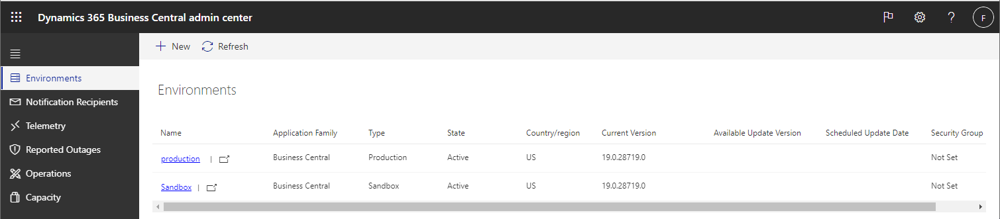
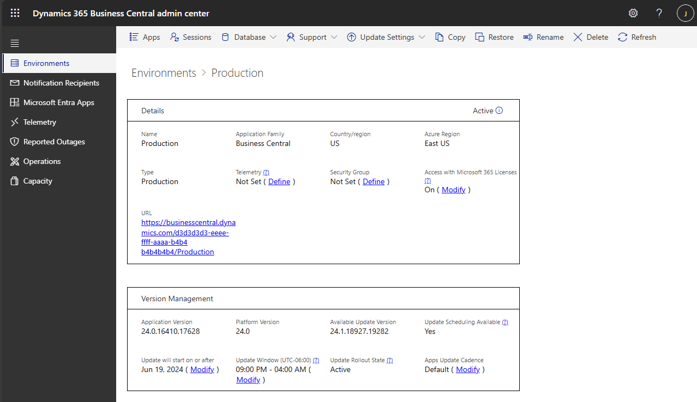

# Managing Production and Sandbox Environments in the Admin Center

The **Environments** tab of the [!INCLUDE[prodadmincenter](../developer/includes/prodadmincenter.md)] provides you with an overview of the [!INCLUDE[prod_short](../developer/includes/prod_short.md)] production and sandbox environments for the tenant, and you can manage updates for each environment.

> [!div class="mx-imgBorder"]
>  

## Viewing details for an environment

In the environments list, you can view more details by choosing the link in the **Name** column.

> [!div class="mx-imgBorder"]
> 

## Types of environments

You can create environments of different types. Choose the type of environment based on what you need it for. For more information, see [Production and Sandbox Environments](environment-types.md).  

### Production environments

[!INCLUDE [admin-env-prod](../developer/includes/admin-env-prod.md)]

[!INCLUDE [admin-suspended](../includes/admin-suspended.md)]

[!INCLUDE [admin-env-quota](../developer/includes/admin-env-quota.md)]

### Sandbox environments

[!INCLUDE [admin-env-sandbox](../developer/includes/admin-env-sandbox.md)]

[!INCLUDE [admin-env-quota](../developer/includes/admin-env-quota.md)]

### Pre-sales performance evaluation

[!INCLUDE [perf-demo](../developer/includes/perf-demo.md)]

## Create a new environment

The [!INCLUDE[prodadmincenter](../developer/includes/prodadmincenter.md)] provides an easy method for creating environments for the tenant. For example, you've been using a production environment for training purposes, and you've decided to start using [!INCLUDE [prod_short](../developer/includes/prod_short.md)] to run the business. You can, in this case, delete the original production environment and then create a new production environment.  

[!INCLUDE [admin-env-quota](../developer/includes/admin-env-quota.md)]

You can create new environments that are either production environments or sandboxes. You can also copy an existing environment. For more information, see [Copy a Production or Sandbox Environment](tenant-admin-center-environments-copy.md).  

### To create a new environment that isn't a copy of an existing environment

1. On the **Environments** tab of the [!INCLUDE[prodadmincenter](../developer/includes/prodadmincenter.md)], choose the **New** action on the action ribbon.
2. In the **Create Environment** pane, Specify a name for the new environment.
3. In the **Environment Type** list, choose **Production** or **Sandbox**.
4. In the **Application family** field, specify the type of solution that this environment is based on if it isn't [!INCLUDE [prod_short](../includes/prod_short.md)].  
5. In the **Country** list, select the country for the environment. The specified country determines the localization for the environment and the Azure region in which the environment is created and stored.

   > [!NOTE]
   > The new environment will be created with a default update window that guarantees future updates won't run between 8:00 PM and 6:00 AM local time for the environment country. This update window can be changed after the environment has been created. For more information, see [Managing Updates in the Business Central Admin Center](tenant-admin-center-update-management.md#set-the-update-window-for-each-environment).

6. In the **Version** list, specify the relevant application version for the new environment if more than one version is available.  
7. Choose the **Create** action.  

> [!NOTE]
> The new environment won't be accessible until the **State** shows *Active*.

New production environments are based on the latest production version of [!INCLUDE[prod_short](../developer/includes/prod_short.md)]. New sandboxes are based on the specified version.

> [!IMPORTANT]
> Make sure that you understand the limitations of a sandbox before you create a new sandbox environment. For more information, see the [Sandbox environments](#sandbox-environments) section.

To delete an environment, choose the environment on the **Environments** tab of the [!INCLUDE[prodadmincenter](../developer/includes/prodadmincenter.md)], and then choose **Delete** on the action ribbon.

### Selecting a version for a new sandbox environment

If you create a sandbox that isn't a copy of an existing environment, you must specify an application version for the new environment. The version list will show the latest *production* version, which is the version used for new production environments.

The version list may also have one or more *preview* versions. Preview versions are early release candidates of upcoming releases of [!INCLUDE[prod_short](../developer/includes/prod_short.md)] that are made available specifically for sandbox environments. This list gives you access to review new functionality, validate extension compatibility, and other general testing of the upcoming release.

When you create a sandbox environment on a preview version, the environment will automatically be updated to new preview versions when they become available. However, the environment won't be updated to the production version. Once a sandbox environment is on a preview version, it must stay on a preview version until it's deleted. The environment can also be deleted if an update between preview versions fails. We recommend that preview versions are used only for temporary testing of an upcoming release.

<!--
## Manage access using Azure Active Directory groups

To manage access at the environment level, you can assign an Azure Active Directory (Azure AD) group to the environment. By assigning an Azure AD group to an environment, only direct and indirect members of the group are granted access to the environment. Indirect members are users in another group, which itself is a member of the group assigned to the environment. Although all licensed users in Azure AD will be added to the environment when it's synchronized with Microsoft 365, only group members can sign in.

From the **Environments** page, you'll see the currently assigned group in the **Security Group** column. **Not set** indicates that no group has been assigned. **Not available** indicates that the group that was assigned is no longer available in the Azure AD.

> [!NOTE]
> The restrictions imposed by a security group don't apply to administrators. Local and delegated admins can freely sign in to all environments, regardless of the assigned group.
 
### Assign, change, or remove a group

Before you can assign an Azure AD group to an environment, the group must be created in your Azure AD tenant. For more information, see [Create a basic group and add members using Azure Active Directory](/azure/active-directory/fundamentals/active-directory-groups-create-azure-portal) in the Azure documentation.

1. Select **Environments**, then select the environment on which you want to assign, change, or remove the group.
2. On the **Environment Details** page, the currently assigned group is shown under **Security Group**.

    - To assign a group, select **(Define)**.
    - To change or remove the currently assigned group, select **Modify**.
3. The **Edit Security Group** pane shows the current security group, if any, followed by all the available groups in Azure AD.

   - To assign or change a group, search for and select the group from the list.
   - To remove a group, select  under **Current Security Group**.

    > [!NOTE]
    > If there are more than 10,000 groups in Azure AD, they can't all be retrieved and displayed in the admin center. Instead, you'll see the message **You have too many groups to display them all**. In this case, you'll have to enter the object ID of the group that you want to assign. You get the object ID from the [Azure portal](https://portal.azure.com).

4. Select **Save** when done.

> [!NOTE]
> If you change or remove a group, it can take a while before the changes to take effect or access is revoked from users.

## Manage access with Microsoft 365 licenses

To help [!INCLUDE [prod_short](../developer/includes/prod_short.md)] users easily share and collaborate on business data with their coworkers, you can enable access with Microsoft 365 licenses. When enabled, users within the same organization who have an applicable Microsoft 365 license will be able to read (but not write) Business Central data that is shared with them in Microsoft Team&mdash;without needing a Business Central license.

> [!NOTE]
> This setting is only available for environments of platform version 21.1 or later.

Enabling access to an environment is one of multiple steps required to configure this capability. We recommend that you complete all other setup steps before enabling access for an environment from the Business Central admin center. Learn more at [Set Up Access with Microsoft 365 licenses](/dynamics365/business-central/admin-access-with-m365-license). 

To turn access on or off, complete the following steps:

1. Select **Environments**, then select the environment on which you want to change license access.
2. On the environment details page, select **Modify** for the **Access with Microsoft 365 licenses** setting. 
3. In the **Microsoft 365 licenses** pane, turn the switch on or off.
4. Select **Save** and accept the confirmation dialog. The change takes effect immediately.
-->
## Delete an environment

You can delete environments in the admin center, such as when a sandbox environment isn't longer needed.  

> [!IMPORTANT]
> Make sure no user is using the environment before you delete it.
>
> Also, be very careful before you choose the *Delete* action for the environment. The action is irreversible.

## Log of administrative operations

The **Operations** section of [!INCLUDE [prodadmincenter](../developer/includes/prodadmincenter.md)] provides a log of operations that internal administrators and delegated administrators from the partner have made in the [!INCLUDE [prodadmincenter](../developer/includes/prodadmincenter.md)] or through the admin center API. Use this log to see which operations were created and when. You can also access detailed error messages in this log, should any operation fail.

### Operations

Currently, the log includes the following operations:

|Type|Description|Admin center|API|Extension Management Page|
|----|-----------|------------|---|-------------------------|
|Copy environment|An environment was created from a copy of another environment.|[See...](tenant-admin-center-environments-copy.md)|[See...](administration-center-api_environments.md#copy-environment)||
|Create environment |A new environment was created|[See...](#create-a-new-environment)|[See...](administration-center-api_environments.md#create-new-environment)||
|Delete environment|An environment was deleted.|[See...](#delete-an-environment)|[See...](administration-center-api_environments.md#delete-environment)||
|Modify environment|One of the following operations was done on an environment: <ul><li>Set update window</li><li>Set Application Insights connection string</li><li>Set security group</li><li>Clear security group</li><li>Reschedule update </li><li>Set access with Microsoft 365 licenses.</li></ul>|[See update management...](tenant-admin-center-update-management.md)  [See telemetry...](tenant-admin-center-telemetry.md)  [See manage access...](tenant-admin-center-manage-access.md)|[See environment settings...](administration-center-api_environment_settings.md)||
|Move environment|An environment was moved to another Azure Active Directory organization.|[See...](tenant-admin-center-environments-move.md)|||
|Rename environment|Environment was renamed.|[See...](tenant-admin-center-environments-rename.md)|[See...](administration-center-api_environments.md#rename-environment)||
|Restart environment|Environment was restarted|[See...](tenant-admin-center-manage-sessions.md#restart-environment)||
|Update environment|An environment is updated to a newer version.|[See...](tenant-admin-center-update-management.md)|[See...](administration-center-api_environment_settings.md)|
|Environment app hotfix|A hotfix was applied to the app by using the App Management API.||[See...](appmanagement/app-management-api.md#schedule-environment-hotfix)||
|Environment app install|App was installed by using the tenant's **Extension Management** page or the API install endpoint.||[See...](administration-center-api_app_management.md#install-an-app)|[See...](/dynamics365/business-central/ui-extensions-install-uninstall#installing-an-extension)|
|Environment app uninstall|App was uninstalled by using the tenant's **Extension Management** page or the API uninstall endpoint.||[See...](administration-center-api_app_management.md#uninstall-an-app)|[See...](/dynamics365/business-central/ui-extensions-install-uninstall#uninstalling-an-extension)|
|Environment app update |App was updated either by the Admin Center or API update endpoint.|[See...](tenant-admin-center-manage-apps.md#install-an-app-update---the-flow)|[See...](administration-center-api_app_management.md#update-an-app)||

### Retention period

The operations are kept for 180 days, after which they're deleted.

## See also

[Managing Tenant Notifications](tenant-admin-center-notifications.md)  
[Managing Apps](tenant-admin-center-manage-apps.md)  
[Updating Environments](tenant-admin-center-update-management.md)  
[Managing Sessions](tenant-admin-center-manage-sessions.md)  
[Copy a Production or Sandbox Environment](tenant-admin-center-environments-copy.md)  
[Rename Environments](tenant-admin-center-environments-rename.md)  
[Restoring an Environment](tenant-admin-center-backup-restore.md)  
[Move an Environment to another Azure Active Directory organization](tenant-admin-center-environments-move.md)  
[Introduction to automation APIs](itpro-introduction-to-automation-apis.md)
[The Business Central Administration Center](tenant-admin-center.md)  
