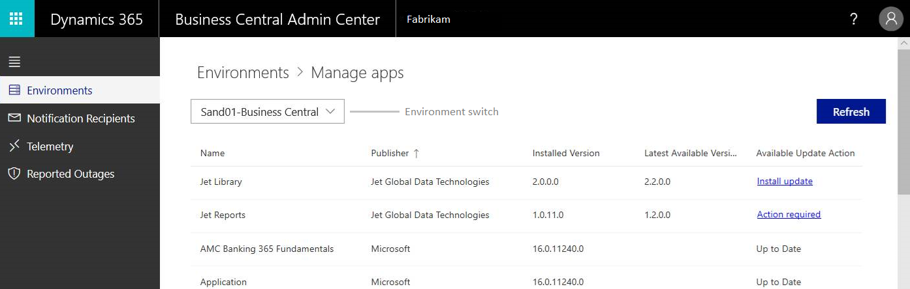

# Managing Apps

[!INCLUDE[2020_releasewave1](../includes/2020_releasewave1.md)]

A [!INCLUDE[prod_short](../developer/includes/prod_short.md)] environment is built as a collection of apps. These apps include Microsoft apps and third-party apps, for example, apps from AppSource. The apps work together to provide customers with a broad set of features to address their various business, market, and industry needs.

Updates are frequently made available for these apps by Microsoft, partners, and ISVs. App updates add new features and fix known problems. To keep your environment up to date and running smoothly, you should check for and install the latest updates regularly.

To help you manage app updates, the administration center includes the **Manage Apps** page. 

Like other features in the administration center, this functionality can be used by the partner (delegated administrator) or a local customer admin.

> [!Note]
> In the current version, it's not possible to install new apps, either main apps or their dependencies (library apps), by using the **Manage Apps**. To install the apps, continue using the **Extension Management** page within your [!INCLUDE[prod_short](../developer/includes/prod_short.md)] environment.

## Get an overview and check for updates

Open the **Manage Apps** page from the environment details page. Choose **Environments** > select the environment > **Manage Apps**.

> [!div class="mx-imgBorder"]
> 

The **Manage Apps** lists all the apps installed on the environment and indicates whether updates are available. When first opened, the system will start checking for updates. Wait for this operation to complete.

   > [!Important]
   > When an ISV [provides a new version of their AppSource app](appsource.md), Microsoft validates it against the latest, currently available version of [!INCLUDE[prod_short](../developer/includes/prod_short.md)] at the time. If the new app version passes validation, it's made available for the customers' environments that are running on that version of [!INCLUDE[prod_short](../developer/includes/prod_short.md)] and greater. So if you're not seeing an AppSource app update in the list, your environment may not yet be running on the version the app was registered for.

When completed, if an update is available for an app, there are two indications:

- The **Latest Available Version** column contains the new version number of the app.
- The **Available Update Action** column contains one of the following actions:

    |Actions|Descriptions|
    |-------|------------|
    |**Action required**|This action means that you have to do something before you install the update for the app. For example, you may have to first update another app or install a new app. Select the link and read the **Requirements for App Updates** pane to see what is required. For more information, see [Resolving requirements for app updates](#requirements).|
    |**Install update**|This action means that the app is ready to install. Select the link to start the installation. |

## Install an app update - the flow

We recommend you always install and test an app update on a Sandbox environment first. Make sure the app update won't disrupt the operational flow or cause problems for the users.

The following steps provide the general flow for updating an app.

1. If you don't have a sandbox environment, create one.
    For more information, see [Create a new sandbox environment](tenant-admin-center-environments.md#create-a-sandbox-environment).
2. Open the Sandbox environment and select **Manage Apps**.
3. On the **Manage Apps**, find the app in the list that you want to update.
4. If the **Available Update Action** column for the app shows the **Action required** link, resolve the update requirements.

    See [Resolving requirements for app updates](#requirements).
5. When the **Available Update Action** column for the app shows **Install update**, select this action to install the new version of the app.

    > [!Important]
    > The update will be applied immediately after you accept the confirmation dialogue. The users can continue working during update installation, but depending on the app changes coming with the update, they may receive a message asking them to log out and login again. It is therefore recommended that you apply the updates outside of working hours.

6. Wait for the app to be installed.

    Select **Refresh** occasionally to check the status.

    - If the app installs successfully, the new version displays in the **Installed version** column and the **Available Update Action** column is **Up to date**.
    - If the installation fails the **Available Update Action** column changes to **Update failed**. See [What to do when an update fails](#failure).

7. If the app update succeeded, sign in the Sandbox environment and test the new app version.
8. If the app update works as expected on the Sandbox, switch to the production environment, and repeat the installation steps for the app update.

    > [!TIP]
    > Use the environment switch box at the top of the page to quickly change to your production environment.

## Resolve requirements for app updates

For apps that have dependencies on other apps, you may have to update or install the dependency apps. The **Requirements for App Updates** page provide this information. The requirements are divided into two categories: **Update requirements** and **Install requirements**.

After you resolve all requirements, the app that you want to update will be ready to install.

### Update requirements

The **Update requirements** category lists existing dependency apps the have updates to be installed. To resolve these requirements, do the following steps for each app:

1. Return to the **Manage Apps** page.
2. Find the app in the list and select **Install update**.
3. Wait for **Available update action** column to change to **Up to date**.

### Install requirements

The **Install requirements** category lists dependency apps that haven't been installed yet. For example, a new app was introduced that app update depends on.

You can't, however, install a new app from the **Manage App** page. Use the **Extension Management** page in the client instead. Completing this step will resolve the requirement. For more information, see [Installing an Extension](/dynamics365/business-central/ui-extensions#installing-an-extension).

## What happens when an app update is installed?

The new app version is starting to install immediately, following the confirmation dialogue. The new app version will be published, synchronized, and updated in the background. This process usually doesn't take long, and users won't be interrupted. However, we still recommend you to install the updates outside of working hours.

## What do I do when an update fails?

When the installation of an app update fails, the **Available Update Action** column will display the **Update failed** action. Select this action to get more information. The **App Update Details** pane provides some details about update and what might have caused the failure.

Sometimes the update could fail because of a transient problem. Select **Retry** to try to install the update again. If the installation continues to fail, contact your ISV. You can find the support details of each ISV on their app page on AppSource. Contact Microsoft support if the app publisher is **Microsoft**.

   > [!TIP]
   > When reporting issues to Microsoft Support, always provide the **Operation ID** displayed in the error message. This will help expedite the investigations. 

## See also

[Working with Administration Tools](administration.md)  
[The Business Central Administration Center](tenant-admin-center.md)  
[Production and Sandbox Environments](environment-types.md)  
[Managing Environments](tenant-admin-center-environments.md)  
[Updating Environments](tenant-admin-center-update-management.md)  
[Managing Tenant Notifications](tenant-admin-center-notifications.md)  
[Introduction to automation APIs](itpro-introduction-to-automation-apis.md)  
