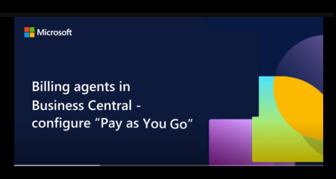

# Manage consumption-based billing for agent capabilities

This article explains how to set up a Business Central environment for billing Copilot and agent capabilities.

## Overview

Selected agent capabilities in [!INCLUDE [prod_short](../includes/prod_short.md)] use consumption-based billing, charging per use. These capabilities use Copilot credits for AI interactions and tasks, like retrieving information and responding to prompts. *Copilot credits* are the billing units that measure usage. The number of Copilot credits consumed by an agent depends on the design of the agent, how often customers interact with it, and the features they use. Learn more about Copilot credits in [Billing rates and management](/microsoft-copilot-studio/requirements-messages-management#message-scenarios).

<!--Learn more about billing in [Copilot Studio licensing](/microsoft-copilot-studio/billing-licensing). [Dynamics 365 Licensing Guide](https://go.microsoft.com/fwlink/?LinkId=866544).Power Platform Licensing Guide](https://go.microsoft.com/fwlink/?LinkId=2085130)-->

### Billable agent capabilities

- [Payables Agent](/dynamics365/business-central/payables-agent)
- [Sales Order Agent](/dynamics365/business-central/sales-order-agent)

Billable agent capabilities in [!INCLUDE [prod_short](../includes/prod_short.md)] use the *Generative answer* and *Agent action* [event scenarios](/microsoft-copilot-studio/requirements-messages-management#copilot-credits-and-events-scenarios) to bill for consumption as they complete their tasks.

### Sales Order Agent billing

The Sales Order Agent connects to a shared mailbox that processes customer requests for sales quotes and orders. The following table shows how the Business Central scenarios performed by the Sales Order agent are mapped to Copilot Studio events.

| Feature | Copilot Studio event scenario | Copilot credits |
|----------|----------|----------|
| Analyze incoming email | Generative answer | 2 |
| Process email attachment, no sales data detected (per attachment *) | Generative answer | 2 |
| Process email attachment, sales data detected (per attachment *) | Agent action | 5|
| Check for items availability | Agent action | 5 |
| Create or update sales quote | Agent action | 5 |
| Create or update sales order | Agent action | 5 |
| Generate response email | Generative answer | 2 |

\* Only attachments in supported formats are processed (for example, PDF, PNG, JPG).
  
A typical [Sales Order Agent process flow](/dynamics365/business-central/sales-order-agent#agent-process-flow) includes:

- One generative answer to analyze the incoming email (2 credits)
- One agent action to check for items availability (5 credits)
- One agent action to create or update a sales quote or order (5 credits)
- One generative answer to generate the response email (2 credits)

#### Example

Assume you get an average of 100 requests per month and 50% include an attachment with usable sales data for making quotes, like a purchase order in PDF format. Each such attachment triggers the 5‑credit agent action. A typical request consumes:

- Analyze incoming email: 2 credits
- Process attachment with sales data: 5 credits (only on 50% of total requests)
- Check item availability: 5 credits
- Create or update sales quote/order: 5 credits
- Generate response email: 2 credits

The calculated monthly total is: `2 + (5 × 0.5) + 5 + 5 + 2 = 1,650 Copilot credits/month`

### Payables Agent billing

Billing events for the Payables agent will be announced in a future update.

## Set up billing model

[!INCLUDE [prod_short](../includes/prod_short.md)] supports two billing models: prepaid capacity and pay-as-you-go. The prepaid capacity model uses Copilot credit pack subscriptions, which are a licensing option for Microsoft Copilot Studio that you purchase in advance. The pay-as-you-go model charges for the actual number of messages consumed by agents during the month. Learn more in [Copilot licensing](/microsoft-copilot-studio/billing-licensing).

> [!NOTE]
>
> - Both billing models can be used in the [!INCLUDE [prod_short](../includes/prod_short.md)] environment. When available, prepaid capacity is consumed first.
> - Copilot credit capacity on the tenant is consumed by [!INCLUDE [prod_short](../includes/prod_short.md)] environments and other Microsoft services on the tenant.

### Set up prepaid capacity

To enable prepaid Copilot credit capacity on your tenant, purchase a Copilot credit pack subscription. Customers purchase Copilot credit packs through the Microsoft 365 admin center, while resellers purchase them through Partner Center. Learn more in [Manage self-service purchases and trials (for users)](/microsoft-365/commerce/subscriptions/manage-self-service-purchases-users) or [Manage self-service purchases and trials (for admin)](/microsoft-365/commerce/subscriptions/manage-self-service-purchases-admins).

[!INCLUDE [prod_short](../includes/prod_short.md)] environments automatically consume from the Copilot credit capacity available in your tenant without any extra setup. The consumption is reported to the [Default Power Platform environment](/power-platform/admin/environments-overview#environment-types) in your tenant.

As an admin, you can allocate a portion of the prepaid capacity to the default Power Platform environment to reserve it for consumption by all [!INCLUDE [prod_short](../includes/prod_short.md)] environments.

If you have more than one Power Platform environment, you can allocate portions of the prepaid capacity to different [!INCLUDE [prod_short](../includes/prod_short.md)] environments. For example, you can have a Power Platform environment with limited capacity for use by Business Central sandboxes, ensuring there's sufficient capacity on production environments. To allocate capacity for a specific Business Central environment, complete these tasks:

1. Assign part or all of the Copilot credit pack to the Power Platform environment as prepaid capacity through the Power Platform admin center (for customers or resellers).

   Learn more in [Manage Capacity](/power-platform/admin/manage-copilot-studio-messages-capacity?tabs=new#manage-capacity).

2. Link the [!INCLUDE [prod_short](../includes/prod_short.md)] environment to the Power Platform environment. Only internal admins can complete this task.

   Learn more in [Linked Power Platform environments](tenant-admin-center-environments.md#linked-power-platform-environment).

Once completed, consumption of the Copilot credits in the [!INCLUDE [prod_short](../includes/prod_short.md)] environment is limited by the capacity allocated to the linked Power Platform environment.

> [!NOTE]
> Other Microsoft services running in the linked Power Platform environment might also consume from the environment's allocated Copilot credit capacity. It isn't possible to allocate capacity to specific Microsoft services or features.

### Set up pay-as-you-go

Complete these tasks to set up the Business Central environment for pay-as-you-go.

1. Set up pay-as-you-go on the Power Platform tenant (reseller):

   As a customer, contact your reseller. As a reseller, set up an Azure subscription for your customer and link it to their Power Platform environment using the [Power Platform admin center](https://admin.powerplatform.microsoft.com/) or [Power Apps](https://make.powerapps.com/).

   Learn more in [Set up pay-as-you-go](/power-platform/admin/pay-as-you-go-set-up).
1. Link the Business Central environment to the Power Platform environment (internal admin).

   As a reseller, contact the customer's internal admin. As an internal admin, use the Business Central admin center to link the Business Central environment to the Power Platform environment. Learn more in [Linked Power Platform environments](tenant-admin-center-environments.md#linked-power-platform-environment).

Watch this YouTube video for summary of how to manage pay-as-you-go billing:

## Manage capacity and usage

You can view Copilot credit capacity and usage for prepaid capacity and pay-as-you-go in the Power Platform admin center. Learn more in [Manage Copilot credits and capacity](/power-platform/admin/manage-copilot-studio-messages-capacity).

Business Central regularly checks the available capacity (quota) of Copilot credits. If your organization's quota is low or depleted, users receive in-app notifications about the status and necessary actions. It's important to take timely action on these notifications by reallocating existing capacity or purchasing more capacity.

- For prepaid capacity, use the Power Platform admin center to allocate more capacity to the environment from the total available on the tenant. Learn more in [Manage capacity](/power-platform/admin/manage-copilot-studio-messages-capacity#manage-capacity).

  If there's no quantity to allocate, purchase capacity. Learn more in [Manage self-service purchases and trials (for users)](/microsoft-365/commerce/subscriptions/manage-self-service-purchases-users). You can do this task yourself or contact your reseller.

- For pay-as-you-go, use Microsoft Cost Management in the Azure portal to view detailed usage and adjust spending limits (budgets) to free up more capacity. Learn more in [View usage and billing information](/power-platform/admin/pay-as-you-go-usage-costs).

  If there's no quantity to allocate, purchase more. This task is done by a reseller. If you're a customer, contact your reseller.

> [!IMPORTANT]
> When the quota is depleted, the AI capability is unavailable until more capacity is added.

## Related information

[Pay-as-you-go plan](/power-platform/admin/pay-as-you-go-overview)  
[Linked Power Platform Environments](tenant-admin-center-environments.md#linked-power-platform-environment)  
