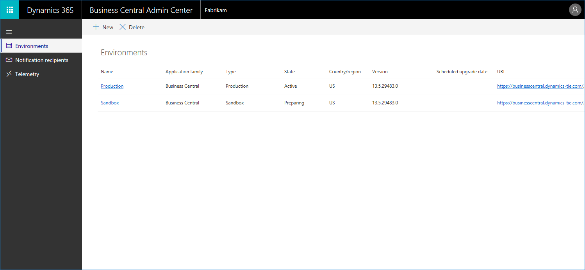

# The Business Central Administration Center

The [!INCLUDE[prodadmincenter](../developer/includes/prodadmincenter.md)] provides a portal for administrators to perform administrative tasks for a [!INCLUDE[prodshort](../developer/includes/prodshort.md)] tenant. Here, administrators can view and work with production and sandbox environments for the tenant, set up upgrade notifications, and view telemetry for events on the tenant.  

> [!div class="mx-imgBorder"]
> 

## Accessing the administration center

The following users are authorized to access the [!INCLUDE[prodadmincenter](../developer/includes/prodadmincenter.md)]:

- Internal tenant administrators
- Admin agent
- Helpdesk agent

The admin agent and helpdesk agent roles are assigned through the [Microsoft Partner Center](https://partner.microsoft.com) for the partner associated with the tenant. These roles are delegated administrators on the [!INCLUDE[prodshort](../developer/includes/prodshort.md)] tenant.

As a partner, you can access the administration center from the Partner Dashboard in the Microsoft Partner Center:

1. Log into the [Partner Dashboard](https://partnercenter.microsoft.com/dashboard).
2. Select the **Customers** link in the navigation pane.
3. Select the customer tenant that you want to perform administrative tasks for.
4. Select **Service Management**.
5. Under the **Administer Services** heading, select [!INCLUDE[prodlong](../developer/includes/prodlong.md)].

You can also get to the administration center by navigating directly to the URL of a tenant. This is done with the following URL, if you replace *[TENANT_ID]* with the tenant ID of your customer's [!INCLUDE [prodshort](../developer/includes/prodshort.md)].

`https://businesscentral.dynamics.com/[TENANT_ID]/admin`

> [!TIP]
> The tenant ID is shown in the **Help and Support** page in your customer's [!INCLUDE [prodshort](../developer/includes/prodshort.md)].  

## Submitting support requests on behalf of your customer

Sometimes your customer's tenant has run into a problem that you cannot resolve. In those cases, in the administration center, use the **New Support Request** link in the Help menu. This opens a new browser tab with the site where you can submit the support request.  

Fill in the fields as appropriate. You can find most of the necessary information in the administration center, including the tenant ID and the [!INCLUDE [prodshort](../developer/includes/prodshort.md)] version.  

## See also

[Working with Administration Tools](administration.md)  
[Managing Environments](tenant-admin-center-environments.md)  
[Tenant Notifications](tenant-admin-center-notifications.md)  
[Environment Telemetry](tenant-admin-center-telemetry.md)  
[Administration Center API](administration-center-api.md)  
[Business Central Data Security](../security/data-security.md)  
[Introduction to automation APIs](itpro-introduction-to-automation-apis.md)  
[Microsoft Partner Dashboard](https://partnercenter.microsoft.com/dashboard)  
[Add a new customer in the Partner Center](/partner-center/add-a-new-customer)  
[Assign licenses to users in the Partner Center](/partner-center/assign-licenses-to-users)  
[Create new subscriptions in the Partner Center](/partner-center/create-a-new-subscription)  
[Cloud Solution Provider program - selling in-demand cloud solutions](/partner-center/csp-overview)  
