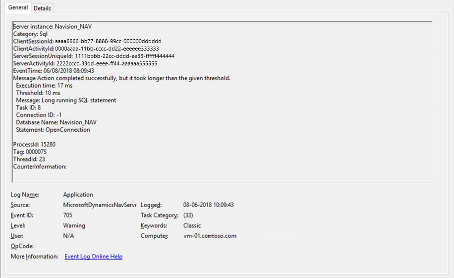

# Troubleshooting: Using the Event Viewer to Monitor Long Running SQL Queries in Business Central

This topic explains how to use the Event Viewer to monitor long running SQL queries. It can help decide which long running query is candidates for optimization. 

## Resolution

Identifying long running SQL queries is a good starting point when doing a performance analysis. To find which SQL queries were slower than expected, open the Event Viewer. Then go to the Windows Logs Application. 

> [!NOTE]  
> The SQL queries which exceed the set threshold will be displayed in the Application window of the Event Viewer as *Warning*. 

If the value of the [SqlLongRunningThreshold](configure-server-instance.md) key was set to the default value of 1000 milliseconds, you'll see the message: "*Action completed successfully, but it took longer than the given threshold.*" for actions that took longer.

To meet performance expectations in production, you can set the threshold to a different value. You can set the threshold without restarting the server instance. For more information on how to set the threshold, see [Monitoring Long Running SQL Queries using the Event Log](monitor-long-running-sql-queries-event-log.md). 



In some cases, you can look at the code-generated SQL statement in the `AL CallStack` column to see what caused the delay.

The code below shows which AL method generated a slow query.

```
Server instance: Navision_NAV
Category: Sql
ClientSessionId: 00000000-0000-0000-0000-000000000000
ClientActivityId: 828c9342-891a-4631-8eb3-a1da7304fdc9
ServerSessionUniqueId: 24b32889-9be9-439f-b86c-9615d5e51319
ServerActivityId: 19bf285d-a8f2-42b6-a4c0-4afe9fb5b4b4
EventTime: 06/08/2018 08:10:15
Message Action completed successfully, but it took longer than the given threshold.
  Execution time: 33 ms
  Threshold: 10 ms
  Message: Long running SQL statement 
  Task ID: 3
  Connection ID: 2
  Database Name: Navision_NAV
  Statement: SELECT "2161"."timestamp","2161"."User","2161"."Default Execute Time","2161"."Current Job Queue Entry" FROM "SQLDATABASE".dbo."CRONUS International Ltd_$Calendar Event User Config_" "2161"  WITH(UPDLOCK)  WHERE ("2161"."User"=@0) OPTION(OPTIMIZE FOR UNKNOWN)
    AppObjectType: CodeUnit
  AppObjectId: 2160
  AL CallStack: "Calendar Event Mangement"(CodeUnit 2160).GetCalendarEventUserConfiguration line 2
"Calendar Event Mangement"(CodeUnit 2160).FindJobQueue line 1
"Calendar Event Mangement"(CodeUnit 2160).FindOrCreateJobQueue line 1
"Calendar Event Mangement"(CodeUnit 2160).CreateOrUpdateJobQueueEntry line 1
"Calendar Event"(Table 2160).Schedule line 12
"Calendar Event"(Table 2160).OnInsert(Trigger) line 1
"Calendar Event Mangement"(CodeUnit 2160).CreateCalendarEventForCodeunit line 6
"Create Telemetry Cal. Events"(CodeUnit 1352).OnRun(Trigger) line 5

ProcessId: 15280
Tag: 000007L
ThreadId: 10
CounterInformation:
```


## See Also
[Troubleshooting: Analyzing Long Running SQL Queries Involving FlowFields by Disabling SmartSQL](Troubleshooting-Queries-Involving-FlowFields-By-Disabling-SmartSQL.md)   
[Monitoring Long Running SQL Queries using the Event Log](monitor-long-running-sql-queries-event-log.md)  
[Tools for Monitoring Performance Counters and Events](tools-monitor-performance-counters-and-events.md)  
[Business Central Server Administration Tool](administration-tool.md)  
[Troubleshooting: Using Query Store to Monitor Query Performance in Business Central](troubleshoot-query-performance-using-query-store.md)  
[SQL Trace](/sql/relational-databases/sql-trace/sql-trace)

