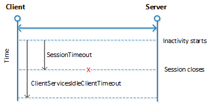
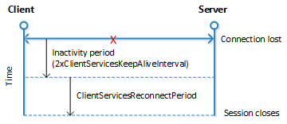

# Session Timeout Settings and Configuration

When you start a client, such as connecting to [!INCLUDE [prodshort](../developer/includes/prodshort.md)] in a browser, a connection is established with the [!INCLUDE[server](../developer/includes/server.md)] instance and a corresponding session is added on [!INCLUDE[server](../developer/includes/server.md)].  

 [!INCLUDE[server](../developer/includes/server.md)] includes several timeout settings that determine when a session closes as a result of inactivity over the client connection, lost client connection, or closing of the client. To help you configure the timeout settings, this document provides an overview of how the session timeouts work and answers some basic questions about session behavior.  

##   Session timeout settings overview  
 This section provides an overview of the settings that are available in [!INCLUDE[prodshort](../developer/includes/prodshort.md)] to control when a [!INCLUDE[server](../developer/includes/server.md)] session for a [!INCLUDE[prodshort](../developer/includes/prodshort.md)] client connection times out and closes. Some of the settings are set on [!INCLUDE[server](../developer/includes/server.md)] and others are set for the [!INCLUDE[nav_web](../developer/includes/nav_web_md.md)]. For more details about using these settings, see the other sections in this topic.  

### [!INCLUDE[server](../developer/includes/server.md)] timeout settings  
 The following table describes the session timeout settings that are used by [!INCLUDE[server](../developer/includes/server.md)].  

|Setting|Description|Remarks|  
|-------------|-----------------|-------------|  
|ClientServicesReconnectPeriod|The amount of time during which a client can reconnect to an existing session on [!INCLUDE[server](../developer/includes/server.md)] before a session closes.|For more information, see [Configuring How Long a Session Remains Open after the Client Connection is Lost](Understanding-Session-Timeouts.md#ReconnectTimeout).|  
|ClientServicesIdleClientTimeout|The interval of time that a [!INCLUDE[prodshort](../developer/includes/prodshort.md)] client connection can remain inactive before the session is closed.|For more information, see [Configuring How Long a Session Remains Open When the Client Connection is Inactive](Understanding-Session-Timeouts.md#InactiveSession).|  
<!--|  ClientServicesKeepAliveInterval | Specifies the interval (in seconds) between keep-alive messages that are sent from the [!INCLUDE[nav_windows](../developer/includes/nav_windows_md.md)] to [!INCLUDE[server](../developer/includes/server.md)]. |This setting is also used, in part, to define the reconnect period when a connection is lost. For more information, see [Keeping inactive sessions alive](Understanding-Session-Timeouts.md#KeepAlive).|-->

 These settings are available in the CustomSettings.config file of [!INCLUDE[server](../developer/includes/server.md)]. For more information about this file, see [Configuring Business Central Server](configure-server-instance.md).  

### [!INCLUDE[nav_web](../developer/includes/nav_web_md.md)] timeout settings  
 The following table describes the session timeout settings that are used by the [!INCLUDE[nav_web](../developer/includes/nav_web_md.md)].  

|Setting|Description|Remarks|  
|-------------|-----------------|-------------|  
|SessionTimeout|Specifies the amount of time that session remains open when there is no activity over the connection from the [!INCLUDE[nav_web](../developer/includes/nav_web_md.md)] to [!INCLUDE[server](../developer/includes/server.md)].|For more information, see [Configuring Business Central Server](configure-server-instance.md).|  

 This setting is available in the navsettings.json configuration file of the [!INCLUDE[webserver.md](../developer/includes/webserver.md)]. For more information about this file, see [Configuring Web Server](configure-web-server.md#WebClientSettingsFile).  

##   Configuring How Long a Session Remains Open When the Client Connection is Inactive  
 Inactivity on a connection is when the [!INCLUDE[prodshort](../developer/includes/prodshort.md)] client is not sending messages to [!INCLUDE[server](../developer/includes/server.md)]. <!--Controlling when a session will timeout and close because of inactivity is different for the [!INCLUDE[nav_windows](../developer/includes/nav_windows_md.md)] and the [!INCLUDE[nav_web](../developer/includes/nav_web_md.md)].-->  

<!--### Configuring the inactive session timeout for the [!INCLUDE[nav_windows](../developer/includes/nav_windows_md.md)]  
 When the [!INCLUDE[nav_windows](../developer/includes/nav_windows_md.md)] is inactive, the session will remain open until the time period that is specified by the *ClientServicesIdleClientTimeout* setting has passed, provided that the client has not been stopped or the connection to [!INCLUDE[server](../developer/includes/server.md)] has not been lost. The default value of the *ClientServicesIdleClientTimeout* setting is **MaxValue**, which means that there is no time limit so the session will remain active indefinitely.-->  

### Configuring the inactive session timeout for the [!INCLUDE[nav_web](../developer/includes/nav_web_md.md)]  
 There are two settings that control when a Web client session closes because of inactivity on a connection:  

-   *ClientServicesIdleClientTimeout* setting on [!INCLUDE[server](../developer/includes/server.md)].  

-   *SessionTimeout* setting on the [!INCLUDE[prodshort](../developer/includes/prodshort.md)] Web Server.  

 The session closes according to the setting that has the shortest time period. By default, the *ClientServicesIdleClientTimeout* setting is set to **MaxValue**, which means no time limit, and the *SessionTimout* setting is 00:20:00 \(20 minutes\). This means that when client connection is inactive, a session will close after 20 minutes. The following figure illustrates the timeout behavior:  

   

<!-- The *SessionTimeout* setting enables you to set the [!INCLUDE[nav_web](../developer/includes/nav_web_md.md)] inactive session timeout different than for the [!INCLUDE[nav_windows](../developer/includes/nav_windows_md.md)], which is only controlled by the *ClientServicesIdleClientTimeout* setting. Typically, you will set the inactive session timeout period on [!INCLUDE[nav_web](../developer/includes/nav_web_md.md)] connections shorter than for the [!INCLUDE[nav_windows](../developer/includes/nav_windows_md.md)].-->  

<!--###   Keeping inactive sessions alive  
 To keep an inactive session alive, the [!INCLUDE[nav_windows](../developer/includes/nav_windows_md.md)] uses the Windows Communication Framework \(WCF\) reliable sessions feature. When the [!INCLUDE[nav_windows](../developer/includes/nav_windows_md.md)] is inactive, reliable sessions automatically sends messages from the [!INCLUDE[nav_windows](../developer/includes/nav_windows_md.md)] to [!INCLUDE[server](../developer/includes/server.md)]. You control the interval of the keep-alive messages by setting the *ClientServicesKeepAliveInterval* setting on the [!INCLUDE[server](../developer/includes/server.md)]. The default value of the *ClientServicesKeepAliveInterval* setting is 120 seconds \(2 minutes\).  

 For most installations, the ClientServicesKeepAliveInterval setting default value sufficient for keeping sessions open until the *ClientServicesIdleClientTimeout* setting period elapses. However, when [!INCLUDE[server](../developer/includes/server.md)] is installed behind a load balancer, which is the case on Microsoft Azure, you might have to adjust the value the *ClientServicesKeepAliveInterval* setting to prevent sessions from closing before the expected session timeout. A load balancer typically has an idle timeout setting that it uses to determine whether to redirect connections. However, you want a stable connection between the [!INCLUDE[nav_windows](../developer/includes/nav_windows_md.md)] and [!INCLUDE[server](../developer/includes/server.md)]. If there is no activity on the client connection for duration of the load balancer's idle timeout setting, then the load balancer might redirect the client connection to another server. To avoid this condition, we recommend that you set the *ClientServicesKeepAliveInterval* to half the value of the load balancer's idle timeout setting.  

> [!NOTE]  
>  The idle timeout on Azure is around 4 minutes, so the default setting of *ClientServicesKeepAliveInterval* \(2 minutes\) should be sufficient.  -->

##   Configuring How Long a Session Remains Open after the Client Connection is Lost  
 Occasionally, a [!INCLUDE[prodshort](../developer/includes/prodshort.md)] client can lose the network connection to [!INCLUDE[server](../developer/includes/server.md)]. You can use *ClientServicesReconnectPeriod* setting on [!INCLUDE[server](../developer/includes/server.md)] to control how long a session remains open after the connection is lost to allow time for the client to reconnect to the session.  

 The time a session remains open actually depends two settings: *ClientServicesKeepAliveInterval* and *ClientServicesReconnectPeriod*. The *ClientServicesKeepAliveInterval* setting is used to specify an initial inactivity period. The initial inactivity period is equal to two times the *ClientServicesKeepAliveInterval* setting value. After this initial inactivity period, the session remains open for the time period that is specified *ClientServicesReconnectPeriod* setting. By default, the *ClientServicesKeepAliveInterval* setting is 120 seconds \(2 minutes\) and the *ClientServicesReconnectPeriod* setting is 10 minutes. This means that [!INCLUDE[server](../developer/includes/server.md)] waits approximately 14 minutes for the client to reconnect before closing the session.  

 The following figure illustrates the reconnect session timeout behavior.  

   

 The process that occurs when a client does not reconnect to the session is explained as follows:  

1.  The connection is lost and the initial inactivity period starts \(default is 4 minutes\).  

2.  After the initial inactivity period, the service channel enters a faulted state.  

     When the service channel is in the faulted state, [!INCLUDE[server](../developer/includes/server.md)] considers the session with the client as orphaned and waits for it to reconnect.  

3.  If the client does not reconnect within the time period that is specified by the *ClientServicesReconnectPeriod* setting \(default is 10 minutes\), then [!INCLUDE[server](../developer/includes/server.md)] closes the session.  

4.  The session is then removed from the **Active Session** table in the [!INCLUDE[prodshort](../developer/includes/prodshort.md)].  

##   FAQ

 This section answers some typical questions about session timeout.  

<!--### How long does [!INCLUDE[server](../developer/includes/server.md)] wait when the [!INCLUDE[nav_windows](../developer/includes/nav_windows_md.md)] is inactive before closing a session??  
 With [!INCLUDE[nav_windows](../developer/includes/nav_windows_md.md)], by default, [!INCLUDE[server](../developer/includes/server.md)] will wait indefinitely as long as the client has not been stopped or the connection to [!INCLUDE[server](../developer/includes/server.md)] has not been lost. With the [!INCLUDE[nav_web](../developer/includes/nav_web_md.md)], the session will remain active for 20 minutes. The [!INCLUDE[nav_windows](../developer/includes/nav_windows_md.md)] and [!INCLUDE[nav_web](../developer/includes/nav_web_md.md)] include configuration settings that you can use to change the inactivity timeout period. For more information, see [Configuring How Long a Session Remains Open When the Client Connection is Inactive](Understanding-Session-Timeouts.md#InactiveSession).  -->

<!--### What happens to the session if I end the [!INCLUDE[nav_windows](../developer/includes/nav_windows_md.md)] by using Task Manager?  
 If the [!INCLUDE[nav_windows](../developer/includes/nav_windows_md.md)]is waiting for a response from [!INCLUDE[server](../developer/includes/server.md)], as is the case with a modal dialog, then the session remains open until the time period that is specified by the ClientServicesReconnectPeriod setting expires. When the Window Client process is ended, the service channel will enter a faulted state. [!INCLUDE[server](../developer/includes/server.md)] considers the session with the Microsoft Dynamics NAV client as orphaned and waits for it to reconnect.  -->

### What happens to the session if the client loses the connection to [!INCLUDE[server](../developer/includes/server.md)]?

 By default, it will take approximately 14 minutes for the [!INCLUDE[server](../developer/includes/server.md)] to close the current session. The time it takes to close the session is in part determined by the *ClientServicesReconnectPeriod* setting on [!INCLUDE[server](../developer/includes/server.md)] plus an initial 10 minute inactivity period. For more information, see [Configuring How Long a Session Remains Open after the Client Connection is Lost](Understanding-Session-Timeouts.md#ReconnectTimeout).  

### What happens if the session is still active when [!INCLUDE[server](../developer/includes/server.md)] tries to close it?  

1. The server stops any executing threads when the next statement is to be executed and the current call stack is aborted so any uncommitted transactions will be rolled back.  

2. The server cancels any callbacks to the client \(similar to waiting for the response to a Confirm dialog\).  

3. The session is closed, and then removed from the Active Session table.  

