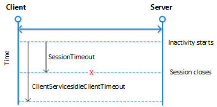
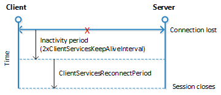

# Session timeout settings and configuration

When you start a client, such as connecting to [!INCLUDE [prod_short](../developer/includes/prod_short.md)] in a browser, a connection is established with the [!INCLUDE[server](../developer/includes/server.md)] instance, and a corresponding session is added on [!INCLUDE[server](../developer/includes/server.md)].  

[!INCLUDE[server](../developer/includes/server.md)] includes timeout settings that determine when a session closes because of inactivity over the client connection, lost client connection, or closing of the client. To help you configure the timeout settings, this document provides an overview of how the session timeouts work and answers some basic questions about session behavior.  

##  <a name="Timeouts"></a> Session timeout settings overview

 This section provides an overview of the settings that are available in [!INCLUDE[prod_short](../developer/includes/prod_short.md)] to control when a [!INCLUDE[server](../developer/includes/server.md)] session for a [!INCLUDE[prod_short](../developer/includes/prod_short.md)] client connection times out and closes. Some of the settings are set on [!INCLUDE[server](../developer/includes/server.md)] and others are set for the [!INCLUDE[nav_web](../developer/includes/nav_web_md.md)]. Learn more about using these settings in this article.  

### [!INCLUDE[server](../developer/includes/server.md)] timeout settings

The following table describes the session timeout settings that are used by [!INCLUDE[server](../developer/includes/server.md)].  

|Setting|Description|Remarks|
|-------------|-----------------|-------------|  
|`ClientServicesIdleClientTimeout`|The interval of time that a [!INCLUDE[prod_short](../developer/includes/prod_short.md)] client connection can remain inactive before the session is closed. |  Learn more in [Configuring How Long a Session Remains Open When the Client Connection is Inactive](#InactiveSession).|
|`ClientServicesReconnectPeriod`|The amount of time during which a client can reconnect to an existing session on [!INCLUDE[server](../developer/includes/server.md)] before a session closes.|**NOTE:** Applies to [!INCLUDE[prod_short](../developer/includes/prod_short.md)] 2022 (v20) and earlier only.<br><br>Learn more in [Configuring How Long a Session Remains Open after the Client Connection is Lost](#ReconnectTimeout). |

These settings are available in the CustomSettings.config file of [!INCLUDE[server](../developer/includes/server.md)]. Learn more about this file in [Configuring Business Central Server](configure-server-instance.md).  

### [!INCLUDE[nav_web](../developer/includes/nav_web_md.md)] timeout settings

The following table describes the session timeout settings that are used by the [!INCLUDE[nav_web](../developer/includes/nav_web_md.md)].  

|Setting|Description|Remarks|  
|-------------|-----------------|-------------|  
|`SessionTimeout`|Specifies the amount of time that session remains open when there's no activity over the connection from the [!INCLUDE[nav_web](../developer/includes/nav_web_md.md)] to [!INCLUDE[server](../developer/includes/server.md)].|Learn more in [Configuring How Long a Session Remains Open When the Client Connection is Inactive](#InactiveSession).|  

This setting is available in the navsettings.json configuration file of the [!INCLUDE[webserver.md](../developer/includes/webserver.md)]. Learn more about this file in [Configuring web server](configure-web-server.md#WebClientSettingsFile).  

##  <a name="InactiveSession"></a> Configure how long a session remains open when the client connection is inactive

Inactivity on a connection is when the [!INCLUDE[prod_short](../developer/includes/prod_short.md)] client isn't sending messages to [!INCLUDE[server](../developer/includes/server.md)]. There are two settings that control when a Web client session closes because of inactivity on a connection:

- `ClientServicesIdleClientTimeout` setting on [!INCLUDE[server](../developer/includes/server.md)].
- `SessionTimeout` setting on the [!INCLUDE[prod_short](../developer/includes/prod_short.md)] Web Server.  

The session closes according to the setting that has the shortest time period. By default, the `ClientServicesIdleClientTimeout` setting is set to **MaxValue**, which means no time limit, and the `SessionTimeout` setting is 00:20:00 \(20 minutes\). This means that when client connection is inactive, a session will close after 20 minutes. The following figure illustrates the timeout behavior:  

  

To change these settings, use the [!INCLUDE[adminshell](../developer/includes/adminshell.md)]:

1. Run the [!INCLUDE[adminshell](../developer/includes/adminshell.md)] as an administrator.
1. To set `ClientServicesIdleClientTimeout`, run the [Set-NAVServerConfiguration](/powershell/module/microsoft.dynamics.nav.management/set-navserverconfiguration) as follows:

   ```powershell
   Set-NAVServerConfiguration -ServerInstance [BC server instance] -KeyName ClientServicesIdleClientTimeout -KeyValue [timespan]
   ```

   - Replace `[BC server instance]` with your [!INCLUDE[server](../developer/includes/server.md)] instance name, like `BC270`
   - Replace `[timespan]` with the time period for timeout in the form hh:mm:ss (hours:minutes:seconds), like `00:10:00` for 10 minutes.

1. To set `SessionTimout`, run the [Set-NAVWebServerConfiguration](/powershell/module/navwebclientmanagement/set-navwebserverinstanceconfiguration) as follows:

   ```powershell
   Set-NAVWebServerInstanceConfiguration -WebServerInstance [BC web server instance] -KeyName SessionTimeout -KeyValue [timespan]
   ```

   - Replace `[BC web server instance]` with your [!INCLUDE[webserver](../developer/includes/webserver.md)] instance name, like `BCWeb`
   - Replace `[timespan]` with the time period for timeout in the form hh:mm:ss (hours:minutes:seconds), like `00:30:00` for 30 minutes.

   Learn more in [Configuring Business Central Web Server instances](configure-web-server.md).

## <a name="ReconnectTimeout"></a> Configure how long a session remains open after the client connection is lost

> **APPLIES TO:** [!INCLUDE[prod_short](../developer/includes/prod_short.md)] 2022 release wave (v20) and earlier only. In later versions, sessions terminate instantly when the client loses connection to the server and you can't change behavior.

Occasionally, a [!INCLUDE[prod_short](../developer/includes/prod_short.md)] client can lose the network connection to [!INCLUDE[server](../developer/includes/server.md)]. You can use `ClientServicesReconnectPeriod`setting on [!INCLUDE[server](../developer/includes/server.md)] to control how long a session remains open after the connection is lost to allow time for the client to reconnect to the session.  

The time a session remains open actually depends on two settings: `ClientServicesKeepAliveInterval` and `ClientServicesReconnectPeriod`. The `ClientServicesKeepAliveInterval` setting is used to specify an initial inactivity period. The initial inactivity period is equal to two times the `ClientServicesKeepAliveInterval` setting value. After this initial inactivity period, the session remains open for the time period that is specified `ClientServicesReconnectPeriod`setting. By default, the `ClientServicesKeepAliveInterval` setting is 120 seconds \(2 minutes\) and the `ClientServicesReconnectPeriod`setting is 10 minutes. This means that [!INCLUDE[server](../developer/includes/server.md)] waits approximately 14 minutes for the client to reconnect before closing the session.  

The following figure illustrates the reconnect session timeout behavior.  

  

The process that occurs when a client doesn't reconnect to the session is explained as follows:  

1. The connection is lost and the initial inactivity period starts \(default is 4 minutes\).  
1. After the initial inactivity period, the service channel enters a faulted state.  

   When the service channel is in the faulted state, [!INCLUDE[server](../developer/includes/server.md)] considers the session with the client as orphaned and waits for it to reconnect.  

1. If the client doesn't reconnect within the time period that the `ClientServicesReconnectPeriod`setting \(default is 10 minutes\) specifies, then [!INCLUDE[server](../developer/includes/server.md)] closes the session.  
1. The session is then removed from the **Active Session** table in the [!INCLUDE[prod_short](../developer/includes/prod_short.md)].  

##  <a name="FAQ"></a>FAQ

This section answers some typical questions about session timeout.  

### What happens to the session if the client loses the connection to [!INCLUDE[server](../developer/includes/server.md)]?

In Business Central 2022 release wave 2 (v21) and later, the session closes immediately. In earlier version, it takes approximately 14 minutes for the [!INCLUDE[server](../developer/includes/server.md)] to close the current session by default. The time it takes to close the session is in part determined by the `ClientServicesReconnectPeriod`setting on [!INCLUDE[server](../developer/includes/server.md)] plus an initial 10-minute inactivity period. For more information, see [Configuring How Long a Session Remains Open after the Client Connection is Lost](#ReconnectTimeout).  

### What happens if the session is still active when [!INCLUDE[server](../developer/includes/server.md)] tries to close it?  

1. The server stops any executing threads when the next statement is to be executed. The current call stack is aborted so any uncommitted transactions will be rolled back.  
1. The server cancels any callbacks to the client \(similar to waiting for the response to a Confirm dialog\).  
1. The session is closed and removed from the **Active Session** table.  

## Related information

[Configuring Business Central Server](configure-server-instance.md)  
