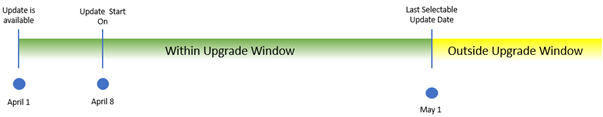

# Major Updates and Service Updates for Business Central Online

This article provides an overview of what you need to know about how a major [!INCLUDE[prod short](../developer/includes/prod_short.md)] update rolls out, and how service updates. It includes key dates, actions you need take, and answers some common questions.  

[!INCLUDE [service-updates](../includes/service-updates.md)]

Microsoft is committed to delivering predictable updates to the service. Updates are continuous, touchless updates that provide new features and functionality. They eliminate the need to do expensive upgrades every few years. For each environment, administrators can set a maintenance window for when Microsoft is allowed to update that environment. For more information, see [Managing Updates in the Business Central Admin Center](tenant-admin-center-update-management.md). Microsoft then schedules updates of the business functionality to be applied during these maintenance windows.  

You are in control and manage how your organization receives these updates. Microsoft applies updates to each environment based on your configuration.  

Each new update is designed and developed by the Dynamics 365 team. Any new update is first validated by the feature team, then validated in combination with the full product. During this time, extensive testing is done on various test topologies. A compatibility checker also runs tests to ensure backward compatibility.  

## Timelines for major updates

The following figure illustrates the key milestones and dates for rolling out a major update. The timeline and dates are loosely based on [2021 release wave 1](/dynamics365-release-plan/2021wave1/smb/dynamics365-business-central/) and [2020 release wave 2](/dynamics365-release-plan/2020wave2/smb/dynamics365-business-central/). The same timeline applies to all other major updates, though dates will differ slightly.

The following table describes the milestones with example dates for the two release waves in any given calendar year.

|Milestone|Example date wave 1| Example date wave 2|Description|
|---------|-------------------|--------------------|-----------|
|Update is available|April 1 |October 1|The date when the new major version of Business Central becomes generally available|
|Update starts rolling out|April 15 |October 15|The default date when Microsoft starts upgrading your environments. Once the update is scheduled, you can change that date, within the allowed date range, to a date that suits you better.|
|Last scheduled update date|May 31 |November 30|The last date you can choose to extend your upgrade date to. Since 2020 release wave 1, this date has been extended from 30 days after the update is available to 60 days.|

> [!IMPORTANT]
> As announced in the [blog post](https://aka.ms/covid19Blog), in response to COVID-19, Microsoft made some changes to the update schedules in April, 2020. Specifically for [!INCLUDE [prod_short](../developer/includes/prod_short.md)], existing customers were given 60 days to upgrade after the new version was made generally available.  
>
> The extended 60 days update window also applies to 2020 release wave 2 updates and 2021 release wave 1 updates.

Dates and times differ significantly across countries and regions. Make sure that you have set up notifications in the [!INCLUDE [prodadmincenter](../developer/includes/prodadmincenter.md)] so that you're notified when the next major update is available.  

## Timelines for minor service updates

Service updates contain both application and platform changes that are critical improvements to the service, including regulatory updates.  

The service components apply to multiple environments, such as all tenants in a region. So Microsoft schedules those updates to a time when traffic is lower in each region, typically during the evening or night. Typically, these service updates are transparent to any users, as the service is designed to manage traffic in a way that any users still working in [!INCLUDE [prod_short](../includes/prod_short.md)] are not affected by these service updates.  

The service update will roll out across Azure regions over several days and weeks. When the service update is available for a specific environment, admins can apply it manually from the [!INCLUDE [prodadmincenter](../developer/includes/prodadmincenter.md)]. If the update has not been applied to an environment by the specified last update date, Microsoft will auto-apply the update. Microsoft takes into account the update window for the environment.  

### Example release schedule

The following table describes the milestones with example dates for a service updates in a release wave in any given calendar year.

| Milestone | Example date | Description |
|--|--|--|
| Update is available | May 07 | The date when the new minor version of Business Central is first available and admins can schedule the update. |
| Update rolls out automatically | May 14 | The default date when Microsoft starts upgrading your environments, 7 days after the first availability date. Once the update is scheduled, you can change that date, within the allowed date range, to a date that suits you better. |
| Last scheduled update date | May 28 | The last date you can choose to extend your upgrade date to, 21 days after the update is available. |

The following table provides an overview of how monthly service updates roll out. Dates are based on the expected rollout of updates for 2021 release wave 1.  

| Version | First availability | Last update date |
|---------|--------------------|------------------|
| 17.5    | March 05, 2021     | March 19, 2021   |
| 18.1    | May 07, 2021       | May 14, 2021     |
| 18.2    | June 04, 2021      | June 11, 2021    |
| 18.3    | July 02, 2021      | July 09, 2021    |

> [!IMPORTANT]
> The dates shown here are example dates and subject to change. Your key takeaway should be that the service updates tend to become available in the first week of any given month, and that the Microsoft aims to update the last environments no more than three weeks later.

## Update availability

The major updates are typically made available twice a year, in April and in October. Minor service updates roll out every month. Get an overview of the release plans at [Dynamics 365 and Microsoft Power Platform release plans](/dynamics365/release-plans/). For [!INCLUDE [prod_short](../developer/includes/prod_short.md)] release plans, select a release plan under **Dynamics 365**, then look under **SMB** in the table of contents.

On the release day, all new sign-ups and all newly created environments (sandbox and production), are directed to the new version. For existing environments, running on the previous version, updates are made available gradually across the supported regions over the coming days and weeks. It's not possible to expedite this process for your environment via Microsoft Support.  

## Scheduling updates

When the update becomes available for your environment, a notification email is sent to all [notification recipients](tenant-admin-center-notifications.md) that you've registered in [!INCLUDE [prodadmincenter](../developer/includes/prodadmincenter.md)]. A notification about the update availability is also shown in the [!INCLUDE[prodadmincenter](../developer/includes/prodadmincenter.md)] itself.  

Starting this day, you can use the [!INCLUDE[prodadmincenter](../developer/includes/prodadmincenter.md)] to [schedule the date](tenant-admin-center-update-management.md#schedule) when you prefer the update to happen.  

The following fields on the environment page can help you plan the update:

|Field|Description|
|-----|-----------|
|**Available Update Version**|Specifies the version to which you can update your environment|
|**Update Scheduling Available**|Specifies whether it's possible for you to change the update date. The options are **Yes** or **No**.|
|**Scheduled Update Date**| Specifies the default update date set by Microsoft. You can change this date to one you prefer, if **Update Scheduling Available** is set to **Yes**|
|**Update Rollout State**|Microsoft can sometimes postpone the updates for various reasons. This field provides information that can help you track the current state of the rollout. For more information about what happens in such cases, see [Postponed updates](#postponed)|

> [!IMPORTANT]
> If you don't set a date in the **Scheduled Update Date** field, Microsoft will update the environment automatically on any day between the default date and the date that is shown as the last possible update date in your notification email. If you don't want your environment to be updated automatically, change the update date to one that fits you better.

When the scheduled update date arrives, the update runs automatically within the update window that you've specified for this environment. All users will be disconnected from this environment, and all sign-in attempts during the update will be blocked with the message `Service is under maintenance`.  

> [!IMPORTANT]
> We strongly encourage that you set an update window for all production environments so that updates don't start during business hours.

For more information, see [Set the update window for each environment](tenant-admin-center-update-management.md#set-the-update-window-for-each-environment).  

> [!NOTE]
> When you select a current date for your update, but the update window defined for this environment has already passed, the update will start within that time window, but on the day after the one that you defined for your environment.
>
> For example, if you're changing the **Scheduled update date** to the current date at 6pm, and your update window is set to 1 AM - 7 AM, the update will not start immediately, but around 1 AM on the next day.  

### Delayed scheduling of updates

In some cases, even after the update is available in your area, you may still not be able to set the update date (schedule environment update). This condition can happen for one of the following reasons:  

- Your environment hasn't yet updated to the latest minor update of the previous version of [!INCLUDE [prod_short](../developer/includes/prod_short.md)]. All environments must be updated to the last available minor update of the previous version of [!INCLUDE [prod_short](../developer/includes/prod_short.md)] before they can be scheduled for the next major version. You can check the version information in the **Troubleshooting** section of the **Help and Support** page in [!INCLUDE [prod_short](../developer/includes/prod_short.md)] and in the **Version Management** section in [!INCLUDE [prodadmincenter](../developer/includes/prodadmincenter.md)]. For more information, see [Version numbers in Business Central](version-numbers.md).  

    Microsoft is actively working on updating all environments to the latest minor update as soon as possible. In most cases, your environment will be scheduled for the major update soon. You'll get a chance to change the date to the one that fits you better. In the unlikely situation that your environment is updated to the last minor update around or even after the last selectable update date, you'll still get a least seven days to schedule the update.  

- You've just created a new sandbox environment as a copy of your production environment. In this case, the sandbox environment is created on the same version as the production environment it was copied from. If your newly created sandbox environment is running on the last minor update of the previous version, Microsoft will schedule it for update automatically within one hour.  

    You'll receive email notification and will see the notification in [!INCLUDE [prodadmincenter](../developer/includes/prodadmincenter.md)]when it happens. The scheduled update date for this environment will be set to seven days from the current date, so that you have enough time to change the date to one that fits you better (including the current date).  

- Your per-tenant extensions aren't compatible with the next major update.  

    Before rolling out the next major update, and during the update, Microsoft routinely checks per-tenant extensions in all existing environments for compatibility with the next major update. When compatibility issues with the upcoming version are detected, email notifications that describe the detected issues are sent to the notification recipients.  

    If you discover any such issues, apply the changes to your solution as usual using Visual Studio Code, and test the new app in a sandbox environment that runs on the new major version (either in preview or officially available). If tests complete successfully, upload the new app version into your production environment in the **Extension Management** page, setting the **Deploy to** field to **Next major version**. This way the compatible version of your app will be used when your environment is updated. For more information, see [Deploying a Tenant Customization](../developer/devenv-deploy-tenant-customization.md).  

- The AppSource apps that are installed in your environment aren't yet available for the next major version of [!INCLUDE [prod_short](../developer/includes/prod_short.md)].  

    While the AppSource apps are normally kept up to date by the partners who own them, it can happen that a particular app needs more time to prepare for the next major update and isn't yet available for it. In this situation, contact the app owner to understand their availability plans.  

## Failed updates and rescheduling

An environment may fail to update for various reasons, such as the following:

- Per-tenant extension compatibility issues
- AppSource app compatibility issues
- Internal update issues  

Any environment that fails to update will be automatically restored to the original application version so that users could connect to it again. The environment is then automatically rescheduled for a new update attempt in seven days. If you consider the issue resolved and want to try the update again, change the update date to an earlier date or the current date.  

If Microsoft can't do the update on the selected date, you'll be notified by email that the environment update is rescheduled for seven days later. You can change that date in the [!INCLUDE [prodadmincenter](../developer/includes/prodadmincenter.md)] to any other allowed date, including the current date.

## Postponed updates

In critical circumstances, Microsoft can decide to postpone the rollout of the updates, such as if a critical issue is discovered in the new major version that is being rolled out. While Microsoft is working on addressing the issue, the updates will be postponed. You'll receive email notification about this, and you'll see the notification displayed in the [!INCLUDE [prodadmincenter](../developer/includes/prodadmincenter.md)]. The **Version Management** section for each environment will show the update rollout state as *Postponed*.  

Not knowing the nature of the issue and the solution in advance, we can't predict when the updates will resume again. This means that neither the email nor the notification in [!INCLUDE [prodadmincenter](../developer/includes/prodadmincenter.md)] will contain the information about the expected resume date. Microsoft will be actively working on resuming updates as a matter of highest priority once the issue is addressed. You'll receive another email notification when updates have been resumed. The last available date will be prolonged by the number of days the update was postponed.  

If it happens that you schedule the update of your environment on a date when the updates are postponed, your update will not be done. Microsoft will not send separate notification about this. You can reschedule the update to a later date, or you can wait until you have received the email notification that the updates have been resumed and schedule the update at that time. All environments that missed their scheduled update date will be rescheduled automatically to run the update within seven days from the date the updates were resumed. You can change that date to any other allowed date, including the current date.  

If you didn't explicitly set a date for your environment update in the [!INCLUDE [prodadmincenter](../developer/includes/prodadmincenter.md)], this environment will be picked up for updating automatically, shortly after the updates have been resumed. The update will still be executed within the specified update time window.  

## Prepare, test, and learn before a major update

You can prepare yourself, users, and any customizations by trying out the new major version before your production environment is updated. You can do this in different ways as explained in the following sections.  

### Prepare for major updates by enabling select features earlier

Some new features can be enabled ahead of time on sandbox and production environments, giving you time to test and prepare for change. Most times, you can enable features weeks before preview environments for the major update are available.

When Microsoft releases features or feature design improvements as part of minor updates, some of these features are optional until the following major update. Administrators can turn these optional features on or off from the **Feature Management** page.

For more information, see [Feature Management](feature-management.md).  

### Prepare for major updates with preview environments

[!INCLUDE [admin-previews](../developer/includes/admin-previews.md)]

For more information, see [Prepare for major updates with preview environments](preview-environments.md).  

### Prepare for major updates just before the production environment is updated

Already on the date when you're notified that the new major update is available, you can test the new version by using a sandbox environment that you then schedule to be updated. Start by copying your production environment into a sandbox on the same version as your production environment. All newly created environments are automatically included in the update process within one hour, so you'll receive email notification that the update is available, and you'll be able to schedule the newly created sandbox for update within one hour after it was created. By default, the newly created environments are scheduled to run the update within seven days from the date they were created, but you can change that date to any other allowed date, including the current date.  

If you change the update date to the current date, the update will start within the closest available update time window you specified for the environment. If you want to start the update of your sandbox environment immediately, you can set the update time window for this sandbox environment to be 24 hours.  

If any errors are detected during the update, you'll receive email notification that describes the detected issues.  

Any environments that fail to update due to per-tenant extension compatibility issues or any other issues will be automatically restored to the original application version. Within one hour, they are automatically rescheduled for another update attempt. Scheduled update date is again set to seven days in the future. If you address the compatibility issues earlier, you can change the date to an earlier date, including the current date. This pattern repeats until your environment is updated successfully.  

### Overview of the timeline for preparing for the next major update

The following table describes the suggested milestones with example dates for the two release waves in any given calendar year.

|Milestone|Example date wave 1|Example date wave 2|Description|
|---------|-------------------|-------------------|-----------|
|Previews are available|March 1 |September 1|You create a new sandbox environment based on the new preview for test purposes. For more information, see [Prepare for major updates with preview environments](preview-environments.md).|
|A few days before you know that the update is announced|March 31 |September 30|You create a new sandbox environment based on your existing production environment (copy your production environment into a sandbox) and wait for it to be updated to the new version.|
|Update available in your region|April 6 |October 5|The major update is made available. You're notified about it via e-mail. Go to the [!INCLUDE [prodadmincenter](../developer/includes/prodadmincenter.md)] and set the update date for your sandbox environment to the current date. The sandbox will be updated within the closest available update time window that you set for it. Now, you can test your existing extensions and your production data against the new version.  We recommend that you set the update date for your production environment a few days or weeks in the future, to help make sure that it does not get updated automatically before you had a chance to test the new version and your extensions in your sandbox environment.|
|Preview sandboxes are deleted|May 1 |November 1|30 days after the new major update is announced, the preview sandboxes are deleted. There will be no option to keep these sandboxes or export data from them.|

## See also

[Managing Major and Minor Updates of Business Central Online](tenant-admin-center-update-management.md)  
[Working with Administration Tools](administration.md)  
[The Business Central Administration Center](tenant-admin-center.md)  
[Managing Environments](tenant-admin-center-environments.md)  
[Managing Tenant Notifications](tenant-admin-center-notifications.md)  
[Introduction to automation APIs](itpro-introduction-to-automation-apis.md)