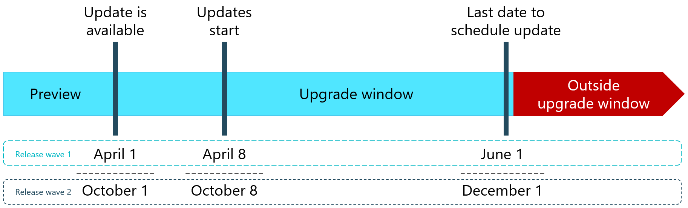
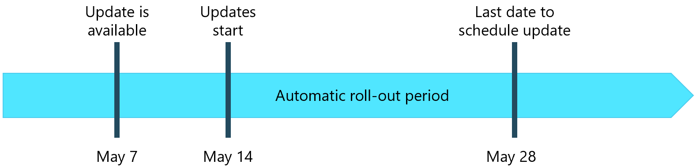
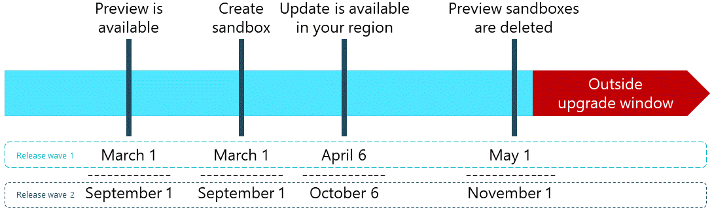

# Major Updates and Minor Updates for Business Central Online

This article provides an overview of what you need to know about how a major or minor update for [!INCLUDE[prod short](../developer/includes/prod_short.md)] rolls out, and how the underlying service updates. It includes key dates, actions you need take, and answers some common questions.  

[!INCLUDE [service-updates](../includes/service-updates.md)]

Microsoft is committed to delivering predictable updates to the service. Updates are continuous, touchless updates that provide new features and functionality. They eliminate the need to do expensive upgrades every few years. Administrators can set a maintenance window for each environment that determines when Microsoft is allowed to update that environment. For more information, see [Managing Updates in the Business Central Admin Center](tenant-admin-center-update-management.md). Microsoft then schedules updates of the business functionality to be applied during these maintenance windows.  

You are in control and manage how your organization receives these updates. Microsoft applies updates to each environment based on your configuration. The only exception is how Microsoft maintains the underlying platform with invisible updates during low traffic hours, for example. For more information, see the [Service updates](#service-updates) section.  

Each new update is designed and developed by the Dynamics 365 team. Any new update is first validated by the feature team, then validated in combination with the full product. During this time, extensive testing is done on various test topologies. A compatibility checker also runs tests to ensure backward compatibility.  

## Timelines for major updates

The following figure illustrates the key milestones and dates for rolling out a major update. The dates are loosely based on [2021 release wave 1](/dynamics365-release-plan/2021wave1/smb/dynamics365-business-central/) and [2021 release wave 2](/dynamics365-release-plan/2021wave2/smb/dynamics365-business-central/). The same timeline applies to all other major updates, though dates will differ.

> [!TIP]
> Dates differ across countries and regions. Make sure that you have set up [notifications](tenant-admin-center-notifications.md) in the [!INCLUDE [prodadmincenter](../developer/includes/prodadmincenter.md)] so that you're notified when the next major update is available.  

The following table describes the milestones with example dates for the two release waves in any given calendar year.

|Milestone|Example date wave 1| Example date wave 2|Description|
|---------|-------------------|--------------------|-----------|
|Update is available|April 1 |October 1|The date when the new major version of Business Central becomes generally available.|
|Update starts rolling out|April 8 |October 8|The default date when Microsoft starts upgrading your environments. Once the update is scheduled, you can change that date, within the allowed date range, to a date that suits you better.|
|Last scheduled update date|June 1 |December 1|The last date you can choose to extend your upgrade date to. <!--Starting April 1, 2022, the update window is again 30 days after update is available.-->|

> [!IMPORTANT]
> Starting October 1, 2022, we expect to return to an update window that again is *30 days after update is available*. This window has been temporarily extended during the CoViD-19 pandemic. Until then, the upgrade window remains 60 days during 2022 release wave 1.  
>
> We recommend that you keep any apps and per-tenant extensions ready for upgrade at any given time, and that you actively test compatibility. For more information, see [Maintain AppSource Apps and Per-Tenant Extensions](../developer/app-maintain.md).

## Timelines for minor updates

The monthly minor updates contain both application and platform changes that are critical improvements to the service, including regulatory updates.  

A minor update will roll out across Azure regions over several days and weeks. When the update is available for a specific environment, admins can apply it manually from the [!INCLUDE [prodadmincenter](../developer/includes/prodadmincenter.md)]. If the update has not been applied to an environment by the specified last update date, Microsoft will auto-apply the update. Microsoft takes into account the update window for the environment.  

### Example release schedule

The following figure illustrates the key milestones and dates for rolling out a minor update in any month.

The following table describes the milestones with example dates for a minor update in any given calendar year.

| Milestone | Example date | Description |
|--|--|--|
| Update is available | May 07 | The date when the new minor version of Business Central is first available and admins can schedule the update. |
| Update rolls out automatically | May 14 | The default date when Microsoft starts upgrading your environments, 7 days after the first availability date. Once the update is scheduled, you can change that date, within the allowed date range, to a date that suits you better. |
| Last scheduled update date | May 28 | The last date you can choose to extend your upgrade date to, 21 days after the update is available. |

> [!TIP]
> The minor updates tend to become available on the first Friday of any given month, except the months when a major update becomes available. Microsoft aims to update the last environments 2-3 weeks later.

## Update availability

The major updates are typically made available twice a year, in April and in October. Minor updates roll out every month. Get an overview of the release plans at [Dynamics 365 and Microsoft Power Platform release plans](/dynamics365/release-plans/). For [!INCLUDE [prod_short](../developer/includes/prod_short.md)] release plans, select a release wave under **Dynamics 365**, then look under **SMB** in the table of contents.

On the release day for any update, all new sign-ups and all newly created environments (sandbox and production), are directed to the new version. For existing environments that run on the previous version, updates are made available gradually across the supported regions over the coming days and weeks as indicated earlier in this article. It's not possible to speed up this process for your environment through Microsoft Support.  

## Schedule updates

When the update becomes available for your environment, a notification email is sent to all [notification recipients](tenant-admin-center-notifications.md) that you've registered in [!INCLUDE [prodadmincenter](../developer/includes/prodadmincenter.md)]. A notification about the update availability is also shown in the [!INCLUDE[prodadmincenter](../developer/includes/prodadmincenter.md)] itself.  

Starting this day, you can use the [!INCLUDE[prodadmincenter](../developer/includes/prodadmincenter.md)] to [schedule the date](tenant-admin-center-update-management.md#schedule) when you prefer the update to happen.  

[!INCLUDE [admin-set-update-date](../includes/admin-set-update-date.md)]

When the scheduled update date arrives, the update runs automatically within the update window that you've specified for this environment. All users will be disconnected from this environment, and all attempts to sign in during the update will be blocked with the message `Service is under maintenance`.  

> [!IMPORTANT]
> We strongly encourage that you set an update window for all production environments so that updates don't start during business hours.

For more information, see [Set the update window for each environment](tenant-admin-center-update-management.md#set-the-update-window-for-each-environment).  

> [!NOTE]
> When you select a current date for your update, but the update window defined for this environment has already passed, the update will start within that time window, but on the day after the one that you defined for your environment.
>
> For example, if you're changing the **Scheduled update date** to the current date at 6 PM, and your update window is set to 1 AM - 7 AM, the update will not start immediately, but after 1 AM on the next day.  

### Delayed scheduling of updates

In some cases, even after the update is available in your area, you are still not be able to set the update date (schedule environment update). This condition can happen for one of the following reasons:  

- Your environment hasn't yet updated to the latest minor update of the previous version of [!INCLUDE [prod_short](../developer/includes/prod_short.md)]. All environments must be updated to the last available minor update of the previous version of [!INCLUDE [prod_short](../developer/includes/prod_short.md)] before they can be scheduled for the next major version. You can check the version information in the **Troubleshooting** section of the **Help and Support** page in [!INCLUDE [prod_short](../developer/includes/prod_short.md)] and in the **Version Management** section in [!INCLUDE [prodadmincenter](../developer/includes/prodadmincenter.md)]. For more information, see [Version numbers in Business Central](version-numbers.md).  

    Microsoft actively works on updating all environments to the latest minor update as soon as possible. In most cases, your environment will be scheduled for the major update soon. You'll get a chance to change the date to the one that fits you better. In the unlikely situation that your environment is updated to the last minor update around or even after the last selectable update date, you'll still get at least seven days to schedule the update.  

- You've just created a new sandbox environment as a copy of your production environment. In this case, the sandbox environment is created on the same version as the production environment it was copied from. If your newly created sandbox environment is running on the last minor update of the previous version, Microsoft will schedule it for update automatically within one hour.  

    You'll receive email notification and will see the notification in [!INCLUDE [prodadmincenter](../developer/includes/prodadmincenter.md)] when it happens. The scheduled update date for this environment will be set to seven days from the current date. This gives you enough time to change the date to one that fits you better, including the current date.  

- Your per-tenant extensions aren't compatible with the next major update.  

    [!INCLUDE [admin-update-pte](../includes/admin-update-pte.md)]

- The AppSource apps that are installed in your environment aren't yet available for the next major version of [!INCLUDE [prod_short](../developer/includes/prod_short.md)].  

    While most AppSource apps are kept up to date by the app providers, a particular app might need more time to prepare for the next major update and isn't yet available for it. In this situation, contact the app owner to understand their availability plans.  

> [!TIP]
> Make sure each environment has the right contacts set up t get email notification. For more information, see [Managing Tenant-Specific Notifications](tenant-admin-center-notifications.md).

## Failed updates and rescheduling

An environment may fail to update for various reasons, such as the following:

- Per-tenant extension compatibility issues  
- AppSource app compatibility issues  
- Internal update issues  

Any environment that fails to update will be automatically restored to the original application version so that users can connect to it again. The environment is then automatically rescheduled for a new update attempt in seven days. If you consider the issue resolved and want to try the update again, change the update date to an earlier date or the current date.  

If Microsoft can't do the update on the selected date, you'll be notified by email that the environment update is rescheduled for seven days later. You can change that date in the [!INCLUDE [prodadmincenter](../developer/includes/prodadmincenter.md)] to any other allowed date, including the current date.

## Postponed updates

In critical circumstances, Microsoft can decide to postpone the rollout of the updates, such as if a critical issue is discovered in the upcoming major version. While Microsoft is working on addressing the issue, the updates will be postponed. You'll receive email notification, and you'll see the notification displayed in the [!INCLUDE [prodadmincenter](../developer/includes/prodadmincenter.md)]. The **Version Management** section for each environment will show the update rollout state as *Postponed*.  

If we do not know the nature of the issue and the solution in advance, we can't predict when the updates will resume again. As a result, neither the email nor the notification in [!INCLUDE [prodadmincenter](../developer/includes/prodadmincenter.md)] will contain the information about the expected resume date. In these extreme cases, Microsoft actively works on resuming updates as a matter of highest priority once the issue is addressed. You'll receive another email notification when updates have resumed. The last available date will be prolonged by the number of days that the update was postponed.  

If it happens that you schedule the update of an environment to a date when the updates are postponed, the environment will not be updated. Microsoft will not send separate notification. You can reschedule the update to a later date, or you can wait until you have received the email notification that the updates have resumed. All environments that missed their scheduled update date will be rescheduled automatically to run the update within seven days from the date the updates were resumed. You can change that date to any other allowed date, including the current date.  

If you didn't explicitly set a date for your environment update in the [!INCLUDE [prodadmincenter](../developer/includes/prodadmincenter.md)], this environment will be picked up for updating automatically, shortly after the updates have been resumed. The update will still be executed within the specified update time window.  

## Prepare, test, and learn before a major update

You can prepare yourself, users, and any customizations by trying out the new major version before your production environment is updated. The following sections provide recommendations for how to prepare for an update.  

> [!IMPORTANT]
> We strongly recommend that you test any critical business scenarios before your production environments are updated to the new major or minor version.

### Prepare for major updates by enabling select features earlier

Some new features can be switched on ahead of time on sandbox and production environments, giving you time to test and prepare for change. Most times, you can switch on features several weeks before preview environments for the major update are available.

When Microsoft releases features or feature design improvements as part of minor updates, some of these features are optional until the following major update. Administrators can turn these optional features on or off from the **Feature Management** page.

For more information, see [Feature Management](feature-management.md).  

### Prepare for major updates with preview environments

[!INCLUDE [admin-previews](../developer/includes/admin-previews.md)]

For more information, see [Prepare for major updates with preview environments](preview-environments.md).  

### Prepare for major updates just before the production environment is updated

As soon as you're notified that the new major update is available, you can test the new version. Just create a sandbox environment that you then schedule to be updated. Start by copying your production environment into a sandbox on the same version as your production environment. All newly created environments are automatically included in the update process within one hour. You'll get notified that the update is available, and you'll be able to schedule the newly created sandbox for update within one hour after it was created. By default, the newly created environments are scheduled to run the update within seven days from the date they were created, but you can change that date to any other allowed date, including the current date.  

If you change the update date to the current date, the update will start within the closest available update time window you specified for the environment. If you want to start the update of your sandbox environment immediately, you can set the update time window for this sandbox environment to be 24 hours.  

Microsoft monitors each update of an environment. If we detect any errors during the update, you'll receive email notification that describes the detected issues.  

Any environments that fail to update due to per-tenant extension compatibility issues or any other issues are automatically restored to the original application version. Within one hour, they are automatically rescheduled for another update attempt. The scheduled update date is automatically set to seven days in the future to give you time to resolve the issues. If you address the compatibility issues sooner, you can change the date to an earlier date, including the current date. This pattern repeats until the environment is updated successfully.  

### Overview of the timeline for preparing for the next major update

The following figure illustrates the suggested steps for getting a preview of a major update with example dates for the two release waves in any given calendar year.  

The following table provides more information for the suggested steps with example dates for the two release waves in any given calendar year.

|Milestone|Example date wave 1|Example date wave 2|Description|
|---------|-------------------|-------------------|-----------|
|Previews are available|March 1 |September 1|You create a new sandbox environment based on the new preview for test purposes. For more information, see [Prepare for major updates with preview environments](preview-environments.md).|
|A few days before you know that the update is announced|March 31 |September 30|You create a new sandbox environment based on your existing production environment (copy your production environment into a sandbox) and wait for it to be updated to the new version.|
|Update available in your region|April 6 |October 5|The major update is made available. You're notified about it via e-mail. Go to the [!INCLUDE [prodadmincenter](../developer/includes/prodadmincenter.md)] and set the update date for your sandbox environment to the current date. The sandbox will be updated within the closest available update time window that you set for it. Now, you can test your existing extensions and your production data against the new version.  We recommend that you set the update date for your production environment a few days or weeks in the future, to help make sure that it does not get updated automatically before you had a chance to test the new version and your extensions in your sandbox environment.|
|Preview sandboxes are deleted|May 1 |November 1|30 days after the new major update is announced, the preview sandboxes are deleted. There will be no option to keep these sandboxes or export data from them.|

## Service updates

The service components apply to multiple environments, such as all tenants in a region. So Microsoft schedules those updates to a time when traffic is lower in each region, typically during the evening or night. Typically, these service updates are transparent to any users, as the service is designed to manage traffic in a way that any users still working in [!INCLUDE [prod_short](../includes/prod_short.md)] are not affected by these service updates.  

These updates do not add or remove functionality, and they are transparent to business users.

## See also

[Managing Major and Minor Updates of Business Central Online](tenant-admin-center-update-management.md)  
[Working with Administration Tools](administration.md)  
[The Business Central Administration Center](tenant-admin-center.md)  
[Managing Environments](tenant-admin-center-environments.md)  
[Managing Tenant Notifications](tenant-admin-center-notifications.md)  
[Introduction to automation APIs](itpro-introduction-to-automation-apis.md)
