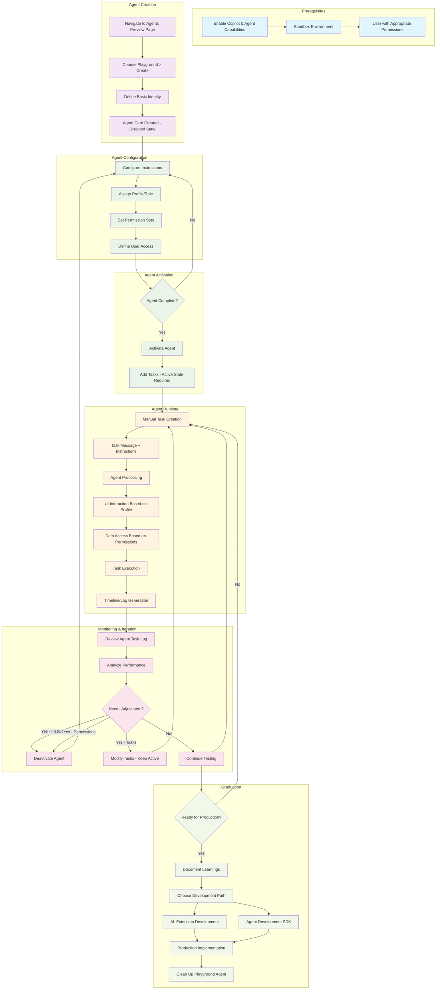
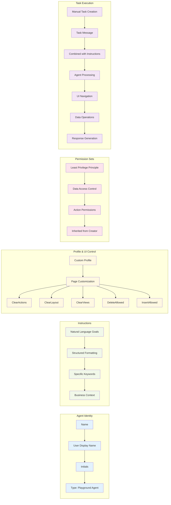
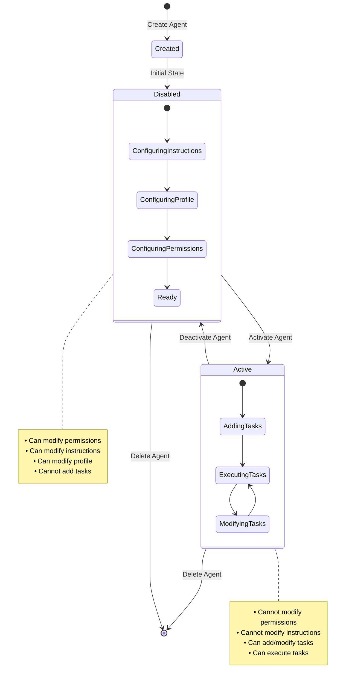

# AI Playground Agent Architecture and Flow Diagram

This diagram illustrates how the AI Playground Agent works in Business Central, from creation through execution.

## Agent Lifecycle and Architecture



## Key Components Detail



## State Transitions



## Integration Points

```mermaid
graph TB
    subgraph "Business Central Environment"
        BC[Business Central Sandbox]
    end
    
    subgraph "AI Playground Agent"
        PA[Playground Agent]
    end
    
    subgraph "User Interface"
        UI[Pages & Forms]
        NAV[Navigation]
        SEARCH[Search - Not Available]
    end
    
    subgraph "Data Layer"
        TABLES[Tables]
        PERMS[Permission Sets]
        PROF[Profiles]
    end
    
    subgraph "AI Services"
        LLM[Large Language Model]
        RUNTIME[Agent Runtime]
    end
    
    subgraph "Monitoring"
        LOG[Agent Task Log]
        TIMELINE[Timeline View]
    end
    
    BC --> PA
    PA --> UI
    PA --> DATA: "Via Permissions"
    PA --> LLM
    LLM --> RUNTIME
    RUNTIME --> PA
    PA --> LOG
    LOG --> TIMELINE
    
    UI --> NAV
    UI -.-> SEARCH
    DATA --> TABLES
    DATA --> PERMS
    DATA --> PROF

    classDef bc fill:#1976d2,color:#fff
    classDef agent fill:#388e3c,color:#fff
    classDef ui fill:#f57c00,color:#fff
    classDef data fill:#7b1fa2,color:#fff
    classDef ai fill:#c2185b,color:#fff
    classDef monitor fill:#5d4037,color:#fff

    class BC bc
    class PA agent
    class UI,NAV,SEARCH ui
    class TABLES,PERMS,PROF,DATA data
    class LLM,RUNTIME ai
    class LOG,TIMELINE monitor
```

## Usage Notes

- **Prerequisites**: Copilot capabilities must be enabled in Business Central sandbox
- **Security**: Agent inherits maximum permissions from creating user
- **Limitations**: Sandbox only, no page search, manual task triggering
- **Monitoring**: All interactions logged in Agent Task Log for debugging
- **Graduation**: Prototype learnings can be implemented in AL extensions or Agent SDK