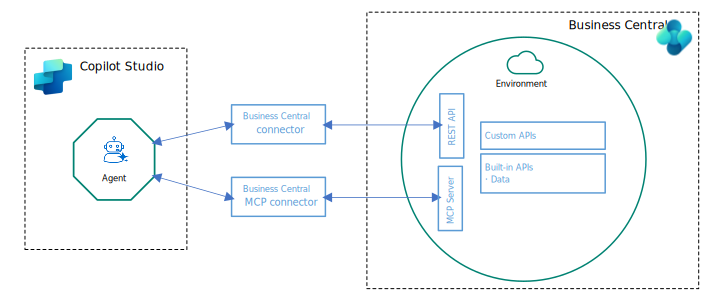

# Create agents for Business Central with Copilot Studio

Copilot Studio is a graphical, low-code tool for building agents and agent flows. You can use it to create conversational agents that understand and act on your business processes and data model in Business Central. Agents present Business Central data (customers, orders, invoices, and inventory) and business logic to users via natural language. Agents can automate tasks such as creating sales orders, checking credit, or posting payments, and trigger approvals or flows.

## Overview

Business Central provides two model‑aware tools that agents can use to interact directly with Business Central environments: Business Central MCP (Model Context Protocol) server and Business Central Connector for Power Platform. These tools let agents read and write records, call custom APIs exposed by AL extensions, and apply server‑side business logic such as pricing, discounts, and validation rules.

After you create an agent, you can publish agents into multiple platforms or channels, like live websites and Microsoft 365 Copilot, or messaging platforms like Teams and Facebook.

Learn more about Copilot Studio and agents in [Copilot Studio](/microsoft-copilot-studio/fundamentals-what-is-copilot-studio).

### Connection options

You can build agents that connect to Business Central Connector for Power Platform and Business Central MCP (Model Context Protocol) server:

**Business Central Connector:** Part of the Power Platform framework. It provides a simplified, low-code interface for accessing Business Central entities such as customers, vendors, items, and invoices. This connector is ideal for scenarios where:

- The agent needs to perform simple CRUD (create, read, update, delete) operations using predefined actions while acting as the user (respecting their Business Central permissions).
- You want low-code integration through Power Automate.
- Your organization’s governance model requires per-user control for auditing and compliance.

The connector abstracts away many of the underlying API details, making it easier to use but less flexible for advanced scenarios.

**Business Central MCP Server:** A server implementation that uses the Model Context Protocol (MCP) to provide direct access to Business Central’s REST APIs, including custom API pages and system endpoints. This approach is suited for:

- Advanced integrations requiring fine-grained control over API calls, custom extensions, or nonstandard entities.
- The agent must coordinate multiple AI-driven steps&mdash;such as retrieving data, analyzing it, and performing actions&mdash;into one seamless, automated workflow (AI orchestration).
- Scenarios where performance, scalability, or security policies require direct API management.

Agents using the MCP server typically invoke HTTP operations (GET, POST, PATCH, DELETE) against Business Central endpoints, allowing for full customization and extensibility.

**Choosing the connector and MCP Server:** Your choice depends on the agent’s requirements, the level of customization needed, and your familiarity with Business Central APIs. Use this table as a guide:

|Aspect|Business Central Connector|MCP Server|
|-|-|-|
|Setup complexity|Low|Medium|
|API coverage|Limited to standard entities|Full (including custom APIs)|
|Customization|Limited|Extensive|
|Integration with Power Platform|Native|Requires custom flows|
|Performance tuning|Minimal control|Full control|
|Authentication|Managed via Power Platform|Requires OAuth setup|

In short, the connector offers ease of use and rapid development, while the MCP server provides flexibility and control for complex scenarios.

## Prerequisites

- You have a Copilot Studio user license with available Copilot Credits capacity for use. Learn more in [Copilot Studio licensing](/microsoft-copilot-studio/billing-licensing).
- To connect the agent to the Business Central MCP Server, it must be enabled and configured in the Business Central environment. Learn more in [Configure Business Central MCP Server](configure-mcp-server.md).

## Create agents that use Business Central connector

You can use the Business Central connector actions, like `Create Record` or `List Companies`, in your agent by adding them as *tools*. Tools are the building blocks that enable your agent to interact with external systems, in this case, Business Central. For example, if you want to create an agent that allows you list, create, and update items in Business Central, add the `Find Records`, `Create Record`, and `Update Record`actions as tools to the agent.

Learn more about the connector and its actions in [Dynamics 365 Business Central Connector](/connectors/dynamicssmbsaas/).

### Exercise: Build an agent to find and create customers

Follow the steps in this exercise to create an agent that uses the Dynamics 365 Business Central connector. The agent lets users get information about customers in Business Central and create new ones by providing instructions in plain language. The agent uses one read action `Find records (V3)` and one write action `Create record (V3)` of the Business Central connector. You can extend it by adding more connector actions (like `Update record (V3)`, `Delete record (V3)`) and refining the prompt-handling to cover more business scenarios.  

1. Create new or open existing agent.

   1. Sign in to [Copilot Studio](https://copilotstudio.microsoft.com/).
   1. In the left-side navigation pane, select **Agents**.
   1. Select the agent you want to modify or select **New agent** to create a new agent.

   Learn more about creating agents in [Create an agent in Copilot Studio](/microsoft-copilot-studio/authoring-first-bot?tabs=web#create-an-agent).

1. Add the Business Central connector actions as tools.

   1. On the **Tools** tab of the agent page, select **+ Add a tool**.
   1. Under the **Search for tool** box, choose **Connector**, then search for "Dynamics 365 Business Central".
   1. Select the connector action `Find records (V3)`. The **Add tool** page opens.
   1. If the **Connection** box displays the `Not connected`, select the box, select **Create new connection** and sign in to Business Central with a valid account.
   1. Select **Add to agent**. You return to the agent **Overview** tab.
   1. Repeat to add the connector action `Create record (V3)`. This agent uses this action to create a Customer record.

   Learn more in [Use connectors in Copilot Studio](/microsoft-copilot-studio/advanced-connector).

1. Configure the tools.

   1. On the **Tools** tab of the agent page, select the `Find records (V3)` to open the tool for editing.
   1. Go to **Inputs** and configure the required input values: 

      |Input name|Fill using|Value|
      |-|-|-|
      |Envronment|Custom value|Set to Business Central environment, for example, `PRODUCTION`|
      |Company|Custom value|Set to Business Central environment, for example, `CRONUS USA, Inc.`|
      |API category|Custom value|`V2.0`|
      |Table name|Custom value|`customers`|

   1. Select **Save**.
   1. Repeat for the `Create record (V3)` tool.

   Learn more in [Make changes to your tools configuration](/microsoft-copilot-studio/advanced-plugin-actions#view-and-make-changes-to-your-tool-configuration).

1. Test the agent.

    1. Select **Test** in the upper-right corner of any page to open the **Test your agent** pane.
    1. In the field at the bottom, enter text that explains what you want the agent to do, for example:

       - `List customers`
       - `Show my top customer`
       - `Create a customer named jesse homer with email jesse.homer@contoso.com`
    1. Wait for the response.
    1. Make necessary changes and save.
  
    Learn more in [Test you agent](/microsoft-copilot-studio/authoring-test-bot).

1. Publish and deploy the agent.

   Learn more in [Publish agents](/microsoft-copilot-studio/publication-fundamentals-publish-channels).

### Notes and tips

- **Permissions:** The connection uses the signed-in account’s Business Central permissions; ensure the account can read companies and create customers.
- **Validation:** Use server-side validation rules in Business Central (pricing/validation). The connector surfaces errors; handle these errors in agent responses.
- **Inputs:** Validate and sanitize user input before calling Create record (that is, ensure required fields are present).
- **Logging:** Use the agent’s execution logs to troubleshoot tool calls and to see request/response payloads.

## Create agents that use Business Central MCP

Follow these steps to create an agent that connects to the Business MCP server.

1. Create new or open existing agent.

   1. Sign in to [Copilot Studio](https://copilotstudio.microsoft.com/).
   1. In the left-side navigation pane, select **Agents**.
   1. Select the agent you want to modify or select **New agent** to create a new agent.

   Learn more about creating agents in [Create an agent in Copilot Studio](/microsoft-copilot-studio/authoring-first-bot?tabs=web#create-an-agent).

1. Connect the agent to the Business Central MCP server.

   1. On the **Tools** tab of the agent page, select **+ Add a tool**.
   1. Search for and select **Dynamics 365 Business Central MCP Server (Preview)**.
   1. Select the connector action `Find records (V3)`. The **Add tool** page opens.
   1. If the **Connection** box displays the `Not connected`, select the box, select **Create new connection** and sign in to Business Central with a valid account.
   1. Select **Add and configure** to return to the **Tools** tab. If you select **Add agent**, you configure it later by opening the **Tools** tab.
   1. In **Inputs** section of the **Tools** tab, configure the MCP server to connect Business Central by setting the following fields.

      |Field|Value|
      |-|-|
      |Environment|The Business Central environment the agent connects to. Select the down arrow and select the environment for the environments appear.|
      |Company|The company in Business Central that the agent connects to. Select the down arrow and select the environment for the environments appear.|
      |MCP Server Configuration|The MCP configuration defined in Business Central the agent uses. Select the down arrow and select one of the available configurations. Learn more about MCP Server configurations in [Configure Business Central MCP Server](configure-mcp-server.md)|

   1. The **Tools** section on the page displays the individual tools available to the agent. Use this section to specific which tools the agent is allowed to use.

      For each tool you want the agent to access, turn on the **Allow** switch for each tool you want the agent to access. Alternatively, turn on the **Allow All** to allow all listed tools.

      > [!NOTE]
      > If there are no tools listed, then the selected MCP configuration is configured to automatically detect and allow tools, so you don't need can't manually allow them. Learn more about tool detection in [Create MCP Server configurations](configure-mcp-server.md#create-mcp-server-configurations).

1. Select **Save**.
1. Test the agent.
   1. Select **Test** in the upper-right corner of any page to open the **Test your agent** pane.
   1. In the field at the bottom, enter text that explains what you want the agent to do.

   Learn more in [Test you agent](/microsoft-copilot-studio/authoring-test-bot).
1. Publish and deploy the agent.

   Learn more in [Publish agents](/microsoft-copilot-studio/publication-fundamentals-publish-channels).

## Related information

[Transparency note: Semantic Metadata Search in Business Central](transparency-note-semantic-metadata-search.md)  

<!-- ### What are agents and when to use them

AI agents to connect to your environments and perform a range of interactions and tasks. Agents enable customers and employees to conversationally engage with Business Central from various channels, like Microsoft 365 Copilot, Teams, and websites.

Use an agent when users need to:

- Look up records, like customers, items, inventory, or documents.
- Trigger operations on records (create records, post, check status).
- Ask natural-language questions instead of navigating pages.
- Access Business Central data securely from external channels.

Agents don't:

- Add new AL code or business logic.
- Replace extension development.
- Override permissions or policies.
- Modify the schema or internal engine behavior.-->