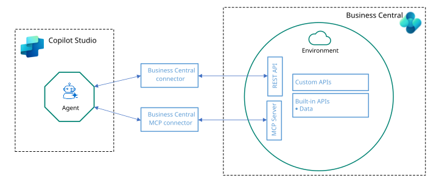

# Create agents in Copilot Studio that connect to Business Central

> **APPLIES TO:** Business Central online

This article explains how to build, configure, and publish agents in Copilot Studio that integrate with Business Central using either the Business Central connector or the Business Central MCP server.

## Overview

Copilot Studio is a graphical, low-code tool for building agents and agent flows. You can use it to create conversational agents that understand and act on your business processes and data model in Business Central. Agents present Business Central data (customers, orders, invoices, and inventory) and business logic to users via natural language. Agents can automate tasks such as creating sales orders, checking credit, or posting payments, and trigger approvals or flows.

Business Central provides two model-aware tools that agents can use to interact directly with Business Central environments: Business Central MCP (Model Context Protocol) server and Business Central Connector for Power Platform. These tools let agents read and write records, call custom APIs exposed by AL extensions, and apply server-side business logic such as pricing, discounts, and validation rules.

[](../developer/media/integrate-copilot-studio.svg#lightbox)

After you create an agent, you can publish agents into multiple platforms or channels, like live websites and Microsoft Copilot, or messaging platforms like Teams and Facebook.

Learn more about Copilot Studio and agents in [Copilot Studio](/microsoft-copilot-studio/fundamentals-what-is-copilot-studio).

### Connection options

Choose a connection option based on the tasks that the agent must perform:

| Option | Best for | How the agent accesses Business Central | Considerations |
| --- | --- | --- | --- |
| Business Central connector | Standard integration and low-code automation | You add predefined connector actions, such as finding, creating, or updating records, as individual tools. | The connector simplifies API access but offers less flexibility for advanced scenarios. |
| Business Central MCP server | AI-driven workflows that discover and coordinate multiple tools | The agent uses tools generated from configured API pages and API queries in Business Central.| MCP configurations control the available APIs and permitted operations. |
| Both | Agents that need MCP discovery and explicitly configured connector actions | The agent uses tools from both connection options. | You can use a connector action when an API tool needs a custom description or explicit configuration. |

The connector and MCP server act with the signed-in user's Business Central permissions. You can use either option independently or combine them in one agent.

## Prerequisites

- You have a Copilot Studio user license with available Copilot Credits capacity for use. Learn more in [Copilot Studio licensing](/microsoft-copilot-studio/billing-licensing).

## Create agents that use Business Central connector

### Prerequisites for the connector

- You have a Business Central account with permission to access the companies and data that the agent uses.
- You can create a Business Central connection in Copilot Studio.

You can use the Business Central connector actions, like `Create Record` or `List Companies`, in your agent by adding them as *tools*. Tools are the building blocks that enable your agent to interact with external systems, in this case, Business Central. For example, if you want to create an agent that lists, creates, and updates items in Business Central, add the `Find records`, `Create Record`, and `Update Record` actions as tools to the agent.

Learn more about the connector and its actions in [Dynamics 365 Business Central Connector](/connectors/dynamicssmbsaas/). 

### Exercise: Build an agent to find and create customers

Follow the steps in this exercise to create an agent that uses the Dynamics 365 Business Central connector. The agent lets users get information about customers in Business Central and create new ones by providing instructions in plain language. The agent uses one read action `Find records (V3)` and one write action `Create record (V3)` of the Business Central connector. You can extend it by adding more connector actions (like `Update record (V3)`, `Delete record (V3)`) and refining the prompt-handling to cover more business scenarios.  

1. Create new or open existing agent.

   1. Sign in to [Copilot Studio](https://copilotstudio.microsoft.com/).
   1. In the left-side navigation pane, select **Agents**.
   1. Select the agent you want to modify or select **New agent** to create a new agent.

   Learn more about creating agents in [Create an agent in Copilot Studio](/microsoft-copilot-studio/authoring-first-bot?tabs=web#create-an-agent).

1. Add the Business Central connector actions as tools.

   1. On the **Tools** tab of the agent page, select **+ Add a tool**.
   1. Under the **Search for tool** box, choose **Connector**, then search for "Dynamics 365 Business Central".
   1. Select the connector action `Find records (V3)`. The **Add tool** page opens.
   1. If the **Connection** box displays the `Not connected`, select the box, select **Create new connection** and sign in to Business Central with a valid account.
   1. Select **Add to agent**. You return to the agent **Overview** tab.
   1. Repeat to add the connector action `Create record (V3)`. This agent uses this action to create a Customer record.

   Learn more in [Use connectors in Copilot Studio](/microsoft-copilot-studio/advanced-connectors).

1. Configure the tools.

   1. On the **Tools** tab of the agent page, select the `Find records (V3)` to open the tool for editing.
   1. Go to **Inputs** and configure the required input values: 

      |Input name|Fill using|Value|
      |-|-|-|
      |Environment|Custom value|Set to Business Central environment, for example, `PRODUCTION`|
      |Company|Custom value|Set to Business Central environment, for example, `CRONUS USA, Inc.`|
      |API category|Custom value|`V2.0`|
      |Table name|Custom value|`customers`|

   1. Select **Save**.
   1. Repeat for the `Create record (V3)` tool.

   Learn more in [Make changes to your tools configuration](/microsoft-copilot-studio/advanced-plugin-actions#view-and-make-changes-to-your-tool-configuration).

1. Test the agent.

    1. Select **Test** in the upper-right corner of any page to open the **Test your agent** pane.
    1. In the field at the bottom, enter text that explains what you want the agent to do, for example:

       - `List customers`
       - `Show my top customer`
       - `Create a customer named jesse homer with email jesse.homer@contoso.com`
    1. Wait for the response.
    1. Make necessary changes and save.
  
    Learn more in [Test your agent](/microsoft-copilot-studio/authoring-test-bot).

1. Publish and deploy the agent.

   Learn more in [Publish agents](/microsoft-copilot-studio/publication-fundamentals-publish-channels).

### Tips and best practices when using connector

- **Permissions:** The connection uses the signed-in account’s Business Central permissions; ensure the account can read companies and create customers.
- **Validation:** Use server-side validation rules in Business Central (pricing/validation). The connector surfaces errors; handle these errors in agent responses.
- **Inputs:** Validate and sanitize user input before calling Create record (that is, ensure required fields are present).
- **Logging:** Use the agent's execution logs to troubleshoot tool calls and to see request/response payloads.

## Create agents that connect to the Business Central MCP server

The Business Central MCP server enables agents in Copilot Studio to access Business Central data and capabilities through MCP tools.

### Prerequisites for the MCP server

Before you connect an agent to the Business Central MCP server, make sure that:

- The Business Central MCP server is enabled in the Business Central environment.
- You have a Business Central account with permission to use the API objects and data that the agent accesses.
- If the agent only needs to read data from eligible API pages and API queries, you don't need to create an MCP server configuration. The built-in default configuration provides this access. To let the agent create, update, or delete data or invoke API actions, configure the required operations on the MCP server. Learn more in [Configure MCP server](configure-mcp-server.md).

Follow these steps to create an agent in Copilot Studio that connects to the Business Central MCP server.

### Create the agent

1. Create a new agent or edit an existing agent 

   Sign in to Copilot Studio and create an agent in Copilot Studio or open an existing agent. Learn more in [Create and delete agents](/microsoft-copilot-studio/authoring-first-bot).

1. Connect the agent to the Business Central MCP server

   Add **Dynamics 365 Business Central MCP Server** as a tool for the agent. If a connection isn't already established, create a connection and sign in to Business Central.

   Learn more in [Add tools to custom agents](/microsoft-copilot-studio/add-tools-custom-agent).

   Configure the following inputs for the Business Central MCP server:

   | Field | Description |
   |-------|-------------|
   | **Environment** | The Business Central environment that the agent connects to. |
   | **Company** | The company in Business Central that the agent connects to. |
   | **MCP Server Configuration** | Optional. The MCP server configuration that determines the API objects and operations available to the agent. Leave this field blank to use the current default configuration. |

   > [!NOTE]
   > Copilot Studio determines the tenant from the signed-in connection. **Environment** and **Company** are required. **MCP Server Configuration** is optional.

   The tools available to the agent depend on the MCP server configuration:

   - If you leave **MCP Server Configuration** blank, the agent uses the current default configuration. The built-in default configuration uses dynamic tool mode and provides read-only access to eligible API pages and API queries.
   - If you select a configuration that uses dynamic tool mode, the agent uses the `bc_actions_search`, `bc_actions_describe`, and `bc_actions_invoke` system tools to discover and invoke available API operations.
   - If you select a configuration that doesn't use dynamic tool mode, tools for the API objects included in the configuration are exposed individually.
   - If **Data Query Tools (Preview)** is enabled for the configuration, the agent also has access to `bc_data_find_tables`, `bc_data_get_table_schema`, `bc_data_get_table_relations`, and `bc_data_query`.

      Learn more about Business Central MCP server configurations, permissions, dynamic tool mode, and how Business Central API objects are exposed as MCP tools in [Configure MCP server](configure-mcp-server.md).

1. Add instructions.

   Add instructions that describe how the agent should use the available Business Central tools. For example:

   ```text
   You are a Business Central agent. The user will ask a question, ask you to perform a task, or ask you to retrieve data.

   Start with a brief plan, and then use the available tools to retrieve the relevant information. Explain the actions you take and summarize the result for the user.

   Prefer using semantic search when searching for available actions.
   ```

   Learn more in [Write agent instructions](/microsoft-copilot-studio/authoring-instructions).

1. Preview and test the agent

   Preview the agent to verify that it can access the expected Business Central data and operations.

   Learn more in [Test an agent](/microsoft-copilot-studio/agents-experience/authoring-test-bot).

1. Publish the agent

   When the agent works as expected, publish it and make it available through the appropriate channels.

   Learn more in [Publish an agent](/microsoft-copilot-studio/agents-experience/publication-publish-agent). 

### Tips and best practices for using the MCP server

To improve results when using the Business Central MCP server with Copilot Studio:

- Use a model that supports tool use and complex business tasks. Learn more in [Agent models in Business Central](ai-agent-models.md).
- Give the agent clear instructions about how to use the Business Central tools.
- Ensure the signed-in user has the Business Central permissions required for the data and operations that the agent uses.
- After you change the MCP server configuration, refresh the available tools in Copilot Studio to reflect the current configuration.
- To get a list of available API pages in a Business Central environment, open the Page Metadata virtual table (ID 2000000138) in the Business Central web client by using the following URL, customized for the environment the agent connects to:

  ```http
  https://businesscentral.dynamics.com/<tenant ID>/<environment name>?table=2000000138
  ```

  Filter the list by **Page Type** = **API** and **APIVersion** = **v2.0**.

### Troubleshoot tool discovery

If the expected Business Central tools aren't available to the agent:

- Verify that the signed-in user can access the selected environment and company.
- Verify that the user has permission to access the API objects exposed by the MCP server configuration.
- Verify that you selected the expected MCP server configuration or set the appropriate configuration as the default.
- Refresh the available tools after changing the MCP server configuration.
- Copilot Studio handles Base64 encoding for non-ASCII **Company** and **ConfigurationName** values. If you use a client that doesn't, ensure you encode non-ASCII headers by using MCP Base64 encoding syntax (`=?base64?<base64>?=`).

## Related information

[Model Context Protocol (MCP) in Business Central](mcp-overview.md)  
[Configure Business Central MCP Server](configure-mcp-server.md)  
[Dynamics 365 Business Central connector](/connectors/dynamicssmbsaas/)  
[Copilot Studio overview](/microsoft-copilot-studio/fundamentals-what-is-copilot-studio)  
[Transparency note: Semantic Metadata Search in Business Central](transparency-note-semantic-metadata-search.md)  
