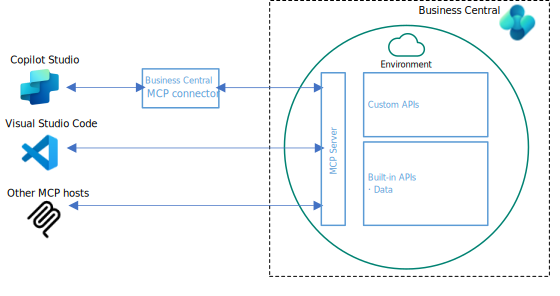
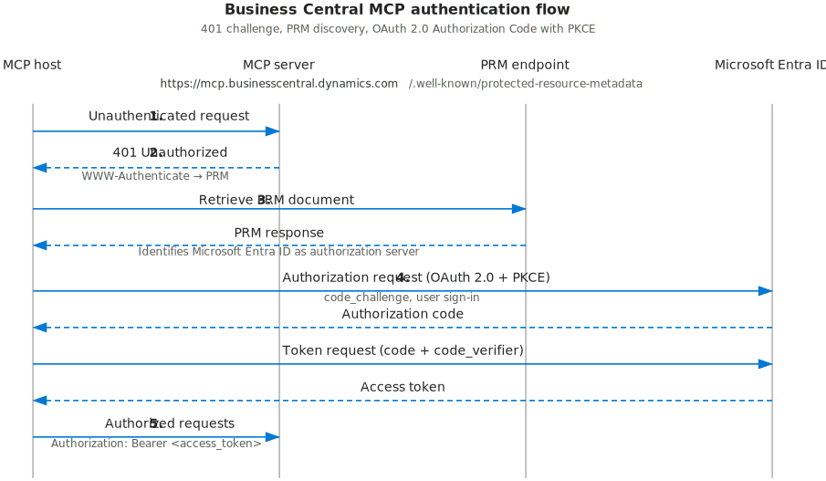

# Model Context Protocol (MCP) in Business Central overview

> **APPLIES TO:** Business Central online

The [Model Context Protocol (MCP)](https://modelcontextprotocol.io) is an open standard that defines how AI applications communicate with data sources and tools. It provides a consistent and secure way for AI clients&mdash;such as Copilot Studio, GitHub Copilot, Claude, ChatGPT, and custom agents&mdash;to access and interact with external systems like Business Central.

## Business Central MCP Server

An **MCP server** is a service that implements the Model Context Protocol, exposing an application's data and functionality to AI clients. When an AI client connects to an MCP server, it can read data, perform actions, and integrate that application's capabilities directly into conversational workflows—all through a standardized interface.

The Business Central MCP server enables AI clients to interact with Business Central environments from various channels such as Visual Studio Code, Copilot Studio, and other MCP-compliant clients, allowing customers and employees to conversationally work with Business Central data and business logic.

## What the MCP Server can do

By default, the Business Central MCP server provides read-only access to all exposed Business Central API pages. With no extra configuration, MCP clients can read data from your Business Central environment. To enable write operations, administrators configure API page objects with specific permissions for create, modify, delete, and bound actions.

Once configured, these capabilities are exposed to agents as tools, which they can use to:

- View and manage records – List, create, update, and delete entities such as customers, items, and sales orders
- Execute business processes – Post documents, change statuses, and run business logic
- Answer natural language queries – Provide conversational access to Business Central data

The capabilities available to agents depend on how the MCP server is configured and the permissions assigned to each API. Learn more in [Configure Business Central MCP Server](configure-mcp-server.md).

## Supported MCP Clients

An MCP client is an AI application that can connect to the Business Central MCP server to discover available tools and run them. Business Central supports:

- Visual Studio Code with GitHub Copilot
- Copilot Studio
- Other clients that comply with [Model Context Protocol specification](https://modelcontextprotocol.io/specification/2025-11-25), for example Claude, ChatGPT, and MCP Inspector.

## How MCP clients connect to MCP server

All MCP clients connect to the same Business Central MCP server endpoint:

`https://mcp.businesscentral.dynamics.com`

You specify which Business Central environment to connect to using the following HTTP headers:

[!INCLUDE [mcp-server-headers](../developer/includes/mcp-server-headers.md)]

MCP clients authenticate with Business Central through a registered application in Microsoft Entra ID. Microsoft MCP clients (Visual Studio Code and Copilot Studio) use a preregistered application, so no extra setup is required. Non-Microsoft clients require you to register your own application.

### How authentication works

The Business Central MCP server acts as a bridge between MCP clients and your Business Central data. Business Central MCP authentication follows the standard [MCP authentication specification](https://modelcontextprotocol.io/specification/2025-11-25/basic/authorization) using OAuth 2.0 Authorization Code flow with [Proof Key for Code Exchange (PKCE)](https://datatracker.ietf.org/doc/html/rfc7636) and Microsoft Entra ID as the authorization server. The MCP server exposes Protected Resource Metadata (PRM) to help clients discover the authorization endpoints and required parameters for authentication. All operations are performed with your user identity and permissions, ensuring audit trails show who performed each action.

## Next steps

- [Configure Business Central MCP Server](configure-mcp-server.md)
- [Connect with Copilot Studio](create-agent-in-copilot-studio.md)
- [Connect with Visual Studio Code](use-mcp-server-in-vscode.md)
- [Connect with non-Microsoft MCP clients](use-mcp-server-non-microsoft.md)

## Related information

- [Model Context Protocol specification](https://modelcontextprotocol.io)
- [Business Central APIs](/dynamics365/business-central/dev-itpro/api-reference/v2.0/)
