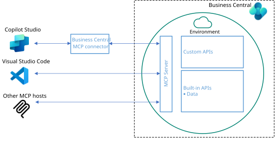
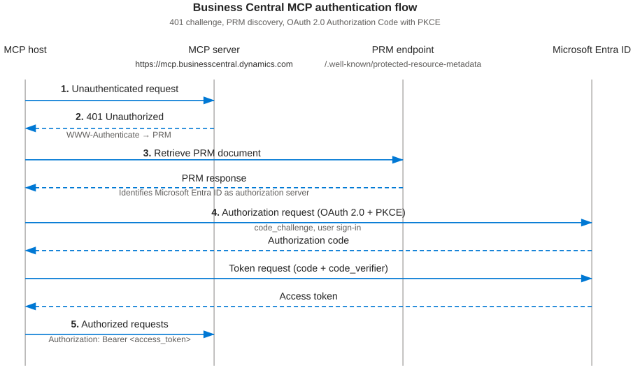

# Model Context Protocol (MCP) in Business Central overview

> **APPLIES TO:** Business Central online

The [Model Context Protocol (MCP)](https://modelcontextprotocol.io) is an open standard that defines how AI applications communicate with data sources and tools. It provides a consistent and secure way for AI clients&mdash;such as Copilot Studio, GitHub Copilot, Claude, ChatGPT, and custom agents&mdash;to access and interact with external systems like Business Central.

## Business Central MCP server

An **MCP server** is a service that implements the Model Context Protocol, exposing an application's data and functionality to AI clients. When an AI client connects to an MCP server, it can read data, perform actions, and integrate that application's capabilities directly into conversational workflows—all through a standardized interface.

The Business Central MCP server enables AI clients to interact with Business Central environments from various channels such as Visual Studio Code, Copilot Studio, and other MCP-compliant clients, allowing customers and employees to conversationally work with Business Central data and business logic.

## What the MCP server can do

The built-in default configuration exposes dynamic discovery tools for read-only API access. Agents can discover eligible Business Central API pages and API queries that the signed-in user has permission to use. Administrators can designate another active configuration as the default or enable more capabilities by activating Server Features on their MCP configurations:

- **API Tools**: Admins choose which API pages and API queries that agents can access. Agents can then perform allowed read, create, modify, delete, and action operations on selected objects.
- **Dynamic Tool Mode**: Agents discover available tools dynamically, so you don't need to manually configure each tool. This feature is useful when you have many API objects.
- **Data Query Tools (Preview)**: Enables agents to run queries directly against your Business Central database.

Once configured, these capabilities are exposed to agents as tools, which they can use to:

- **View and manage records**: List, create, update, and delete entities such as customers, items, and sales orders.
- **Execute business processes**: Post documents, change statuses, and run business logic through API page actions or API codeunit actions.
- **Query data**: Run read-only queries directly against your database for advanced analysis.
- **Answer natural language queries**: Provide conversational access to Business Central data.

The capabilities available to agents depend on which Server Features you enable and how you configure permissions on each API. Learn more in [Configure Business Central MCP Server](configure-mcp-server.md).

## Supported MCP hosts

An MCP host is an AI application that can connect to the Business Central MCP server to discover available tools and run them. Business Central supports:

- Visual Studio Code with GitHub Copilot
- Copilot Studio
- Other clients that comply with [Model Context Protocol specification](https://modelcontextprotocol.io/specification/2025-11-25), for example Claude, ChatGPT, and MCP Inspector.

## How MCP hosts connect to MCP server

All MCP hosts connect to the same Business Central MCP server endpoint:

`https://mcp.businesscentral.dynamics.com`

Use the following HTTP headers to select the Microsoft Entra tenant, Business Central environment, company, and MCP server configuration:

[!INCLUDE [mcp-server-headers](../developer/includes/mcp-server-headers.md)]

Whether you can omit `TenantId`, `EnvironmentName`, or `Company` depends on the MCP host. `ConfigurationName` is always optional:

| MCP host | `TenantId` | `EnvironmentName` | `Company` |
|-----------|------------|-------------------|-----------|
| Visual Studio Code with GitHub Copilot | Can be omitted | Can be omitted | Can be omitted |
| GitHub Copilot CLI | Can be omitted | Can be omitted | Can be omitted |
| Copilot Studio* | Required | Required | Required |
| Other MCP hosts | Depends on host support | Depends on host support | Depends on host support |

\* Copilot Studio will soon support headerless configuration.

When omitted, the server determines the tenant from the signed-in identity. When included, `EnvironmentName` and `Company` pin those values for the connection. When a supported host omits either header, tool calls require the corresponding parameter. The server also exposes `list_environments` or `list_companies`, as applicable, so the agent can discover values available to the signed-in user.

For implementation details, see [Configure Business Central MCP Server](configure-mcp-server.md). Microsoft MCP hosts (Visual Studio Code and Copilot Studio) use a preregistered application, so you don't need to set up anything extra. Non-Microsoft clients require you to register your own application.

### How authentication works

The Business Central MCP server acts as a bridge between MCP hosts and your Business Central data. Business Central MCP authentication follows the standard [MCP authentication specification](https://modelcontextprotocol.io/specification/2025-11-25/basic/authorization) using OAuth 2.0 Authorization Code flow with [Proof Key for Code Exchange (PKCE)](https://datatracker.ietf.org/doc/html/rfc7636) and Microsoft Entra ID as the authorization server. The MCP server exposes Protected Resource Metadata (PRM) to help clients discover the authorization endpoints and required parameters for authentication. All operations are performed with your user identity and permissions, ensuring audit trails show who performed each action.

## Next steps

- [Configure Business Central MCP Server](configure-mcp-server.md)
- [Connect with Copilot Studio](create-agent-in-copilot-studio.md)
- [Connect with Visual Studio Code](use-mcp-server-in-vscode.md)
- [Connect with non-Microsoft MCP hosts](use-mcp-server-non-microsoft.md)

## Related information

- [Model Context Protocol specification](https://modelcontextprotocol.io)
- [Business Central API Reference](/dynamics365/business-central/dev-itpro/api-reference/v2.0/)  
- [Troubleshooting MCP Server for AL](../developer/devenv-debug-mcp-server.md)  
