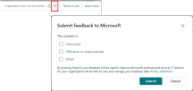
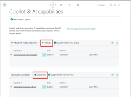

# Transparency note: Developer tools for Copilot in Business Central  

## What is a Transparency Note? 

An AI system includes not only the technology, but also the people who will use it, the people who will be affected by it, and the environment in which it is deployed. Creating a system that is fit for its intended purpose requires an understanding of how the technology works, what its capabilities and limitations are, and how to achieve the best performance. Microsoft's Transparency Notes are intended to help you understand how our AI technology works, the choices system owners can make that influence system performance and behavior, and the importance of thinking about the whole system, including the technology, the people, and the environment. You can use Transparency Notes when developing or deploying your own system, or share them with the people who will use or be affected by your system. 

Microsoft’s Transparency Notes are part of a broader effort at Microsoft to put our AI Principles into practice. To find out more, see the [Microsoft AI principles](https://aka.ms/RAI). 

## The basics of Developer Tools for Copilot in Business Central  

### Introduction 

Microsoft Dynamics 365 Business Central is a comprehensive business management solution for small and midsized organizations. Copilot in Business Central is the AI-powered assistant that helps boost creativity and reduce repetitive tasks across lines of business, such as finance, operations and marketing.

Customers purchase Business Central through a network of software partners, who also customize the system to their needs via mature development tools in Visual Studio Code. From the very beginning, adaptability has been one of the core tenets of Business Central, and our community of partners across the world have built their business around this, tailoring the system to individual and changing customer needs, providing solutions in virtually all industries and geographies, selling add-ons at scale through the Microsoft AppSource store. Naturally, both partners and customers expect Copilot to be as adaptable as the rest of Business Central. 

Business Central’s development platform includes an extension model, the proprietary AL (Application Language) programming language in Visual Studio Code, open-sourced components and business functionality, and diverse UI and APIs in which to add capabilities to Business Central or connect to and from external services or data sources. Developer tools for Copilot in Business Central are a native part of this same platform and are based on [Azure OpenAI Service](/legal/cognitive-services/openai/transparency-note), empowering partners to implement and deploy safer, enterprise-grade, generative AI capabilities for their customers.

These tools are intended to accelerate development, integrate seamlessly, and provide common safety guard rails. Any capability built using these tools is still required to meet its own privacy, compliance, security and Responsible AI criteria through its own individual assessment that covers the unique use case and nuances of that capability. 

Not only does this support our partner community, but many of Microsoft’s own Copilot features in Business Central are built using these same tools.  

### Key terms

|Terminology|Definition|
|-|-|
|Toolkit|Short name for the Developer tools for Copilot in Business Central.|
|Prompt|	The text you send to Azure OpenAI Service as an API call. This text is then input into the AI model.|
|UI|Abbreviation for user-interface, which refers to the space where interactions between users and the system occur, like screens, pages, fields, and buttons of Business Central's browser client or mobile app.|

## Capabilities 

### System components 

The toolkit allows developers to build generative AI features integrated into Business Central's line-of-business functionality and deploy them as Business Central extensions to Business Central online. The following components are included: 

- **APIs** 

   The APIs provide a convenient abstraction layer that wraps Azure OpenAI Service and reduces the amount of code that must be written in AL for text completion, chat completion and embeddings. Developers call this API with their own Azure OpenAI Service key that they obtain and manage.

- **Prompt dialog** 

   This a flexible, in-app UI window that's designed for generative AI features that have distinct inputs and outputs. It exhibits the signature Microsoft AI visual elements, and Responsible AI controls such as notifying the user that the content is generated by AI.   

   

- **Guidance** 

   This component includes a "Hello world" code example and documentation that illustrates how to use the toolkit and promotes Responsible AI practices.  

- **Feedback loop** 

   End-users can choose to provide feedback on generative output that is then visible to partners and to Microsoft through the standard telemetry-based PowerBI report, along with statistics around usage and adoption. The feedback mechanism is a like and dislike button at the top of the page, which leads to the option to provide a reason before submitting.  
  
   

- **Feature governance**  

   Developers have a convenient way to funnel generative AI features into a single admin screen where customer admins can gain an overview of AI features available on that specific environment, manage compliance such as data movement across compliance boundaries, and also deactivate specific AI features that their organization isn’t ready to use.  

   

### Use cases 

#### Intended uses

The toolkit is intended for Business Central partners to extend Copilot that is available with Business Central. It can be used to design, implement and deploy a variety of use cases where generative AI is applied to solve specialized tasks, such as:

- Generating a project plan for a wind turbine manufacturing project.
- Suggesting alternate available vehicles with similar attributes for a vehicle rental business.
- Drafting a social media post based on active product campaigns for a specific product line.

The following list isn’t comprehensive, but it illustrates the diversity of classes of tasks that can be supported with appropriate mitigations:

- Data 
- Reason over structured and unstructured data
- Search
- Summarization
- Content generation

#### Considerations when choosing a use case 

We encourage partners to leverage the toolkit in their innovative solutions or applications. However, here are some considerations when choosing a use case. 

- Building features for customers that are not yet running Business Central online

   Copilot in Business Central is intended for use with Business Central online, Microsoft's SaaS flavor of Business Central. While Microsoft does not prevent partners from deploying and running their features to on-premises, Azure private cloud or other topologies, features built using the toolkit are not supported in these combinations. Some of the built-in guard rails such as protective metaprompts are not available on these topologies, increasing risk to stakeholders and increasing the effort for partners to mitigate those risks. 

- Using some but not all of the components

   The API and UI components of the toolkit are designed to work together to maximize value and safety. Using one but not all components may degrade the experience for customers, and may increase risk due to the availability of fewer guard rails. For example, using the UI but not the APIs as a means to work with other AI models, such as DALL-E 2 for image generation, will not provide any metaprompt guard rails. 

- Use of AI platforms other than Azure OpenAI Service

   The toolkit is not intended for use with any other AI models other than Azure OpenAI Service.  

- Use cases that maximize use of tokens

   For some AI models, Business Central offers built-in safeguards that automatically add system prompts to your own prompt, resulting in the use of additional tokens. For example, when using Large Language Model chat completion or text completion, your prompt and completion cannot utilize the maximum number of tokens, such as 16000 tokens for a 16000 token model. The tokens automatically added to your prompt by Business Central also have financial impact and the Azure token consumption costs are part of your operating expenses through your Azure OpenAI Service key.

- Financial impact

   Because your AI features are attached to your Azure OpenAI Service key, you are responsible for the operating costs of Azure OpenAI resources throughout development, testing and when your customers use the feature in production or sandbox environments. For example, an AI feature that provides a handful of monthly suggestions to business owners will likely consume fewer resources and cost less. In contrast, an AI feature that generates a daily, 2-page project summary for each employee will likely consume more resources and cost more.

- Use with Embed Apps 

   Some of our community partners build industry solutions through the Embed App Program. While such solutions are able to utilize the toolkit to develop generative AI solutions, only some of the built-in guard rails are available to embed apps. For example, Business Central will not append prompts to your prompts to mitigate risks and you must implement these safeguards yourself.  

- Use for non-AI use cases or non-business use cases

   The toolkit is built specifically to unlock the benefits and manage the challenges of generative AI in a business context. Using the UI components for other purposes, or using generative AI for personal use cases may erode customer trust and understanding of these experiences. 

- Fully automated use cases

   Copilot is the AI-powered assistant intended to help support productivity and should be used with human review. We acknowledge that AI systems are not always correct and that careful review from humans is required to assess that generated output is accurate and appropriate. Use cases that fully automate processes without human oversight elevate the risk to stakeholders and place more accountability on the developer of the AI feature. For example, generating reminder emails and immediately sending those to thousands of contacts may result in recipients receiving inappropriate content that affects the customer's reputation. 

- Sensitive use cases

   Some applications of AI can be particularly sensitive and impactful on individuals and society, as well as on the partner that published the AI feature. For example:

   - The use or misuse of an AI feature that predicts when to service critical machinery may result in injury.
   - The use or misuse of an AI feature that determines eligibility for education may infringe upon human rights.
   - The use or misuse of an AI feature that ranks individuals’ access to social housing may have consequential impact to their life opportunities.

   Sensitive use cases require increased attention throughout their development lifecycle and may carry additional effort to satisfy any of your organization’s policies or regulations in the countries, regions, or industries in which they will be deployed.

- Seek appropriate legal and professional advice

   We strongly recommend seeking legal advice from a specialist to understand the laws and regulations applicable to your use case. You are responsible for complying with all laws and regulations, including privacy, security, accessibility, and AI safety. 

## Limitations 

### General limitations for AI models 

It is important to understand that while AI systems are valuable tools, they are non-deterministic. This means that perfect accuracy of any generated content, suggestions or insights is not possible. Failure to understand this limitation can lead to over-reliance on the system and unmerited decisions that can impact any stakeholders including customers, their customers, and partners. Ensuring that any output of the AI model is weighted against human judgement and logic can help mitigate this risk. To learn more about common limitations associated with generative AI models, please see the [Transparency Note for Azure OpenAI Service](/legal/cognitive-services/openai/transparency-note?context=%2Fazure%2Fai-services%2Fopenai%2Fcontext%2Fcontext&tabs=text#limitations). 

### Limitations for specific industries, products, and topics  

The toolkit includes built-in safety mechanisms that prevent the undesirable generation of harmful content, such as sexually explicit content or incitement of violence. Sometimes, our customers operate in industries, sell products and services, or work with processes that naturally overlap with what may be considered inappropriate in other contexts, or work with data that may trigger these safeguards. The toolkit may not perform as well in these cases. For example:

- an AI feature that generates project plans for testing of weapons may not be able to generate complete plans.
- an AI feature for a customer selling child psychology services may not be able to operate the feature. 

Microsoft does not provide a mechanism for partners or customers to remove these specific safeguards or add topics to any inclusion list within Business Central at this time. The list of impacted topics are:

- Topics covering offensive material that may hurt or impact all or specific demographics, minorities or children.
- Adult material and sexually explicit topics.
- Gambling.
- Drugs and harmful substances.
- Violence, physical and emotional harm.

These safeguards and limitations do not impact embed apps. Click [here](/azure/ai-services/openai/concepts/content-filter?tabs=warning%2Cpython) to learn more about Azure AI Content Safety. 

### Language and country/region limitations  

The toolkit itself does not determine the set of languages or environment localizations in which your AI feature is available. Similarly, the toolkit does not define or limit which Azure OpenAI Service endpoints you deploy and connect to. Partner developers fully control these aspects of their AI features, and are responsible for ensuring both quality and compliance.

#### About languages and Large Language Models 

Large Language Models are trained on large volumes of data in different languages, but the overall corpus of data is not evenly distributed across all world languages. This means your specific use case may be more successful in some languages than others. We recommend that partners verify language quality independently for each use case, to determine which languages each use case will be made available, and clearly document supported languages. We recommend seeking appropriate legal and professional advice from a specialist to understand the laws and regulations applicable to your choice of languages.

#### Language of prompts 

Business Central's built-in safeguards are designed to work with prompts that are in English language. The effectiveness of these safeguards may be lower when either the prompts you author in AL, or the data you include with your prompts, or the end-user written prompts you include with your prompt to Azure OpenAI Service are not in the English language.
 
#### About Azure OpenAI Service endpoints 

Business Central includes an administrative screen for Copilot that provides customer admins with transparency and control over generative AI features in their specific environment. Business Central does not distinguish between partner or Microsoft-built features in terms of how they connect to Azure OpenAI Service outside of the customer’s compliance boundary. You are responsible for ensuring that you deploy Azure OpenAI Service endpoints in the same regions as Microsoft, so that customer admins have a simple mechanism to provide their consent for data to flow beyond the compliance boundary where applicable. 

## Evaluation of the toolkit 

### Evaluation methods and results 

The toolkit is reviewed and tested throughout Microsoft's development lifecycle and is designed to meet the requirements outlined in the [Responsible AI Standard](https://blogs.microsoft.com/wp-content/uploads/prod/sites/5/2022/06/Microsoft-Responsible-AI-Standard-v2-General-Requirements-3.pdf) that sets the bar for Microsoft's AI products and features. Evaluating success of the toolkit was primarily conducted through early adoption of the technology by select partner developers, as well as rigorous red team test exercises with hundreds of example prompts to verify that built-in guard rails are able to mitigate risk.

- Early adoption of the toolkit by select partner developers across different skill levels indicates that the toolkit is successful in reducing effort and delivering a seamless experience as intended, with the user experience successfully drawing user attention towards review of generated content.
- Prompt guard rails indicate a high (>95%) success rate at deflecting risks such as harmful content and prompt injection.

## Evaluating and integrating Business Copilot for your use

The Microsoft cloud runs on trust. Our fundamental promise to our customers is that their data is their data: it is not used to train foundation AI models to the benefit of others, and it is protected by comprehensive enterprise compliance and security controls that they govern. Furthermore, Microsoft's AI systems are built on Responsible AI principles of fairness, reliability, safety, privacy, security, inclusiveness, transparency and accountability. 

To reduce time and effort to build responsible use cases, the toolkit provides numerous, built-in safeguards that reduce risk and impact to customers, their customers and partners. However, each use case may come with unique challenges depending on the nature of that use case, the affected stakeholders, and how AI is applied. You are responsible for assessing and mitigating risks for your use cases. In some cases, resting on system safeguards may be insufficient.

### Working Responsible AI into your development practices

We recommend that partners adopt a similar process and criteria to the [Microsoft Responsible AI Standard](https://query.prod.cms.rt.microsoft.com/cms/api/am/binary/RE5cmFl) as a structured mechanism to build use cases responsibly. For example, you should:

- Assess the impact of your AI feature using the [Microsoft Responsible AI Impact Assessment Template](https://aka.ms/RAIImpactAssessmentTemplatePDF).
- Review the assessment with diverse stakeholders and SMEs.
- Mitigate any identified risks by adjusting your use case requirements, design, implementation and documentation after understanding which mitigations are already provided by the toolkit.
- Measure whether your mitigations are successful at reducing or deflecting risk.

## Learn more about responsible AI 

[Microsoft AI principles](https://www.microsoft.com/en-us/ai/responsible-ai) 

[Microsoft responsible AI resources](https://www.microsoft.com/en-us/ai/tools-practices) 

[Microsoft Azure Learning courses on responsible AI](/ai/)

## Learn more about Developer Tools for Copilot in Business Central 

[Developer tools for Copilot in Business Central](../developer/ai-integration-landing-page.yml)  

## About this document 

© 2023 Microsoft Corporation. All rights reserved. This document is provided "as-is" and for informational purposes only. Information and views expressed in this document, including URL and other Internet Web site references, may change without notice. You bear the risk of using it. Some examples are for illustration only and are fictitious. No real association is intended or inferred. 

This document is not intended to be, and should not be construed as providing legal advice. The jurisdiction in which you’re operating may have various regulatory or legal requirements that apply to your AI system. Consult a legal specialist if you are uncertain about laws or regulations that might apply to your system, especially if you think those might impact these recommendations. Be aware that not all of these recommendations and resources will be appropriate for every scenario, and conversely, these recommendations and resources may be insufficient for some scenarios. 

Published: December 2023

Last updated: December 2023 
