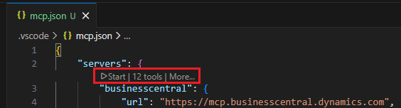
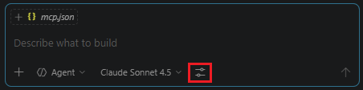

# Connect to Business Central MCP Server with Visual Studio Code

> **APPLIES TO:** Business Central online

The Business Central Model Context Protocol (MCP) server lets developers and business users interact with Business Central data directly from Visual Studio Code by using natural language through GitHub Copilot. With this integration, you can perform common business operations&mdash;such as viewing customers, creating items, and processing sales orders&mdash;through conversational AI assistance. This article explains how to configure the Business Central MCP server in Visual Studio Code and how to use it with GitHub Copilot to manage Business Central data.

Learn more about the MCP Server in [Model Context Protocol (MCP) in Business Central](mcp-overview.md).

## Prerequisites

- Visual Studio Code installed with the GitHub Copilot extension
- Access to a Business Central online environment configured with the MCP server. Learn more in [Configure Business Central MCP Server](configure-mcp-server.md).
- The MCP server connection string details, including the following values (required for setup only):

   [!INCLUDE [mcp-server-headers](../developer/includes/mcp-server-headers.md)]

  You can get the complete MCP server configuration connection string directly from the Business Central web client. Learn more in [Get the MCP server configuration connection](configure-mcp-server.md#get-the-mcp-server-configuration-connection-string).

## Set up the MCP Server in Visual Studio Code

1. Open Visual Studio Code.
1. Configure the MCP server either the user level or the workspace level, depending on whether you want the configuration to apply globally or only to a specific workspace:

   # [User level (most common)](#tab/userlevel)

   Follow these steps if you want the MCP server configuration available in every file, folder, or workspace:

   1. Select <kbd>Ctrl</kbd>+<kbd>Shift</kbd>+<kbd>P</kbd> to open Command Palette.
   1. In search, enter and select **MCP: Open User Configuration**.

   # [Workspace-level](#tab/workspacelevel)

   Follow these steps if you want the MCP server configuration to apply only to a specific folder or workspace.

   1. Open the root folder of the workspace or project
   1. In this folder, create a folder named `.vscode` if it doesn't already exist.  
   1. In the `.vscode` folder, create a file called `mcp.json`.

   ---

1. Add the Business Central MCP server configuration connection string within the `"servers": { }` element of the `mcp.json` file as illustrated in the following json code.  

   ```json
   {
       "servers": {
            "businesscentral": {
                "url": "https://mcp.businesscentral.dynamics.com",
                "type": "http",
                "headers": {
                    "TenantId": "<Business-Central-tenant-id>",
                    "EnvironmentName": "<Business-Central-environment-name>",
                    "Company": "<Business-Central-company-name>",
                    "ConfigurationName": "<mcp-server-configuration-name>"
                }
            }
        }
    }
    ```

   Replace the placeholder `<>` values with your actual Business Central environment details ([Learn more](#prerequisites)). Omit `"ConfigurationName"` or leave the value empty to give read-only access to all API pages.

   > [!TIP]
   > If you copied the MCP server configuration connection string directly from the Business Central web client, paste the copy within `"servers": { }`. Learn more in [Get the MCP server configuration connection](configure-mcp-server.md#get-the-mcp-server-configuration-connection-string).

1. In the toolbar above the `"businesscentral"` server you added, select Start to start the server.

   

   When started, the text changes to `Running`.

1. Go to the next section to verify the connection.

## Use Business Central MCP Server with agent

Once the MCP server is configured, you can interact with Business Central through GitHub Copilot Chat.

1. In Visual Studio Code, open the GitHub Copilot Chat in the Agent mode (<kbd>Ctrl</kbd>+<kbd>Shift</kbd>+<kbd>I</kbd>).
1. In the Chat box, type a question or instructions like: "Can you list all items" or "list my customers".

   

1. The agent starts working on a response, like fetching customer data.

   If you don't get a response, select **Configure tools** in the Chat box to verify Business Central MCP sever is enabled. If it's enabled, there's entry for **businesscentral**.

   > [!NOTE]
   > The agent can only access data and perform operations permitted by the MCP server configuration. Your available operations depend on the API permissions defined in your Business Central environment. For example, you can only create a customer if you have Create permission on the Customer API. If an operation fails due to insufficient permissions, contact your Business Central administrator to enable the required API access. Learn more about configurations in [Configure Business Central MCP Server](configure-mcp-server.md)

## Related Information

[Business Central MCP Server overview](mcp-overview.md)  
[Configure Business Central MCP Server](configure-mcp-server.md)  
[Model Context Protocol Documentation](https://modelcontextprotocol.io)  
[Business Central API Reference](/dynamics365/business-central/dev-itpro/api-reference/v2.0/)  
[GitHub Copilot in Visual Studio Code](https://code.visualstudio.com/docs/copilot/overview)
