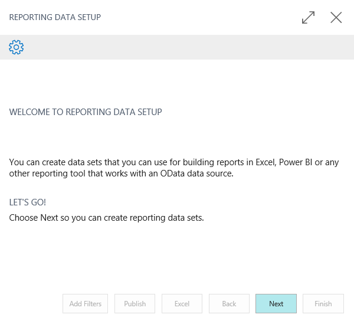
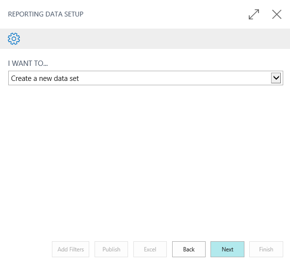
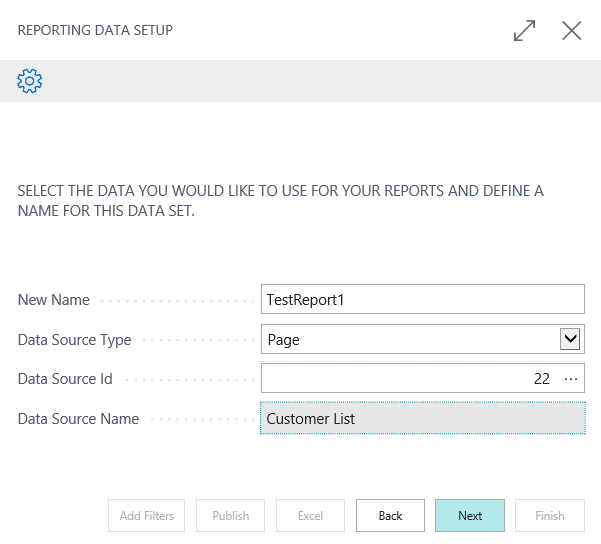
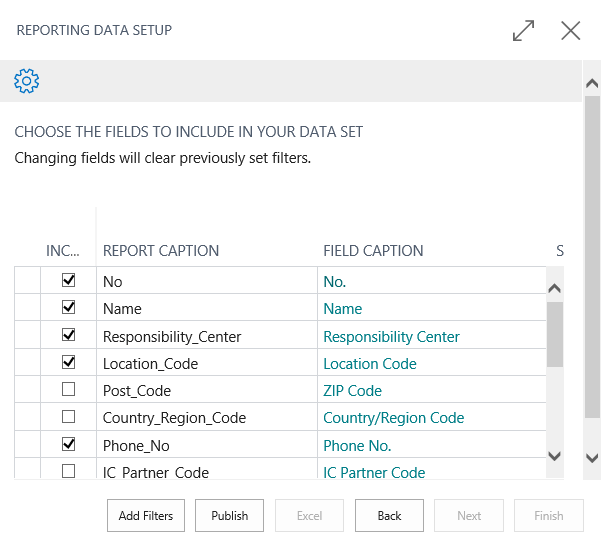

# User Scenario Documentation

One of the keys to a successful extension validation is a document that guides the tester through the setup and usage of the extension. You must include a document that helps Microsoft test the key scenarios of your extension. We want to ensure that we are validating the functionality in the correct manner. Following are some key points to keep in mind when writing the user scenario document.

- Be as detailed as possible. No detail is too small. If a field needs a specific value, include that value in your document.
- Keep the inexperienced user in mind. You know your app well, but other users Microsoft does not.
- Use screenshots as much as possible. They provide a good picture of what you want the user to accomplish.
- Provide all prerequisite and setup steps required for successful test scenario completion.  

  - If your app requires setup of its own, include those details.
  - If any setup is extensive, consider using the import of Rapid Start packages.
  - If your app has a dependency on non-standard settings in the core default version of [!INCLUDE[prodshort](../includes/prodshort.md)], include those details. The Microsoft-provided demo data might not have everything that your app needs to work properly.

- Include the most important functionality scenarios of your extension. We are not looking to test your entire extension, but we do want to ensure we are validating the most used aspects of your app.  
  - Do not give a summary as to what these scenarios do. List step by step details instead. Again, the tester doing the validation might not have the same product knowledge as you do.

> [!NOTE]
> This is not the same as the requirement to include Help for your functionality. For more information about getting started with extending and customizing the [!INCLUDE[prodshort](../includes/prodshort.md)] user assistance, see [User assistance model](../user-assistance.md).  

## Use the correct Business Central version

We recommend that you use Docker as a guide for writing your user scenario document. This way, you can take screenshots and other visuals that really help the tester walk through your validation. Keep these things in mind:

- Do not base your user document on an on-premises environment. [!INCLUDE[prodshort](../includes/prodshort.md)] on-premises deployments can have different windows, data, and so on. As a result, your document can lead to confusion and differences in our results.  
- Use the correct [!INCLUDE[prodshort](../includes/prodshort.md)] version. If you are basing your document on a build that is months old, many things could now be different in the latest production environment. This also can lead to much confusion. For more information, see [Current Build - Developing for Dynamics 365 Business Central](https://partner.microsoft.com/dashboard/collaborate/packages/4756) on the Collaborate site.
- Use the correct data for your document. Do not submit a document based on custom data that our testers will not have access to. You should always base your documents on the base demo CRONUS data and then include Rapid Start packages with any additional data.
- If your app's functionality is different per country, provide that important information. Some of the steps might be different (for your app) between US and DK. If that is the case, mention that in the document.  

### Example

Here is an example of the level of detail we are looking for, based on running the Assisted Setup wizard:

1. On the Home Page, click the **Setup & Extensions** dropdown
2. Click **Assisted Setup**
3. Click the **Set up reporting data** link
4. This will launch the wizard for this process

    > [!div class="mx-imgBorder"]
    > 

5. Click **Next**

    > [!div class="mx-imgBorder"]
    > 

6. Click **Next**
7. New Name = TestReport1
8. Data Source Type = Page
9. Data Source Id = 22
10. Data Source Name = Customer List

    > [!div class="mx-imgBorder"]
    > 

11. Click **Next**

    > [!div class="mx-imgBorder"]
    > 

12. Click **Publish**

## See Also

[Checklist for Submitting Your App](../developer/devenv-checklist-submission.md)  
[Rules and Guidelines for AL Code](apptest-overview.md)  
[User assistance model](../user-assistance.md)  
