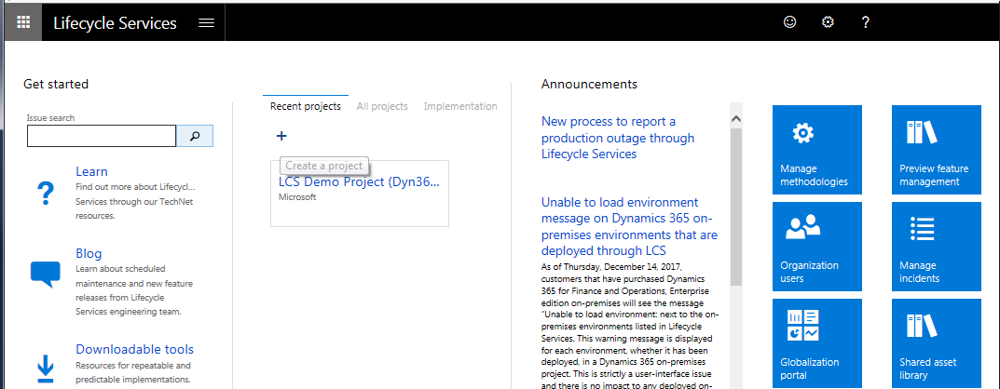
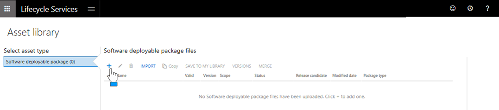

# Moving from Dynamics NAV On-premises to Business Central Online
This article describes you can move your on-premise [!INCLUDE[prod_short](../developer/includes/prod_short.md)] solution, including the application and its tenants, to [!INCLUDE[prod_short](../developer/includes/prod_short.md)] online.

## Prerequisites
To complete the tasks in this article, you will need the following:

-   The installation media (DVD) for the latest [!INCLUDE[prod_short](../developer/includes/prod_short.md)] version.

    Download the version from [Microsoft Collaborate](https://developer.microsoft.com/dashboard/collaborate/packages).

-   A [!INCLUDE[prod_short](../developer/includes/prod_short.md)] license.

-   A working environment of your current [!INCLUDE[prod_short](../developer/includes/prod_short.md)] application, including the following tools:
    -   [!INCLUDE[nav_dev_long](../developer/includes/nav_dev_long_md.md)]
    -   [!INCLUDE[nav_dev_shell_md](../developer/includes/nav_dev_shell_md.md)]
    -   [!INCLUDE[nav_shell_md](../developer/includes/nav_shell_md.md)]
    -   [!INCLUDE[nav_admin_md](../developer/includes/nav_admin_md.md)]
-    Microsoft SQL Server Management Studio installed.

     You must use SQL Server Management Studio 2012 Service Pack 1 or later. To download the latest version, see [Download SQL Server Management Studio](/sql/ssms/download-sql-server-management-studio-ssms).

-   A Microsoft Dynamics Lifecycle Services (LCS) subscription.  

    You will use LCS to upload your solution for deployment. To get a subscription, follow the step in [Sign up for a preview subscription](/dynamics365/unified-operations/dev-itpro/dev-tools/sign-up-preview-subscription).

## Upgrade your application
1. Complete a technical upgrade of your current application to the [!INCLUDE[prod_short](../developer/includes/prod_short.md)] version.

    This will convert your application database so that is runs on the new [!INCLUDE[prod_short](../developer/includes/prod_short.md)] platform. For more information, see [Converting a Database - Technical Upgrade](/dynamics-nav/converting-a-database).

    > [!IMPORTANT]  
    >  Be sure to upload your [!INCLUDE[prod_short](../developer/includes/prod_short.md)] to converted database.
    >
    > After the technical upgrade, make sure that all the components are compiled successfully.

2. Optionally, upgrade your application to the new [!INCLUDE[prod_short](../developer/includes/prod_short.md)] application.

    You only have to complete this step if you want any new application features that are part of the latest [!INCLUDE[prod_short](../developer/includes/prod_short.md)] version.

    For more information, see [Upgrading the Application Code in Dynamics NAV](/dynamics-nav/upgrading-the-application-code).

3. Complete the following steps as needed:

    1.  Import any new control add-ins that you want to use into the application database.

        Import any client-side and server-side add-ins (such as control add-ins and .NET Framework Interoperability objects) which are not included by default into the old application database.

        For more information, see [To import the control add-in to the database](/dynamics-nav/how-to--install-a-windows-client-control-add-in-assembly#InstallOnDatabase).

    2. Import test automation objects.
    3. Publish and synchronize any new V2 extensions that you want in application that are not already published.

        For more information, see [Publishing and Installing an Extension v2.0](../developer/devenv-how-publish-and-install-an-extension-v2.md).

4. Test and validate the upgraded application on-premise.


## Prepare the application and tenant databases

1. Separate the old database into two databases: the application database and the tenant database.

    This step is only necessary if your database is not already separated into an application database and tenant database.

    You do this by using the [!INCLUDE[nav_dev_shell_md](../developer/includes/nav_dev_shell_md.md)]. For more information, see [How to: Export the Application Tables to a Dedicated Database](how-to--export-the-application-tables-to-a-dedicated-database.md).

2.  For application and tenant database, remove all users except the default users like, dbo, guest, INFORMATION,SCHEMA, and sys.

     Use SQL Server Management Studio to remove any previous database users that are assigned to these databases. This includes the service account that was used by the Microsoft Dynamics NAV Server to connect to the database (for example, the [NT AUTHORITY\NETWORK SERVICE] account).

3.  Clean up the system tables in the application and tenant databases.

    You must clean up certain system tables in these databases to ensure that they do not contain any records that they are related to the previous deployment environment or activities.

    The following table lists the system tables in the application and tenant databases from which you must clear data.

    | Database | Table |Remarks|
    |----------|--------|-----|
    |Application|	dbo.Server Instance| |
    | |	dbo.$ndo$tenants|Note This table is only available if the original database was used in a multitenant environment.|
    | |dbo.Object Tracking |  |
    |Tenant|dbo.Access Control| |
    ||dbo.Active Session||
    ||dbo.Session Event||
    ||dbo.User||
    ||dbo.User Default Style Sheet||
    ||dbo.User Metadata||
    ||dbo.User Personalization||
    ||dbo.User Property||

    You can perform this work manually by using SQL Server Management Studio to connect to the databases and make the modifications directly. Or, you can use Windows PowerShell.

    To use Windows Powershell, you can run the following cmdlets:

    ```
    $DBServerInstance = ‘[YOUR SQL SERVER INSTANCE NAME]’  
    $DatabaseName = ‘[YOUR DB NAME]’

    Invoke-Sqlcmd –ServerInstance $DBServerInstance –Query “USE [$DatabaseName] DELETE FROM dbo.[Server Instance]” –Verbose | Write
    Invoke-Sqlcmd –ServerInstance $DBServerInstance –Query “USE [$DatabaseName] DELETE FROM dbo.[$(“$”)ndo$(“$”)cachesync]” –Verbose | Write
    ```

## Create the deployable package (.zip file)

When you deploy your application online, you must provide a compressed .zip file that contains the application and tenant databases as data-tier application files, known as BACPAC (.bacpac) files. This article describes how you to create the BACPAC files and zip. You can do this using SQL Server Management Studio.

1.	In SQL Server Management Studio, connect to the server instance that hosts the application and tenant databases.
2.	In **Object Explorer**, right-click either the application or tenant database, choose **Task**, and then choose **Export Data-tier Application**.
3.	Follow the steps in the **Export Data-tier Application** wizard to export the database to a .bacpac file on your computer or network.

    You can use any name for the .bacpac file.
4.  Repeat steps 2 and 3 for the other database.

    For more information about exporting databases to .bacpac format, see [Export a Data-tier Application](/sql/relational-databases/data-tier-applications/export-a-data-tier-application).

5. Create a single ZIP (compressed) file that contains the application and tenant database BACPAC files.

## Upload the deployable package to the Dynamics Lifecycle Services (LCS)

To upload your deployable package, you will create a project in LCS.

1. Sign-in to LCS from [https://lcs.dynamics.com/v2](https://lcs.dynamics.com/logon/index).
2. On the **Getting Started** page, under Recent Projects or All Projects, select **+**.

       
3. In the **What is this project for?** box, select **Migrate, create solutions, and learn**.

4. Enter a name and description for your project, and then the remaning fields accordingly:

    |  Field  |  Value  |
    |---------|---------|
    |Product name|[!INCLUDE[prod_short](../developer/includes/prod_short.md)]|
    |Country|Set this to the country where your solution will be published.|
    |Import roles and users from existing LCS project|No|

5. Select **Create**.

    Your project is created and its home page opens.
6. Select **Asset Library**.

7. On the **Asset library** page, select select **Software deployable package**, and then select **+**.

       
8. In the **Upload Software deployable package file** box, enter a name, select **Add a file**.
9. In the **Upload file asset** box, select **Browse** > *select your deployable package* > **Open** > **Upload**.

    When the file has been uploaded, go to the nect step to assign the project to a [!INCLUDE[prod_short](../developer/includes/prod_short.md)] user for processing.

10. Go back to you project home page, and select **Project users**.
11. On the **Project user management** page, select **+**.

       

12. In the **Invite user** box, use the **User lookup** field to find the [!INCLUDE[prod_short](../developer/includes/prod_short.md)] user or enter the email address directly in the **Email** field, and then select **Invite**.