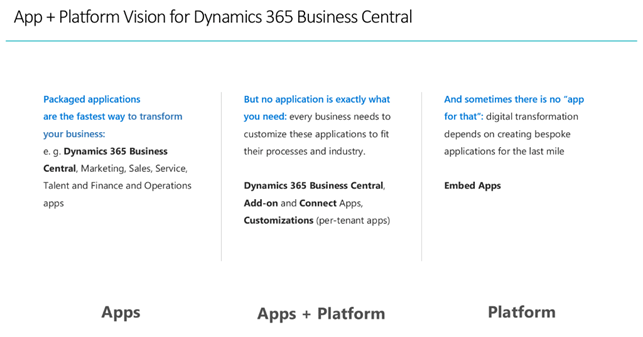
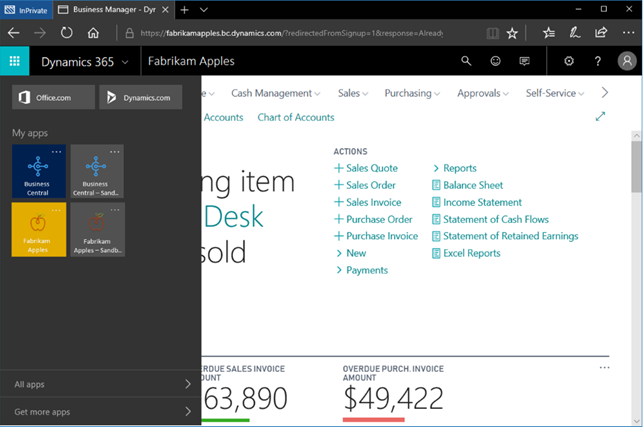
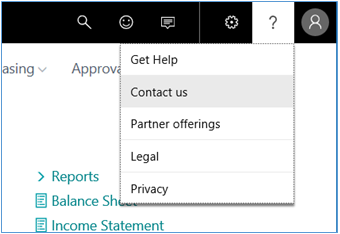

# Embed App Overview

[!INCLUDE[embedapp](../developer/includes/embedapp.md)] is a term that defines an end-to-end solution meeting the specific needs of a vertical or micro-vertical industry.  

[!INCLUDE[d365_bus_central_md](../developer/includes/d365_bus_central_md.md)] plays a vital role in the Embed App, as [!include[prodshort](../developer/includes/prodshort.md)] is embedded as an integral part of the overall solution.   

Some examples of an [!INCLUDE[embedapp](../developer/includes/embedapp.md)] include:  
- A Dentist solution  
- A Real Estate Agent solution  
- A Food Processing solution  

An [!INCLUDE[embedapp](../developer/includes/embedapp.md)] refers to what is being provided to a given customer segment, unrelated to how the solution is being implemented or architected. An [!INCLUDE[embedapp](../developer/includes/embedapp.md)] can be built using AL, in other words extension, code-customization, and a combination of extensions and code-customization.  

  

## Components

On a high level, an [!INCLUDE[embedapp](../developer/includes/embedapp.md)] is a package that consists of the following parts:

- Library extensions

    This is the functionality of the [!INCLUDE[embedapp](../developer/includes/embedapp.md)] that is implemented by the ISV partner in a form of extensions.  
- Third party extensions  

    These are add-on extensions coming from other ISVs that contribute to and enhance the [!INCLUDE[embedapp](../developer/includes/embedapp.md)]. The extensions are validated to be compatible by the [!INCLUDE[embedapp](../developer/includes/embedapp.md)] owner.  
- Extended metadata  

    This includes additional [!INCLUDE[embedapp](../developer/includes/embedapp.md)] properties that are specific to this type of app and not otherwise available for other types of apps (see the list below).  
- Base application and tenant template (optional)  

The following capabilities are only available for the [!INCLUDE[embedapp](../developer/includes/embedapp.md)] and not for other types of [!INCLUDE[prodshort](../developer/includes/prodshort.md)] apps (Connect and Add-on).

### Partner Branding

The [!INCLUDE[embedapp](../developer/includes/embedapp.md)] will promote the partner's brand in several places:

- Web Client and Web Service URLs  
  - Client: `https://[application name].bc.dynamics.com`
  - Web Services: `https://[application name].api.bc.dynamics.com`
- Name, image, and icon on the provisioning page of the Fixed Client Endpoint  
- Splash screen of the client  
- Title bar of the browser tab (for example, “Fabrikam Apples”)  
- A dedicated product tile, icon, and short marketing description in the Dynamics shell ([https://home.dynamics.com](https://home.dynamics.com))  
- In-product messages (such as pop-up errors, warnings, notifications)  

  

### Exclusivity

The partner can control which third party apps can be installed for their [!INCLUDE[embedapp](../developer/includes/embedapp.md)].  

- Safe listing of the 3rd party apps - no other apps will be possible to install, except the ones explicitly approved by the partner  
- App install/uninstall controlled by the partner  
- The partner can choose to allow a customer to install other extensions from the AppSource, but this will be an explicit partner decision, not the default behavior  

### Code-customizations of the base application

Partners can choose to bring their own code-customized base application as an [!INCLUDE [embedapp](../developer/includes/embedapp.md)] for several reasons:

- Shortening time-to-market (“lift and shift” approach).

    The partner's current solution is a significantly customized version of the [!INCLUDE [navnow_md](../developer/includes/navnow_md.md)] application and it will require substantial time and effort to migrate it into extensions. A partner can lift their solution as-is (upgraded to a supported platform) to [!INCLUDE[[prodshort](../developer/includes/prodshort.md)] service and start offering it to their new and prospective customers. Then, they can gradually start moving their functionality into extensions to achieve the benefits that come with the extension model.  
- Overcoming the limitations of the current extensions framework.

    Extensions today can support many scenarios and the Microsoft team is working on extending these capabilities even more. However, some customization needs of the partners are not yet possible using the current version of the extensions framework, so partners can choose to do these changes directly in the base application using C/SIDE Development Environment based on [!INCLUDE [prodshort](../developer/includes/prodshort.md)] version 14.  
- Availability of 3rd party add-ins as extensions.

    Some of the add-ins required by the [!INCLUDE[embedapp](../developer/includes/embedapp.md)] might not yet be available as extensions, for the reasons mentioned above. The partner can choose to import these add-ins as FOB files into the base application that they submit with the [!INCLUDE[embedapp](../developer/includes/embedapp.md)].  
- Usage of .NET interoperability and custom assemblies.

    Partners that use .NET interoperability in their current application to address multiple business scenarios. Although extensions today allow a number of these scenarios to be implemented in AL, they don’t and cannot cover for all possible scenarios of .NET usage. Therefore, the partner can choose to import the required .NET add-ins into the Add-ins table of the base application, and these add-ins will automatically be deployed into the environment where they will be running.

### Additional settings (metadata)

- An [!INCLUDE[embedapp](../developer/includes/embedapp.md)] is the property of the partner, so the customers of the [!INCLUDE[embedapp](../developer/includes/embedapp.md)] must be able to find the partner’s own legal, privacy, contact, community and feedback links (not Microsoft links) when they work with the app:

      

- Safe listed domains for embedding [!INCLUDE[embedapp](../developer/includes/embedapp.md)] pages into other web sites, including SharePoint (“frame ancestors”) 
- Target version of [!INCLUDE[d365_bus_central_md](../developer/includes/d365_bus_central_md.md)] platform
- Target version of [!INCLUDE[d365_bus_central_md](../developer/includes/d365_bus_central_md.md)] base application (if not included with the [!INCLUDE[embedapp](../developer/includes/embedapp.md)])  
- Azure KeyVault account for storing application secrets, such as accounts for connecting to 1-3rd party services  
- Base application + tenant template. This is an optional component of an [!INCLUDE[embedapp](../developer/includes/embedapp.md)]. The partner can choose to include it or simply specify which version of the [!INCLUDE[d365_bus_central_md](../developer/includes/d365_bus_central_md.md)] base application the [!INCLUDE[embedapp](../developer/includes/embedapp.md)] should use as a base application.  

At this stage, within the extensions and base application, the partner can work in their own Object ID range.  

#### Platform version availability

Microsoft is going to make new versions of the [!include[prodshort](../developer/includes/prodshort.md)] platform available to [!INCLUDE [embedapp](../developer/includes/embedapp.md)] partners through the Lifecycle Services portal (LCS). The partner will then have to pick the platform they want to use for deployment of their solution.

#### Deploying versions

When a partner deploys a solution through the LCS portal, they can pick from the last three available versions of the platform (minor and major). Every newly released minor or major platform update will be added to the list and simultaneously one older version will be removed form that list.  

Any existing deployments, running on platform versions that are older than 3 updates, will enter a grace period of 30 days. And after that, if the deployment is not upgraded, it will be moved out of the standard SLA.  

## See Also

[Microsoft Responsibilities](microsoft-responsibilities.md)  
[Qualification and Onboarding](embed-app-qualifications-onboarding.md)  
[Managing in Microsoft Lifecycle Services](embed-app-lifecycle-services.md)  
[Components and Capabilities](app-components.md)  
[Deployment of [!INCLUDE[prodlong](../developer/includes/prodlong.md)]](Deployment.md)  
[Administration of Business Central Online](../administration/tenant-administration.md)  
[Administration of Business Central On-Premises](../administration/Administration.md)  
