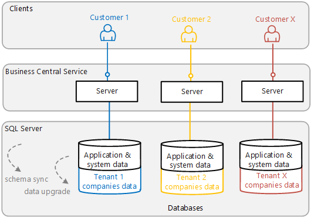

# Planning Your [!INCLUDE[prod_long](../developer/includes/prod_long.md)] Deployment

This article outlines some of the things you should consider and decide on before you install [!INCLUDE[prod_short](../developer/includes/prod_short.md)].

Most of the topics discussed in this article can be changed at any time after the initial installation.  

## Network Topology

A [!INCLUDE[prod_short](../developer/includes/prod_short.md)] deployment consists of various [components](product-and-architecture-overview.md) that support the production, development, and testing. These components can be installed on various computers. The deployment process varies depending on the topology that you implement.

For more information, see [Deployment Topologies](deployment-scenarios.md).

## Single-tenancy and Multitenancy

A [!INCLUDE[prod_short](../developer/includes/prod_short.md)] solution consists of an application (the code) and business data (the customer's data). This information is stored in a database and accessed through a [!INCLUDE[server](../developer/includes/server.md)] instance. There are two different two deployment architectures to choose from: single-tenant and multitenant.

> [!NOTE]
> For this discussion, a *customer* refers to  a business or a group of legal entities whose data can be stored in one database, isolated from other customers. In [!INCLUDE[prod_short](../developer/includes/prod_short.md)], a customer can consist of one or more companies.

### Single-tenant architecture

[!INCLUDE[prod_short](../developer/includes/prod_short.md)] is installed as a single-tenant deployment by default. In a single-tenant deployment, the application and the business data are stored in the same database. Each customer solution has its own [!INCLUDE[server](../developer/includes/server.md)] and database.

  

### Multinenant architecture

In a multitenant deployment, the application and business data are stored in separate databases. There's a single [!INCLUDE[server](../developer/includes/server.md)] and application database for multiple customers. But each individual customer has their own database for storing business data, which is referred to as a *tenant*. 

  

Multitenancy centralizes the maintenance of the application, and at the same, time isolates each tenant. This architecture makes upgrading easier compared with a single-tenant deployment. For more information, see [Multitenant Deployment Architecture](Multitenant-Deployment-Architecture.md).

## User Authentication

[!INCLUDE[prod_short](../developer/includes/prod_short.md)] supports several credential mechanisms for authorizing users trying to access data. By default, Windows authentication is used. 

For more information, see [Authentication and Credential Types](../administration/users-credential-types.md).

 
## [!INCLUDE[server](../developer/includes/server.md)] Service Account

The central component of a [!INCLUDE[prod_short](../developer/includes/prod_short.md)] deployment is the [!INCLUDE[server](../developer/includes/server.md)], which handles all communication between the client and the databases. The [!INCLUDE[server](../developer/includes/server.md)] requires a log on account, referred to as the service account. By default, the Network Service Account is used. The Network Service Account is acceptable in a test environment, but we recommend that you use a domain account in your production environment.

For more information, see [Provisioning the [!INCLUDE[server](../developer/includes/server.md)] Service Account](provision-server-account.md).
 
## Enhancing Connection Security

[!INCLUDE[prod_short](../developer/includes/prod_short.md)] offers features that help secure connections over a wide area network \(WAN\), such as connections from the [!INCLUDE[webserver](../developer/includes/webserver.md)], [!INCLUDE[nav_windows_md](../developer/includes/nav_windows_md.md)], and web services to the [!INCLUDE[server](../developer/includes/server.md)]. The implementation of these security features requires that you obtain a certificate from a certification authority or trusted provider.

For more information, see:

[Using Security Certificates with Business Central On-Premises](implement-security-certificates-production-environment.md)

[Configuring SSL to Secure the [!INCLUDE[prod_short](../developer/includes/prod_short.md)] Web Client Connection](configure-ssl-web-client-connection.md)

## See Also  

[Upgrading to Business Central](../upgrade/upgrading-to-business-central.md)
[Business Central Components](Product-and-Architecture-Overview.md)  
[System Requirements](system-requirement-business-central.md)  
