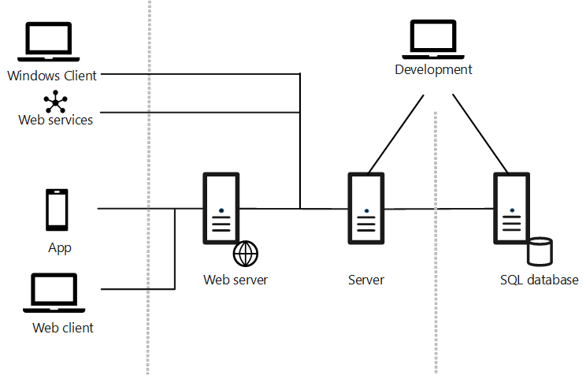

# [!INCLUDE[prod_short](../developer/includes/prod_short.md)] Component and System Topology

The [!INCLUDE[prod_short](../developer/includes/prod_short.md)] deployment includes three core components for serving the application to users. It also includes various tools and components for managing, developing, extending, and testing the application.

## Multi-Tier System Topology
 
To understand the components is useful to first look at the base topology of a [!INCLUDE[prod_short](../developer/includes/prod_short.md)] deployment, as illustrated in the following diagram:

  

## Components

### Main components

Every deployment must include the core components: Web server, Server, and SQL Database. 

|Component|Description| More Information  |
|---------|-----------|---|
|SQL Database|An SQL Server or Azure SQL Database database that contains application object definitions and business data. In a multitenant deployment, the application and business data can be separated into different databases: the application database and the tenant, which is the database that contains the business data. In this case, there can be one or more tenants for a single application database.| [Creating Databases](../cside/cside-create-databases.md)  [Deploy a Business Central Database to Azure SQL Database](deploy-database-azure-sql-database.md)|
|Server|[!INCLUDE[server](../developer/includes/server.md)] is a .NET-based Microsoft service application that uses Windows Communication Framework to handle communication between clients and databases. It controls authentication, event logging, scheduled tasks, reporting, and more.|[Configuring Business Central Server](../administration/configure-server-instance.md)|
|Web Server|An Internet Information Server (IIS) web site, provisioned with the [!INCLUDE[webserver components](../developer/includes/webservercomponents.md)], that enables access from the [!INCLUDE[webclient](../developer/includes/webclient.md)] and mobile apps.| [Business Central Web Server](web-server-overview.md)|
|Business Central App|A desktop, phone, and tablet app for Business Central.|[Windows Store](https://go.microsoft.com/fwlink/?LinkId=734848)  [App Store](https://go.microsoft.com/fwlink/?LinkId=734847)  [Google Play](https://go.microsoft.com/fwlink/?LinkId=734849)|
|Web services|SOAP and OData Web Services for exposing application functionality to external systems and users. Developers can create and publish functionality as web services. They expose pages, codeunits, or queries, and even enhance a page web service by using an extension codeunit.|[Web Services](../webservices/web-services.md)|

### Development and administration components

|Component|Description| More Information   |
|---------|-----------|---|
|AL development environment|An AL language extension for Visual Studio Code for developing applications and extensions. |[Getting Started with C/SIDE and AL for On-Premises](../developer/devenv-get-started-al-for-onprem.md).|
|[!INCLUDE[admintool](../developer/includes/admintool.md)]|A Microsoft Management Console (MMC) for creating and configuring [!INCLUDE[server](../developer/includes/server.md)] instances.|[Business Central Server Administration Tool](../administration/administration-tool.md)|
|[!INCLUDE[adminshell](../developer/includes/adminshell.md)]|Windows PowerShell modules for managing the deployment, including tasks such adding and configuring [!INCLUDE[server](../developer/includes/server.md)] and Web server instances, databases, and users, and administering extension packages.|[Windows PowerShell Cmdlets for Business Central](/powershell/business-central/overview)|

### Additional components

|Component|Description| More Information  |
|---------|-----------|---|
|Demo Database|A database that contains application objects and sample business data for demonstration purposes.||
|[!INCLUDE[nav_dev_long_md](../developer/includes/nav_dev_long_md.md)]|The C/SIDE client that was available in [!INCLUDE[navnow_md](../developer/includes/navnow_md.md)] for developing applications using C/AL. In [!INCLUDE[prod_short](../developer/includes/prod_short.md)], this component is only required for doing upgrades but you can still use it to develop applications.|[!INCLUDE[2019_releasewave2_deprecated](../includes/2019_releasewave2_deprecated.md)]  [Development in C/AL](/dynamics-nav/development) in the Dynamics NAV Developer and IT Pro Help.|
|[!INCLUDE[devshell](../developer/includes/devshell.md)]|Windows PowerShell modules for merging and modifying application object files and creating extension packages. Installed with the [!INCLUDE[nav_dev_long_md](../developer/includes/nav_dev_long_md.md)].|[!INCLUDE[2019_releasewave2_deprecated](../includes/2019_releasewave2_deprecated.md)]  [Windows PowerShell Cmdlets for Business Central](/powershell/business-central/overview)|
|[!INCLUDE[nav_windows_md](../developer/includes/nav_windows_md.md)]|Windows Desktop application for accessing [!INCLUDE[prod_short](../developer/includes/prod_short.md)].|[!INCLUDE[2019_releasewave2_deprecated](../includes/2019_releasewave2_deprecated.md)]  |
|Microsoft Outlook Integration|A [!INCLUDE[server](../developer/includes/server.md)] component for integrating with Microsoft Outlook.|[!INCLUDE[2019_releasewave2_deprecated](../includes/2019_releasewave2_deprecated.md)]  |
|Microsoft Outlook Add-in| A component to synchronize data, such as to-dos, contacts, and tasks, between [!INCLUDE[prod_short](../developer/includes/prod_short.md)] and Outlook. The Outlook Add-In uses [!INCLUDE[prod_short](../developer/includes/prod_short.md)] web services.|[Setting Up the Office Add-ins for Outlook Integration](../administration/Setting-up-Office-Add-Ins-Outlook-Inbox.md)|
|Microsoft Excel Add-in|A component that enables users to export data from [!INCLUDE[prod_short](../developer/includes/prod_short.md)] to Excel.|[!INCLUDE[2019_releasewave2_deprecated](../includes/2019_releasewave2_deprecated.md)]  |
|Excel Add-in|A component that enables users to export data from [!INCLUDE[prod_short](../developer/includes/prod_short.md)] to Excel.|[Setting up the Excel Add-In](../administration/configuring-excel-addin.md)|
|Page Testability|A [!INCLUDE[server](../developer/includes/server.md)] component for testing pages.||
|Automated Data Capture System|A system that tracks the movement of items in a warehouse.|[Use Automated Data Capture Systems (ADCS](/dynamics365/business-central/warehouse-use-automated-data-capture-systems-adcs)  [!INCLUDE[2020_releasewave1_deprecated](../includes/2020_releasewave1_deprecated.md)]. The VT100 Plug-in is no longer included on the product installation media.|
|ClickOnce Installer Tools|Tools for implementing ClickOnce installation for the [!INCLUDE[nav_windows_md](../developer/includes/nav_windows_md.md)].|[!INCLUDE[2019_releasewave2_deprecated](../includes/2019_releasewave2_deprecated.md)]  [Deploying Microsoft Dynamics NAV Windows client Using ClickOnce](/dynamics-nav/deploying-microsoft-dynamics-nav-using-clickonce) in the Dynamics NAV Developer and IT Pro Help.|
|NAS Service|A server component that executes business logic without a user interface or user interaction. NAS services in [!INCLUDE[server](../developer/includes/server.md)] support applications such as Microsoft Outlook Integration and the Job Queue.| Instead of using NAS services, we recommend that you use the Task Scheduler (see [Task Scheduler](../developer/devenv-task-scheduler.md). If you decide to use NAS, and want to read more about its configuration, see [Configuring NAS Services](/dynamics-nav/configuring-nas-services) in the Dev and IT Pro Help for [!INCLUDE[nav2018_md](../developer/includes/nav2018_md.md)].|

## See Also

[Deployment](Deployment.md)  
[Installing Business Central Using Setup](install-using-setup.md)  
[Multitenant Deployment Architecture](Multitenant-Deployment-Architecture.md)  
