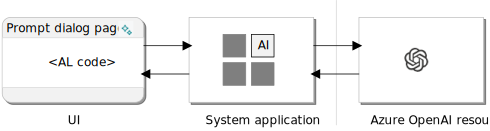

# Developing generative AI experiences overview

Creating a copilot in Business Central extension involves three main tasks: getting set up with Azure OpenAI, building the AI capability using system application, and designing the copilot user interface. 

With these steps completed, you well on your way to creating a powerful and effective Copilot that can assist users with generating content and making their work easier and more efficient. Let's take a closer look at each of these tasks.

## Getting set up with Azure OpenAI

As a prerequisite to get started with creating a Copilot in Business Central, you first need to apply for access to Azure OpenAI Service. Once you're approved, you can create an Azure OpenAI resource in the Azure portal. From this resource, you need to grab your API key and deployment name.

## Building AI capability using the AI module of system application

The AI module of the Business Central system application provides the API for communicating with Azure OpenAI. In this task, you use the AI module to define the application logic to request and retrieve AI-generated content from the Azure OpenAI service.

## Designing the copilot user interface

In this task, you design the Copilot user interface by using a PromptDialog type page, The enables users to input their requirements, start the generation process, review the output, and save it. The PromptDialog page can be customized to suit the needs of your specific extension and can include fields for user input, buttons for initiating the generation process, and fields for displaying the generated content.

## Next steps

- [Get setup with Azure OpenAI Service](ai-dev-tools-get-started.md)
- [Build AI capability in app](ai-build-capability-in-al.md)
- [Design the Copilot user experience](ai-build-experience.md)

