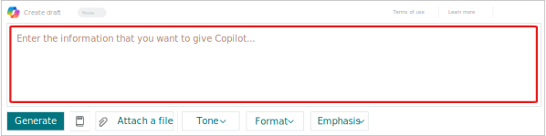
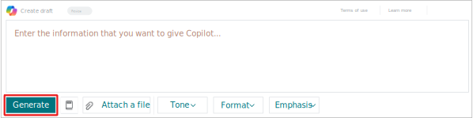
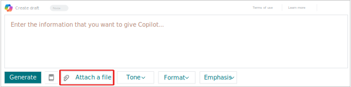
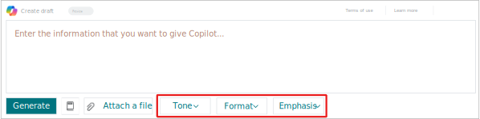
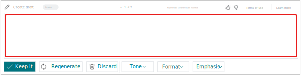
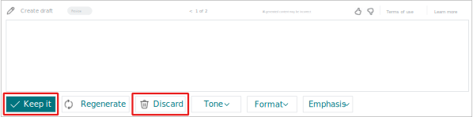
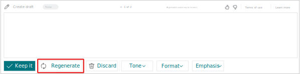
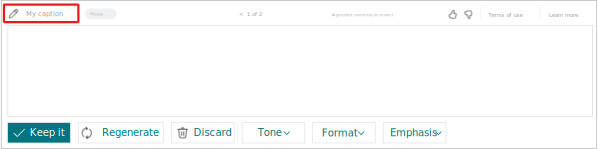
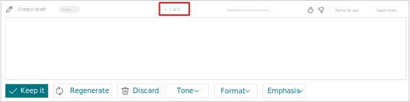

# Build copilot user experience with the prompt dialog page

In this article, you learn how to create the user interface for your AI solution that provides users with a copilot experience that is consistent across Business Central. The fundamental component of Copilot from the user-interface perspective is the [PromptDialog](devenv-page-type-promptdialog.md) type page. 

The PromptDialog page type is designed for creating copilot experiences that assist users in making informed decisions about the AI-generated output. Within a single page object, the PromptDialog page type creates a comprehensive flow in the UI, where users can provide input, view the subsequent output, and revise it as needed. The user can then choose to save their work or discard it.

## Design overview and flow

The PromptDialog page type has three different display modes to accommodate the flow for generating AI content: 

|Mode|Description|
|-|-|
|prompt mode|The *prompt mode* is used to input data to influence the results generated by AI. You can design this mode so that input is provided manually by the user, for example, by entering data in one or more fields, or programmatically, for example by extracting existing data from a table. This mode is optional because AI logic might not require it.|
|generate mode|The *generate mode* appears while the platform connects to the Azure OpenAI Service and content is being generated, functioning as a kind of progress bar for the user. This mode doesn't require any added logic on your part, because its behavior is controlled by the platform. Its UI is limited to a caption, a link to terms of use, and an action to stop generating.  |
|content mode |The *content mode* is used to display the AI-generated results and is initiated automatically after the *generate mode* allowing the user to review the content, regenerate, save or discard the results. |

<!--
- The *prompt mode* is used to input data to influence the results generated by AI. You can design this mode so that input is provided manually by the user, for example, by entering data in one or more fields, or programmatically, for example by extracting existing data from a table. This mode is optional because AI logic might not require it.
- The *generate mode* appears while the platform connects to the Azure OpenAI Service and content is being generated, functioning as a kind of progress bar for the user. This mode doesn't require any added logic on your part because its behavior is controlled by the platform. Its UI is limited to a caption, a link to terms of use, and an action to stop generating.  
- The *content mode* is used to display the AI-generated results and is initiated automatically after the *generate mode* allowing the user to review the content, regenerate, save or discard the results. -->

### Fundamental flow

The following diagram illustrates the PromptDialog page type and its different modes within the fundamental copilot flow. Your flow might vary depending on your design choices, like whether to use a prompt mode and which mode displays when the PromptDialog page opens.

[](media/prompt-dialog-flow-v3.svg#lightbox)

The following table gives an overview of the typical flow from the user's perspective and how it's achieved in AL code.

|Phase|In UI|In AL code|Learn more|
|-|-|-|-|
|1|User starts the copilot experience by selecting an action on a page.|An `action` control on a page runs the PromptDialog type page|[Launch experience](#launch-experience)|
|2|The PromptDialog page opens in the prompt mode, where users can provide input.|The PromptDialog page is defined by setting the PageType property to `PromptDialog`.|[Create PromptDialog type page](#create-promptdialog-type-page) |
|3|User enters information that copilot uses to generate results. |The `prompt` area of the PromptDialog page defines what the user can input, which typically consists of one or more fields.|[Design the prompt mode](#design-the-prompt-mode)|
|4|User selects a button to start generating content with AI|The system action `Generate` calls the procedure that starts the AI generation process.|[Add the generate action](#add-a-generate-action)|
|5|The generation mode appears while the results are being generated.|Handled automatically by the platform. However, you can customize its caption by calling [Dialog.Open()](methods-auto/dialog/dialog-open-method.md) or [Dialog.Update()](methods-auto/dialog/dialog-update-method.md) from the Generate and Regenerate actions.||
|6|The content mode appears and displays the AI-generated proposal for review by the user.|The `content` area of the PromptDialog page defines the layout of AI-generated content on the page.|[Design the content mode](#design-the-content-mode)|
|7|User chooses to save or discard the proposal by using actions at the bottom of the page |A system action for saving and one for discarding trigger the logic to handle the content with respect the user's choice, and the prompt dialog page closes.|[Add save and discard actions](#add-a-content-area)| 

<!--
1. User opens the Promptdialog page to start the experience, for example, be selecting an action on another page.
1. The page opens to display a prompt area, where users can provide input, for example, text.
1. User starts the generation by AI by selecting a system action called Generate.
1. Resulting AI-generated content is returned and displayed in the Promptdialog page, arranged as defined by the page layout.
1. The user can review 
1. 
1. -->

## Create PromptDialog type page

You create the page like any other page, except consider the following properties:

```al
page 50100 "My copilot"
{
    Caption = 'Draft with my copilot';
    PageType = PromptDialog;
    Extensible = false;
    PromptMode = Prompt;
    IsPreview = true;
...
}
```

|Property|Description and value|
|-|-|
|[PageType](properties/devenv-pagetype-property.md)|Set to `PromptDialog`.|
|[Extensible](properties/devenv-extensible-property.md)|Set to `false` to ensure that extensions for other providers don't interfere with the experience you're providing customers|
|[PromptMode](properties/devenv-promptmode-property.md)|Specifies which mode you want to page to display when it first opens. The default is `Prompt`. For more information, go to [Specify the mode in which the PromptDialog opens](#specify-the-mode-in-which-the-promptdialog-opens).|
|[IsPreview](properties/devenv-ispreview-property.md)|This property is used to specify whether your feature is in preview or generally available. Setting this property to `true` applies a **Preview** label on the all display modes of the PromptDialog type page, as illustrated in the following figure. The **Preview** label communicates to users that the feature is available to try out and provide feedback, but the functionality is subject to change. When you feel the feature is ready, you can change this value to `false` to communicate that the feature is generally available. We recommend that most new copilot experiences start in preview. |


This is the first step in creating the PromptDialog type page. The sections that follow explain the different modes and the UI elements that comprise the modes. 

## Specify the mode in which the PromptDialog opens

By default, the PromptDialog page opens in the prompt mode. But in some scenarios, this behavior might not be desired. For example, consider [marketing text suggestions with Copilot](/dynamics365/business-central/ai-overview) from Business Central. This copilot experience includes a prompt mode, which is used for changing item attributes. However, when users start the copilot, it opens directly in the generate mode, then moves to the content mode. In the content mode, users have the option to open the prompt mode to change the input to AI, this case the item attributes, if they like. 

There are two ways to change the mode that PromptDialog page opens. One way is to use PromptMode property, as previously mentioned. The other way to change the mode at runtime, for example, by using the [OnInit](triggers-auto/page/devenv-oninit-page-trigger.md):

```al
trigger OnInit()
begin
    CurrPage.PromptMode := PromptMode::Generate;
end;
```

In both cases, the trigger defined for the `systemaction(Generate)` control will automatically be invoked.

## Design the prompt mode 

In this task, you define the screen of the PromptDialog page where users can add input that's used by AI generation logic for producing results. The prompt area is optional because not all AI designs required it. Also, you might need a prompt mode, but it doesn't have to be the first mode presented to the user in the copilot experience. 

### Add the prompt area

The prompt area is where users can provide input to the AI generation. The prompt area supports natural language input (like free text fields) and structured input (like field groups and page parts). The example uses a single field that allows the user to type natural language text in an unstructured format.



The prompt area is defined by adding an `area` control to the `layout` of the page, similar to way you'd add content areas on other page types. Except, you use the syntax `area(Prompt)`: 

```al
layout
{
    area(Prompt) 
    {
        field(input; UserInput)
        {
            ShowCaption = false;
            MultiLine = true;
        }
    }
}
```

Within `area(Prompt)`, you can add one or more fields, groups, and page parts. `Prompt` supports all `area()` controls except the`repeater` control.

> [!NOTE]
> The code example is a special case where the first field on the PromptDialog page is shown as a multiline input with `ShowCaption=false`. In this case, the page caption serves as the caption for the input field. For accessibility and usability reasons, other fields on the page should continue to have their captions visible.

### Add a generate action

In this task, you add action to the PromptDialog page that users select to start generating output with Copilot and AI. 



The `PromptDialog` page type supports several *system actions* that appear as buttons in the UI. You add these actions in the `actions` control on the page, like you would any other action. Except you define the system actions by first adding an `area(SystemActions)` control, then using the `systemaction()`control to define the specific action. In this case, you use a `systemaction(Generate)` control. 


```al
actions
{
    area(SystemActions)
    {
        systemaction(Generate)
        {
            Caption = 'Generate';
            trigger OnAction()
            begin
                RunGeneration();
            end;
        }
        ...
    }
}
```

Use the [OnAction()](triggers-auto/action/devenv-onaction-action-trigger.md) to call generative AI code, in this case the `RunGeneration()` procedure.

This trigger is invoked when the user selects the button or when the page is opened in generate mode.

### Add a file attachment action

In this task, you add action to the PromptDialog page that enables users to select a file to upload in the prompt area. The content of the file can provide input to the AI generation.



Like the system action for generating AI, there's also a system action for attaching a file. In this case, you use a `systemaction(Attach)` control.

```al
actions
{
    area(SystemActions)
    {
        systemaction(Attach)
        {
            Caption = 'Attach a file';
            ToolTip = 'Attach a file describing the job.';
            trigger OnAction()
            var
                InStr: InStream;
                Filename: Text;
            begin
                UploadIntoStream(‘Select a file...', '', ‘All files (*.*)|*.*', Filename, InStr);
                if not (Filename = '') then begin
                ...
            end;
        end;
        }
    }
}
```

### Add preference options

In this task, you add actions to the PromptDialog page that enable users to set style preferences to influence the AI-generated output. The options appear as buttons in the UI to the right of the system actions.



You add the options by using in a `area(PromptOptions)` control with the `actions` control. Each option is defined by a field using the `field` control. Only fields of the [option data type](methods-auto/option/option-data-type.md) are supported.

```al
actions
{
    area(PromptOptions) 
    {          
        field(tone; Tone)
        {
        }
        field(format; Format)
        {
        }
        field(emphasis; Emphasis)
        {
        }
    }
}

```

## Design the content mode

The content mode shows the AI-generated output. It enables users to review output, then choose to regenerate, save, or discard it. 

<!---->


### Add a content area

In this task, you define the area of the content that displays results of the AI generation.



To define this area, you add an `area(Content)` control to the `layout`, then add one or more data fields. You can structure and arrange fields in groups and page parts. Like the `Prompt` area, the `Content` area supports all controls except  `repeater`. 

```al
layout
{
    area(Content)
    {
        field(generatedOutput; Output)
        {
            ShowCaption = false;
            MultiLine = true;
        }
    }
}
```

### Add a save and discard action 

In this task, you add actions to the content mode that enable users to save or discard the AI-generated proposal. Don't save AI-generated proposals to the database until the user chooses to do so. In accordance with responsible AI, to respect the user's choice.




There are two system actions that control the behavior: `systemaction(OK)` for saving and `systemaction(Cancel)` for discarding. These actions appear in the UI by default without you having to add any code where `systemaction(OK)` has the caption **Keep it** and `systemaction(Cancel)` has the caption **Discard**. However, you do have to add code that handles the content based on which action the user chooses. 

1. This step is optional and only required if you want use captions other than **Keep it** and **Discard**. In the `actions` control, add a system action `OK` for saving proposals and `Cancel` for discarding proposals.

    ```al
    actions
    {
        area(SystemActions)
        {
            systemaction(OK)
            {
                Caption = 'Save';
                ToolTip = 'Save the proposal.';
             }
            systemaction(Cancel)
            {
                Caption = 'Cancel';
                ToolTip = 'Throw away the proposal.';
            }
        }
    }
    ```

    Use the Caption property to specify the text that you want to use for the actions. Choose text that is concise but best communicates what the action does. For example, if the OK action inserts a row in list, then perhaps **Insert** is a better than **Keep it**. 

1. Add the code that saves or discards the proposal using either the [OnQueryClosePage](triggers-auto/page/devenv-onqueryclosepage-page-trigger.md) or the value returned from the [RunModal](methods-auto/page/page-runmodal--method.md).

    ```al
    trigger OnQueryClosePage(CloseAction: Action): Boolean
    var
        SaveCopilotJobProposal: Codeunit "Save Copilot Job Proposal";
        begin
            if CloseAction = CloseAction::OK then
                SaveCopilotJobProposal.Save(CustomerNo, CopilotJobProposal);
        end;
    ```

### Add a regenerate action

In this task, you add an action to the PromptDialog page that enables users to generate the results again directly from the content mode.   



To include this action, add a `systemaction(Regenerate)` control to `area(SystemActions)`.

```al
actions
{
    area(SystemActions)
    {

        systemaction(Regenerate)
        {
            Caption = 'Regenerate';

            trigger OnAction()
            begin
                RunGenerate();
            end;
        }
    }
}

```

## Customize the page caption

By default, the page caption in all modes of the PromptDialog page is determined by the page's Caption property. By using the [DataCaptionExpression property](properties/devenv-datacaptionexpression-property.md), you can change the caption dynamically. This property enables you to display a different caption when the page is in the content and generate mode than in the prompt mode.



A useful pattern is to show the input that was made by the user before the AI generation is done. 

```al

page 50100 My Copilot"
{
    Caption = 'Draft with my copilot';
    DataCaptionExpression = UserInput;
    PageType = PromptDialog;
    Extensible = false;

```

## Enable proposal history capability

When using copilot, a user might have more than one generated output available. This situation can happen when copilot provides several versions of an output from start, or when the user chooses to regenerate the output. It can be beneficial to provide users with a way to scroll back and forth through a history of the different proposals. To accommodate this capability, you can set up version carousel at the top of the PromptDialog page.



This capability requires that the PromptDialog page uses a temporary source table. Unlike with other page types, the source table represents an instance of a copilot proposal. It can include both user inputs and the AI-generated results. 

You should design the capability to insert a new record each time content is generated. When in place, the control appears on the PromptDialog page whenever the source table contains multiple records. After the user closes the copilot, for example by saving or discarding the results, the version history is deleted. 


```al
page 50100 "Copilot Job Proposal"
{
    Caption = 'Draft new job with copilot';
    PageType = PromptDialog;
    Extensible = false;
    PromptMode = Prompt;
    IsPreview = true;
    SourceTable = TempInputData;
    SourceTableTemporary = true;
...
}
```  

## Launch experience

With this task, you add code to run the PromptDialog page. This task is done similar to the way you start any page. The following code uses an action: 

```al
action(GenerateCopilot)
{
    Caption = 'Draft with Copilot';
    Image = Sparkle;

    trigger OnAction()
    begin
        Page.RunModal(Page::"Copilot Job Proposal");
    end;
}
```

Set the [Image property](properties/devenv-image-property.md) to either `Sparkle` 
or `SparkleFilled` . These images are recognized across Microsoft products to indicate that the action is associated with copilot.

In general, use the `Sparkle` icon. Reserve the `SparkleFilled` icon for special cases where you want to emphasize a specific copilot. For example, if there's multiple copilot actions on a page, you might want to emphasize one copilot action over the others.  


## Example


```al
page 50100 "Copilot Job Proposal"
{
    Caption = 'Draft new job with Copilot';
    PageType = PromptDialog;
    Extensible = false;
    IsPreview = true;
    DataCaptionExpression = UserInput;

layout
{
    area(Prompt) 
    {
        field(ProjectDescription; UserInput)
        {
            ShowCaption = false;
            MultiLine = true;
        }
    }
    area(Content)
    {
        field("Job Short Description"; JobDescription)
        {
        }
        field("Job Full Details"; JobFullDescription)
        {
        }
        field(CustomerNameField; CustomerName)
        {
        }
        part(ProposalDetails; "Copilot Job Proposal Subpart")
        {
        }
    }

    area(PromptOptions)
        {
            field(Tone; Tone) {}
            field(TextFormat; TextFormat) {}
            field(Emphasis; Emphasis){}
        }
}
actions
{
    area(SystemActions)
    {
        systemaction(Generate)
        {
            Caption = 'Generate';
            trigger OnAction()
            begin
                RunGeneration();
            end;
        }
    }
        systemaction(Regenerate)
        {
            Caption = 'Regenerate';
            ToolTip = 'Regenerate the Job proposed by Dynamics 365 Copilot.';
            trigger OnAction()
            begin
                RunGeneration();
            end;
        }
        systemaction(OK)
        {
            Caption = 'Keep it';
            ToolTip = 'Save the proposed Job.';
        }
        systemaction(Cancel)
        {
            Caption = 'Throw it away';
            ToolTip = 'Throw away the proposed Job.';
        }
}

trigger OnQueryClosePage(CloseAction: Action): Boolean
var
    SaveCopilotJobProposal: Codeunit "Save Copilot Job Proposal";
begin
    if CloseAction = CloseAction::OK then
        SaveCopilotJobProposal.Save(CustomerNo, CopilotJobProposal);
end;
}
```
<!--
## Notes

If the DataCaptionExpression has no value, the caption property is used. 

System actions on promptdialog in prompt mode is always: Generate, Attach, options

System actions order on promptdialog in Content mode is always: OK, Regenerate, Cancel, options. Regardless fo order in AL.-->

## See also

[Integrating AI using developer tools for copilot](ai-integration-landing-page.yml)

