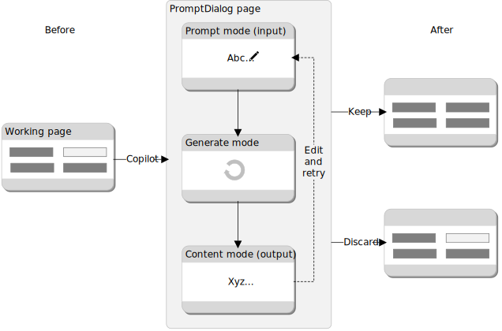
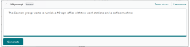

# Build a Copilot user experience with the PromptDialog page

In this article, you learn how to create the user interface for your AI solution that provides users with a copilot experience that is similar across Business Central. The fundamental component of Copilot, from the user-interface perspective, is the [PromptDialog](devenv-page-type-promptdialog.md) type page. 

<!--
The PromptDialog page type is a *multi-mode* page type that creates flow for user to enter data, generate AI-powered content, preview and revise, and finally save or discard results. The PromptDialog page type is built on the pillars of responsible AI principles, emphasizing human interaction and ethical AI usage. -->

The PromptDialog page type is an innovative page type designed for creating copilot experiences that are intuitive and interactive, but also assists users in making informed decisions about the AI-generated output. Following the principles of responsible AI, it promotes human interaction and ethical AI usage. Within the confines of a single page in the UI, the PromptDialog page type creates a comprehensive flow where users can provide input, view the subsequent output, and revise it as needed. The user can then choose to save their work or discard it. 


<!-- The PromptDialog page type is a new feature in Business Central. It's designed to create Copilot experiences, offering an interactive and user-friendly interface. Following the principles of responsible AI, it emphasizes human interaction and ethical use of AI. The page type allows users to input data, review AI-generated output, and make necessary changes. All actions, including saving or discarding work, can be done within a single page object.-->

## Design overview and flow

The PromptDialog page type has three different display modes to accommodate the flow for generating AI content: 

- The *prompt mode* is used to input data to influence the results generated by AI. You can design this mode so that input is provided manually by the user, for example, by entering data in one or more fields, or programmatically, for example by extracting existing data from a table. This mode is optional because AI logic might not require it.
- The *generate mode* is used while the platform connects to the Azure OpenAI Service and content is being generated.
- The *content mode* is used to display the AI-generated results, allowing the user to review the content, regenerate, save or discard the results. 

The following diagram illustrates the PromptDialog page type within the basic copilot flow. Your flow might vary. 
  
[](media/prompt-dialog-flow-v2.svg#lightbox)

||In UI|In AL code|Learn more|
|-|-|-|-|
|1|User starts the Copilot experience by selecting an action on a page.|An `action` control on a page runs the Promptdialog type page|[Launch experience](#launch-experience)|
|2|A Promptdialog page opens ||[Create PromptDialog type page](#create-promptdialog-type-page)
|3|User enters information that Copilot uses to generate results. |The `prompt` area of the Promptdialog page defines what the user can input, which typically consists of one or more editable fields|[Create PromptDialog type page](#create-promptdialog-type-page)<br><br>[Add prompt area](#add-the-prompt-area)|
|4|User selects a button to start generating content with Copilot|A system action `Generate` starts the AI generation process.|[Add the generate action](#add-a-system-action-to-start-ai-generation)|
|5|The AI-generated content is returned and displayed in a page|The `content` area of the PromptDialog page defines the layout of AI-generated content on the page.|[Add content area](#add-a-content-area)|
|6|User select to save or discard the results by using actions at the bottom of the page |A system action for saving and one for discarding work with a trigger respect the user's choice, and close the page||  


<!--
1. User opens the Promptdialog page to start the experience, for example, be selecting an action on another page.
1. The page opens to display a prompt area, where users can provide input, for example, text.
1. User starts the generation by AI by selecting a system action called Generate.
1. Resulting AI-generated content is returned and displayed in the Promptdialog page, arranged as defined by the page layout.
1. The user can review 
1. 
1. -->

## Create PromptDialog type page

You create the page like any other page, except consider the following properties:

```al
page 54320 "Copilot Job Proposal"
{
    Caption = 'Draft new job with Copilot';
    PageType = PromptDialog;
    Extensible = false;
    IsPreview = true;

...
}
```

|Property|Description and value|
|-||
|[PageType](properties/devenv-pagetype-property.md)|Set to `PromptDialog`.|
|[Extensible](properties/devenv-extensible-property.md)|Set to `false` to ensure that extensions for other providers don't interfere with the experience you're providing customers|
|IsPreview|This property is used to specify whether your feature is in preview or generally available. Setting this property to `true` communicates to users that the feature is in preview, which means that it's available to try out and provide feedback, but the functionality is subject to change. When you feel the feature is ready, you can change this value to `false` to communicate that the feature is generally available. We recommend that most new Copilot experiences start in preview. |

### Create the prompt mode 

In this task, you define the screen of the PromptDialog page where users can add input that used by AI generation logic for producing results. The prompt mode supports natural language input, like free text fields, and structured input, like field groups and parts. The example uses a single field that allows the user to type natural language text in an unstructured format.



The prompt mode is defined by adding an area to the page, similar to way you'd add content areas on other page types. Except, you add an `area(Prompt)` control within `layout` of the page:

```al
layout
{
    area(Prompt) 
    {
        field(ProjectDescription; UserInput)
        {
            ShowCaption = false;
            MultiLine = true;
        }
    }
```

You're AI logic might not require a prompt mode, so this area is optional. 

## Add a system action to start AI generation

In this task, you add action to the PromptDialog page that users select to start generating output with Copilot. The button appears on when the prompt area is  the. The platform includes a system action called Add a system action to generate results with Copilot.

```al
actions
{
    area(SystemActions)
    {
        systemaction(Generate)
        {
            Caption = 'Generate';
            trigger OnAction()
            begin
                RunGeneration();
            end;
        }
        ...
    }
}
```

## Add a content area

Add a content area to display the results
1. Add a data caption expression to the page.
1. Add save and discard


## Example


```al
page 50100 "Copilot Job Proposal"
{
    Caption = 'Draft new job with Copilot';
    PageType = PromptDialog;
    Extensible = false;
    IsPreview = true;
    DataCaptionExpression = UserInput;

layout
{
    area(Prompt) 
    {
        field(ProjectDescription; UserInput)
        {
            ShowCaption = false;
            MultiLine = true;
        }
    }
    area(Content)
    {
        field("Job Short Description"; JobDescription)
        {
        }
        field("Job Full Details"; JobFullDescription)
        {
        }
        field(CustomerNameField; CustomerName)
        {
        }
        part(ProposalDetails; "Copilot Job Proposal Subpart")
        {
        }
    }

    area(PromptOptions)
        {
            field(Tone; Tone) {}
            field(TextFormat; TextFormat) {}
            field(Emphasis; Emphasis){}
        }
}
actions
{
    area(SystemActions)
    {
        systemaction(Generate)
        {
            Caption = 'Generate';
            trigger OnAction()
            begin
                RunGeneration();
            end;
        }
    }
        systemaction(Regenerate)
        {
            Caption = 'Regenerate';
            ToolTip = 'Regenerate the Job proposed by Dynamics 365 Copilot.';
            trigger OnAction()
            begin
                RunGeneration();
            end;
        }
        systemaction(OK)
        {
            Caption = 'Keep it';
            ToolTip = 'Save the proposed Job.';
        }
        systemaction(Cancel)
        {
            Caption = 'Throw it away';
            ToolTip = 'Throw away the proposed Job.';
        }
}

trigger OnQueryClosePage(CloseAction: Action): Boolean
var
    SaveCopilotJobProposal: Codeunit "Save Copilot Job Proposal";
begin
    if CloseAction = CloseAction::OK then
        SaveCopilotJobProposal.Save(CustomerNo, CopilotJobProposal);
end;
}
```

## Launch experience

With this task, you add code to run the PromptDialog page. This task is done similar to the way you start any page. The following code uses an action: 

```al
action(GenerateCopilot)
{
    Caption = 'Draft with Copilot';
    Image = Sparkle;

    trigger OnAction()
    begin
        Page.RunModal(Page::"Copilot Job Proposal");
    end;
}
```

Set the [Image property](properties/devenv-image-property.md) to `Sparkle`, which is the recognized image across Microsoft products used to indicate that the action is associated with Copilot. 


## Next steps

<!--Remove all the comments in this template before you sign-off or merge to the main branch.-->
