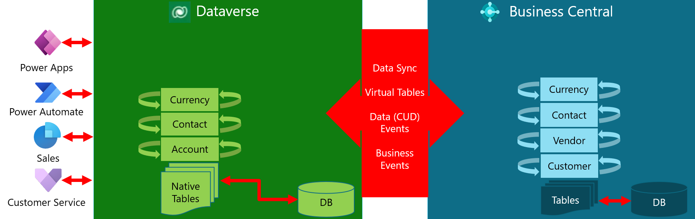
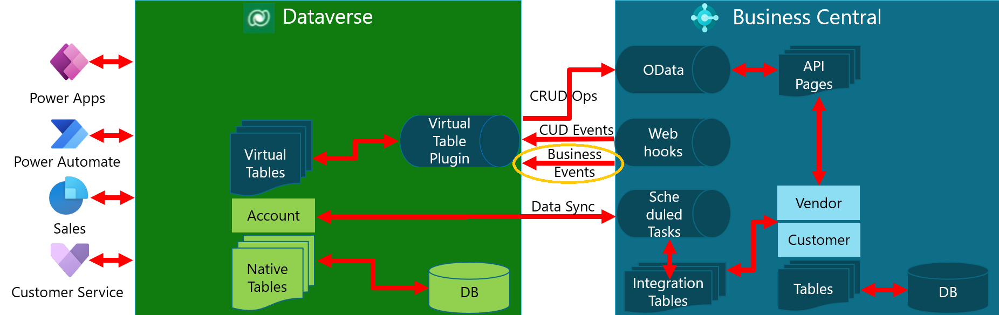
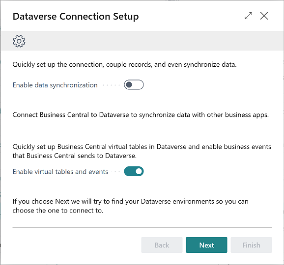
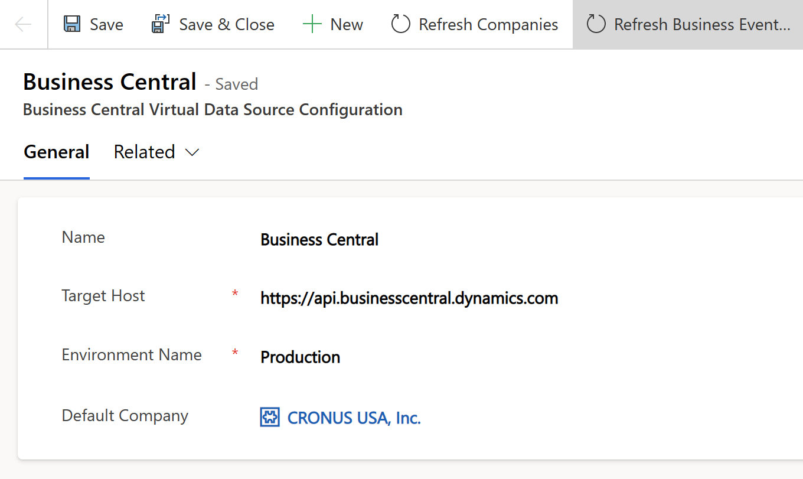
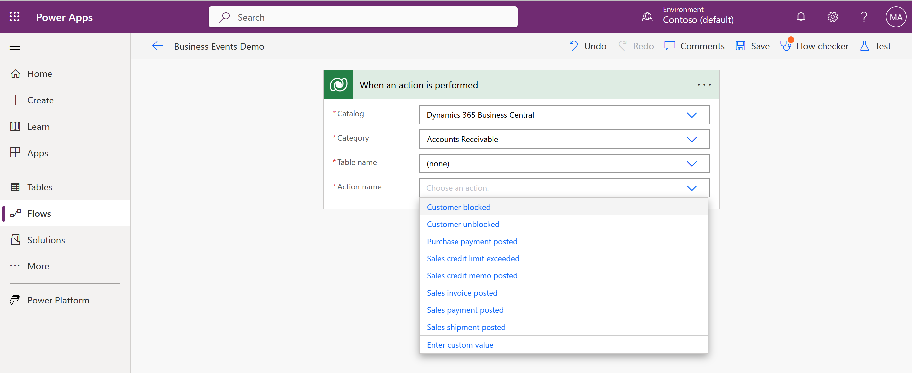

# Business events on Business Central

[!INCLUDE[azure-ad-to-microsoft-entra-id](~/../shared-content/shared/azure-ad-to-microsoft-entra-id.md)]

Integrating with Dataverse enables Business Central to interact with other apps in its ecosystem through business events. This article gives an introduction to the new business events feature, the prerequisites and step-by-step instructions to preview it, and its current limitations/future improvements.

## Introduction

There are four types of complementary app/system interactions between Business Central and Dataverse: 

- Data sync that replicates data between Business Central and Dataverse
- Virtual tables in Dataverse via Business Central API for (**C**reate/**R**ead/**U**pdate/**D**elete) operations
- Data change (**CUD**) events
- Business events

[](media/four-complementary-interactions.png#lightbox)

Business events provide our partners and customers a mechanism for notifying and triggering their external systems (Dataverse and non-Dataverse) when actions are done on Business Central. The external systems can react and perform other actions in response. With Dataverse, partners and customers can use Power Automate to subscribe to Business Central for its business events and react on other apps in its ecosystem, such as Dynamics 365 Sales or Customer Service, and others built using Power Apps. They can also react on non-Dataverse systems, such as non-Microsoft warehouse management, fulfillment, and e-invoicing services.

[](media/introducing-business-events.png#lightbox)

To learn more about Business Central and Dataverse integration, go to [  Review of Business Central & Dataverse integration](media/business-central-and-dataverse-integration.pdf).

## Prerequisites and step-by-step guidelines

To preview the new feature of business events on Business Central, do the following tasks:

1. Create or upgrade a Business Central environment with Business Central 2023 release wave 1, version 22.x.

   - On version 22.0 or 22.1, you have to build an extension that implements the *Dynamics 365 Business Central* catalog of sample business events. Go to step 2.
   - On v22.2 or later, the *Dynamics 365 Business Central* catalog of sample business events is built in. Go to step 3.
1. On v22.0 or 22.1, get the source files published in preview section of the [microsoft/bc365bcdv GitHub repo](https://github.com/microsoft/d365bcdv/tree/main/samples/Business%20Events/Private%20Preview), and then build and install an extension that implements our sample business events.

   Follow the instructions in [Build and install an extension for sample business events](https://github.com/microsoft/d365bcdv/tree/main/samples/Business%20Events/Private%20Preview#build-and-install-an-extension-for-sample-business-events) of the README.md

   > [!TIP]
   > This repo is being prepared as a one-stop-shop for Business Central and Dataverse integration.

1. In Business Central, use the **Dataverse Connection Setup** assisted setup guide to connect your Business Central environment to the Dataverse environment on which you want to submit subscriptions and receive notifications of business events.

   This assisted setup guides you to install the *Business Central Virtual Table (Preview)* app from AppSource that enables business event subscriptions/notifications on your Dataverse environment.

   > [!IMPORTANT]
   > Make sure that you install the latest version that supports business events (**1.023093.3 or higher**).

   For more information, go to [Connect Business Central to Dataverse](#connect-business-central-to-dataverse) in this article.

1. In Business Central, assign the **Ext. Events – Subscr** permission set to users who want to subscribe to specific companies for their business events.

   For more information about assigning permission sets, go to [Assign Permissions to Users and Groups](/dynamics365/business-central/ui-define-granular-permissions) in the business functionality help for Business Central.

1. In Power Apps, find and edit the **Business Central Virtual Data Source Configuration** table to refresh Business Central catalog with sample business events on your Dataverse environment.

   For more information, go to [Refresh Business Central catalog of business events](#refresh-business-central-catalog-of-business-events) in this article.

1. In Power Apps, create Power Automate flows with the **When an action is performed** trigger that query Business Central catalog, submit subscriptions, and receive notifications of business events on your Dataverse environment.

   For more information, go to [Query Business Central catalog business events on Dataverse](#query-business-central-catalog-of-business-events-in-dataverse) in this article.
1. (Optional) Following our code, build and install your own AL extension that adds custom business events to Business Central catalog.

   For more information, go to [Build and install an extension for custom business events](#build-and-install-an-extension-for-custom-business-events) in this article.

   Use the same **Business Central Virtual Data Source Configuration** table to refresh Business Central catalog with custom business events on your Dataverse environment. This step should also be done if you make changes to your custom business events. <!--For more information, go to [Refresh Business Central catalog of business events](#refresh-business-central-catalog-of-business-events) in this article.-->

1. (Optional) Query Business Central catalog, submit subscriptions, and receive notifications of business events on your non-Dataverse environment.

   For more information, go to [Query Business Central catalog of business events in non-Dataverse systems](#query-business-central-catalog-of-business-events-in-non-dataverse-systems) in this article.
1. (Optional) Fill out [our survey](https://forms.office.com/r/GkvB6pritG) to let us know what you think. You're asked for information like:

   - Which business events you plan to try or build in preview
   - Other business events we should add for general availability and in which scenarios do you expect to use these business events
   - Your email contact for us to follow up.

## Business Central catalog of business events

The following table describes the business events in Business Central catalog. These business events are readily available in version 22.2 and later but must be implemented in an extension in version 22.0 and 22.1

| **Category** | **Name** | **Description** |
|--------------|----------|-----------------|
| Accounts Payable | Purchase credit memo posted | Triggered when a purchase credit memo is posted. |
| Accounts Payable | Purchase invoice posted | Triggered when a vendor invoice is posted as part of the Procure-to-Pay process. |
| Accounts Payable | Purchase payment posted | Triggered when a vendor payment is posted as part of the Procure-to-Pay process. |
| Accounts Payable | Purchase receipt posted | Triggered when goods from a purchase order are received by the internal warehouse/external logistics company. This event can trigger Finance Department to post a purchase invoice. |
| Accounts Receivable | Customer blocked |Triggered when a customer is blocked for shipping/invoicing. |
| Accounts Receivable | Customer unblocked | Triggered when a customer is unblocked for shipping/invoicing. |
| Accounts Receivable | Sales credit limit exceeded | Triggered when the credit limit for a customer is exceeded due to a posted sales invoice/changed credit limit for that customer. |
| Accounts Receivable | Sales credit memo posted | Triggered when a sales credit memo is posted. |
| Accounts Receivable | Sales invoice posted | Triggered when a sales invoice is posted as part of the Quote-to-Cash process. |
| Accounts Receivable | Sales payment posted | Triggered when a customer payment is posted as part of the Quote-to-Cash process. |
| Accounts Receivable | Sales shipment posted | Triggered when goods from a sales order are shipped by the internal warehouse/external logistics company. This event can trigger Finance Department to post a sales invoice. |
| Opportunities | Opportunity activated | Triggered when an opportunity is activated as part of the Quote-to-Cash process. |
| Opportunities | Quote created for opportunity | Triggered when a quote is created for an opportunity as part of the Quote-to-Cash process. |
| Opportunities | Winning quote converted into sales order | Triggered when a winning quote for an opportunity is converted into a sales order as part of the Quote-to-Cash process. |
| Opportunities | Opportunity closed as lost | Triggered when a lost opportunity is closed as part of the Quote-to-Cash process. |
| Purchasing | Purchase order released | Triggered when a purchase order is released to the internal warehouse/external logistics company, so they're ready to receive goods coming their way. This trigger occurs when the Release button is clicked on Purchase Order page in Business Central. |
| Sales | Sales order released | Triggered when a sales order is released to the internal warehouse/external logistics company, so they're ready to pick and ship goods. This trigger occurs when the Release button is clicked on Sales Order page in Business Central. |

## Connect Business Central to Dataverse

To connect your Business Central environment to a Dataverse environment on which you want to submit subscriptions and receive notifications of business events, follow these steps:

1. In Business Central, in the upper-right corner, select the **Settings** icon > **Assisted setup** > **Set up a connection to Dataverse** to open the **Dataverse Connection Setup** assisted setup guide.  
1.	Turn on the **Enable virtual tables and events** switch, and then select **Next**.

    

1.	Review the relevant terms and conditions. If you agree to the terms, turn on the **I accept** switch and then select **Next**.
1.	Specify your Dataverse environment URL, sign in as an administrator user, and select **Next**.
1.	Install the **Business Central Virtual Table (Preview)** app from [AppSource](https://appsource.microsoft.com/product/dynamics-365/microsoftdynsmb.businesscentral_virtualentity).

    This app enables business event subscriptions and notifications on your Dataverse environment. Make sure that you install the latest version that supports business events (**1.023093.3 or later**).

    [](media/virtual-table-plugin.png#lightbox)

1. Finally, in the **Dataverse Connection Setup** guide, select **Finish** when done.

To learn more about connecting Business Central to Dataverse, go to [Connect to Microsoft Dataverse](/dynamics365/business-central/admin-how-to-set-up-a-dynamics-crm-connection) in the business functionality help for Business Central.

## Refresh Business Central catalog of business events

To refresh the business event catalog after installing your extension, follow these steps: <!--Do you mean vistual table app?-->

1.	Sign in to [Power Apps]( https://make.powerapps.com).
1. Select **Tables**, search for **Business Central Virtual Data Source Configuration** under the **All** tab, and then select it.
1.	Select the **Edit**, select the **Business Central** row, and then select **Edit row using form** to open a form.
1.	Select **Refresh Business Event Catalog** on the form.

   [](media/refresh-business-event-catalog.png#lightbox)

## Query Business Central catalog of business events in Dataverse

To query Business Central catalog, submit subscriptions, and receive notifications of business events in your Dataverse environment, follow these steps:

1.	In Power Apps, select the **Flows**,  and create Power Automate flows with the Dataverse **When an action is performed** trigger.
1.	Select the **Dynamics 365 Business Central** catalog, then do the following:

   1. Select one of the categories, such as **Accounts Receivable**
   1. Select *(none)* as table name.
   1. Select one of the business events to subscribe in that category, such as *Customer blocked*, as action name.
1.	Select the **+ New step** button to continue your flows to process the received notifications.


   [](../developer/media/power-automate-flow3.png#lightbox)

## Build and install an extension for custom business events

To build and install an extension that implements custom business events, see our code in the published source files and follow these steps:

1.	Identify or create relevant AL files to code your custom business events.
1.	Identify existing categories for your custom business events or create new ones using the extensible `enum`.
1.	Create a procedure with an empty body for each custom business event.
1.	Add the `ExternalBusinessEvent` attribute to define the business event name, display name, description, and category.
1.	Add the optional `RequiredPermissions` attribute to enforce more permissions for users to subscribe.
1.	Add the required parameters to define the business event payload.
1.	Identify a specific AL event to subscribe and invoke the custom business event procedure with appropriate parameters when it occurs.
1.	Build an extension by adding those files to your AL project in Visual Studio Code.

    For more information, see [Developing in AL](devenv-dev-overview.md).

1.	Install the extension on your Business Central environment.

    For more information, see [Installing Extensions in Business Central](/dynamics365/business-central/ui-extensions-install-uninstall).

1. Use the **Business Central Virtual Data Source Configuration** table to refresh the Business Central catalog with custom business events on your Dataverse environment (see [previous section](#refresh-business-central-catalog-of-business-events)).

```al
enumextension 50101 MyEnumExtension extends EventCategory
{
   value(0; "Sales")
   {
   }
}

codeunit 50102 MyCodeunit 
{ 
   trigger OnRun()
   begin
   end; 

   [ExternalBusinessEvent('salesorderposted', 'Sales order posted', 'Triggered when sales order has been posted', EventCategory::"Sales")]
   [RequiredPermissions(PermissionObjectType::TableData, Database::"Sales Header", 'R')] // optional
   procedure SalesOrderPosted(salesOrderId: Guid; customerName: Text; orderNumber: Text)
   begin
   end;
   
   [EventSubscriber(ObjectType::Page, Page::"Sales Order", 'OnPostDocumentBeforeNavigateAfterPosting', '', true, true)] 
   local procedure OnPostDocument(var SalesHeader: Record "Sales Header"; var PostingCodeunitID: Integer; var Navigate: Enum "Navigate After Posting"; DocumentIsPosted: Boolean; var IsHandled: Boolean) 
   begin
      SalesOrderPosted(SalesHeader.SystemId, SalesHeader."Sell-to Customer Name", SalesHeader."No."); 
   end;
} 
```

## Query Business Central catalog of business events in non-Dataverse systems

Business Central exposes specific APIs for business events that can be used to:

- Query Business Central catalog for business event definitions
- Submit business event subscriptions w/ your own notification URL

The *Business Central Virtual Table (Preview)* app uses the same APIs to query Business Central catalog and submit subscriptions of business events for Power Automate flows.

### Query Business Central catalog of business events

To query Business Central catalog for business event definitions, you can send a request to the *externalbusinessdefinitions* endpoint:

```json
Request: GET api/microsoft/runtime/v1.0/externalbusinesseventdefinitions

Response: "value": [{
   "category": "Sales",
   "name": "salesorderposted",
   "displayName": "Sales order posted",
   "description": "Triggered when sales order has been posted",
   "payload": "[{\"Index\":0,\"Name\":\"salesOrderId\",\"Type\":\"Guid\"},{\"Index\":1,\"Name\":\"customerName\",\"Type\":\"Text\"},{\"Index\":2,\"Name\":\"orderNumber\",\"Type\":\"Text\"}]",
   "appId": "xxxxxxxx-xxxx-xxxx-xxxx-xxxxxxxxxxxx",
   "appName": "MyBCExtension",
   "appVersion": "1.0.0.0",
   "appPublisher": "Default publisher"
}]
```

For each business event, the response to your request contains the following data:

- `category`: The enum value of category for this business event
- `name`: The name of this business event
- `displayName`: The display name of this business event
- `description`: The description of this business event
- `payload`: The serialized text in JSON format that defines the payload parameters for this business event. Each payload parameter is defined by an array of objects in JSON format, for example: <!--this was tagged as yaml>

   ```json
   {
     "Index": 0,
     "Name": "salesOrderId",
     "Type": "Guid"
   }
   ```

   The objects that define each payload parameter are:

   - `Index`: The index counter for this payload parameter 
   - `Name`: The name of this payload parameter
   - `Type`: The type of this payload parameter – We use Business Central parameter types that allow only the following values: `Byte`, `Char`, `Guid`, `Text`, `Text[length]`, `String`, `Enum`, `Code`, `Boolean`, `Decimal`, `Integer`, `BigInteger`, `Date`, `Time`, `DateTime`, `Option`, `RecordId`, `ObjectType`

- `appId`: The GUID of Business Central extension that implements this business event
- `appName`: The name of Business Central extension that implements this business event
- `appVersion`: The version of Business Central extension that implements this business event
- `appPublisher`: The publisher of Business Central extension that implements this business event

Any authenticated Business Central user can query Business Central catalog for business event definitions.

### Submit subscriptions of business events

To submit business event subscriptions with your own notification URL, you can send requests to the `externaleventsubscriptions` endpoint:

```json
Request: POST api/microsoft/runtime/v1.0/externaleventsubscriptions
{
   "companyName": "CRONUS USA, Inc.",
   "companyId": "xxxxxxxx-xxxx-xxxx-xxxx-xxxxxxxxxxxx",
   "eventName": "salesorderposted",
   "appId": "xxxxxxxx-xxxx-xxxx-xxxx-xxxxxxxxxxxx",
   "notificationUrl": "https://webhook.site/xxxxxxxx-xxxx-xxxx-xxxx-xxxxxxxxxxxx",
   "clientState": "" (optional)
}

Response: Empty w/ status code 201 Created
```

For each business event, your request must contain the following data:

- `companyName`: The name of company to subscribe for this business event
- `companyId`: The GUID of company to subscribe for this business event
- `eventName`: The name of this business event
- `appId`: The GUID of Business Central extension that implements this business event
- `notificationUrl`: The URL to post notifications of this business event 
- `clientState`: The optional string associated with this business event subscription that can be used to validate any caller's posting to the notification URL

Only Business Central users who have been assigned the **Ext. Events – Subscr** permissions set can subscribe to specific companies for their business events.  Subscribers must have READ access to the **ExternalBusinessEventDefinition** table in subscribed companies.  Additionally, they must have relevant access in the subscribed companies as defined by the optional `RequiredPermissions` attribute.

### Receive notifications of business events

When a business event occurs and a subscription exists for it, Business Central sends a request to the relevant notification URL:

```json
Request: POST https://webhook.site/xxxxxxxx-xxxx-xxxx-xxxx-xxxxxxxxxxxx
{
   "initiatingUserAADObjectId": "xxxxxxxx-xxxx-xxxx-xxxx-xxxxxxxxxxxx",
   "timestamp": "2023-02-20T10:27:35.8770000Z",
   "companyName": "CRONUS USA, Inc.",
   "companyId": "xxxxxxxx-xxxx-xxxx-xxxx-xxxxxxxxxxxx",
   "eventName": "salesorderposted",
   "payload": 
   {
     "salesOrderId": "xxxxxxxx-xxxx-xxxx-xxxx-xxxxxxxxxxxx",
     "customerName": "Adatum Corporation",
     "ordernumber": "S-ORD101005"
   },
   "appId": "xxxxxxxx-xxxx-xxxx-xxxx-xxxxxxxxxxxx",
   "clientState": ""
}
```

This request contains the following data:

- `initiatingUserAADObjectId`: The Microsoft Entra object ID of user who initiated this business event
- `timestamp`: The timestamp when this business event occurred (UTC)
- `companyName`: The name of company where this business event occurred
- `companyId`: The GUID of company where this business event occurred
- `eventName`: The name of this business event
- `payload`: The payload of this business event with parameter names and values that match their definitions
- `appId`: The GUID of Business Central extension that implements this business event
- `clientState`: The optional string associated with this business event subscription that can be used to validate any caller's posting to the notification URL

Subscribers must still have READ access to the `ExternalBusinessEventDefinition` table in subscribed companies.  Additionally, they must still have relevant access in the subscribed companies as defined by the optional `RequiredPermissions` attribute.

## Current limitations and future improvements

This feature has the following limitations that will be either removed or improved on in a future update:

- When creating Power Automate flows with the **When an action is performed** trigger, you can't select specific companies to subscribe for their business events, so business event subscriptions are submitted for all companies accessible to you for now.
- Translation and versioning for business events aren't supported for now.
