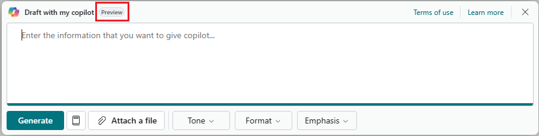

# Create prompt dialog page for Copilot

The first step in designing the Copilot UI is creating a page of the type `PromptDialog`. Once you create the prompt dialog page following this article, you use it to build the different display modes needed for your Copilot extension, including prompt, generate, and content.

For an overview building of the Copilot UI, refer to [Build Copilot user experience](ai-build-experience.md).

## Create a prompt dialog page

You create a prompt dialog page similar to any other page, except it has some specific properties to consider, as shown in the following code snippet:

```al
page 50100 "My Copilot"
{
    Caption = 'Draft with my Copilot';
    PageType = PromptDialog;
    Extensible = false;
    PromptMode = Prompt;
    IsPreview = true;
...
}
```

|Property|Description and value|
|-|-|
|[PageType](properties/devenv-pagetype-property.md)|Set to `PromptDialog`.|
|[Extensible](properties/devenv-extensible-property.md)|Set to `false` to ensure that extensions for other providers don't interfere with the experience you're providing customers.|
|[PromptMode](properties/devenv-promptmode-property.md)|Specifies which mode you want to page to display when it first opens. The default is `Prompt`. For more information, go to [Specify the mode in which the PromptDialog opens](#specify-the-mode-in-which-the-promptdialog-opens).|
|[IsPreview](properties/devenv-ispreview-property.md)|This property is used to specify whether your feature is in preview or generally available. Setting this property to `true` applies a **Preview** label on all display modes of the prompt dialog page, as illustrated in the following figure. The **Preview** label communicates to users that the feature is available to try out and provide feedback, but the functionality is subject to change. When you feel the feature is ready, you can change this value to `false` to communicate that the feature is generally available. We recommend that most new Copilot experiences start in preview. |



## Specify the mode in which the PromptDialog opens

By default, the PromptDialog page opens in the prompt mode. In some scenarios, this behavior might not be desired. For example, consider [marketing text suggestions with Copilot](/dynamics365/business-central/ai-overview) from Business Central. This Copilot experience includes a prompt mode that  is used for changing item attributes. However, when users start the Copilot, it opens directly in the generate mode, then moves to the content mode. In the content mode, users can choose to open the prompt mode to change the input to AI, in this case, the item attributes.

There are two ways to change the mode that PromptDialog page opens. One way is to use `PromptMode` property, as previously mentioned. The other way to change the mode at runtime, for example, by using the [OnInit](triggers-auto/page/devenv-oninit-page-trigger.md):

```al
trigger OnInit()
begin
    CurrPage.PromptMode := PromptMode::Generate;
end;
```

In both cases, the trigger defined for the `systemaction(Generate)` control is automatically invoked.

## Next steps

- [Design Copilot prompt mode](copilot-design-prompt-mode.md)
- [Design Copilot content mode](copilot-design-content-mode.md)
- [Customize Copilot generate mode](copilot-customize-generate-mode.md)
- [Launch Copilot](copilot-launch-experience.md)

