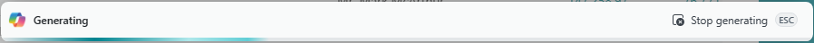
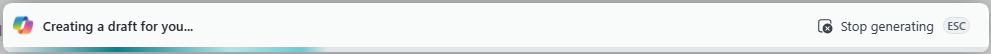

# Customize generate mode caption of the prompt dialog page

In this article, you learn how to change the caption shown in the UI when copilot is retrieving generated results from the Azure Open AI service. The UI is defined by the generate mode of the prompt dialog page. Its purpose is to give users feedback about what's happening with copilot. The caption functions as a kind of progress bar for the user. By default, the caption of PromptDialog page when it's in the generate mode is **Generating**, as illustrated in the following figure:

[](media/promptdialog-generate-mode.png#lightbox)

Customizing the caption enables you to give users more specific feedback about what copilot is doing or how it's progressing. This feedback is especially useful if the Copilot consists of multiple steps or takes a long time.

## How to change the caption

You customize the caption by using the [Dialog.Open()](methods-auto/dialog/dialog-open-method.md) or [Dialog.Update()](methods-auto/dialog/dialog-update-method.md) methods. 

<!--The following code snippet changes the caption to **Creating a draft for you...** by calling `Dialog.Open()` from the `RunGenration()` procedure, which is run from the `systemaction(Generate)` and `systemaction(Regenerate)`actions:-->

<!--
```al
systemaction(Generate)
{
    trigger OnAction()
    var
        ProgressDialog: Dialog;
    begin
        ProgressDialog.Open('Creating a draft for you...');
    end;
}
```


```al
local procedure RunGeneration()
var
    GenerateModeProgress: Dialog;
    ...
begin
    GenerateModeProgress.Open('Creating a draft for you...');
    ...
end

```
-->

There are various ways to use the `Dialog.Open()`and `Dialog.Update()` to change the generate mode's caption. Refer to the two examples that follow for inspiration.


For example, you can call the methods directly from the `OnAction()` trigger of `Generate` and `Regenerate` actions. procedure).

## Example: From the OnAction() trigger

The following code example illustrates how to change the generate mode caption directly from the `OnAction()` trigger of `Generate` and `Regenerate` actions:

```al
systemaction(Generate)
{
    trigger OnAction()
    var
        GenerateModeProgress: Dialog;
    begin
        GenerateModeProgress.Open('Creating a draft for you...');
    end;
}

systemaction(Regenerate)
{
    trigger OnAction()
    var
        GenerateModeProgress: Dialog;
    begin
        GenerateModeProgress.Open('Revising the draft...');
    end;
}

```

## Example: From the RunGeneration() procedure

This example calls the `Dialog.Open()` method from the procedure that generates the results (for purposes of this article, the `RunGeneration()`). The following code snippets use the `OnAction()` trigger together with the `RunGeneration()` procedure
to change the caption to:

- **Creating a draft for you...** when generating the first draft with copilot.
- **Revising the draft for you...** when regenerating a draft.

```al
systemaction(Generate)
{
    Caption = 'Generate';

    trigger OnAction();
    begin
        RunGenerate(CopilotGeneratingTxt);
    end;
}
systemaction(Regenerate)
{
    Caption = 'Regenerate';
    trigger OnAction()
    begin
        RunGenerate(CopilotRegeneratingTxt);
    end;
}
```

```al
local procedure RunGenerate(ProgressTxt: Text)
begin
    GenerateModeProgress.Open(ProgressTxt);
    //GenerateModeProgress.Open('Creating a draft for you...');
    generatedOutput := 'This is the output for: ' + userInput;

end;

var
    GenerateModeProgress: Dialog
```

The following figure shows the customized generate mode caption in the UI for the **Generate** action is selected:

[](media/promptdialog-generate-mode-custom.png#lightbox)

For a more complex example, refer to `RunGeneration()` procedure in the `CopilotJobProposal.Page`of the [Advanced_SuggestJob sample on GitHub](https://github.com/microsoft/BCTech/blob/002affcf1520a710c270257d6547e25a9a223e85/samples/AzureOpenAI/Advanced_SuggestJob/DescribeJob/CopilotJobProposal.Page.al).

## Next steps

- [Design copilot prompt mode](copilot-design-prompt-mode.md)
- [Design copilot content mode](copilot-design-content-mode.md)
- [Launch copilot](copilot-launch-experience.md) 
