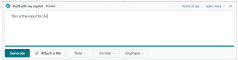
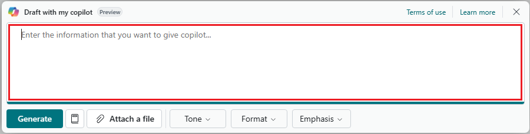
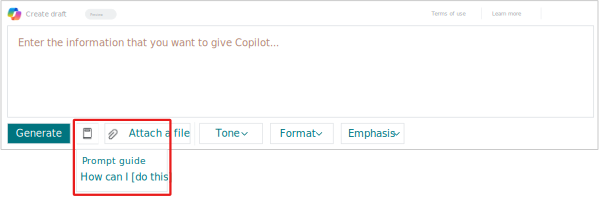
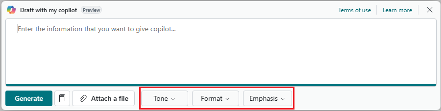

# Design the prompt mode of prompt dialog page

In this article, you learn how to design the Copilot screen where users can add input that the AI generation logic uses for producing results. The screen is defined by the prompt mode of the PromptDialog page. The prompt mode is optional because not all AI designs required it. Also, you might need a prompt mode, but it doesn't have to be the first mode presented to the user in the Copilot experience.

The following figure illustrates an example of the prompt mode. The prompt mode UI consists of several elements, which are described in the sections that follow.

[](media/promptdialog-prompt-mode-prompt-area-no-callout.svg#lightbox)

For an overview building the Copilot UI, go to [Build Copilot user experience](ai-build-experience.md).

## Prerequisites

[Create the prompt dialog page](copilot-create-promptdialog.md)

## Add the prompt area

The prompt area is where users can provide input to the AI generation. The prompt area supports natural language input (like free text fields) and structured input (like field groups and page parts). The example uses a single field that allows the user to type text in an unstructured format.

[](media/promptdialog-prompt-mode-prompt-area.png#lightbox)

The prompt area is defined by adding an `area` control to the `layout` of the page, similar to way you'd add content areas on other page types. Except you use the syntax `area(Prompt)`:

```al
layout
{
    area(Prompt) 
    {
        field(input; UserInput)
        {
            ApplicationArea = All;            
            ShowCaption = false;
            MultiLine = true;
            // Adds placeholder text.
            InstructionalText = 'Enter information that describes that you want to give Copilot...'; 
        }
    }
}
```

Within `area(Prompt)`, you can add one or more fields, groups, and page parts. `Prompt` supports all `area()` controls except the `repeater` control. Instead of a `repeater`, you can use a `ListPart` control.

> [!NOTE]
> The code example is a special case where the first field on the PromptDialog page is shown as a multiline input with `ShowCaption=false`. In this case, the page caption serves as the caption for the input field. For accessibility and usability reasons, other fields on the page should continue to have their captions visible.

### Add placeholder text

For fields of data type [Text](methods-auto/text/text-data-type.md), [BigText](methods-auto/bigtext/bigtext-data-type.md), [Code](methods-auto/code/code-data-type.md), or [GUID](methods-auto/guid/guid-data-type.md), you can use the [InstructionalText property](properties/devenv-instructionaltext-property.md) to add placeholder text in the field. The purpose of placeholder text is help users understand what they should enter as a prompt. The placeholder text disappears as soon as the user enters text in the field.

> [!NOTE]
> Placeholder text appears only if the field and page are editable. It's not shown if the [Editable property](properties/devenv-editable-property.md) of the page or field is set to `false`.

Here are some guidelines for using placeholders:

- Keep the placeholder text short, succinct, and specific to the field, page, or prompt dialog. Don't use entirely generic text like `Enter description here`. Don't use entirely generic text like `Enter description here`. Instead, make the text contextual to the specific field, page, or prompt dialog so that there's real informational value. Don't repeat what the prompt dialog title says, but use text that naturally extends what the title says to guide the user along.
- Don't require the user to use the value of `InstructionalText`  property to complete their task. The reason is that the full text might not always be visible depending on screen size, device type, orientation, page layout, and similar.
- The placeholder text isn't the same as the *name* or *label* of the field&mdash;it's supplemental information. Don't use the `InstructionalText` property on fields as a replacement for the [Caption property](properties/devenv-caption-property.md).
- Use placeholder text only when the extra guidance is helpful for users to get started. Overuse of placeholder, such as applying it to all fields on a page, might be distracting and diminish its effectiveness.
- Use placeholder text instead of implementing instructions as "captionless" fields outside of the input field. This practice keeps your page design compact.
- Placeholder text provides hints about how to fill in a field, where the instruction is only shown while the field is empty. Conversely, field tooltips can explain in moderate detail what the field is about and how to use it, and they're available even if a field isn't empty.

## Add prompt guides

A prompt guide is a predefined list of prompt texts that users can choose from by selecting **Prompt guide**  on the prompt dialog page.

[](media/promptdialog-prompt-mode-prompt-guide.svg#lightbox)

The prompt guide saves users time because they don't have to write prompts from scratch. Plus, it can help them to understand how to write prompts to get the results they want.

To create a prompt guide, you add an action area on `PromptDialog` pages, called `PromptGuide`. You then add an individual `action` control for each prompt you want to include in the prompt guide. For example:

```al
actions
{
    area(PromptGuide)
    {
        action(MyPromptAction)
        {
            Caption = 'How can I [do this]';
            ToolTip = 'Ask Copilot for help with a specific task.';

            trigger OnAction()
            begin
                InputProjectDescription := 'How can I [do this]';
            end;
        }
    }
}


var 

    InputProjectDescription: Text;
```

[Learn more about prompt guides](devenv-page-promptguide.md) and about [Error handling in prompt dialogs](devenv-page-prompt-error-handling.md).

## Add a generate action

In this task, you add action to the PromptDialog page that users select to start generating output with Copilot and AI. 

[](media/promptdialog-prompt-mode-generate.svg#lightbox)

The `PromptDialog` page type supports several *system actions* that appear as buttons in the UI. You add these actions in the `actions` control on the page like you would any other action. Except you define the system actions by first adding an `area(SystemActions)` control, then using the `systemaction()`control to define the specific action. In this case, you use a `systemaction(Generate)` control. 

```al
actions
{
    area(SystemActions)
    {
        systemaction(Generate)
        {
            Caption = 'Generate';
            trigger OnAction()
            begin
                // The code triggering the Copilot interaction. This is where you call the Copilot API, and get the results back. You must implement this yourself. 
                RunGeneration();
            end;
        }
        ...
    }
}
```

Use the [OnAction()](triggers-auto/action/devenv-onaction-action-trigger.md) to call generative AI code, in this case the `RunGeneration()` procedure. This trigger is invoked when the user selects the button or when the page is opened in generate mode.

The code of the `RunGeneration` procedure, you must implement yourself. This procedure is where you call the Copilot API, and get the results back.

For an example on how to implement the `RunGeneration` procedure, see [BCTech samples AzureOpenAI](https://github.com/microsoft/BCTech/blob/002affcf1520a710c270257d6547e25a9a223e85/samples/AzureOpenAI/Basic_ItemSubstitution/PromptDialog/ItemSubstAIProposal.Page.al#L111).

For an example on building an AI capability, see [Build the Copilot capability in AL](ai-build-capability-in-al.md).

## Add a file attachment action

In this task, you add action to the PromptDialog page that enables users to select a file to upload in the prompt area. The content of the file can provide input to the AI generation.

[](media/promptdialog-prompt-mode-attach.svg#lightbox)

Like the system action for generating AI, there's also a system action for attaching a file. In this case, you use a `systemaction(Attach)` control.

```al
actions
{
    area(SystemActions)
    {
        systemaction(Attach)
        {
            Caption = 'Attach a file';
            ToolTip = 'Attach a file describing the job.';
            trigger OnAction()
            var
                InStr: InStream;
                Filename: Text;
            begin
                UploadIntoStream(‘Select a file...', '', ‘All files (*.*)|*.*', Filename, InStr);
                if not (Filename = '') then begin
                ...
            end;
        end;
        }
    }
}
```

## Add preference options

In this task, you add actions to the PromptDialog page that enable users to set style preferences to influence the AI-generated output. The options appear as buttons in the UI to the right of the system actions.

[](media/promptdialog-prompt-mode-options.png#lightbox)

You add the options by using in a `area(PromptOptions)` control with the `actions` control. Each option is defined by a field using the `field` control. Only fields of the [option data type](methods-auto/option/option-data-type.md) are supported.

```al
actions
{
    area(PromptOptions) 
    {          
        field(tone; Tone)
        {
        }
        field(format; Format)
        {
        }
        field(emphasis; Emphasis)
        {
        }
    }
}
```

## Next steps

- [Design Copilot content mode](copilot-design-content-mode.md)
- [Customize Copilot generate mode](copilot-customize-generate-mode.md)
- [Launch Copilot](copilot-launch-experience.md)