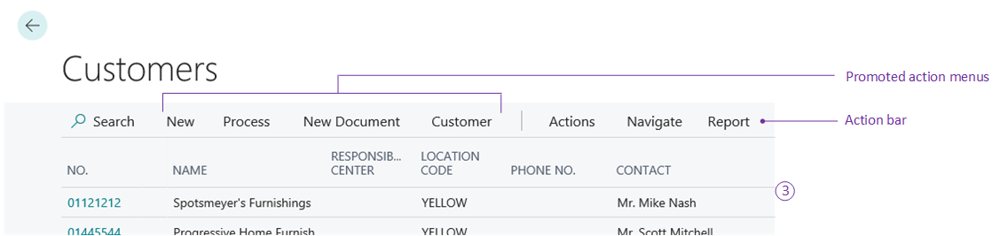

# Actions Overview

In [!INCLUDE[d365fin_long_md](includes/d365fin_long_md.md)], actions are displayed at the top of each page, referred to as the action bar. In this article, you learn about different types of actions, and how you can enable users to quickly locate the actions they want to use.  
  
The actions can be displayed in different menus on the action bar.

 

You can choose from the following action menus to place the actions in the specified area.
  
|Area |Syntax| Used on|Description|Example|  
|---------------|--|-------|-----------|-------|  
|Actions menu|`area(processing)`| Role Center, list, card, and task pages|User tasks|Post a sales order|
|New document group in Actions menu|`area(creation)` |List, card, Role Center pages, and task pages|Actions that appear under the New group. Opens a new [!INCLUDE[d365fin_md](includes/d365fin_md.md)] document.|New sales invoice|  
|Navigate menu|`area(navigation)` |List, card, and task pages|Links to other pages in [!INCLUDE[d365fin_long_md](includes/d365fin_long_md.md)].|Prices|  
|Report menu|`area(reporting)` |Role Center, list, card, and task pages|A list of available reports.|Customer Top 10 List| 
  
The following actions are related to the Role Center page.

|Area |Syntax |Used on |Description |Example |  
|-----|----------------|-------|-----------|-------| 
|Navigation menus|`area(sections)`|Role Center pages|The top-level navigation consists of one or more root items that expand to display a submenu of links to other pages. |Posted sales invoices|  
|Navigation bar|`area(embedding)`|Role Center pages|The second-level navigation displays a flat list of links to other pages.|Customers|  

For more information about actions used on the role center page, see [Designing Role Centers](devenv-designing-role-centers.md).
 
## Types of Actions

> [!TIP]  
> If you used to work in [!INCLUDE[dyn_nav_md](includes/dyn_nav_md.md)], you can get an overview of the mapping between actions in the [Differences in the Development Environments](devenv-differences.md#pages) topic.

Each page has a different set of actions depending on the page type, and the processes that the page supports. In order to create the appropriate set of actions for a particular page, you should have a good understanding of your customer's business processes.  
  
Each process in an organization has several actions associated with it. You should try to create a full set of actions that mirror all tasks and processes that are performed.  
  
For example, the Sales Orders list page at CRONUS International contains all actions related to processing sales orders. During user configuration and personalization, some of these actions may be hidden or promoted to the ribbon. Therefore, you must create a full set of actions for the customer. 

> [!NOTE]  
> With [!INCLUDE [prod_short](includes/prod_short.md)] 2022 release wave 2, the way that you promote actions on pages or page extensions has changed. Promoting actions is defined in a specific section of the page definition and contains a reference to the action. For more information, see [Promoted Actions](devenv-promoted-actions.md).
 

Pages can have the following actions as described in each section below.  
  
## Actions menu

The Actions menu is a displayed in the action bar on all page types, and contains relevant tasks for the current page. Typically, you add processing tasks and creation tasks in the Actions menu. To add processing actions such as posting a sale order, you must use the `processing` action area. They're regular daily tasks. Therefore, they must be on the Actions menu. For examples on how to add actions to the Actions menu, see [Adding Actions to a Page](devenv-adding-actions-to-a-page.md). 

Some examples from the Customer page are as follows:
  
- Sales Invoice  
  
- Sales Quote  
  
- Sales Credit Memo  
  
- Ledger Entries  
  
- Invoice Discounts  
  
- Prices  
  
- Line Discounts  

You can add actions to the Actions menu, group actions together under action sub menus, or promote them to the ribbon. For examples of how to use actions, see [Page Object](devenv-page-object.md) and [Page Extension Object](devenv-page-ext-object.md).
  
### New Document menu

The New Document menu is often displayed both as a top-level menu in the actions bar and as a sub menu in the Actions menu. You can use this menu to open new documents within [!INCLUDE[d365fin_md](includes/d365fin_md.md)]. You can add an action to create a new document such as creating a new sales invoice. This action displays in a separate menu called **New document** in the Actions menu. To add to the New document menu, you must use the `creation` action area.
  
For example, on the Customers page, if the order processor wants to create a new invoice, the order processor can open the new page directly from the Actions menu, which is useful when creating new sales invoices daily. 

<!-- ### Home Items  
 Home Items are actions that appear under the Home button, on the Role Center navigation pane. This navigation has a tree structure, and each node in the tree links to a list page.  
  
 The user Role Center is like a home page, and home items in the navigation pane are links to the user's most useful list pages. For more information, see [Setting Up the Home Button and Home Items](Setting-Up-the-Home-Button-and-Home-Items.md). -->

## Navigate menu

The Navigate menu is displayed after the Actions menu in the action bar. Rather than providing tasks for the user, this menu provides additional information by taking the user to a specific page in [!INCLUDE[d365fin_md](includes/d365fin_md.md)]. To add a page link in the Navigate menu, you must use the `navigation` action area. These actions act like a bookmark to enable quick access to view a page. <!-- For examples on how to link pages in the Navigate menu, see [Adding Page Links to Navigate Menu](devenv-adding-page-links-to-navigate-menu.md). -->
  
> [!NOTE]  
> You should not add a Navigation action to a Role Center page.  
  
## Report menu

The Report menu is displayed after the Navigate menu in the action bar. The Reports menu lists the reports most relevant to a page. If a user doesn't require a Report menu, then the menu is hidden. Sometimes it's relevant to promote the most important reports to the top-level in the action bar to save the user from too many clicks. To create an action in the Report menu, you must use the `reporting` action area. 

 <!--
### Activity Buttons  
 If there are too many Home items to fit on the Role Center without scrolling, then activity buttons can be used to group other important processes together.  
  
 Example: The Order Processor Role Center could have activity buttons called Approving Web Orders, or Sales Forecasting. These are secondary activities for the order processor, so they do not have to be included under the Home button.  
  
 Each activity button has its own navigation pane, with links to list pages and can be configured just like the user Role Center.  
  
 For more information, see [Creating Activity Buttons for the Navigation Pane](Creating-Activity-Buttons-for-the-Navigation-Pane.md)  -->

## Promoted Actions 

> [!NOTE]  
> With [!INCLUDE [prod_short](includes/prod_short.md)] 2022 release wave 2, the way that you promote actions on pages or page extensions has changed. Promoting actions is defined in a specific section of the page definition and contains a reference to the action. For more information, see [Promoted Actions](devenv-promoted-actions.md).

Promoted actions are actions that are set up on the Actions, Navigate, or Reports menus in the action bar, but are also configured to display in custom menus in the action bar. Although the actions are set up on the Actions, Navigate, or Report menus, you can choose to hide them on these menus and only show them in custom menus.

<!-- 
### Home menu 
The Home menu is always displayed first so promoted actions provide quick access to common tasks, because users do not have to browse through a menu to access them. You can promote any command from the existing actions menus to the ribbon. If there are no promoted actions, the ribbon remains hidden. For more information, see [Promoted Property](properties/devenv-promoted-property.md).
-->

## Run Power Automate flows from page actions

[!INCLUDE [2022_releasewave2](../includes/2022_releasewave2.md)]

With [!INCLUDE [prod_short](includes/prod_short.md)] 2022 release wave 2, it's possible to define page actions that trigger a Power Automate flow using custom actions. Custom actions are defined next to other actions, but use the `customaction` keyword instead. The syntax is as follows:

```al
customaction(MyFlowAction)
{
    CustomActionType = Flow;
    FlowId = '<the-GUID-identifying-the-Power-Automate-Flow>';
    FlowEnvironmentId = '<the-GUID-identifying-the-Power-Automate-environment>';
}
```

For a `customaction`, the [CustomActionType Property](properties/devenv-customactiontype-property.md) must be set to `Flow`. The [FlowId Property](properties/devenv-flowid-property.md) and the [FlowEnvironmentId Property](properties/devenv-flowenvironmentid-property.md) must specify the IDs of the flow and the environment of the flow. These properties make up the target flow identity, allowing the client to trigger the flow when the custom action is invoked.

## Grouping Actions in Submenus

Within the different areas, you can create submenus to a group of actions and improve navigation. You create a submenu by adding a `group()` control, as shown in the following example:  

```AL
actions
{
    area(Report)
    {
        action(Report 1)
        {
            RunObject = report "Report1";
        }

        // Adds a submenu called "Group1" to the Report menu. 
        group(Group1)
        {
            // Adds the action "Report 2" to the My Label submenu. 
            action(Action2)
            {
                RunObject = report "Report2";
            }
            // Adds a submenu called "Group2" to the Group1 submenu. 
            group(Group2)
            {
                // Adds the action "Report 3" to the Group1 submenu. 
                action(Action3)
                {
                    RunObject = report "Report3";
                }
            }
        }
    }
}
```

> [!NOTE]
> Prior to [!INCLUDE[d365fin_long_md](includes/d365fin_long_md.md)] 2019 Wave 2, in the client, submenus were automatically placed before single actions on the same level. This means, for example, group **Group2** appears before the action **Report 2**.  

## Actions at runtime  
 
An action can trigger code to run, such as posting a document or otherwise modifying a record in a table. When a user chooses an action, one of the following pieces of logic will happen in addition to the code that the action itself triggers:  
  
- If the page is empty and no longer shows any records, the page is reinitialized with default values.  
  
- If the page does show records, and the current state is within the page filters boundary, the **OnAfterGetRecord** trigger is run on the page.  
  
- If the current record that the page showed is now outside the filter but there are other records within the filter, the **OnFindRecord** trigger is called, and the **OnAfterGetRecord** trigger is run on the next record with the given filters.  
  

The logic runs in the transaction that the action triggered. This can cause the application code to result in users locking the whole table when they thought they were only modifying one record.  
  
To avoid users accidentally locking tables, you can use the [SetSelectionFilter](methods-auto/page/page-setselectionfilter-method.md) method before your code passes the record variable to the processing codeunit, for example. The following code example illustrates the code on the [OnAction](triggers-auto/action/devenv-onaction-action-trigger.md) trigger on an action on a page.  
  
```AL
if confirm('Are you sure you want to call this codeunit?', true) then begin
    CurrPage.SetSelectionFilter(Rec);  
    codeunit.Run(50000, Rec);  
end;         
```  

## See Also

[AL Development Environment](devenv-reference-overview.md)  
[Developing Extensions in AL](devenv-dev-overview.md)  
[Pages Overview](devenv-pages-overview.md)  
[Promoted Actions](devenv-promoted-actions.md)